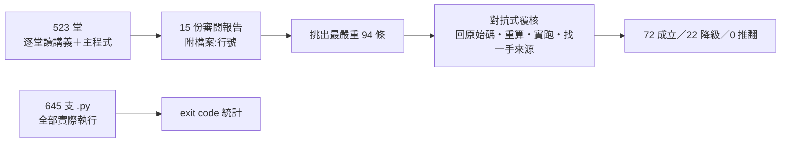

> 🌏 [English version](/posts/learning/2026-10-03-ai-engineering-from-scratch-review-en)

[AI Engineering from Scratch](https://github.com/rohitg00/ai-engineering-from-scratch) 是 GitHub 上一套免費、MIT 授權的 AI 工程課程：20 個 phase、523 堂課，從線性代數一路講到多 agent 系統，2026 年 10 月初有 6.2 萬顆星。它主打「每個演算法先用原始數學手刻，再交給框架」，還能用 `npx skills add` 裝進 Claude Code 或 Codex，讓 coding agent 當家教。

我把 523 堂的講義與主程式全部讀過一遍，645 支 Python 程式全部實際執行，再挑出最嚴重的 94 條錯誤做對抗式覆核。結論很直接：**當名詞地圖和練習題素材可以用，當教材照著學不行。** 最大的風險藏在「程式能跑完」這件事裡。

## 這套課在做什麼

每堂課是一個資料夾，裡面有講義 `docs/en.md`、程式 `code/`、產出物 `outputs/`，多數還有 `quiz.json`。講義依固定六段走：Motto、Problem、Concept、Build It、Use It、Ship It。核心承諾是 Build It／Use It 的對照：先用 NumPy 或標準函式庫寫出小版本，再用 PyTorch 跑同一件事，讓框架不再是黑盒子；Ship It 則交出一份可重用的 prompt、skill 或 MCP server。

規模大概是這樣：講義合計約 92 萬英文字，程式約 17 萬行。宣稱用四種語言，實際檔案數是 Python 515、TypeScript 39、Julia 20、Rust 10，後兩者只出現在前十個 phase 的少數課。

作者 Rohit Ghumare 是 DevRel 出身，個人網站列出 [Docker Captain、CNCF Ambassador、Google Developer Expert](https://rohitghumare.com/) 等頭銜。repo 的第一個 commit 是 2026-03-18，幾乎所有內容都由作者本人提交。

## 我怎麼審



審閱由多個 AI agent 分組完成，每組負責 1 到 3 個 phase，依同一份評估表打分：技術正確性、Build It 是不是真的從零、講義和程式是否一致、有沒有 AI 量產痕跡。之後每個 phase 挑出「若為真、對學習者傷害最大」的錯誤，交給另一批 agent 覆核，要求先假設原指控是錯的再去找反證。

## 判決一：能跑不等於對

645 支程式有 624 支正常結束，比例 96.7%。剩下的多半是 CPU 訓練超過 15 分鐘、缺少沒列在 `requirements.txt` 的套件，或下載資料集被擋。單看這個數字，會以為這是一套很可靠的課。

問題在於「跑完」之後算出來的東西。最嚴重的例子在 Phase 10。[SFT 課](https://github.com/rohitg00/ai-engineering-from-scratch/blob/3be078b/phases/10-llms-from-scratch/06-instruction-tuning-sft/code/main.py#L157-L160)、[RLHF 課](https://github.com/rohitg00/ai-engineering-from-scratch/blob/3be078b/phases/10-llms-from-scratch/07-rlhf/code/main.py#L261-L266)、[DPO 課](https://github.com/rohitg00/ai-engineering-from-scratch/blob/3be078b/phases/10-llms-from-scratch/08-dpo/code/main.py#L195-L201)都是算出 loss 或梯度之後丟掉，再對權重做這件事：

```python
block.ffn.W1 -= lr * np.random.randn(*block.ffn.W1.shape) * 0.01
```

講義把它寫成梯度更新。學生照著學，會以為對權重加雜訊就是在訓練。

同樣的模式在其他 phase 也出現過，覆核時實際跑過確認：

- [OCR 課](https://github.com/rohitg00/ai-engineering-from-scratch/blob/3be078b/phases/04-computer-vision/19-ocr-document-understanding/code/main.py#L52-L59)把每個英數字元都畫成同一個黑色方塊，模型無從辨字，三個測試字串全部預測成 `'xc6'`。
- [音訊浮水印課](https://github.com/rohitg00/ai-engineering-from-scratch/blob/3be078b/phases/06-speech-and-audio/16-anti-spoofing-audio-watermarking/code/main.py#L57-L74)只在 16 個取樣點加 ±0.0005，偵測卻讀原始訊號的正負號。加不加浮水印，偵測結果完全一樣。
- capstone [第 38 課](https://github.com/rohitg00/ai-engineering-from-scratch/blob/3be078b/phases/19-capstone-projects/38-classifier-finetuning/code/main.py#L69-L81)的預訓練沒有 causal mask，每個位置都看得到下一個 token。byte-level loss 降到 0.076，正是「直接抄答案」才會有的數字。

這類錯誤不會讓程式崩潰，也不會被 exit code 抓到。

## 判決二：前段扎實，後段變薄

把 15 份報告的逐堂評分放在一起看，品質大致隨 phase 往後下降：

| 區段 | 狀態 | 可以直接用的課 |
|---|---|---|
| Phase 1 數學 | 最扎實，多數真的從零手刻 | [autodiff](https://github.com/rohitg00/ai-engineering-from-scratch/tree/3be078b/phases/01-math-foundations/05-chain-rule-and-autodiff)、[統計](https://github.com/rohitg00/ai-engineering-from-scratch/tree/3be078b/phases/01-math-foundations/15-statistics-for-ml)、[線性方程組](https://github.com/rohitg00/ai-engineering-from-scratch/tree/3be078b/phases/01-math-foundations/17-linear-systems) |
| Phase 2–9 | 前段手刻、後段 stub 化 | 卷積、VAE、n-gram LM、DQN 等核心演算法課 |
| Phase 10–12 | 訓練類大多是假的 | 只建議當概念導覽 |
| Phase 13 新版 23 堂 | 依 MCP 2026-07-28 規格重寫，每堂 11–51 個測試 | [Streamable HTTP](https://github.com/rohitg00/ai-engineering-from-scratch/tree/3be078b/phases/13-tools-and-protocols/09-mcp-transports)、[取消與流量控制](https://github.com/rohitg00/ai-engineering-from-scratch/tree/3be078b/phases/13-tools-and-protocols/29-mcp-reliability-cancellation-and-flow-control) |
| Phase 14 | 54 堂沒有一堂呼叫真的 LLM，多用腳本冒充 | [runtime feedback](https://github.com/rohitg00/ai-engineering-from-scratch/tree/3be078b/phases/14-agent-engineering/37-runtime-feedback-loops)、[verification gates](https://github.com/rohitg00/ai-engineering-from-scratch/tree/3be078b/phases/14-agent-engineering/38-verification-gates) |
| Phase 15–18 | 前沿新聞導讀＋機率模擬器，事實錯誤多 | 只當主題清單 |
| Phase 19 capstone | 幾乎不 import 前面 phase 的程式 | 第 75、87 課是少數真的整合 |

品質高低和「有沒有被重寫過」很有關係。Phase 13 新版課程有測試、有對照官方規格，明顯優於同一個 phase 裡沒改寫的舊課。[MCP 2026-07-28](https://blog.modelcontextprotocol.io/posts/2026-07-28) 是真實存在的正式規格，新版課程描述的 `server/discover`、Multi Round-Trip Requests 都對得上。

## 判決三：數字和事實要自己查

覆核過、確認成立的例子：

- [KV cache 課](https://github.com/rohitg00/ai-engineering-from-scratch/blob/3be078b/phases/07-transformers-deep-dive/12-kv-cache-flash-attention/docs/en.md?plain=1#L41)算 7B 模型時漏乘 32 個 head，每 token 寫 16 KB，實際是 512 KB。
- [集成學習課](https://github.com/rohitg00/ai-engineering-from-scratch/blob/3be078b/phases/02-ml-fundamentals/11-ensemble-methods/docs/en.md?plain=1#L33)說 21 個 60% 準確的分類器多數決約 74%，用講義自己的公式算是 82.6%。
- [損失函數課](https://github.com/rohitg00/ai-engineering-from-scratch/blob/3be078b/phases/03-deep-learning-core/05-loss-functions/docs/en.md?plain=1#L19)整課建立在「用 MSE 做分類，模型只會全部預測 0.5」的前提上；同一課的程式用 MSE 訓練到 99% 準確率。
- [音樂生成課](https://github.com/rohitg00/ai-engineering-from-scratch/blob/3be078b/phases/06-speech-and-audio/09-music-generation/docs/en.md?plain=1#L24)把 MusicGen 標成 MIT 並推薦商用。[Hugging Face 模型卡](https://huggingface.co/facebook/musicgen-large)寫明程式碼是 MIT，權重是 CC-BY-NC 4.0。
- [浮水印課](https://github.com/rohitg00/ai-engineering-from-scratch/blob/3be078b/phases/18-ethics-safety-alignment/23-watermarking-synthid-stable-signature-c2pa/docs/en.md?plain=1#L23-L25)把 SynthID-Text 說成 Kirchenbauer green/red-list 的產品化。[Nature 2024 原論文](https://www.nature.com/articles/s41586-024-08025-4)用的是 Tournament sampling。
- [AI 治理課](https://github.com/rohitg00/ai-engineering-from-scratch/blob/3be078b/phases/15-autonomous-systems/22-cais-caisi-societal-risk/docs/en.md?plain=1#L3)還寫「加州 SB-53 if signed」。[州長辦公室](https://www.gov.ca.gov/2025/09/29/governor-newsom-signs-sb-53-advancing-californias-world-leading-artificial-intelligence-industry)在 2025-09-29 就簽署了。

安全相關的宣稱更不能照抄。[第 49 課](https://github.com/rohitg00/ai-engineering-from-scratch/blob/3be078b/phases/19-capstone-projects/49-lm-eval-harness/code/main.py#L209-L223)把 `__builtins__` 換掉就宣稱模型輸出碰不到檔案系統，覆核時用 `().__class__.__base__.__subclasses__()` 一路找到 `os` 模組，成功列出根目錄。

## 宣稱與實際的落差

| 宣稱 | 實際 |
|---|---|
| 作者在 [dev.to](https://dev.to/rohitg00/build-it-then-use-it-how-i-wrote-435-ai-engineering-lessons-from-scratch-5d2d) 說花了 18 個月寫成 | 發文日 2026-05-24，距 repo 第一個 commit 約兩個月；單日最多 247 個 commit |
| 第一堂 transformer 課會用 `nn.MultiheadAttention` 比對手刻輸出到數值精度 | [Use It 段落](https://github.com/rohitg00/ai-engineering-from-scratch/blob/3be078b/phases/07-transformers-deep-dive/02-self-attention-from-scratch/docs/en.md?plain=1#L280-L300)只用隨機輸入印 shape，`code/` 裡沒有 torch |
| 每堂都有 quiz | 373／523 堂有，Phase 06、08、15 全缺 |
| 每堂交一份 Ship It 產出物 | Phase 19 有 57／85 堂沒有 `outputs/` |

社群反應也不一致。[Hacker News 討論串](https://news.ycombinator.com/item?id=48219853)拿到 58 分後被 flag，主要批評是內容由 AI 生成、冗長重複；轉介紹的部落格與影片則多半稱讚「像一整個學位」，我沒看到有人逐課查證。

## 怎麼用它

- **想要 AI 工程的名詞地圖**：看每個 phase 的目錄與 Concept 段落就好，數字一律不要引用。
- **想練手刻演算法**：用 Phase 1 和 Phase 2–9 前段的課當練習題，自己寫完再對答案，對不上時別先懷疑自己。
- **想學 LLM 訓練**：Phase 10 的 SFT、RLHF、DPO 直接跳過，改看 [Karpathy 的 Neural Networks: Zero to Hero](https://karpathy.ai/zero-to-hero.html)。
- **想學 agent 框架**：[Hugging Face Agents Course](https://huggingface.co/learn/agents-course/en/unit0/introduction) 或 [Microsoft ai-agents-for-beginners](https://github.com/microsoft/ai-agents-for-beginners) 會真的呼叫 LLM。
- **想學 MCP**：Phase 13 第 06–18、22–31 課是新版，可以用，搭配[官方規格](https://modelcontextprotocol.io/specification/2026-07-28)一起讀；第 01–05、19–21 課是舊模板，跳過。

## 這次審查的限制

- **審閱者和覆核者都是 AI agent。** 94 條覆核結果是 72 條成立、22 條需要降級、0 條被推翻。需要降級的共同型態是：審閱者漏讀同一課已經寫明的 toy 或 simulated 標註，或附帶的小項說錯，或高估嚴重度。
- **覆核挑的是傷害最大、能直接驗證的指控。** 次要的年份、作者、benchmark 數字沒有覆核，誤報率不能外推。
- **執行測試只看 exit code。** 兩支用 gloo 多程序通訊的程式在容器內失敗，我歸為環境問題，沒有證實。
- **跨組評分尺度不一。** 分數只適合看相對高低。
- **比較對象只看了公開介紹。** Karpathy、Hugging Face、Microsoft 的課程沒有用同樣方法逐課審。

整體來看，這套課的設計理念是對的，覆蓋範圍也是同類免費資源裡最廣的。代價是每一堂都需要讀者自己把關，而最容易出錯的地方，剛好是看起來最可信的那兩處：能跑完的程式，和寫得很精確的數字。

## 參考資料

- [rohitg00/ai-engineering-from-scratch（本文審閱版本 3be078b）](https://github.com/rohitg00/ai-engineering-from-scratch/tree/3be078b)
- [AI Engineering from Scratch 官網](https://aiengineeringfromscratch.com/)
- [Rohit Ghumare：Build It, Then Use It: How I wrote 435 AI engineering lessons from scratch（dev.to）](https://dev.to/rohitg00/build-it-then-use-it-how-i-wrote-435-ai-engineering-lessons-from-scratch-5d2d)
- [Rohit Ghumare 個人網站](https://rohitghumare.com/)
- [Hacker News：AI Engineering from Scratch](https://news.ycombinator.com/item?id=48219853)
- [Model Context Protocol：The 2026-07-28 Specification](https://blog.modelcontextprotocol.io/posts/2026-07-28)
- [MCP 2026-07-28 規格](https://modelcontextprotocol.io/specification/2026-07-28)
- [facebook/musicgen-large 模型卡（Hugging Face）](https://huggingface.co/facebook/musicgen-large)
- [Dathathri et al., Scalable watermarking for identifying large language model outputs（Nature 2024）](https://www.nature.com/articles/s41586-024-08025-4)
- [Governor Newsom signs SB 53（California Governor's Office, 2025-09-29）](https://www.gov.ca.gov/2025/09/29/governor-newsom-signs-sb-53-advancing-californias-world-leading-artificial-intelligence-industry)
- [Andrej Karpathy：Neural Networks: Zero to Hero](https://karpathy.ai/zero-to-hero.html)
- [Hugging Face AI Agents Course](https://huggingface.co/learn/agents-course/en/unit0/introduction)
- [microsoft/ai-agents-for-beginners](https://github.com/microsoft/ai-agents-for-beginners)
