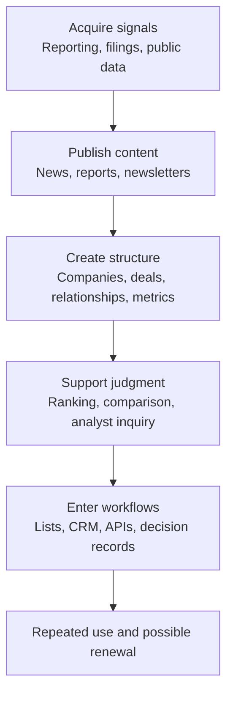
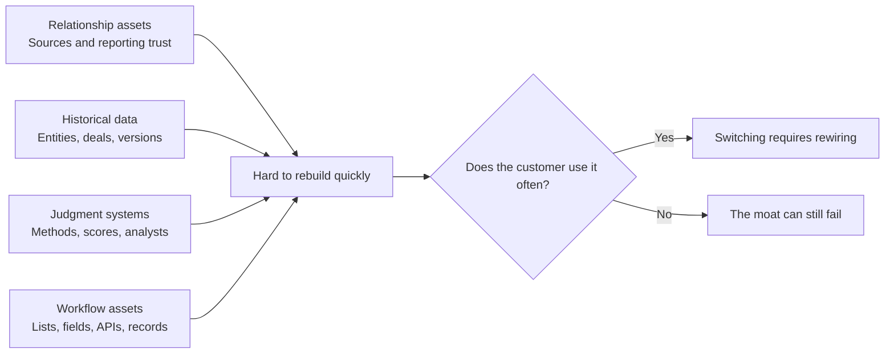
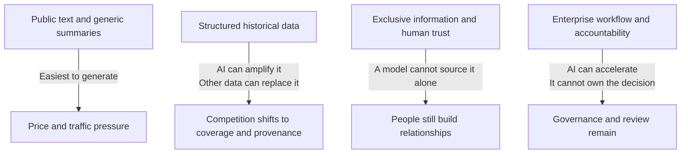

> 🌏 [中文版](/posts/product/2026-09-16-b2b-intelligence-business)

Imagine a company preparing to buy a new factory. Its executives have hundreds of news stories, vendor decks, spreadsheets, and meeting notes. The hard questions remain: which signals are trustworthy, which companies deserve attention first, which criteria should every department use, and how will the team explain the decision six months later?

B2B intelligence sells the distance between information and action. Articles are an entrance. Products that win enterprise budget often turn information into lists, data fields, scores, analyst inquiry, or procurement workflows. The customer is not simply paying to know more. It is paying to miss fewer companies and risks—and to repeat less research.

This is the guide to the “How Intelligence Becomes an Enterprise Business” series. The six companies do not share one pricing formula, nor do they form a clean weakest-to-strongest ranking. They are closer to six tools. Some begin with first-hand reporting. Others organize distributed research or place structured data directly inside systems a team uses every day.

## The map: content is only the first layer

An intelligence business can stop at any layer or move further into the customer's work. Deeper products are usually used more often and can cost more to replace. That is not a formula for guaranteed renewal. If the data is poor, the use case is infrequent, or the customer cannot adopt the product, integration alone will not save it.

The final box is easy to misread as an inevitable outcome. Workflow creates more reasons to use a product; it does not prove that customers will stay. PitchBook's public financial commentary illustrates the distinction: core investor and advisor customers use it deeply, while smaller corporate customers with limited use cases can still leave.

## What each company turns into a product

| Case | Primary source of signals | Unit of the paid product | Decision job | Main limitation or AI exposure |
|---|---|---|---|---|
| [DIGITIMES: turning supply-chain relationships into renewal](/en/posts/product/2026-09-16-digitimes-supply-chain-intelligence-en) | Reporting and relationships across Taiwan's technology supply chain | News, research, data, and advisory services | Interpret upstream and downstream change before adjusting a supply-chain view | Summaries are easy; first-hand signals still require people |
| [The Information: sustaining premium subscriptions with a small number of scoops](/en/posts/product/2026-09-16-the-information-exclusive-news-en) | Sources in technology companies, venture capital, and finance | Exclusive reporting, enterprise seats, and data tools | Gain time before investment, competitive, or organizational changes become consensus | Retelling dilutes direct traffic; a model cannot create source trust on demand |
| [Seeking Alpha: contributor markets, Quant Ratings, and the subscription flywheel](/en/posts/product/2026-09-16-seeking-alpha-contributor-marketplace-en) | External contributors, financial data, and quantitative signals | Articles, investing tools, and quantitative ratings | Find opinions, screen equities, and monitor them over time | Generic articles are highly generatable; ratings still carry methodology and conflict limits |
| [CB Insights: turning research content into an enterprise workflow](/en/posts/product/2026-09-17-cb-insights-research-to-workflow-en) | Public market signals, transactions, and company data | Structured data, Mosaic, AI interfaces, and integrations | Find companies, prioritize research, and monitor markets | Private-company data has gaps; a company-run retrospective is not investment return |
| [PitchBook: turning private-market data into a workflow](/en/posts/product/2026-09-17-pitchbook-private-market-data-en) | Public sources, direct submissions, and researcher review | Relational company, deal, fund, and people data | Sourcing, diligence, fund comparison, and internal data updates | Reporting lags, estimates, and revisions remain; infrequent users may not renew |
| [Gartner: brand, analysts, and decision insurance](/en/posts/product/2026-09-17-gartner-decision-insurance-en) | Analyst research, client interaction, benchmarks, and vendor data | Research subscriptions, analyst access, and procurement tools | Narrow a vendor list, align functions, and preserve the decision rationale | A Magic Quadrant is expert opinion, not product truth; AI compresses search and summary first |

The table intentionally omits third-party price estimates, unverified revenue, and “the only company in the world” claims. Disclosure differs dramatically across the six businesses. Forcing them into the same numeric column would mix quotes, packages, company claims, and audited financials into a comparison that looks more precise than it is.

## Two starting points: relationships or data

[DIGITIMES](/en/posts/product/2026-09-16-digitimes-supply-chain-intelligence-en) and [The Information](/en/posts/product/2026-09-16-the-information-exclusive-news-en) begin with reporters and sources. Their first product is a time advantage: they help readers see an important development before it becomes consensus. AI can rewrite a published story. It cannot manufacture trust between a reporter and a supply-chain executive, venture partner, or employee.

[CB Insights](/en/posts/product/2026-09-17-cb-insights-research-to-workflow-en) and [PitchBook](/en/posts/product/2026-09-17-pitchbook-private-market-data-en) look more like data factories. They turn companies, people, transactions, funds, and relationships into fields, then resolve entities, fill gaps, and revise history. Public research can demonstrate the capability. The paid value comes from repeated querying, comparison, and integration.

[Seeking Alpha](/en/posts/product/2026-09-16-seeking-alpha-contributor-marketplace-en) sits between the two. Instead of hiring an entire research department first, it gathers distributed views from outside contributors, then organizes the market with editorial rules, data, and quantitative tools. It inherits two risks: content quality is difficult to govern, while a numerical score can be mistaken for an automatic investment answer.

## The hardest asset to move is rarely the article

The six cases reveal four kinds of moats. They are not a ranking. Each asset requires different time and resources to build.

Relationship assets help DIGITIMES and The Information obtain signals that are not yet public. Historical data lets PitchBook and CB Insights answer how the present differs from the past. Judgment systems let Seeking Alpha and Gartner reduce a large universe to a shorter list. Workflow assets place the output in a CRM, API, spreadsheet, watchlist, or procurement record.

A company can hold all four or only one. The useful question is not whether it “has a moat.” Ask what a customer must rebuild after canceling: sources, historical definitions, an evaluation method, or connections to systems used every day.

## AI is not one tidal wave; it reprices the layers in sequence

Labeling each company low-, medium-, or high-risk looks tidy but hides variation inside the product. Generative AI compresses the cost of searching, summarizing, and drafting from public text first. It meets more resistance at data rights, provenance, human accountability, and enterprise integration.

One company can benefit and suffer at the same time. Seeking Alpha's generic articles face abundant substitutes, while its quantitative tools may remain useful. Chat interfaces lower the cost of querying CB Insights and PitchBook, but they also propagate underlying data errors faster. Gartner can improve access with an AI interface and still need to prove that analysts, benchmarks, and procurement workflows justify a premium. These are product-level pressures; they are not sufficient on their own to explain a share-price or revenue change.

Four questions make AI exposure more concrete:

1. Does the answer require only public text, or information that is not public yet?
2. Can users trace the data to a source, update date, and estimation method?
3. Does the product sit inside work a team performs every day, or is it read occasionally?
4. When it is wrong, does a person review and own the decision, or is there only fluent output?

## Taiwan should not try to clone Gartner

Taiwan is not a large media market, but its supply chains, regulations, manufacturing processes, and local relationships create information gaps with global value. [Can Taiwan produce another DIGITIMES?](/en/posts/product/2026-09-17-taiwan-vertical-intelligence-opportunity-en) takes the question forward. The opportunity may not be a platform covering everything. It may be one expensive, recurring decision whose existing data is fragmented.

Run a small test tonight. Take the last three important decisions made by a target customer. List the information they checked, the people they asked, and the system where the result ended up. If your content helps only with the first step, it is still media. If it also reduces repeated comparison, handoff, and monitoring work, it has started to become an enterprise intelligence product.

## Reading order

0. [How supply-chain relationships become renewals: the DIGITIMES intelligence pipeline](/en/posts/product/2026-09-16-digitimes-supply-chain-intelligence-en)
1. [How a small number of scoops sustain premium subscriptions: The Information's reporting flywheel](/en/posts/product/2026-09-16-the-information-exclusive-news-en)
2. [How Seeking Alpha sells crowdsourced research: contributor markets, Quant Ratings, and subscriptions](/en/posts/product/2026-09-16-seeking-alpha-contributor-marketplace-en)
3. [How research becomes an enterprise workflow: CB Insights and data productization](/en/posts/product/2026-09-17-cb-insights-research-to-workflow-en)
4. [How private-market data becomes a workflow: PitchBook's human verification and switching costs](/en/posts/product/2026-09-17-pitchbook-private-market-data-en)
5. [Why enterprises buy Gartner: brand, analysts, and decision insurance](/en/posts/product/2026-09-17-gartner-decision-insurance-en)
6. [Can Taiwan produce another DIGITIMES? A method for choosing vertical intelligence markets](/en/posts/product/2026-09-17-taiwan-vertical-intelligence-opportunity-en)

## Update log

- 2026-09-17: Rebuilt the guide around seven case studies; removed unreliable precise pricing, estimated revenue, uniqueness claims, and unsupported AI causality; added a comparison table, moat and AI diagrams, and the complete reading path.

## References

- Parent series: [Who Sells Content: Four Models and One Threat](/en/posts/product/2026-09-16-content-selling-four-models-en)
- [DIGITIMES case](/en/posts/product/2026-09-16-digitimes-supply-chain-intelligence-en)
- [The Information case](/en/posts/product/2026-09-16-the-information-exclusive-news-en)
- [Seeking Alpha case](/en/posts/product/2026-09-16-seeking-alpha-contributor-marketplace-en)
- [CB Insights case](/en/posts/product/2026-09-17-cb-insights-research-to-workflow-en)
- [PitchBook case](/en/posts/product/2026-09-17-pitchbook-private-market-data-en)
- [Gartner case](/en/posts/product/2026-09-17-gartner-decision-insurance-en)
- [Taiwan vertical-intelligence opportunity](/en/posts/product/2026-09-17-taiwan-vertical-intelligence-opportunity-en)
