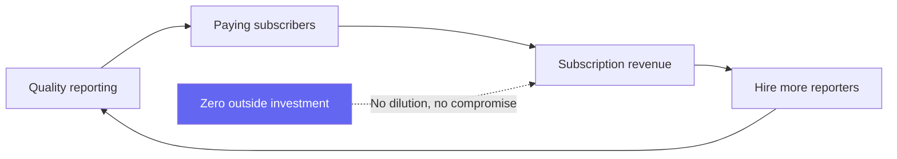
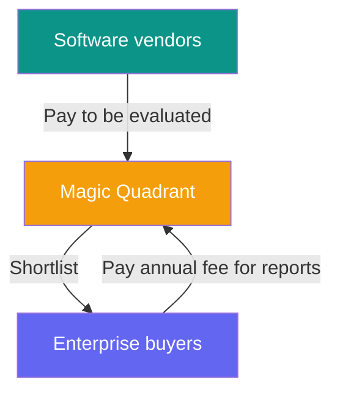
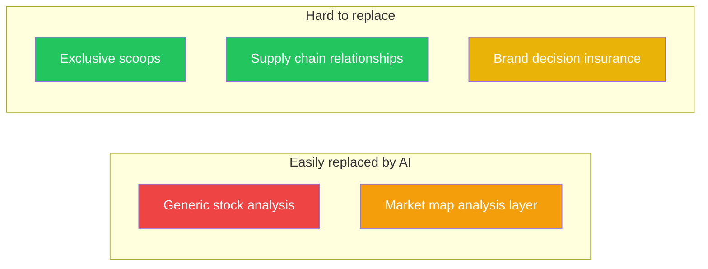
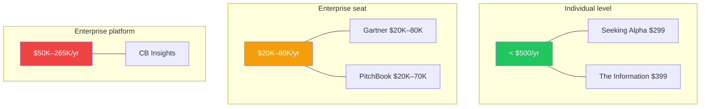

> 🌏 [中文版](/posts/product/2026-09-16-b2b-intelligence-business)

Not all content businesses are created equal. The least glamorous yet most profitable ones sell to enterprises — not because the content is inherently better, but because the buyer isn't spending their own money. When a CIO expenses an $80K [Gartner](https://www.gartner.com/) subscription or a supply chain VP puts [DIGITIMES](https://www.digitimes.com.tw/) on the departmental budget, the price-to-value calculus is entirely different from an individual paying $15/month for a newsletter.

This post dissects six B2B intelligence companies: how they get enterprises to pay year after year, and how AI is shaking the foundations.

## DIGITIMES: An Intelligence Firm Disguised as a Newspaper

[DIGITIMES](https://www.digitimes.com.tw/) (大椽股份有限公司) was founded in 1998 by Colley Hwang, backed by over fifty Taiwanese tech industry leaders including Morris Chang (TSMC) and Stan Shih (Acer). It calls itself a "Decision Intelligence Platform," but Hwang put it more precisely in a [2024 year-end essay](https://www.digitimes.com.tw/col/article/?id=15360):

> "Amazon is an internet giant disguised as a retailer; DIGITIMES is a professional intelligence provider disguised as a newspaper."

DIGITIMES publishes roughly 100 articles per working day and produced 344 research reports in 2024, all focused on the ICT supply chain — semiconductor, display, mobile, EV. It has one sharp self-imposed constraint: no stock market coverage, no general news. Supply chain intelligence only.

**Who pays:** Over 1,300 enterprise members across approximately 90 countries. Enterprise subscriptions are priced annually; Hwang's stated goal is to charge each company "one hundred-thousandth to one ten-thousandth of their annual revenue" for professional intelligence. Individual access reportedly costs around NTD 5,000–6,000/year, but enterprise contracts are significantly higher.

**Moat:** Twenty-six years of Taiwan supply chain relationships. DIGITIMES reporters regularly visit fabs, attend earnings calls, and dine with supply chain executives in Hsinchu and Tainan. Being cited as a source by the WSJ, Bloomberg, and Reuters reinforces the premium positioning.

**AI threat:** Medium. AI can summarize DIGITIMES reporting (BigGo Finance already does something similar with podcasts), but it cannot replace a reporter walking into a factory or hearing undisclosed information from a supply chain executive over dinner.

**Taiwan lesson:** DIGITIMES is Taiwan's only globally significant B2B intelligence product. Hwang's insight is worth remembering: a small market cannot copy the scale game of US or China consumer media, but it can dominate a vertical where it has genuine information advantage — and Taiwan's ICT supply chain is exactly that.

## The Information: The Zero-Outside-Investment Playbook

[The Information](https://www.theinformation.com/) was founded in 2013 by Jessica Lessin, a former Wall Street Journal tech reporter. It has never taken outside investment — the initial capital was under $1 million, and the company is now profitable and growing.

**What it sells:** Exclusive Silicon Valley scoops. VC deal terms, big tech board dynamics, employee disputes — the stories no one else has. Forbes reported that by 2016, The Information had broken news about deals worth over $97 billion.

**Pricing:** Standard plan at $399/year, Pro at $749/year (adds databases, company org charts, and a Deep Research AI tool), and Investor at $10,000/year (includes in-person briefings). The $399 threshold acts as a filter — it eliminates casual browsers and selects for people whose companies expense subscriptions or who convert intelligence into high-value decisions.

**Scale:** Approximately 45,000 paying subscribers and 360,000 active readers including free. Revenue grew 30% in 2024. About a third of readers work in financial services.

**Moat:** Exclusive human sources. The Information's value rests on journalists' personal relationships with Silicon Valley's power core — something AI cannot replicate. A second, less obvious moat is the "no outside investment" stance itself: without VC growth pressure, Lessin can optimize for quality over scale.

**AI threat:** Low. AI can summarize public information, but it cannot call a VC partner, attend a private dinner, or earn the trust of a CEO willing to share undisclosed plans. AI search tools may erode the perceived value of the standard tier but are more likely to push value toward Pro's exclusive data layer.

## Seeking Alpha: Crowdsourced Analysis Plus Machine Stock Picks

[Seeking Alpha](https://seekingalpha.com/), founded in 2004, runs a fundamentally different model: over 7,000 independent contributors produce more than 10,000 stock analysis articles per month, covering 1,300-plus stocks that Wall Street largely ignores.

**Pricing:** Premium at $299/year (unlimited articles, Quant Ratings, screener), Alpha Picks at $399/year (two quant-model-selected stocks per month), and Pro at $2,149–2,400/year (full earnings transcripts, top ideas screener). With over 250,000 Premium subscribers, Premium revenue alone likely exceeds $75 million.

**The real moat is Quant Ratings, not articles:** An AI/ML-driven scoring system that rates stocks across valuation, growth, profitability, momentum, and earnings revisions. A University of Kentucky academic study validated its effectiveness in 2024. Alpha Picks has returned +276% since July 2022, versus +81% for the S&P 500.

**AI threat: A tale of two layers.** The article layer faces existential risk — generic stock analysis is precisely what LLMs excel at generating. When AI can produce serviceable stock reports for free, the case for paying $299/year for crowdsourced human analysis weakens considerably. The Quant Ratings layer, however, is less threatened — proprietary data and trained models are harder to replicate from the outside. Seeking Alpha's future depends on successfully shifting its value center from articles to quantitative tools.

## CB Insights: The AI-Powered Enterprise Intelligence Platform

[CB Insights](https://www.cbinsights.com/), founded in 2008, reported approximately $146 million in revenue in 2024. Its key distinction from the others: AI is not the threat — AI is the product.

**What it sells:** Enterprise-grade tech market intelligence. Predictive scores (company health, exit probability), market maps, emerging technology reports. The "CB Insights market map" has become an industry-standard format.

**Pricing:** $30,000–265,000/year, never publicly listed, requires a demo and custom quote. Clients are corporate strategy teams at Fortune 500 companies, VC firms, and management consulting firms.

**Moat:** Proprietary datasets — patent filings, funding rounds, job posting changes, and news signals — processed through ML models to produce predictive insights. Salesforce/CRM integrations and API access create high switching costs once teams build workflows on the platform.

**AI threat:** Mixed. The data moat is strong (proprietary datasets are hard to replicate), but the analysis layer faces pressure — if a GPT-class model can scrape Crunchbase and public PitchBook data to produce similar market maps, the $50K+ annual price requires stronger justification.

## PitchBook: The Underrated Data Juggernaut

[PitchBook](https://pitchbook.com/) was founded in 2009 and acquired by [Morningstar](https://www.morningstar.com/) in 2016 for $225 million. Revenue reached $618 million in 2024, with 10,600 accounts and an average revenue per account of $58,300.

**What it sells:** The most comprehensive VC/PE/M&A transaction database in the world. Company valuations, investor profiles, fund performance, LP commitments — the numbers that are hardest to find in private markets. New ML-powered features in 2026 include daily private company valuation estimates and an exit timing prediction model.

**Who pays:** VCs sourcing deals, PE firms conducting due diligence, investment banks running transaction comparisons, law firms supporting deals. Seat pricing ranges from $20,000 to $70,000+ per year, with price increases at renewal being standard practice.

**Moat:** The data itself. Transaction records, fund performance, and LP commitment data come from proprietary relationships with GPs and LPs — they cannot be obtained by crawling the public web. Morningstar's financial backing and cross-sell opportunities through Morningstar Direct further fortify its position.

**AI threat:** Low to medium. AI can enhance analysis efficiency (and PitchBook is doing this itself — Navigator for natural language queries, MCP integration with Perplexity), but the raw data layer is the moat, and that data is not accessible to external AI.

## Gartner: When Decision Insurance Starts to Fail

[Gartner](https://www.gartner.com/) (NYSE: IT) is the largest of the six — FY2025 revenue of $6.497 billion, approximately 14,000 enterprise clients, across roughly 90 countries. It is also the one facing the clearest AI disruption.

**What it sells:** Analyst research reports, Magic Quadrants, Hype Cycles, plus executive peer networks and advisory calls. The core value proposition is not information itself — it is "decision insurance." No CIO gets fired for choosing a CRM vendor that Gartner recommended.

**Pricing:** Basic research seats cost approximately $20,000/year, senior advisory seats $80,000+/year. Annual contracts, paid upfront. The Magic Quadrant operates as a two-sided market: software vendors pay to be evaluated, and buyers use the evaluations to shortlist vendors. Both sides pay.

**The cracks:** Stock price is down roughly 70% from its highs. Contract value growth has decelerated for four consecutive quarters: 8% → 5% → 3% → 1%. GTS wallet retention dropped from 108.8% in FY21 to 97.5% in FY25 — existing clients are spending less at renewal. Small tech vendor retention has fallen to the low-to-mid 70s.

**The core question:** If a CIO can ask Claude or ChatGPT "which CRM should I buy?" and receive a well-reasoned, cited analysis, why pay $80,000/year for a Gartner seat? Management's response has been aggressive buybacks ($2 billion in FY25, exceeding free cash flow) and launching AskGartner, an AI-assisted research tool — but these are defensive moves, not growth engines.

## Six Companies at a Glance

| | DIGITIMES | The Information | Seeking Alpha | CB Insights | PitchBook | Gartner |
|---|---|---|---|---|---|---|
| **Founded** | 1998 | 2013 | 2004 | 2008 | 2009 | 1979 |
| **Revenue** | Undisclosed | Undisclosed (profitable) | Undisclosed (est. $80–120M) | ~$146M | $618M | $6,497M |
| **Pricing** | ~NTD 1,900–6,000+/yr | $399–999/yr | $299–2,400/yr | $30K–265K/yr | $20K–70K+/yr | $20K–80K+/yr |
| **Primary buyer** | Supply chain / corp strategy | Tech execs / VCs | Individual investors | Corp strategy / VCs | VCs / PE / IBanks | CIOs / C-suite |
| **Content source** | Journalists (first-hand) | Journalists (first-hand) | Crowdsourced UGC + Quant | Analysts + AI/ML | Data + ML | Analysts |
| **AI threat** | Medium | Low | High (articles) / Low (quant) | Medium | Low–Medium | **High** |
| **Moat type** | Supply chain access | Exclusive sources | Scale + quant system | Proprietary data + ML | Private market data | Brand + two-sided market |
| **Ownership** | Private (Hwang) | Private (Lessin) | Private | Private | Morningstar (public) | Public (NYSE: IT) |

## Five Patterns Across the Six

### The moat spectrum: weakest to strongest

1. **Generic analysis** (Seeking Alpha's crowdsourced articles) — LLMs can easily generate comparable stock analysis
2. **Aggregated intelligence** (CB Insights market maps) — the data holds, but the analysis layer can be replaced
3. **Exclusive reporting** (The Information's scoops) — requires human relationships and trust; AI cannot replicate this today
4. **Supply chain relationships** (DIGITIMES) — requires physical presence and decades of accumulated trust
5. **Brand-as-decision-insurance** (Gartner's Magic Quadrant) — powerful institutional inertia, but visibly cracking

The pattern is clear: **AI threatens the analysis layer, not the data acquisition layer or the relationship layer.** The closer content sits to "analysis anyone could produce from public data," the higher the replacement risk.

### Pricing reveals who the customer really is

Products priced below $500/year (The Information, Seeking Alpha) serve individuals or people who can expense at the individual level. Products above $20K/year (Gartner, PitchBook, CB Insights) are enterprise budget line items. The higher the price, the more the buyer needs "decision insurance" — and the harder it is for AI to disrupt, because the question is not just "how much is the information worth?" but "who takes the blame if we're wrong?"

### Ownership shapes strategy

Both DIGITIMES and The Information are founder-controlled. Hwang can choose depth over scale; Lessin can refuse outside capital and prioritize quality over growth. Gartner, as a public company, must deliver quarterly growth numbers — which is why it spent more than its free cash flow on share buybacks when CV growth stalled, rather than reinvesting in content quality.

### AI disruption is asymmetric

The six companies face wildly different AI exposure. Gartner's stock has cratered 70%, and Seeking Alpha's article layer faces an existential challenge, yet The Information and PitchBook are barely affected. The differentiator: **AI excels at processing information that already exists; it struggles to obtain information that does not yet exist.** Exclusive scoops require people. Proprietary data requires relationships. Brand trust requires time. These remain AI's blind spots.

### The Taiwan lesson

DIGITIMES's story carries a direct lesson for content entrepreneurs in small markets: do not copy the consumer media scale playbook of the US or China. Taiwan's market is small, but its ICT supply chain gives it globally unique information advantage. Hwang chose to package that advantage as a B2B intelligence product rather than free news supported by advertising — and that choice is why DIGITIMES remains required reading in global supply chain circles twenty-six years later.

## References

- [DIGITIMES](https://www.digitimes.com.tw/)
- [Colley Hwang, "From DigiTimes to DIGITIMES: A Strategic Pivot"](https://www.digitimes.com.tw/col/article/?id=15360) (in Chinese)
- [The Information](https://www.theinformation.com/)
- [Seeking Alpha](https://seekingalpha.com/)
- [CB Insights](https://www.cbinsights.com/)
- [PitchBook](https://pitchbook.com/)
- [Gartner](https://www.gartner.com/)
- [Morningstar PitchBook Financial Disclosure (Q1 2026)](https://www.morningstar.com/company-reports)
- [Gartner 10-K (FY2025)](https://www.gartner.com/en/about/annual-report)
- Series overview: [Who Sells Content: Four Models and One Threat](/en/posts/product/2026-09-16-content-selling-four-models-en)
