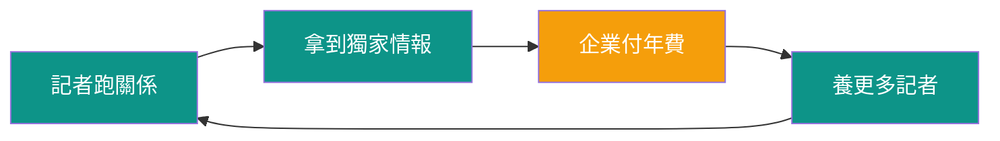
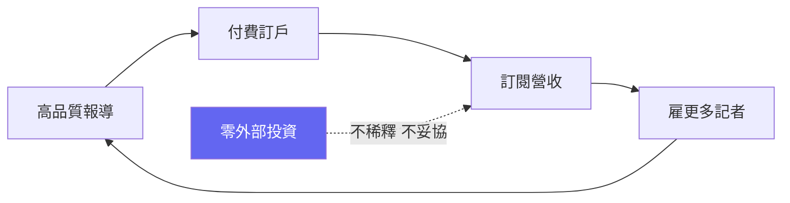
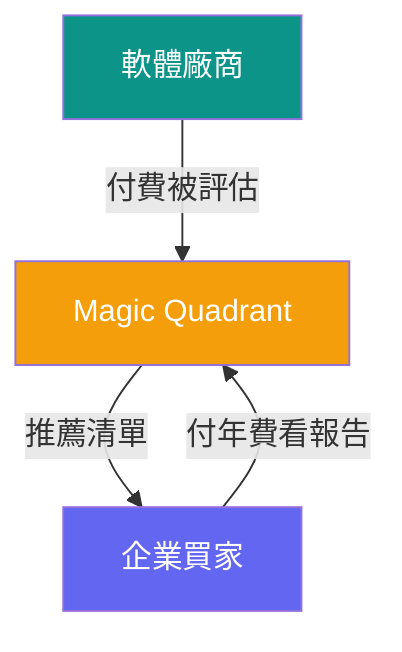
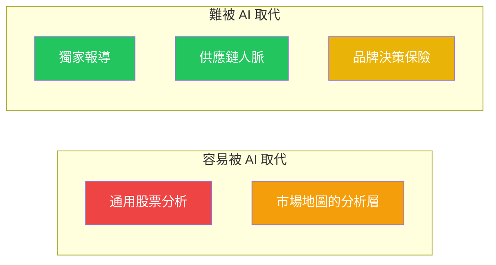
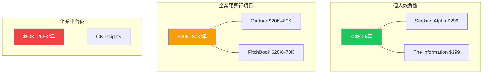

> 🌏 [English version](/en/posts/product/2026-09-16-b2b-intelligence-business-en)

不是所有內容生意都一樣值錢。最不性感卻最賺錢的，是賣給企業的那種——不是因為內容品質一定更好，而是因為買單的人花的不是自己的錢。當一位 CIO 用公司預算訂了一年 $80K 的 [Gartner](https://www.gartner.com/) 席位，或者供應鏈副總裁把 [DIGITIMES](https://www.digitimes.com.tw/) 列入部門預算，決策邏輯跟個人掏 $15/月訂電子報完全不同。

這篇拆解六家 B2B 產業情報公司，看它們怎麼讓企業願意年復一年付錢，以及 AI 正在怎麼動搖這門生意的根基。

## DIGITIMES：假裝成報社的情報商

[DIGITIMES](https://www.digitimes.com.tw/)（大椽股份有限公司）1998 年由黃欽勇創辦，背後站著張忠謀、施振榮等五十多位科技業大老。它自稱「Decision Intelligence Platform」，但創辦人自己說得更精準：

> 「亞馬遜是假裝成零售商的網路巨擘；電子時報是[假裝成報社的專業資訊服務供應商](https://www.digitimes.com.tw/col/article/?id=15360)。」

DIGITIMES 每個工作日產出約 100 則新聞，2024 年累計 344 份研究報告，涵蓋半導體、面板、手機、電動車供應鏈。它有一條極為清晰的自我限制：不談股市、不做社會新聞，只做供應鏈情報。

**誰在付錢：** 1,300 多家企業會員，遍及全球約 90 個國家。企業訂閱按年計費，黃欽勇的定價哲學是「讓每家企業用營業額的萬分之一到十萬分之一來支付專業資訊費用」。個人使用者在 PTT 上回報的年費約五六千元台幣，但企業合約的金額高得多。

**護城河：** 26 年的台灣供應鏈關係網。DIGITIMES 的記者長年出入竹科、南科、展會與工廠，跟台積電、鴻海、聯發科的供應鏈人脈是用時間換來的。被 WSJ、Bloomberg、Reuters 引用為消息來源，又反過來強化了它的品牌定位。

**AI 威脅：** 中等。AI 可以摘要 DIGITIMES 的報導（事實上 BigGo Finance 已經在對 Podcast 做類似的事），但無法取代記者走進工廠、參加法說會、跟供應鏈主管吃飯時聽到的第一手訊息。

**台灣角度：** DIGITIMES 是台灣唯一具全球影響力的 B2B 情報產品。黃欽勇的洞察值得台灣所有內容創業者記住——小市場無法照抄中美大國的消費媒體規模戰，但可以在自己有資訊優勢的垂直領域（ICT 供應鏈）做到全球最深。

## The Information：零外部投資的獨家路線

[The Information](https://www.theinformation.com/) 由前華爾街日報記者 Jessica Lessin 在 2013 年創辦，至今沒有接受過任何外部投資——初始資金不到 100 萬美元，現在已經獲利且持續成長。

**賣的是什麼：** 矽谷科技圈的獨家新聞。VC 交易條款、大型科技公司的董事會動態、員工爭議——那些其他媒體拿不到的消息。Forbes 曾報導，The Information 在 2016 年就已經搶先報導了總金額超過 $970 億美元的交易新聞。

**定價：** 標準方案 $399/年，Pro 方案 $749/年（含公司組織圖、AI 資料庫、Deep Research 工具），Investor 方案 $10,000/年（含實體簡報會）。$399 的門檻本身就是一道篩選——過濾掉隨意瀏覽的讀者，留下的都是公司會報銷或從情報中提取高價值決策的人。

**規模：** 約 45,000 名付費訂戶，36 萬名活躍讀者（含免費）。2024 年營收年增 30%。約三分之一的讀者來自金融服務業。

**護城河：** 獨家消息來源。The Information 的價值建立在記者與矽谷權力核心的人際關係上——這是 AI 無法複製的。另一個隱性護城河是「不接受外部投資」本身：沒有 VC 的成長壓力，Lessin 可以專注在品質而非規模上。

**AI 威脅：** 低。AI 可以摘要公開資訊，但無法打電話給 VC 合夥人、無法在晚餐時從 CEO 嘴裡聽到還沒公開的消息。AI 搜尋工具可能削弱標準方案的價值感，但反而會把價值推向 Pro 方案的獨家資料層。

## Seeking Alpha：群眾分析加機器選股

[Seeking Alpha](https://seekingalpha.com/) 創辦於 2004 年，模式跟前兩家截然不同：7,000 多名獨立投稿人每月產出超過一萬篇股票分析文章，涵蓋 1,300 多檔華爾街不怎麼關注的股票。

**定價：** Premium $299/年（無限文章、Quant Ratings、篩選器），Alpha Picks $399/年（每月兩檔量化模型精選股），Pro $2,149–2,400/年（完整財報逐字稿、頂級選股器）。250,000 多名 Premium 訂戶，粗估 Premium 營收就超過 $7,500 萬。

**真正的護城河不是文章，是 Quant Ratings：** 一套 AI/ML 驅動的評分系統，從估值、成長性、獲利能力、動能和修正五個維度幫股票打分。肯塔基大學 2024 年的學術研究驗證了這套系統的有效性。Alpha Picks 自 2022 年 7 月以來報酬率 +276%，同期 S&P 500 +81%。

**AI 威脅：雙軌分化。** 文章層威脅極高——通用的股票分析正是 LLM 最擅長生成的內容類型，當 AI 可以免費寫出差不多水準的個股報告，$299/年的群眾分析就很難說服人了。但 Quant Ratings 系統威脅低——專有資料加上訓練好的模型，不容易被外部 AI 複製。Seeking Alpha 的未來取決於它能否把價值重心從文章轉移到量化工具。

## CB Insights：AI 驅動的企業情報平台

[CB Insights](https://www.cbinsights.com/) 2008 年創辦，2024 年營收約 $1.46 億。它跟前面幾家最大的不同是——AI 不是威脅，AI 就是產品本身。

**賣的是什麼：** 企業級的科技市場情報平台。預測性評分（公司健康分數、退場機率）、市場地圖、新興技術報告。「CB Insights 市場地圖」已經成為一種業界通用格式。

**定價：** $30,000–265,000/年，完全不公開定價，需要 demo 和客製報價。客戶是 Fortune 500 的企業策略部門、VC、管理顧問公司。

**護城河：** 專有資料集（專利申請、融資輪次、職缺變化、新聞訊號）經過 ML 模型處理後產出的預測性洞察。加上 Salesforce/CRM 整合和 API 串接，一旦團隊把工作流程建在上面，遷移成本很高。

**AI 威脅：** 混合。資料護城河穩固（專有資料集不容易複製），但分析層面臨壓力——如果 GPT 等級的模型可以爬 Crunchbase 和 PitchBook 的公開資料來產出類似的市場地圖，$50K+ 的年費就需要更強的理由。

## PitchBook：被低估的資料巨頭

[PitchBook](https://pitchbook.com/) 2009 年創辦，2016 年被 [Morningstar](https://www.morningstar.com/) 以 $2.25 億收購。2024 年營收 $6.18 億，10,600 個帳戶，平均每個帳戶年付 $58,300。

**賣的是什麼：** 全球最完整的 VC/PE/M&A 交易資料庫。公司估值、投資人資料、基金績效、LP 承諾——私人市場最難取得的那些數字。2026 年新推出的 ML 驅動功能包括每日私人公司估值更新和退場時間預測模型。

**誰在付錢：** VC 找案源、PE 做盡職調查、投行做交易比較、律所做交易支援。$20,000–70,000+/年的座位費，續約時漲價是常態。

**護城河：** 資料本身。大量的交易紀錄、基金績效和 LP 承諾資料來自與 GP 和 LP 的專有關係，不是爬公開網頁就能取得的。Morningstar 的財務後盾和 Morningstar Direct 的交叉銷售進一步鞏固了它的地位。

**AI 威脅：** 低到中。AI 可以提升分析效率（PitchBook 自己也在做——Navigator 自然語言查詢、MCP 整合 Perplexity），但原始資料層本身就是護城河，而那些資料 AI 拿不到。

## Gartner：品牌決策保險正在失靈

[Gartner](https://www.gartner.com/)（NYSE: IT）是這六家裡最大的——FY2025 營收 $64.97 億，14,000 家企業客戶，遍及約 90 個國家。也是 AI 威脅最明確的一家。

**賣的是什麼：** 分析師研究報告、Magic Quadrant、Hype Cycle，加上高管社群網路和諮詢電話。核心價值不是資訊本身——是「決策保險」。沒有 CIO 會因為照著 Gartner 的建議選了 CRM 然後出事而被開除。

**定價：** 基礎研究席位約 $20,000/年，資深顧問席位 $80,000+/年。年約，預付。Magic Quadrant 是一個雙邊市場：軟體廠商付錢被評估，買方用它來篩選廠商，兩邊都付費。

**正在瓦解的訊號：** 股價從高點跌了七成。合約價值（CV）成長率連續四季下滑：8% → 5% → 3% → 1%。GTS 續約率從 FY21 的 108.8% 降到 FY25 的 97.5%——現有客戶續約時花的錢比去年少。中小科技廠商留存率降到七十幾的低檔。

**核心問題：** 當 CIO 可以問 Claude 或 ChatGPT「我該買哪家 CRM？」然後得到附引用的完整分析，為什麼還要花 $80,000/年買 Gartner 的席位？管理層的回應是大手筆回購（FY25 花了 $20 億買回自家股票，超過自由現金流）和推出 AskGartner AI 工具——但這些是防守動作，不是成長引擎。

## 六家公司一張表

| | DIGITIMES | The Information | Seeking Alpha | CB Insights | PitchBook | Gartner |
|---|---|---|---|---|---|---|
| **創辦** | 1998 | 2013 | 2004 | 2008 | 2009 | 1979 |
| **營收** | 未揭露 | 未揭露（獲利中） | 未揭露（估 $80-120M） | ~$146M | $618M | $6,497M |
| **定價** | ~$1,900–6,000+ NTD/年 | $399–999/年 | $299–2,400/年 | $30K–265K/年 | $20K–70K+/年 | $20K–80K+/年 |
| **買家** | 供應鏈/企策 | 科技高管/VC | 散戶投資人 | 企策/VC/顧問 | VC/PE/投行 | CIO/C-suite |
| **內容來源** | 記者（第一手） | 記者（第一手） | 群眾投稿 + Quant | 分析師 + AI/ML | 資料 + ML | 分析師 |
| **AI 威脅** | 中 | 低 | 高（文章）/低（量化） | 中 | 低–中 | **高** |
| **護城河** | 供應鏈關係 | 獨家消息來源 | 規模 + 量化系統 | 專有資料 + ML | 私有市場資料 | 品牌 + 雙邊市場 |
| **所有權** | 私人（黃欽勇） | 私人（Lessin） | 私人 | 私人 | Morningstar | 上市（NYSE: IT） |

## 五個跨公司的規律

### 護城河光譜：從最脆弱到最堅固

1. **通用分析**（Seeking Alpha 的群眾文章）——LLM 可以輕易生成相當水準的個股分析
2. **聚合情報**（CB Insights 的市場地圖）——資料可守住，但分析層可被 AI 取代
3. **獨家報導**（The Information 的 scoop）——需要人際關係和信任，AI 目前做不到
4. **供應鏈關係**（DIGITIMES）——需要實體接觸、26 年的信任累積
5. **品牌決策保險**（Gartner 的 Magic Quadrant）——制度慣性強大，但正在瓦解

規律很清楚：**AI 威脅的是分析層，不是資料取得層，也不是關係層。** 越靠近「任何人都能用公開資料做出來的分析」，被替代的風險越高。

### 定價揭示了客戶是誰

年費不到 $500 的產品（The Information、Seeking Alpha），客戶是個人或個人能報銷的級別。$20K 以上的（Gartner、PitchBook、CB Insights），客戶是企業的一個預算行項目。定價越高，買方越需要「決策保險」——也就越難被 AI 顛覆，因為問題不只是「資訊值多少錢」，而是「錯了誰負責」。

### 所有權決定了策略空間

DIGITIMES 和 The Information 都是創辦人自己掌控。黃欽勇可以選擇不追求規模，專注在供應鏈深度；Lessin 可以拒絕外部投資，讓品質優先於成長。Gartner 是上市公司，必須每季交出成長數字——這就是為什麼它在 CV 成長趨緩時花了超過自由現金流的錢去回購股票，而不是重新投資在內容品質上。

### AI 顛覆的不對稱性

六家公司面對 AI 的處境截然不同。Gartner 的股價暴跌七成，Seeking Alpha 的文章層面臨存亡危機，但 The Information 和 PitchBook 幾乎不受影響。差別在哪？**AI 擅長的是「處理已有的資訊」，不擅長的是「取得還沒有的資訊」。** 獨家消息需要人；專有資料需要關係；品牌信任需要時間——這三樣是 AI 目前的盲區。

### 台灣的啟示

DIGITIMES 的故事對台灣內容創業者有一個直接的啟示：不要照搬中美大國的消費媒體打法。台灣市場小，但在 ICT 供應鏈上有全球獨一無二的資訊優勢。黃欽勇選擇把這個優勢包裝成 B2B 情報產品，而不是拿來做免費新聞靠廣告養，這個選擇讓 DIGITIMES 在二十六年後仍然是全球供應鏈圈必讀的情報來源。

## 參考資料

- [DIGITIMES 官網](https://www.digitimes.com.tw/)
- [黃欽勇〈從《電子時報》到大椽 DIGITIMES 的策略轉進〉](https://www.digitimes.com.tw/col/article/?id=15360)
- [The Information 官網](https://www.theinformation.com/)
- [Seeking Alpha 官網](https://seekingalpha.com/)
- [CB Insights 官網](https://www.cbinsights.com/)
- [PitchBook 官網](https://pitchbook.com/)
- [Gartner 官網](https://www.gartner.com/)
- [Morningstar PitchBook 財務揭露（Q1 2026）](https://www.morningstar.com/company-reports)
- [Gartner 10-K（FY2025）](https://www.gartner.com/en/about/annual-report)
- 系列總覽：[誰在賣內容：四種模式與一個威脅](/posts/product/2026-09-16-content-selling-four-models)
