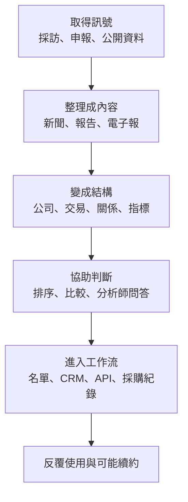
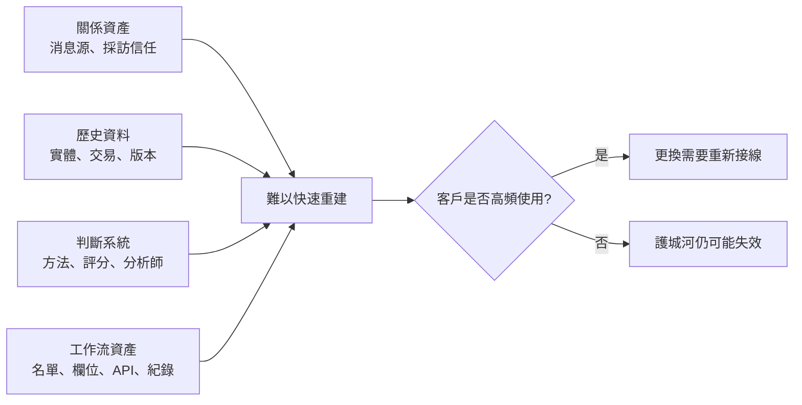
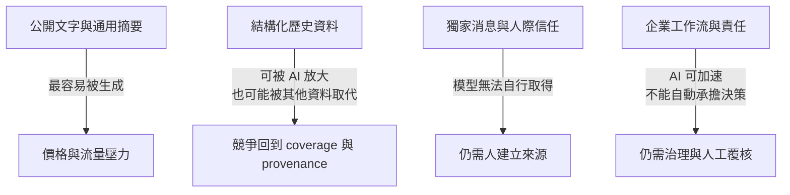

> 🌏 [English version](/en/posts/product/2026-09-16-b2b-intelligence-business-en)

想像公司準備買一座新工廠。主管桌上有幾百篇新聞、供應商簡報、試算表和會議筆記。資料很多，真正困難的卻是：哪一則訊號可信、哪些公司值得先談、各部門要用什麼標準選，以及半年後怎麼解釋當初的決定。

B2B 產業情報賣的就是這段距離。文章只是入口；能收進企業預算的產品，通常還會把資訊整理成名單、資料欄位、評分、分析師問答或採購流程。企業付費，是為了少找錯一家公司、少漏掉一個風險，也少重做一次研究。

這篇是「情報如何成為一門企業生意」的導讀。六個案例沒有共同的定價公式，也不能排成一條由弱到強的排行榜。它們比較像六種工具：有人靠第一手消息，有人把分散研究變成市場，有人把資料直接接進企業每天使用的系統。

## 先看全貌：內容只是情報產品的第一層

一門情報生意可以停在任何一層，也可以逐步往下走。愈往下，產品愈接近日常工作；導入與更換成本通常也會增加。但這不是保證續約的公式。若資料不準、使用頻率太低，或團隊根本沒有能力採用，再深的整合也救不了產品。

這張圖最容易被誤讀的地方，是把最後一格當成必然結果。工作流只能增加使用理由，不能證明客戶一定留下。PitchBook 的公開財務說明就顯示，高頻投資與顧問客群較能持續使用，需求有限的小型企業仍可能離開。

## 六個案例，各自把哪一層做成商品

| 案例 | 主要訊號來源 | 付費產品單位 | 最接近的決策工作 | 主要限制或 AI 暴露 |
|---|---|---|---|---|
| [DIGITIMES：供應鏈人脈怎麼變成續約](/posts/product/2026-09-16-digitimes-supply-chain-intelligence) | 台灣科技供應鏈採訪與產業關係 | 新聞、研究、資料與顧問服務 | 看懂上下游變化、提早調整供應鏈判斷 | 摘要容易，第一手訊號仍需人取得 |
| [The Information：少量獨家新聞怎麼撐起高價訂閱](/posts/product/2026-09-16-the-information-exclusive-news) | 科技公司、創投與金融圈消息源 | 獨家報導、企業席次、資料工具 | 在投資、競爭與組織變動前取得時間差 | 轉述會稀釋流量，獨家採訪不能自動生成 |
| [Seeking Alpha：投稿市場、Quant Ratings、訂閱飛輪](/posts/product/2026-09-16-seeking-alpha-contributor-marketplace) | 外部作者、財務資料與量化訊號 | 文章、投資工具、量化評級 | 找觀點、篩選股票、持續追蹤 | 通用文章最容易被生成；評分仍有方法與利益衝突限制 |
| [CB Insights：研究內容怎麼變成企業工作流](/posts/product/2026-09-17-cb-insights-research-to-workflow) | 公開市場訊號、交易與公司資料 | 結構化資料、Mosaic、AI 介面、整合 | 找公司、排研究順序、監控市場 | 私人公司資料有缺口；回測是公司自評，不等於投資報酬 |
| [PitchBook：私人市場資料怎麼變成工作流](/posts/product/2026-09-17-pitchbook-private-market-data) | 公開來源、當事人回報與研究員核對 | 公司、交易、基金、人物關係資料 | 找案、盡調、基金比較、內部資料更新 | 遲報、估計與回修無法消失；低頻使用者未必願意續約 |
| [Gartner：品牌、分析師與決策保險](/posts/product/2026-09-17-gartner-decision-insurance) | 分析師研究、客戶互動、基準與供應商資料 | 研究訂閱、分析師問答、採購工具 | 縮小供應商名單、跨部門對齊、保留決策依據 | Magic Quadrant 是專家意見，不是產品真理；AI 先壓縮搜尋與摘要 |

這張表刻意不放第三方估算價格、未查證營收或「全球唯一」之類的宣稱。六家公司公開程度差很多，硬塞進同一欄，只會把報價、方案、公司聲明與法定財務混成看似精準的比較。

## 兩條起跑線：先有人脈，或先有資料

[DIGITIMES](/posts/product/2026-09-16-digitimes-supply-chain-intelligence) 與 [The Information](/posts/product/2026-09-16-the-information-exclusive-news) 從記者和消息源起跑。它們的第一個產品是時間差：在重要消息變成共識之前，先讓讀者看見。AI 可以重寫已公開的報導，卻不能憑空建立記者與供應鏈主管、創投合夥人或公司員工之間的信任。

[CB Insights](/posts/product/2026-09-17-cb-insights-research-to-workflow) 與 [PitchBook](/posts/product/2026-09-17-pitchbook-private-market-data) 則更接近資料工廠。它們把公司、人物、交易、基金與關係從文字拆成欄位，再持續消歧、補值與回修。免費研究或報告可以展示能力，付費價值則來自反覆查詢、比較與串接。

[Seeking Alpha](/posts/product/2026-09-16-seeking-alpha-contributor-marketplace) 站在兩者中間。它先讓外部作者提供分散觀點，再用編輯規則、資料與量化工具把市場組織起來，不必從一整間內部研究部門起步。這也帶來兩種風險：內容品質難治理，量化分數又可能被誤讀成自動投資答案。

## 真正難搬的，通常不是那篇文章

六個案例的護城河可以拆成四種。這四種資產需要不同時間與資源累積，沒有簡單的高低排名。

關係資產讓 DIGITIMES 與 The Information 取得還沒公開的訊號。歷史資料讓 PitchBook 與 CB Insights 能回答「這次跟以前有何不同」。判斷系統讓 Seeking Alpha 與 Gartner 把大量候選壓成較短的清單。工作流資產則把輸出送進 CRM、API、試算表、監控清單或採購紀錄。

一家公司可以同時擁有四種，也可能只有其中一種。判斷護城河時，應該問客戶取消後要重建什麼：消息來源、歷史口徑、評估方法，還是每天會用到的系統連接？

## AI 不是同一場海嘯，而是逐層壓價

把六家公司標成低、中、高風險看似俐落，實際上會遮掉產品內部的差異。生成式 AI 先壓縮公開文字的搜尋、摘要與初稿，再碰到資料權利、來源追溯、人工責任與企業整合。

因此，同一家公司會同時受益與受傷。Seeking Alpha 的通用文章面臨大量替代品，但量化工具仍可能有用。CB Insights 與 PitchBook 能用聊天介面降低查詢門檻，底層資料錯誤也會被更快放大。Gartner 推出 AI 入口，可以改善研究取用，卻還得證明分析師、基準與採購流程值得高價。這些是產品層的壓力，不足以單獨解釋股價或營收變化。

AI 暴露可以用四個問題檢查：

1. 答案只需要公開文字，還是需要尚未公開的消息？
2. 資料能否追到來源、更新日期與估計方法？
3. 產品是否進入團隊每天使用的流程，還是偶爾讀一次？
4. 出錯時有人覆核並承擔決策，還是只剩一段流暢文字？

## 台灣可以學的不是「再做一家 Gartner」

台灣市場不大，卻有很多全球供應鏈、法規、製造流程與地方關係留下的資訊落差。[台灣能不能再長出一家 DIGITIMES](/posts/product/2026-09-17-taiwan-vertical-intelligence-opportunity) 這篇把問題往前推。機會未必是一個包山包海的平台，更可能藏在某個昂貴、反覆發生、現有資料又很破碎的決策裡。

今晚可以先做一個小測試。找出目標客戶最近三次重要決策，列出他們依序查了哪些資料、問了哪些人、最後把結果貼進哪套系統。若你的內容只能補第一步，它還是媒體；若能讓後面的比較、交接與追蹤也少重做，才開始接近企業情報產品。

## 系列閱讀順序

0. [供應鏈人脈怎麼變成續約：DIGITIMES 的情報生產線](/posts/product/2026-09-16-digitimes-supply-chain-intelligence)
1. [少量獨家新聞怎麼撐起高價訂閱：The Information 的採訪飛輪](/posts/product/2026-09-16-the-information-exclusive-news)
2. [Seeking Alpha 怎麼賣群眾研究：投稿市場、Quant Ratings、訂閱飛輪](/posts/product/2026-09-16-seeking-alpha-contributor-marketplace)
3. [研究內容怎麼變成企業工作流：CB Insights 的資料產品化](/posts/product/2026-09-17-cb-insights-research-to-workflow)
4. [私人市場資料怎麼變成工作流：PitchBook 的人工驗證與切換成本](/posts/product/2026-09-17-pitchbook-private-market-data)
5. [企業為什麼買 Gartner：品牌、分析師與決策保險](/posts/product/2026-09-17-gartner-decision-insurance)
6. [台灣能不能再長出一家 DIGITIMES：垂直情報的選題方法](/posts/product/2026-09-17-taiwan-vertical-intelligence-opportunity)

## 更新紀錄

- 2026-09-17：依七篇案例重寫導讀，移除未可靠的精確定價、估算營收、唯一性與 AI 因果宣稱；新增比較表、護城河／AI 圖與完整系列連結。

## 參考資料

- 母系列總覽：[誰在賣內容：四種模式與一個威脅](/posts/product/2026-09-16-content-selling-four-models)
- [DIGITIMES 個案](/posts/product/2026-09-16-digitimes-supply-chain-intelligence)
- [The Information 個案](/posts/product/2026-09-16-the-information-exclusive-news)
- [Seeking Alpha 個案](/posts/product/2026-09-16-seeking-alpha-contributor-marketplace)
- [CB Insights 個案](/posts/product/2026-09-17-cb-insights-research-to-workflow)
- [PitchBook 個案](/posts/product/2026-09-17-pitchbook-private-market-data)
- [Gartner 個案](/posts/product/2026-09-17-gartner-decision-insurance)
- [台灣垂直情報機會](/posts/product/2026-09-17-taiwan-vertical-intelligence-opportunity)
