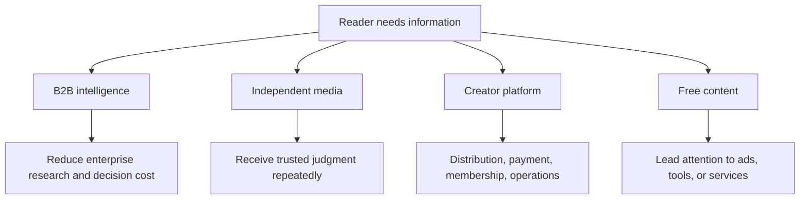
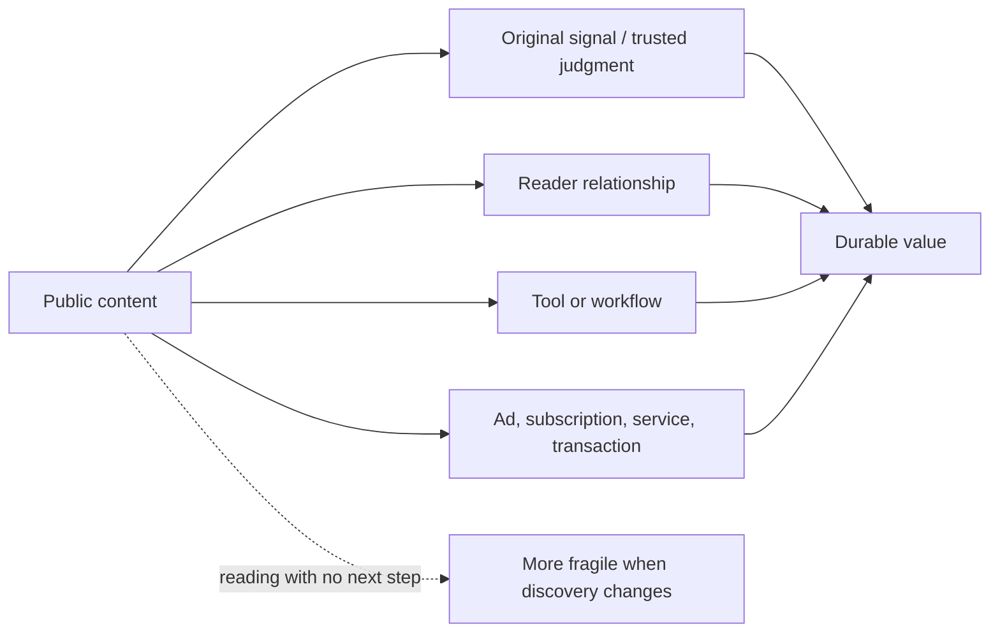

> 🌏 [中文版](/posts/product/2026-09-16-content-selling-four-models)

Think of the content business as a market. One vendor sells research to corporate procurement teams, while another earns repeat visits through a trusted personal voice. A platform builds stalls, checkout, and membership systems for creators. Free content acts like a map that directs people to a nearby tool or service.

All four make content, but they sell different things. Asking only what an article should cost is like inspecting the menu paper while ignoring the kitchen, customer, checkout, and reason to return.

This article is the entrance to a group of series. It does not rank companies or preserve a price leaderboard that will quickly expire. It starts with two questions: **who pays, and what job are they paying to complete?**

## Four parent models, not four company labels

One company can span several models, and one product can move from articles into data, tools, or transactions. This table compares the main exchange rather than revenue estimates or market rank.

| Parent model | Primary payer | Job purchased | Asset that may accumulate | Evidence boundary |
|---|---|---|---|---|
| B2B intelligence | Enterprise, department, professional | Find signals, query data, complete decisions and collaboration | Original sources, data, methods, workflows | A public summary is not the whole enterprise product; private quotes do not define market price |
| Independent media | Reader, advertiser, partner | Receive a publisher's judgment and curation repeatedly | Brand, direct audience relationship, archive | Personal brand does not guarantee renewal; winner cases do not transfer |
| Creator platform | Creator, reader, or both | Delivery, discovery, payment, membership, operations | Network, data, payments, operating tools | A CSV is not full billing and interaction portability; fees need plan and date context |
| Free content plus side monetization | Advertiser, tool user, merchant, enterprise | Solve one problem free, then complete another paid job | Reach, first-party relationship, tool use, transaction entry | Entry-to-revenue needs measurement; adjacent buttons do not prove causality |

## Path one: enterprises pay for the decision process

The [B2B intelligence guide](/en/posts/product/2026-09-16-b2b-intelligence-business-en) separates reporting, exclusive news, contributor research, private-market data, and procurement frameworks into six product paths. Enterprises pay to identify signals sooner, compare choices with consistent fields, or bring research into existing work; word count is beside the point.

“Decision insurance” is an organizational-purchasing hypothesis, not an explanation for every Gartner customer. A stock move and the arrival of AI answers do not establish causality. The series examines DIGITIMES, The Information, Seeking Alpha, CB Insights, PitchBook, and Gartner at the product layer.

## Path two: one person turns trust into media

Independent newsletters are not a new subseries here because the site already has the [One-Person Media Company series](/en/posts/career/2026-08-26-one-person-media-company-overview-en). It follows subscription, advertising, community, investing, and services while asking whether the creator has built a reader relationship that supports repeated delivery.

This overview keeps independent media as a parent model without repeating creator revenue and subscriber counts. Those figures change quickly and overrepresent visible winners.

## Path three: what responsibilities does a platform take?

The [creator-platform guide](/en/posts/product/2026-09-16-ugc-platform-creator-economy-en) compares four gates: who brings readers, collects payment, holds data, and operates the system. Substack, Medium, Vocus, Patreon, Ghost, and Beehiiv assign control, growth, and operating cost differently; they do not form a ladder from worst to best.

[Ghost's membership documentation](https://docs.ghost.org/members) says member lists can be exported and native paid subscriptions connect to the publisher's own Stripe account. That supports portability for specific product surfaces. It does not establish frictionless migration of comments, interaction history, automations, and every payment record.

## Path four: free content acquires customers for another business

The [free-content guide](/en/posts/product/2026-09-16-free-content-side-monetization-en) follows eight paths through advertising, tools, AI content funnels, information-to-transaction journeys, affiliate marketing, and CAC/LTV. The useful test is whether a qualified reader reaches a next step that produces contribution margin, not pageview volume alone.

An investment page beside an order button does not prove the publisher receives brokerage commission. A free podcast summary does not turn every read into a paid conversion. Commercial relationships, fulfillment parties, and attribution data need separate evidence.

## AI search is cross-cutting, not a fifth revenue model

AI search can touch the public text of all four models, but its impact is not equivalent to all traffic disappearing. [Order 0 of the AI Search series](/en/posts/product/2026-09-17-ai-overviews-change-traffic-path-en) separates retrieval, citation, referral requests, on-site sessions, and conversion.

[Google's documentation](https://developers.google.com/search/docs/appearance/ai-features) says AI Overviews and AI Mode may use query fan-out and that their traffic is included in Search Console's Web search type. [Cloudflare's crawl-to-refer metric](https://blog.cloudflare.com/ai-search-crawl-refer-ratio-on-radar/) compares HTML crawler requests with HTML requests carrying a platform `Referer`. It is not CTR, and native apps that omit `Referer` can undercount the denominator.

The cross-cutting series does not use one zero-click percentage to predict every publisher. It asks which text can be compressed completely and which value still requires original data, a direct relationship, a tool, workflow, or transaction.

## How to read the series group

Start with B2B intelligence if you sell enterprise research. Go to the platform series if you are choosing creator infrastructure. Follow the free-content series if articles acquire customers for a tool or service. If discovery is already changing, begin with AI Search order 0 and audit your product layers.

There is no shared best answer. Draw three boxes—content, retained asset, paid job—and ask of every arrow: who owns it, can it move, how often must it update, and what evidence shows the transition occurs?

## Update history

- 2026-09-17: Rewritten as the series-group entry point; removed weakly supported or fast-expiring price, revenue, subscriber, traffic-forecast, and legal claims; added navigation to three subseries and the AI Search series.

## References

- [Google Search Central: AI features and your website](https://developers.google.com/search/docs/appearance/ai-features)
- [Cloudflare: The crawl before the fall of referrals](https://blog.cloudflare.com/ai-search-crawl-refer-ratio-on-radar/)
- [Ghost: Memberships](https://docs.ghost.org/members)
