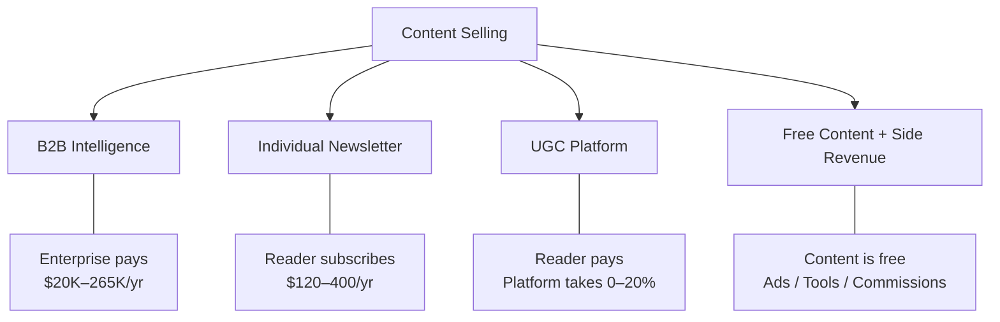
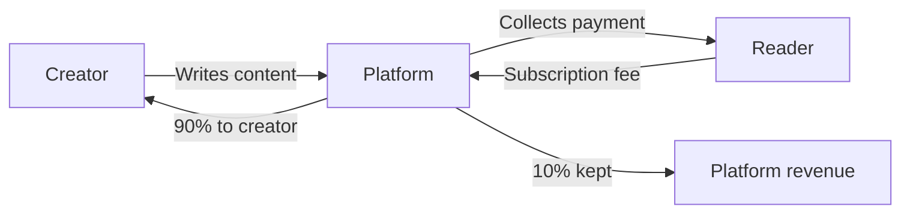
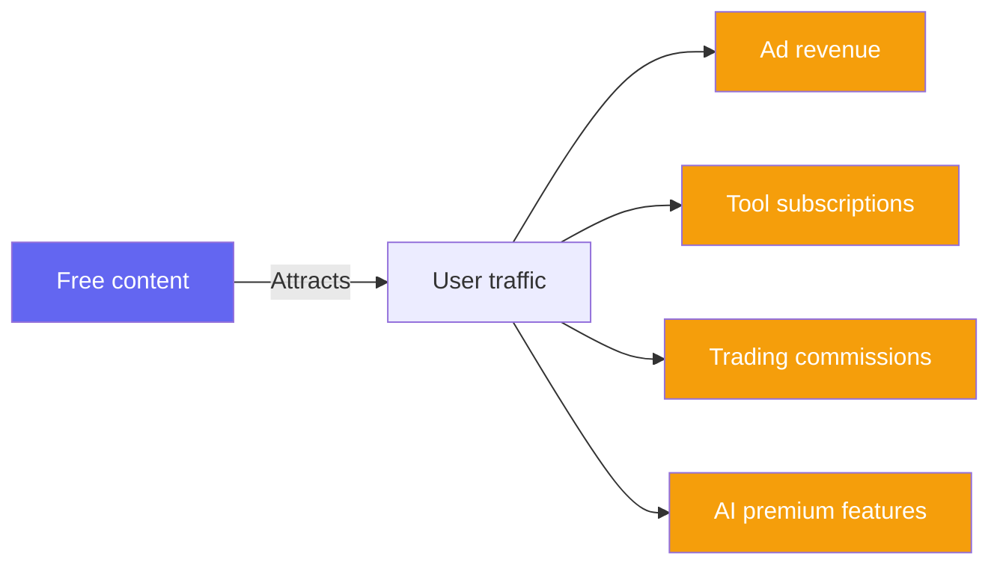
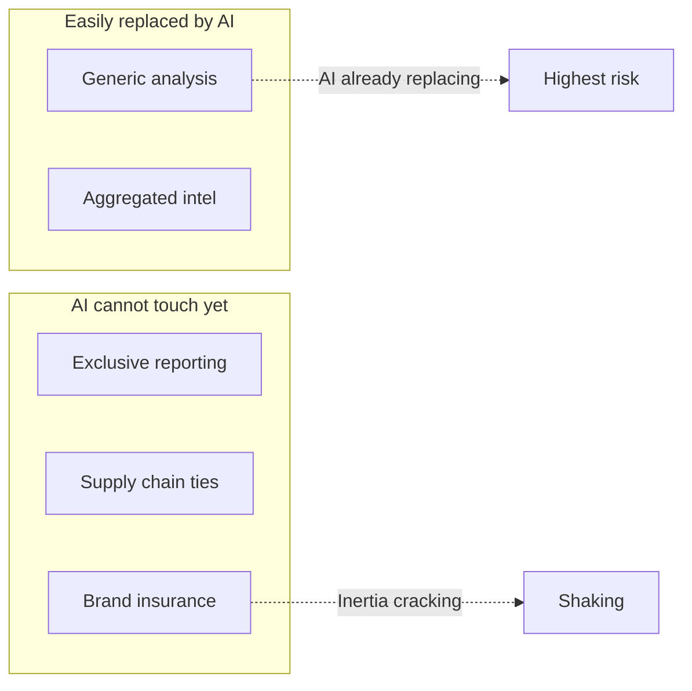
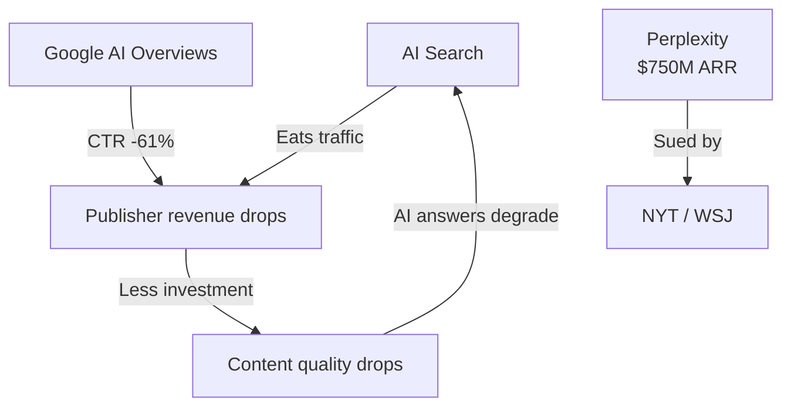

> 🌏 [中文版](/posts/product/2026-09-16-content-selling-four-models)

The same need — "I need information to make better decisions" — spawns the $25,000/year [Bloomberg Terminal](https://www.bloomberg.com/professional/products/bloomberg-terminal/) and the completely free [cnYES](https://www.cnyes.com/) (Taiwan's largest financial news portal). A thousand-fold pricing gap, serving the same people trying to make money.

Why does one need produce businesses priced so differently? Because "selling content" is not one business model — it is four, each with a completely different customer, pricing logic, and moat. And in 2026, a structural force is threatening all four simultaneously.

This is the overview of the "Content Selling Business Models" series. The four subsequent posts go deep into each model.

---

## The Four Models at a Glance

| Model | Who creates | Who pays | Pricing range | Representative products | Moat |
|---|---|---|---|---|---|
| B2B Intelligence | In-house journalists & analysts | Enterprises | $20K–265K/yr | [DIGITIMES](https://www.digitimes.com.tw/), [The Information](https://www.theinformation.com/), [Gartner](https://www.gartner.com/) | Exclusive sources, proprietary data |
| Individual Paid Newsletter | Solo or small team | Individual readers | $120–400/yr | [Stratechery](https://stratechery.com/), [Lenny's Newsletter](https://www.lennysnewsletter.com/) | Personal brand, unique perspective |
| UGC Platform Revenue Share | Creator community | Individual readers (platform takes cut) | Platform takes 0–20% | [Substack](https://substack.com/), [Vocus](https://vocus.cc/), [Ghost](https://ghost.org/) | Network effects, discoverability |
| Free Content + Side Monetization | Editorial + AI + tools | Advertisers or tool subscribers | Content is free | [cnYES](https://www.cnyes.com/), [CMoney](https://www.cmoney.tw/), [BigGo Finance](https://finance.biggo.com.tw/) | User habits, tool lock-in |

---

## Model 1: B2B Industry Intelligence

Enterprises pay tens to hundreds of thousands of dollars per year not for "content" but for **decision insurance**. A CIO consults [Gartner](https://www.gartner.com/)'s Magic Quadrant before purchasing software — not because Gartner knows more, but because if things go wrong, the CIO can say "I followed Gartner's recommendation."

The major players span a wide range of scales:

| Product | Revenue | Pricing | Content source |
|---|---|---|---|
| [Gartner](https://www.gartner.com/) | $6.5B/yr | $20K–80K+/seat | Thousands of analysts |
| [PitchBook](https://pitchbook.com/) | $618M/yr | $20K–70K+/yr | Proprietary VC/PE database |
| [CB Insights](https://www.cbinsights.com/) | ~$146M/yr | $30K–265K/yr | Analysts + AI models |
| [The Information](https://www.theinformation.com/) | Undisclosed (30% YoY growth) | $399–999/yr | ~20 reporters |
| [DIGITIMES](https://www.digitimes.com.tw/) | Undisclosed | Tens of thousands NTD/yr | Reporter team |
| [Seeking Alpha](https://seekingalpha.com/) | Est. $80–120M/yr | $299–2,400/yr | 7,000+ crowdsourced contributors |

[The Information](https://www.theinformation.com/) is the most distinctive of the group: founder Jessica Lessin has never taken outside investment. With 45,000 paying subscribers and consistently growing revenue, her moat is the exclusive scoops her reporters dig up — the actual terms of VC deals, the internal dynamics of big tech boards. AI cannot crawl its way to these sources.

[DIGITIMES](https://www.digitimes.com.tw/) chose a different battleground. Founded in 1998 with backing from over fifty industry leaders including Morris Chang and Stan Shih, it zeroed in on a domain where Taiwan has a natural information advantage: ICT supply chain intelligence. It produces about a hundred articles per day and serves over 1,300 enterprise members. The moat is not technology — it is 26 years of industry relationships.

**The entry ticket for this path**: you need information sources no one else can access. Without exclusives, there is no reason to pay.

Series [Order 1](/en/posts/product/2026-09-16-b2b-intelligence-business-en) dives deeper into this model.

---

## Model 2: Individual Paid Newsletters

In 2014, Ben Thompson began running [Stratechery](https://stratechery.com/) full-time from an apartment in Taipei, charging $15 per month. [Substack](https://substack.com/) did not exist yet. "Making a living writing a newsletter" sounded like a joke.

A decade later, Stratechery earns over $5M per year, [Lenny's Newsletter](https://www.lennysnewsletter.com/) earns $2.7M+, and [Morning Brew](https://www.morningbrew.com/) was acquired for $75M. Newsletters went from fringe experiment to a replicable media startup path.

We already covered this model in depth across ten posts. From Stratechery's subscription model to TLDR's advertising approach, from The Hustle's SaaS funnel to Not Boring's writing-as-deal-flow strategy, each post is a standalone business model case study. The full series is at [One-Person Media Company: Ten Cases and Four Paths](/en/posts/career/2026-08-26-one-person-media-company-overview-en).

---

## Model 3: UGC Platform Revenue Share

[Substack](https://substack.com/)'s logic is simple: help creators collect payment, take a 10% cut. The platform produces no content — it provides infrastructure (payments, subscription management, email delivery) and some degree of content discovery.

The economics vary significantly across major players:

| Platform | Revenue model | Creator keeps | Scale |
|---|---|---|---|
| [Substack](https://substack.com/) | 10% revenue share | ~87% (after Stripe fees) | 50M subscriptions, $450M creator GMV |
| [Vocus](https://vocus.cc/) | 20% + 2.25% processing fee | ~78% | Taiwan's largest text creator platform |
| [Ghost](https://ghost.org/) | SaaS fee $9–199/mo | 100% (handle payments yourself) | $100M+ creator revenue |
| [Beehiiv](https://www.beehiiv.com/) | SaaS fee + ad network | 100% (subscriptions) / split (ads) | $30M ARR |
| [Patreon](https://www.patreon.com/) | 10% revenue share | ~87% | $2B+ annual payouts |
| [Medium](https://medium.com/) | Membership pool ($5/mo) | Opaque | Declining creator mindshare |

There is a fundamental tension here: **revenue share vs. SaaS**. Substack's 10% aligns platform and creator incentives — but it also means successful creators subsidize the platform's less successful ones. Ghost charges a flat monthly fee and creators keep everything, but you handle more yourself.

Another tension: **discoverability vs. ownership**. Substack's recommendation algorithm and Notes feature help you get found, but your subscriber list lives on Substack's servers. Ghost gives you full control, but traffic is your problem.

These tensions cannot be resolved, which is why platform migration is real: Platformer's Casey Newton moved from Substack to Ghost over content policy disagreements; multiple high-earning creators switched to Beehiiv or self-hosted setups over the 10% cut.

Series [Order 3](/en/posts/product/2026-09-16-ugc-platform-creator-economy-en) compares these platforms in depth.

---

## Model 4: Free Content + Side Monetization

These companies give content away for free. Revenue comes from elsewhere — advertising, tool subscriptions, transaction commissions, or using free content as a funnel into paid products.

Taiwanese investors are most familiar with this path:

| Product | How content is produced | Where revenue comes from |
|---|---|---|
| [cnYES](https://www.cnyes.com/) | Editorial team + wire services | Advertising |
| [CMoney](https://www.cmoney.tw/) | Editorial + community + tools | Multi-tier subscriptions + stock screening tools |
| [BigGo Finance](https://finance.biggo.com.tw/) | AI auto-summarizes English podcasts | Pro plan at $20/mo |
| [Fugle](https://www.fugle.tw/) | Investment research + API docs | Brokerage commissions + API subscriptions |
| [Yahoo Finance](https://finance.yahoo.com/) | Editorial + licensed + UGC | Advertising |

[BigGo Finance](https://finance.biggo.com.tw/) is the most interesting case in this group. It uses AI to automatically convert English financial podcasts (Lenny's Podcast, All-In, and others) into high-quality structured Chinese notes — complete with headings, tables, quotes, and unresolved questions — published for free. These summaries are not the product; they are the funnel. Readers drawn to the platform then encounter AI deep-thinking mode, early earnings call access, and push notifications — features that require a paid subscription.

The moat for this path is not in content (which is free and replicable) but in the **surrounding ecosystem**: CMoney's stock screening tools create switching costs once embedded in an investor's workflow; cnYES's real-time market data is the default landing page for many Taiwanese investors; Fugle's API is already integrated into developers' trading systems. Content is the door; tools are the lock.

Series [Order 4](/en/posts/product/2026-09-16-free-content-side-monetization-en) uses financial information platforms as a case study to dissect this path.

---

## The Moat Spectrum: What AI Cannot Take

Moat strength varies dramatically across the four models. From easiest to hardest for AI to replace:

| Moat type | Example | Can AI replace it? |
|---|---|---|
| Generic analysis | [Seeking Alpha](https://seekingalpha.com/) crowdsourced articles | Yes — and it is already happening |
| Aggregated intelligence | [CB Insights](https://www.cbinsights.com/) market maps | Data layer is defensible; analysis layer is eroding |
| Exclusive reporting | [The Information](https://www.theinformation.com/) Silicon Valley scoops | No — AI has no sources |
| Supply chain relationships | [DIGITIMES](https://www.digitimes.com.tw/) industry contacts | No — requires physical access and decades of trust |
| Brand decision insurance | [Gartner](https://www.gartner.com/) Magic Quadrant | Institutional inertia holds, but it is cracking |

The pattern is clear: **AI threatens the analysis layer, not the data access layer or the relationship layer.** If your moat is built on "I can analyze better than anyone else," AI is catching up. But if it is built on "I can access information no one else can" or "people need my name to justify their decisions," AI cannot touch you yet.

Gartner is the most telling case. Its moat is decision insurance — nobody gets fired for following Gartner's recommendation. Yet Gartner's stock is down over 70% from its peak, and contract value (CV) growth has decelerated from 8% to 1% across four consecutive quarters. When a CIO can ask Claude "which CRM should I buy?" and receive a cited, reasoned answer, the $80,000 annual Gartner seat needs to re-justify its existence.

---

## Pricing Reveals the Customer

A simple heuristic: look at a content product's pricing, and you can guess its customer.

| Annual price | Customer type | Purchase decision |
|---|---|---|
| < $500 | Individual consumer | "Is this worth a coffee a day?" |
| $20K–80K | Enterprise seat | Department budget line item |
| $50K–265K | Enterprise platform | Requires procurement process and executive sign-off |

The higher the price, the less the buyer cares whether the content is objectively good — what matters is whether the expense can be justified within the organization. The Information at $399/year relies on content quality to make individuals feel it is worth the price. Gartner at $80,000/year relies on institutional inertia to keep procurement auto-renewing.

---

## The Fifth Force: AI Search Is Eating Everyone's Traffic

Regardless of which model you pursue, one force is reshaping the entire game: AI search.

[Perplexity](https://www.perplexity.ai/) reached an estimated $750M in annualized revenue by August 2026, with 45 million monthly active users. It retrieves content from across the web, synthesizes answers with LLMs, and provides citations. Users get answers; publishers lose traffic.

[Google AI Overviews](https://blog.google/products/search/generative-ai-google-search-may-2024/) delivers an even larger impact. According to [Similarweb](https://www.similarweb.com/) data, when AI Overviews appear, click-through rates on traditional search results drop by 61%. Zero-click searches — where users read the AI answer and leave without clicking any link — rose from 56% to 69% within a single year.

Publisher responses are diverging. According to the [Reuters Institute](https://reutersinstitute.politics.ox.ac.uk/) 2026 survey, publishers expect traffic to decline by an average of 43% over the next three years, and a third plan to block AI Overviews. Yet simultaneously, most publishers plan to invest more in AI platform distribution — contradictory but rational.

Legal battles are intensifying. [Dow Jones](https://www.dowjones.com/) (WSJ's parent) and The New York Times filed separate lawsuits against Perplexity in late 2024 and late 2025, alleging "massive illegal copying" of copyrighted content. These cases remain unresolved, but their outcomes will define the rules of the game for content businesses in the AI era.

The deepest issue is the **content collapse paradox**: if AI summaries continue to erode publisher traffic and revenue, publishers will invest less in high-quality content. But AI answer quality depends on the existence of high-quality content. When AI consumes the ecosystem that feeds it, it starves itself.

---

## Series Map

This post is the overview. The following posts dive into each model:

| Post | Topic | Products covered |
|---|---|---|
| [Order 1: B2B Intelligence](/en/posts/product/2026-09-16-b2b-intelligence-business-en) | Why enterprises pay tens to hundreds of thousands per year for intelligence | DIGITIMES, The Information, Gartner, PitchBook, CB Insights, Seeking Alpha |
| [Order 2: Individual Paid Newsletters](/en/posts/career/2026-08-26-one-person-media-company-overview-en) | How far can one person go selling a newsletter (existing series) | Stratechery, Morning Brew, Lenny's Newsletter, and seven more cases |
| [Order 3: UGC Platforms](/en/posts/product/2026-09-16-ugc-platform-creator-economy-en) | Revenue share vs. SaaS, discoverability vs. ownership | Substack, Vocus, Ghost, Beehiiv, Patreon, Medium |
| [Order 4: Free Content + Side Monetization](/en/posts/product/2026-09-16-free-content-side-monetization-en) | Content is free — where does the money come from? | cnYES, CMoney, BigGo Finance, Fugle, Yahoo Finance |

## References

- [DIGITIMES](https://www.digitimes.com.tw/) — Taiwan ICT supply chain intelligence platform
- [The Information](https://www.theinformation.com/) — Silicon Valley tech exclusive reporting
- [Gartner FY2025 Annual Report](https://www.gartner.com/en/about/annual-report) — $6.5B revenue, decelerating CV growth
- [Gartner investment analysis](https://junkbondinvestor.com/) — Stock decline and AI threat deep dive
- [PitchBook / Morningstar Q1 2026 Earnings](https://www.morningstar.com/) — $618M revenue, 10,600 accounts
- [CB Insights](https://www.cbinsights.com/) — Tech market intelligence platform
- [Seeking Alpha](https://seekingalpha.com/) — Crowdsourced investment analysis
- [Substack](https://substack.com/) — Newsletter subscription platform
- [Vocus](https://vocus.cc/) — Taiwan creator content platform
- [Ghost](https://ghost.org/) — Open-source newsletter and membership platform
- [Beehiiv](https://www.beehiiv.com/) — Newsletter SaaS platform
- [BigGo Finance](https://finance.biggo.com.tw/) — AI financial information platform
- [cnYES](https://www.cnyes.com/) — Taiwan financial news portal
- [CMoney](https://www.cmoney.tw/) — Investment tools and community platform
- [Fugle](https://www.fugle.tw/) — Taiwan brokerage and investment research platform
- [Perplexity](https://www.perplexity.ai/) — AI search engine
- [Perplexity revenue estimates](https://sacra.com/c/perplexity/) — Sacra analysis, ~$750M ARR as of August 2026
- [Similarweb AI Overviews impact data](https://www.similarweb.com/) — Zero-click search rates and CTR changes
- [Reuters Institute Journalism Trends 2026](https://reutersinstitute.politics.ox.ac.uk/) — Publisher traffic expectation survey
- In-site: [One-Person Media Company: Ten Cases and Four Paths](/en/posts/career/2026-08-26-one-person-media-company-overview-en)
