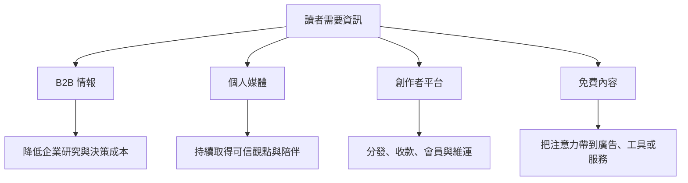
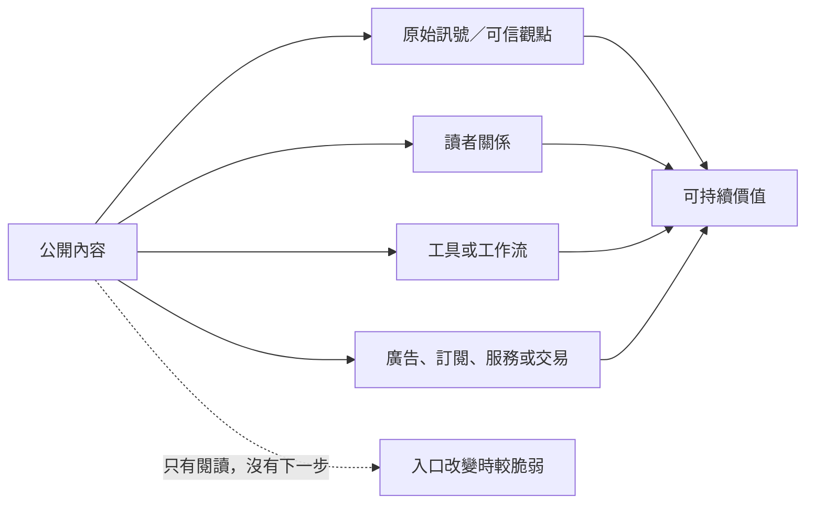

> 🌏 [English version](/en/posts/product/2026-09-16-content-selling-four-models-en)

把內容生意想成一座市場。有人把研究報告賣給公司採購，也有人靠自己的名字讓讀者每週回來。平台蓋好攤位、收銀機和會員系統，向創作者收費；免費內容則像地圖，把人帶到旁邊的工具或服務。

四個攤位都在「做內容」，實際出售的東西卻不同。只問文章該賣多少錢，就像只看菜單紙張，卻沒看廚房、客人、收銀方式與回頭理由。

這篇是系列群入口。它不替公司排高下，也不保存容易過時的報價排行榜；它先回答兩件事：**誰付錢？付錢是為了完成什麼工作？**

## 四種母模式，不是四種公司標籤

同一家公司可以跨兩種以上模式；同一產品也可能從文章走向資料、工具或交易。下表比較主要交換關係，不是營收估值或市場排名。

| 母模式 | 主要付費者 | 真正購買的工作 | 能累積的資產 | 證據邊界 |
|---|---|---|---|---|
| B2B 情報 | 企業、部門或專業使用者 | 找訊號、查資料、完成決策與協作 | 原始來源、資料、方法、工作流 | 公開摘要不代表完整企業產品；未公開牌價不能定義全市場 |
| 個人媒體 | 個人讀者、廣告主或合作方 | 持續取得特定作者的判斷與策展 | 品牌、直接讀者關係、內容檔案 | 個人品牌不保證續訂；成功案例不能外推給下一位創作者 |
| 創作者平台 | 創作者、讀者，或雙方 | 寄送、發現、收款、會員與維運 | 網路、資料、支付與營運工具 | CSV 不等於付款與互動完整可攜；費率須按方案與日期查核 |
| 免費內容＋側翼變現 | 廣告主、工具使用者、商家或企業 | 先免費解決一段問題，再完成另一項付費工作 | 流量、第一方關係、工具使用與交易入口 | 免費入口到收入要有量測，不能看到相鄰按鈕就宣稱因果 |

## 路線一：企業為決策過程付錢

[B2B 情報導讀](/posts/product/2026-09-16-b2b-intelligence-business)把文章、獨家消息、群眾研究、私人市場資料與採購框架拆成六條產品路線。企業付費的理由，往往是更快找到訊號、用一致欄位比較選項，或把研究接進既有工作；文章字數不是重點。

「決策保險」只能當組織採購假說，不能概括所有 Gartner 客戶，更不能用股價與 AI 問答同時變化宣稱因果。完整系列會分別檢查 DIGITIMES、The Information、Seeking Alpha、CB Insights、PitchBook 與 Gartner 的產品層。

## 路線二：一個人把信任變成媒體

個人電子報不是這次新增的子系列，因為站上已有完整的[「一個人的媒體公司」系列](/posts/career/2026-08-26-one-person-media-company-overview)。它從訂閱、廣告、社群到投資與服務，追問作者除了產文，是否建立了能反覆交付的讀者關係。

這裡保留它作為母模式，但不重抄個別創作者的營收與訂戶數。那些數字變動快，成功者案例也有明顯選樣偏誤。

## 路線三：平台替創作者承擔哪些責任

[創作者平台導讀](/posts/product/2026-09-16-ugc-platform-creator-economy)用四道門比較產品：誰帶來讀者、誰收款、誰保管資料、誰維持系統。Substack、Medium、Vocus、Patreon、Ghost 與 Beehiiv 不是由差到好的排行榜；它們把控制權、成長與維運成本分配給不同的人。

例如，[Ghost 官方會員文件](https://docs.ghost.org/members)說會員清單可匯出，原生付費訂閱連到出版者自己的 Stripe 帳號。這能證明特定產品面的可攜設計，不能推成留言、互動、自動化與所有付款資料都能無痛搬走。

## 路線四：免費內容替另一門生意獲客

[免費內容導讀](/posts/product/2026-09-16-free-content-side-monetization)從廣告、工具、AI 內容漏斗、資訊到交易、聯盟行銷與 CAC／LTV 拆解八條路徑。判斷重點是合格讀者有沒有走到能產生毛利的下一步，不能只看 pageview。

因此，不能看到投資資訊旁有下單功能，就宣稱內容商靠券商交易佣金；也不能看到免費 Podcast 摘要，就把每次閱讀算成付費轉換。商業關係、履約者與歸因資料都要逐一查證。

## AI 搜尋是橫切題，不是第五種收入模式

AI 搜尋會碰到四種模式的公開文字，但影響不等於「所有流量都消失」。[AI 搜尋系列 order 0](/posts/product/2026-09-17-ai-overviews-change-traffic-path)先把被檢索、被引用、referral request、站內 session 與轉換拆開。

[Google 官方文件](https://developers.google.com/search/docs/appearance/ai-features)說 AI Overviews 與 AI Mode 可能使用 query fan-out，流量則併入 Search Console 的 Web search type。[Cloudflare 的 crawl-to-refer](https://blog.cloudflare.com/ai-search-crawl-refer-ratio-on-radar/)比較 HTML crawler requests 與帶平台 `Referer` 的 HTML requests；它不是 CTR，原生 App 缺少 `Referer` 也會讓分母漏算。

因此，橫向系列不從單一 zero-click 百分比預測所有網站命運。它改問：哪些文字能被完整壓縮？哪些價值仍需要原始資料、直接關係、工具、工作流或交易？

## 怎麼讀這組系列

賣企業研究，從 B2B 情報導讀開始；選創作者平台，直接看平台系列；用文章替工具或服務獲客，走免費內容系列。若你已看到搜尋入口改變，從 AI 搜尋 order 0 開始，再回頭盤點自己的產品層。

四種模式沒有共同的最佳答案。比較有用的做法，是畫出「內容 → 留下的資產 → 付費工作」三格，再逐格問：誰擁有？能否帶走？多久更新？哪一箭頭真的有數據？

## 更新紀錄

- 2026-09-17：重寫為系列群入口，移除未可靠支持或容易過時的價格、營收、訂戶、流量預測與法律結論；補上三個子系列及 AI 搜尋系列導覽。

## 參考資料

- [Google Search Central：AI features and your website](https://developers.google.com/search/docs/appearance/ai-features)
- [Cloudflare：The crawl before the fall of referrals](https://blog.cloudflare.com/ai-search-crawl-refer-ratio-on-radar/)
- [Ghost：Memberships](https://docs.ghost.org/members)
