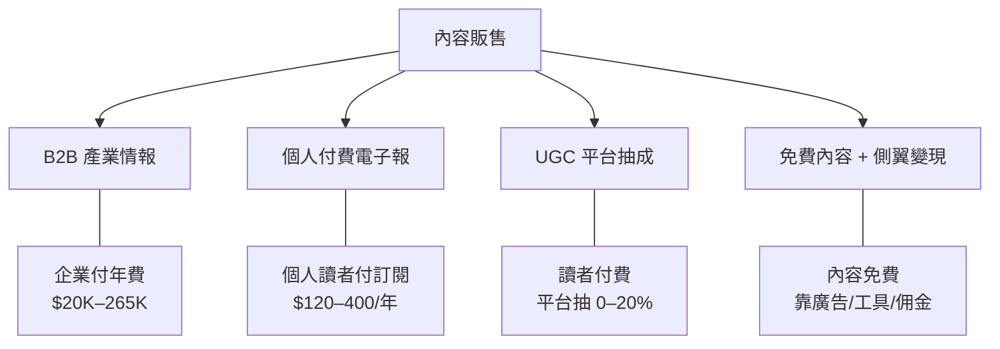
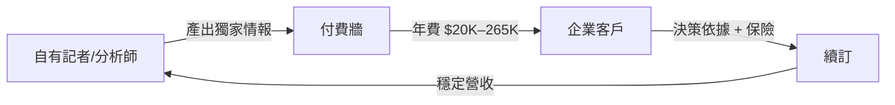
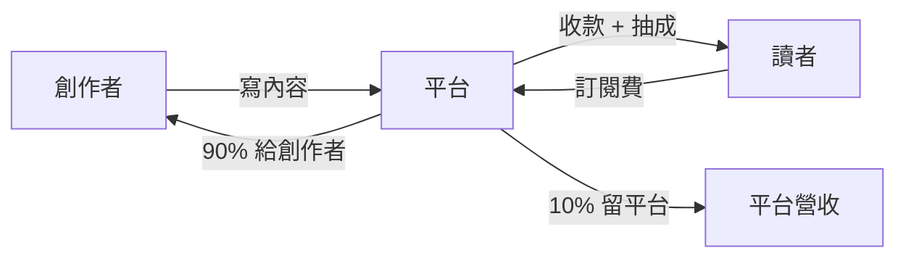
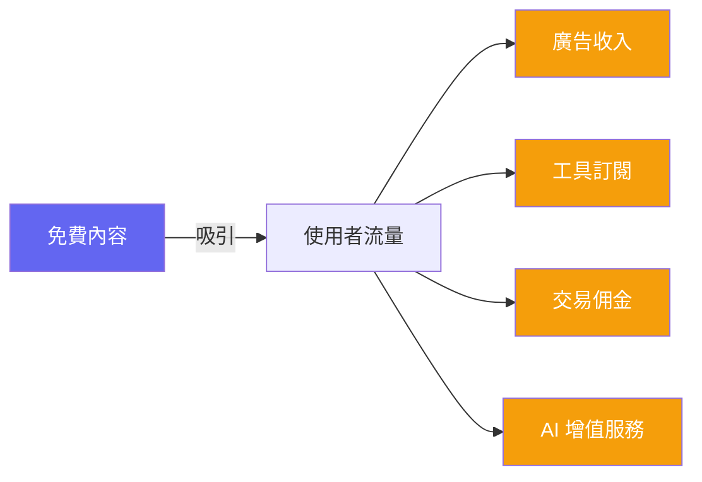
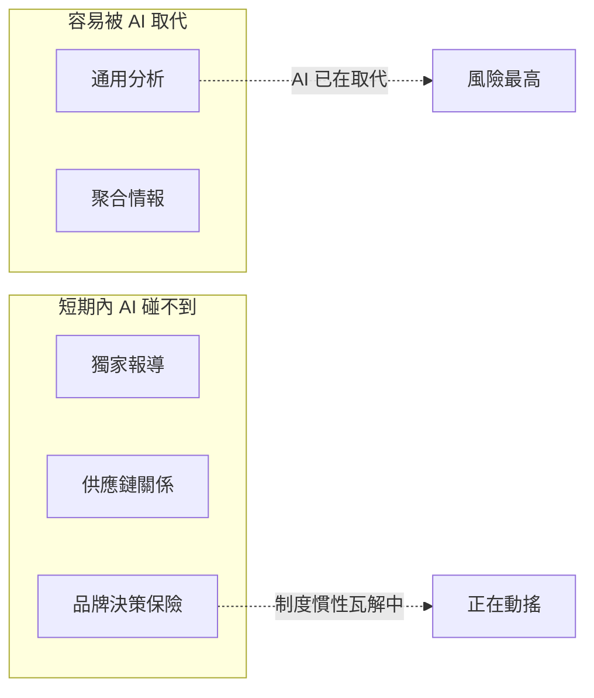
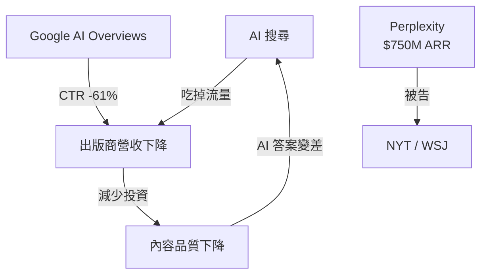

> 🌏 [English version](/en/posts/product/2026-09-16-content-selling-four-models-en)

同樣一個需求——「我需要資訊來做更好的決策」——養出了年費 $25,000 美元的 [Bloomberg Terminal](https://www.bloomberg.com/professional/products/bloomberg-terminal/) 和完全免費的 [鉅亨網](https://www.cnyes.com/)。定價差了一千倍，服務的是同一群想賺錢的人。

為什麼同一種需求可以長出差距這麼大的生意？因為「賣內容」不是一種商業模式，而是四種。每一種有完全不同的客戶、定價邏輯和護城河。而 2026 年，一股結構性力量正在同時威脅這四種模式。

這是「內容販售商業模式拆解」系列的總覽篇。後續四篇會分別深入每個模式的運作細節。

---

## 四種模式一覽

| 模式 | 誰產內容 | 誰付錢 | 定價帶 | 代表產品 | 護城河 |
|---|---|---|---|---|---|
| B2B 產業情報 | 自有記者與分析師 | 企業 | $20K–265K/年 | [DIGITIMES](https://www.digitimes.com.tw/)、[The Information](https://www.theinformation.com/)、[Gartner](https://www.gartner.com/) | 獨家來源、專有資料 |
| 個人付費電子報 | 一人或小團隊 | 個人讀者 | $120–400/年 | [Stratechery](https://stratechery.com/)、[Lenny's Newsletter](https://www.lennysnewsletter.com/) | 個人品牌、獨特觀點 |
| UGC 平台抽成 | 創作者群體 | 個人讀者（平台抽成） | 平台抽 0–20% | [Substack](https://substack.com/)、[Vocus 方格子](https://vocus.cc/)、[Ghost](https://ghost.org/) | 網路效應、發現性 |
| 免費內容＋側翼變現 | 編輯＋AI＋工具 | 廣告主或工具訂閱者 | 內容免費 | [鉅亨網](https://www.cnyes.com/)、[CMoney](https://www.cmoney.tw/)、[BigGo Finance](https://finance.biggo.com.tw/) | 使用者習慣、工具鎖定 |

下面逐一拆解。

---

## 模式一：B2B 產業情報

企業用幾萬到幾十萬美元的年費，買的不是「內容」，而是**決策保險**。CIO 採購軟體前翻 [Gartner](https://www.gartner.com/) 的 Magic Quadrant，不是因為 Gartner 比他懂，而是因為出了事可以說「我是照 Gartner 的建議做的」。

這條路線的代表產品橫跨不同規模：

| 產品 | 營收 | 定價 | 內容來源 |
|---|---|---|---|
| [Gartner](https://www.gartner.com/) | $6.5B/年 | $20K–80K+/座 | 數千名分析師 |
| [PitchBook](https://pitchbook.com/) | $618M/年 | $20K–70K+/年 | 專有 VC/PE 資料庫 |
| [CB Insights](https://www.cbinsights.com/) | ~$146M/年 | $30K–265K/年 | 分析師＋AI 模型 |
| [The Information](https://www.theinformation.com/) | 未公開（30% 年增長） | $399–999/年 | ~20 名記者 |
| [DIGITIMES](https://www.digitimes.com.tw/) | 未公開 | 數萬 NTD/年 | 記者群 |
| [Seeking Alpha](https://seekingalpha.com/) | 估計 $80–120M/年 | $299–2,400/年 | 7,000+ 群眾投稿人 |

[The Information](https://www.theinformation.com/) 是這群裡最特別的：創辦人 Jessica Lessin 從未接受外部投資，45,000 名付費訂戶、年營收持續成長。她的護城河是記者挖出來的獨家報導——矽谷 VC 交易的實際條件、科技公司董事會的內幕——這些靠 AI 爬不到。

[DIGITIMES](https://www.digitimes.com.tw/) 走的是另一條路。創辦人黃欽勇在 1998 年取得張忠謀、施振榮等五十多位企業領袖的支持，選擇了一個台灣有天然優勢的戰場：ICT 供應鏈情報。每天產出約一百則新聞，1,300 多家企業會員。護城河不是技術，而是 26 年累積的產業人脈。

**這條路的入場門票**：你得有別人拿不到的資訊來源。沒有獨家，就沒有付費理由。

本系列 [Order 1](/posts/product/2026-09-16-b2b-intelligence-business) 會深入拆解這條路線。

---

## 模式二：個人付費電子報

2014 年，Ben Thompson 從台北的公寓開始全職經營 [Stratechery](https://stratechery.com/)，每月 $15 的訂閱費。那時候 [Substack](https://substack.com/) 還不存在，「靠寫電子報維生」聽起來不切實際。

十年後，Stratechery 年營收超過 $5M，[Lenny's Newsletter](https://www.lennysnewsletter.com/) 年營收 $2.7M+，[Morning Brew](https://www.morningbrew.com/) 被以 $75M 收購。電子報從邊緣實驗變成可複製的媒體創業路徑。

這條路線我們已經用十篇文章完整拆解過。從 Stratechery 的訂閱制到 TLDR 的廣告模式，從 The Hustle 的 SaaS 漏斗到 Not Boring 的寫作即交易流，每篇都是獨立的商業模式案例。完整系列見[一個人的媒體公司：電子報創業的十個案例與四條路線](/posts/career/2026-08-26-one-person-media-company-overview)。

---

## 模式三：UGC 平台抽成

[Substack](https://substack.com/) 的邏輯很單純：幫創作者收錢，抽 10%。平台不產內容，只提供基礎設施（支付、訂閱管理、電子郵件寄送）和一定程度的內容發現。

目前主要玩家的經濟模型差異很大：

| 平台 | 收費模式 | 創作者留多少 | 規模 |
|---|---|---|---|
| [Substack](https://substack.com/) | 營收抽 10% | ~87%（扣 Stripe 手續費後） | 50M 訂閱、$450M 創作者 GMV |
| [Vocus 方格子](https://vocus.cc/) | 營收抽 20% + 2.25% 手續費 | ~78% | 台灣最大文字創作平台 |
| [Ghost](https://ghost.org/) | SaaS 月費 $9–199 | 100%（自行處理金流） | $100M+ 創作者營收 |
| [Beehiiv](https://www.beehiiv.com/) | SaaS 月費 + 廣告網路 | 100%（訂閱）/ 分潤（廣告） | $30M ARR |
| [Patreon](https://www.patreon.com/) | 營收抽 10% | ~87% | $2B+ 年付款額 |
| [Medium](https://medium.com/) | 會員制分潤（$5/月） | 不透明 | 創作者心佔率下降 |

這裡有一個根本張力：**抽成 vs SaaS**。Substack 抽 10% 代表平台跟創作者利益一致（你賺越多我也賺越多），但也代表成功的創作者補貼了平台的失敗者。Ghost 收固定月費，創作者留全部營收——但你得自己處理很多事。

另一個張力是**發現性 vs 所有權**。Substack 的推薦演算法和 Notes 功能能幫你被看見，但你的讀者名單留在 Substack 的伺服器上。Ghost 給你完全掌控權，但流量得自己找。

正因為這些張力無法調和，出走潮是真實的：Platformer 的 Casey Newton 因為內容政策從 Substack 搬到 Ghost；多個高收入創作者因為抽成而轉投 Beehiiv 或自架。

本系列 [Order 3](/posts/product/2026-09-16-ugc-platform-creator-economy) 會深入比較這些平台。

---

## 模式四：免費內容＋側翼變現

這群公司的內容是免費的。錢從別的地方來——廣告、工具訂閱、交易佣金，或是把免費內容當作付費產品的漏斗入口。

台灣投資人最熟悉的就是這條路線：

| 產品 | 內容怎麼來 | 錢從哪來 |
|---|---|---|
| [鉅亨網](https://www.cnyes.com/) | 編輯團隊＋通訊社授權 | 廣告 |
| [CMoney](https://www.cmoney.tw/) | 編輯＋社群＋工具 | 多層訂閱＋選股工具 |
| [BigGo Finance](https://finance.biggo.com.tw/) | AI 自動摘要英語 Podcast | Pro 方案 $20/月 |
| [富果 Fugle](https://www.fugle.tw/) | 投資研究＋API 文件 | 券商佣金＋API 訂閱 |
| [Yahoo Finance](https://finance.yahoo.com/) | 編輯＋授權＋UGC | 廣告 |

[BigGo Finance](https://finance.biggo.com.tw/) 是這群裡最有意思的案例。它用 AI 自動把英語財經 Podcast（Lenny's Podcast、All-In 等）轉成高品質的中文結構化筆記——有標題、表格、引述、未解問題——然後免費公開。這些摘要不是產品，而是漏斗：讀者被吸引進平台後，才會接觸到 AI 深度思考模式、法說會搶先看、主動式通知等需要付費的功能。

這條路的護城河不在內容（內容免費且可被複製），而在**周邊生態**：CMoney 的選股工具一旦用習慣就很難搬走；鉅亨網的即時行情資料是投資人的預設頁面；Fugle 的 API 已經串進開發者的交易系統。內容是門口，工具是鎖。

本系列 [Order 4](/posts/product/2026-09-16-free-content-side-monetization) 會以財經資訊平台為案例，深入拆解這條路線。

---

## 護城河光譜：什麼東西 AI 拿不走

四種模式的護城河強度差異很大。從最容易被 AI 取代到最難：

| 護城河類型 | 代表 | AI 能取代嗎 |
|---|---|---|
| 通用分析 | [Seeking Alpha](https://seekingalpha.com/) 的群眾投稿文章 | 能，而且已經在發生 |
| 聚合情報 | [CB Insights](https://www.cbinsights.com/) 的市場地圖 | 資料層可守，分析層正在被侵蝕 |
| 獨家報導 | [The Information](https://www.theinformation.com/) 的矽谷獨家 | 不能——AI 沒有消息來源 |
| 供應鏈關係 | [DIGITIMES](https://www.digitimes.com.tw/) 的產業人脈 | 不能——需要實體接觸和數十年信任 |
| 品牌決策保險 | [Gartner](https://www.gartner.com/) 的 Magic Quadrant | 制度慣性還在，但正在瓦解 |

規律很清楚：**AI 威脅的是分析層，不是資料取得層或關係層。** 你的護城河如果建立在「我能分析得比別人好」，那 AI 正在追上來。但如果建立在「我能拿到別人拿不到的資料」或「人們需要我的名字來背書他們的決策」，短期內 AI 還碰不到你。

Gartner 是最值得觀察的案例。它的護城河是「決策保險」——沒有人會因為聽從 Gartner 的建議而被開除。但 Gartner 的股價已經從高點跌了七成，合約價值（CV）年增率從 8% 一路降到 1%。當 CIO 可以問 Claude「我該買哪套 CRM？」並得到附引用的合理答案時，每年 $80,000 的 Gartner 座位就需要重新被證明價值。

---

## 定價揭示客戶

有一個簡單的規律：看一個內容產品的定價，就能猜出它的客戶是誰。

| 年費 | 客戶類型 | 購買決策 |
|---|---|---|
| < $500 | 個人消費者 | 「這值不值一杯咖啡的錢？」 |
| $20K–80K | 企業座位 | 部門預算行項目 |
| $50K–265K | 企業平台 | 需要採購流程和高層簽核 |

定價越高，買的人越不在乎內容好不好——他們在乎的是「這筆支出能不能被組織合理化」。$399/年的 The Information 靠的是內容品質讓個人覺得值得；$80,000/年的 Gartner 靠的是機構慣性讓採購流程自動續約。

---

## 第五種力量：AI 搜尋正在吃掉所有人的流量

不管你走哪條路，有一股力量正在改變整個遊戲：AI 搜尋。

[Perplexity](https://www.perplexity.ai/) 在 2026 年 8 月的年化營收估計達到 $750M，月活躍使用者 4,500 萬。它的做法是從全網擷取內容，用 LLM 合成答案並附上引用。使用者得到答案，出版商失去流量。

[Google AI Overviews](https://blog.google/products/search/generative-ai-google-search-may-2024/) 的衝擊更大。根據 [Similarweb](https://www.similarweb.com/) 的數據，AI Overviews 出現時，傳統搜尋結果的點擊率暴跌 61%。零點擊搜尋（使用者看完 AI 答案就離開，不點任何連結）在一年內從 56% 上升到 69%。

出版商的反應正在分化。根據 [Reuters Institute](https://reutersinstitute.politics.ox.ac.uk/) 2026 年的調查，出版商預期流量在未來三年平均下降 43%，三分之一計劃封鎖 AI Overviews。但同時，大多數出版商計劃增加在 AI 平台上的曝光投入——這是矛盾的，卻也是理性的。

法律戰也在升溫。[Dow Jones](https://www.dowjones.com/)（WSJ 母公司）和紐約時報分別在 2024 年底和 2025 年底對 Perplexity 提起訴訟，指控其 AI 答案「大規模非法複製」受版權保護的內容。這些案件尚未結案，但判決結果將定義 AI 時代內容產業的遊戲規則。

最深層的問題是**內容塌陷悖論**：如果 AI 摘要持續削弱出版商的流量和營收，出版商會減少投資於高品質內容。但 AI 的答案品質取決於高品質內容的存在。當 AI 吃掉了養活它的生態系，它自己也會餓死。

---

## 系列地圖

本篇是總覽。接下來四篇分別深入每種模式：

| 篇 | 主題 | 涵蓋產品 |
|---|---|---|
| [Order 1：B2B 產業情報](/posts/product/2026-09-16-b2b-intelligence-business) | 企業為什麼願意付幾萬到幾十萬美元的年費買情報 | DIGITIMES、The Information、Gartner、PitchBook、CB Insights、Seeking Alpha |
| [Order 2：個人付費電子報](/posts/career/2026-08-26-one-person-media-company-overview) | 一個人靠寫信能走多遠（既有系列） | Stratechery、Morning Brew、Lenny's Newsletter 等十個案例 |
| [Order 3：UGC 平台](/posts/product/2026-09-16-ugc-platform-creator-economy) | 抽成 vs SaaS、發現性 vs 所有權 | Substack、Vocus、Ghost、Beehiiv、Patreon、Medium |
| [Order 4：免費內容側翼變現](/posts/product/2026-09-16-free-content-side-monetization) | 內容不收錢，錢從哪裡來 | 鉅亨網、CMoney、BigGo Finance、富果 Fugle、Yahoo Finance |

## 參考資料

- [DIGITIMES](https://www.digitimes.com.tw/) — 台灣 ICT 供應鏈情報平台
- [The Information](https://www.theinformation.com/) — 矽谷科技獨家報導
- [Gartner FY2025 10-K](https://www.gartner.com/en/about/annual-report) — 年營收 $6.5B，CV 成長減速分析
- [Gartner 投資分析](https://junkbondinvestor.com/) — 股價下跌與 AI 威脅深度拆解
- [PitchBook / Morningstar Q1 2026 財報](https://www.morningstar.com/) — $618M 營收，10,600 帳戶
- [CB Insights](https://www.cbinsights.com/) — 科技市場情報平台
- [Seeking Alpha](https://seekingalpha.com/) — 群眾投稿投資分析平台
- [Substack](https://substack.com/) — 電子報訂閱平台
- [Vocus 方格子](https://vocus.cc/) — 台灣創作者內容平台
- [Ghost](https://ghost.org/) — 開源電子報與會員制平台
- [Beehiiv](https://www.beehiiv.com/) — 電子報 SaaS 平台
- [BigGo Finance](https://finance.biggo.com.tw/) — AI 財經資訊平台
- [鉅亨網](https://www.cnyes.com/) — 台灣財經新聞入口
- [CMoney](https://www.cmoney.tw/) — 投資工具與社群平台
- [富果 Fugle](https://www.fugle.tw/) — 台灣券商與投資研究平台
- [Perplexity](https://www.perplexity.ai/) — AI 搜尋引擎
- [Perplexity 營收估計](https://sacra.com/c/perplexity/) — Sacra 分析，2026 年 8 月 ARR 約 $750M
- [Similarweb AI Overviews 衝擊數據](https://www.similarweb.com/) — 零點擊搜尋比例與 CTR 變化
- [Reuters Institute Journalism Trends 2026](https://reutersinstitute.politics.ox.ac.uk/) — 出版商流量預期調查
- 站內：[一個人的媒體公司：電子報創業的十個案例與四條路線](/posts/career/2026-08-26-one-person-media-company-overview)
