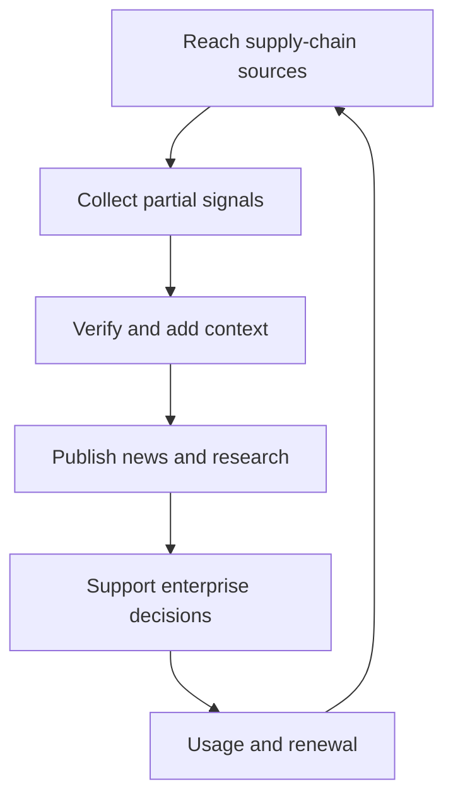
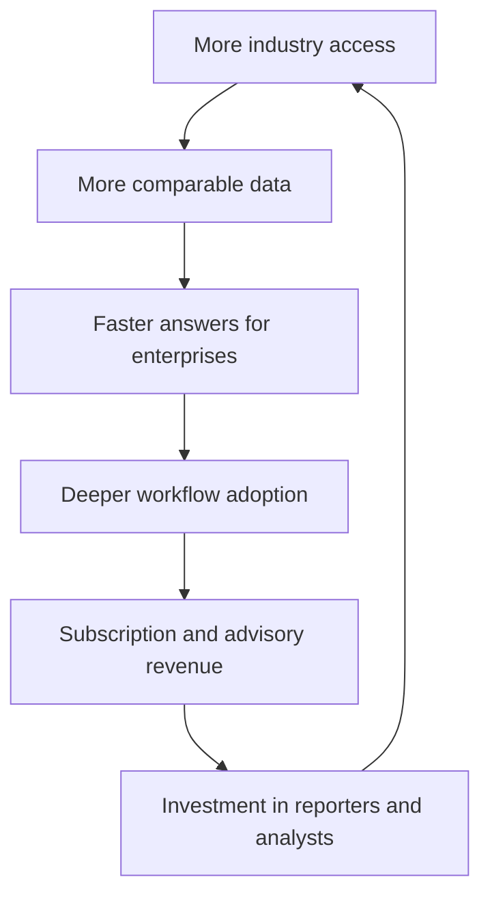

> 🌏 [中文版](/posts/product/2026-09-16-digitimes-supply-chain-intelligence)

Anyone walking through a produce market can read today's prices. The valuable tip is different: which stall will run short tomorrow, which wholesaler just raised a quote, and where buyers are already competing for stock. A restaurant that learns early can change its menu before everyone else reacts.

[DIGITIMES](https://www.digitimes.com/about-us/) sells the technology-industry version of that advantage. Chip designers, foundries, packaging houses, component suppliers, ODMs, and global brands each see one section of the electronics supply chain. DIGITIMES connects those partial views, then packages them as news, research reports, databases, and advisory services.

An enterprise is therefore not paying merely to receive more articles. It is paying to reduce the time spent finding sources, calling suppliers, reconciling shipment estimates, and understanding upstream and downstream effects. Renewals depend on whether that intelligence pipeline keeps making decisions faster—not on how exciting any single scoop sounds.

## How a signal reaches an enterprise budget

The pipeline begins with access, but access alone is not a product. Signals still need context, verification, structure, and a delivery format that fits the buyer's work.

The loop returns to its starting point because subscribers are themselves industry participants. As reporters and analysts repeatedly serve the same professional audience, they can learn which changes matter and which fields deserve continuous tracking. That feedback loop is an inference about the model, however. DIGITIMES does not disclose how much information comes from customers, nor does it publish renewal rates.

## Step one: information advantage begins with supply-chain position

Consumer technology coverage usually works backward from a product launch: which features appeared, how much the device costs, and whether people will buy it. Industry intelligence starts further upstream. Who designed the chip? Which foundry made it? Is packaging capacity available? How many orders reached an ODM? Are component quotes moving?

Taiwan gives DIGITIMES an unusually dense observation point. The island brings together foundries, packaging and testing, component makers, and major notebook and server ODMs. Reporters can follow one change through several neighboring layers. The company's [research services page](https://www.digitimes.com/reports/services/) reflects that structure through quarterly brand and ODM shipments, technology splits, customer market share, and orders placed with manufacturers. The product is no longer only about what happened today; it tracks how the same variable changes quarter after quarter.

The founder's career also explains this supply-side orientation. In a [Business Weekly interview with founder Colley Hwang](https://www.businessweekly.com.tw/business/blog/3020967), the publication traces its origin to his twelve and a half years at Taiwan's Market Intelligence Center before he founded DIGITIMES in 1998. Hwang said that the US research products used at the time focused on global brands and demand, leaving Taiwanese manufacturing and supply-chain questions underserved. That is a founder's account, not an independently measured market gap, but it explains the product's point of view.

## Step two: turn reporting into products that can be sold repeatedly

A news article captures value once, at the moment someone needs to know. DIGITIMES extends the same collection capability across several time horizons: breaking coverage for today's event, quarterly trackers for change, five-year forecasts for direction, and the TechStats database for historical retrieval.

The three layers may all look like information, but buyers use them differently:

| Product layer | Primary question | Source of value | Most vulnerable point |
|---|---|---|---|
| Public news | What happened? | Creates a shared view quickly | Public facts are easy to search and summarize with AI |
| Supply-chain intelligence | Which part of the system is changing? | Connects upstream, downstream, and time-series evidence | Anonymous signals are difficult for outsiders to audit |
| Decision guidance | What should the company do next? | Places intelligence into procurement, investment, or strategy | Advice is easy to overvalue when methods and error ranges are missing |

The [official research site](https://www.digitimes.com/reports/index.php?view=0) lists research channels, TechStats, custom research, and consulting alongside news. Its [Chinese-language research center](https://www.digitimes.com.tw/research/) says the team publishes more than 300 reports per year and offers on-site briefings. These are company-reported products and output figures. They do not, by themselves, demonstrate research quality or customer outcomes.

What productization adds is repeatability. A reporter may hear once that a server component is in short supply. If the organization tracks brands, ODMs, shipments, and prices under stable definitions every quarter, the observation can become a dataset that an enterprise uses in a recurring meeting.

## Step three: enterprise buyers pay to compress decision time

B2B intelligence is not priced by asking what one article is worth. A procurement team asks different questions: What would missing a capacity shift cost us? How much is it worth if an analyst avoids two weeks of calls and spreadsheet reconciliation? A subscription can be rational whenever the decision cost it removes exceeds the purchase price.

DIGITIMES' [individual purchase page](https://www.digitimes.com/register/single.asp) sells research channels, TechStats databases, and individual reports as separate products. Those public offerings establish that the company monetizes more than news subscriptions. They are not enterprise contract prices and cannot be used to infer company revenue.

The [enterprise membership page](https://www.digitimes.com/register/corporate.php) places news access, research reports, analyst consulting, and team access in the same inquiry form. It also advertises centralized administration and usage analytics. The buying unit is thus acquiring both intelligence and the ability to manage access across a team. Discounts, contract values, and renewal terms are not public, so assigning a precise enterprise price would be fiction.

## Step four: the renewal flywheel compounds over time

An urgent report may win the first purchase. A second-year renewal requires something harder to move. Historical data, stable fields, team habits, and analyst relationships can gradually increase switching costs.

This is a deeper loop than an article paywall. News can be paraphrased; a historical series embedded in a team's recurring process is more difficult to replace. Yet DIGITIMES does not disclose retention, product-level revenue, or database usage. We can verify that the components exist, but not claim a measured flywheel effect.

The company's early years also show how long data compounding can take. In two interviews, Hwang recalled that DIGITIMES lost roughly NT$200 million in its first two years and did not erase accumulated losses until year thirteen. [Business Weekly presents the more detailed year-by-year account](https://www.businessweekly.com.tw/business/blog/3020967), while [Fount Media summarizes a separate radio interview](https://www.fountmedia.io/article/356539). Both ultimately depend on the same participant's recollection, so they are not audited financial records. The narrower, defensible conclusion is that the founder himself describes the business as a long investment rather than a quick return.

## Supply-chain access is an advantage, not a guarantee of accuracy

Proximity can reveal prototyping, quotations, or material preparation earlier than public announcements. It cannot guarantee that those actions will produce a commercial product. A brand can test several designs and cancel most of them. Moving from “a supplier received an inquiry” to “the brand will launch this product” requires a separate inference.

That is the easiest trap when reading supply-chain reports. Being repeated by many outlets measures reach; it does not prove that an inference about the final product was correct. Evaluating intelligence quality requires tracing the original observation, the inference that followed, and the eventual outcome instead of using citation counts as a proxy for accuracy.

A careful intelligence reader separates three claims. A source may genuinely observe a supply-chain action; a reporter may accurately describe it; an analyst may still infer the wrong final outcome. Premium intelligence earns trust when it labels observations, estimates, and judgments clearly enough for buyers to see those boundaries.

## AI can compress summarization, but not every collection task

At the business-model level, AI compresses work most easily when the information is already public and repetitive. Filings, press releases, and widely covered events can be summarized faster, so products that depend heavily on search referrals and commodity updates are more exposed. This is an inference from the product structure, not a traffic experiment published by DIGITIMES.

AI cannot independently create an unpublished interview or know whether an anonymous signal deserves trust. If DIGITIMES' edge lies in reaching supply-chain participants, checking signals across layers, and maintaining long time series, AI is more naturally a new interface: it can search the archive, compare quarters, and draft the first list of questions much faster.

The risk cuts both ways. The [DIGITIMES Terms of Service](https://www.digitimes.com/register/terms.php) prohibit unauthorized automated retrieval, data mining, and the creation of aggregations or databases, making machine extraction an explicit product and rights concern. At the same time, enterprise customers can use their own AI systems to process public information, reducing the value of generic summaries. Pricing power ultimately rests on whether the data is scarce, traceable, and embedded in a workflow.

## Three tests you can run on an intelligence subscription tonight

First, take one decision your team actually made and write down what would happen without the subscription: whom would you call, how many systems would you search, and how many days would it take? Price the avoided decision cost, not the number of articles read.

Second, mark one report sentence by sentence as observation, estimate, or recommendation. When those categories blur, teams will treat signals as conclusions. When they stay distinct, the reader knows what still requires independent verification.

Third, ask what disappears if you cancel. A few articles are easy to replace. A historical series, shared fields, team annotations, and a recurring process create much stronger renewal value.

The most instructive part of DIGITIMES is that it did not stop at “our reporters know many people.” Relationships became a defined collection surface. Signals became comparable data. Data entered the rhythm of enterprise decisions. Access is the raw material; customers renew for the factory that keeps turning it into a working tool.

## References

- [About DIGITIMES](https://www.digitimes.com/about-us/)
- [DIGITIMES Research products and services](https://www.digitimes.com/reports/services/)
- [DIGITIMES Research](https://www.digitimes.com/reports/index.php?view=0)
- [DIGITIMES Research Center (in Chinese)](https://www.digitimes.com.tw/research/)
- [DIGITIMES individual subscription pricing](https://www.digitimes.com/register/single.asp)
- [DIGITIMES enterprise membership](https://www.digitimes.com/register/corporate.php)
- [DIGITIMES Terms of Service](https://www.digitimes.com/register/terms.php)
- [Business Weekly: A profile of Colley Hwang and the 28-year DIGITIMES bet (in Chinese)](https://www.businessweekly.com.tw/business/blog/3020967)
- [Fount Media: DIGITIMES' early losses and B2B strategy (in Chinese)](https://www.fountmedia.io/article/356539)
