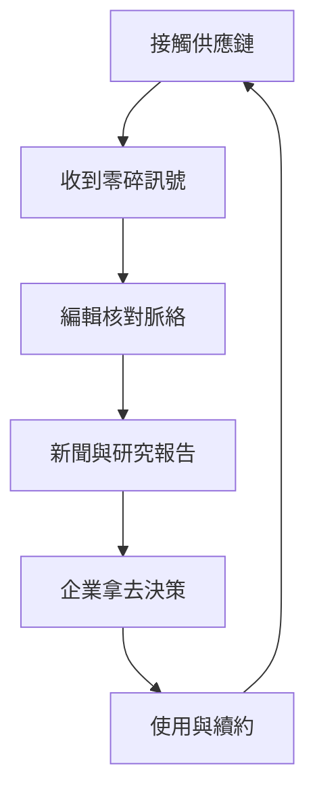
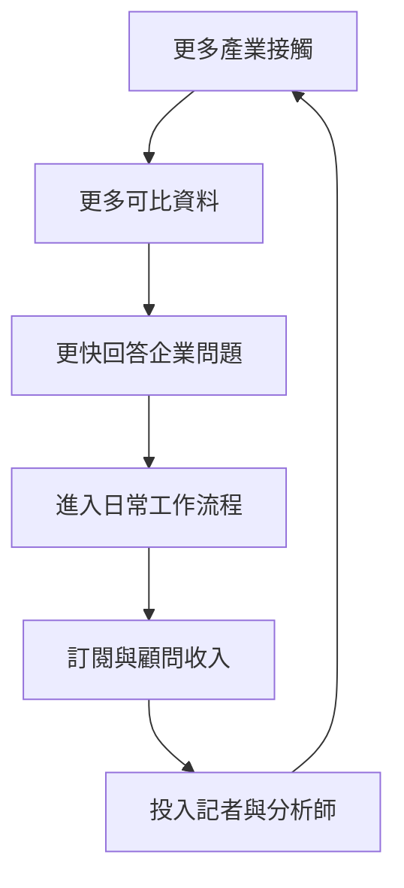

> 🌏 [English version](/en/posts/product/2026-09-16-digitimes-supply-chain-intelligence-en)

菜市場的價格牌，走進去就看得到。真正值錢的消息是：明天哪一攤會缺貨、哪個盤商剛調價、隔壁市場已經有人搶貨。知道得夠早，餐廳老闆就能先換菜單，盤商也能先調度庫存。

[DIGITIMES](https://www.digitimes.com/about-us/) 做的是科技業版本。晶片設計、晶圓製造、封裝測試、零組件、ODM 代工廠與品牌商散落在供應鏈各處；每一家公司只看到自己附近的一段。DIGITIMES 把這些局部訊號接起來，再做成新聞、研究報告、資料庫與顧問服務。

所以，企業買的不是「比較多篇文章」。它們花錢縮短查資料、問供應商、核對出貨與理解上下游的時間。續約是否成立，取決於這條情報生產線能不能持續讓決策變快，而不是某一則獨家消息有多熱鬧。

## 一條訊號，如何走到企業預算

先看整條生產線。人脈只是入口，後面還有驗證、整理、產品化與企業使用；少了其中一段，關係再多也只是一堆聊天紀錄。

這張圖最後又回到起點，因為企業客戶本身也在產業裡。記者與分析師愈常服務同一批專業讀者，愈知道哪些變化值得追、哪些欄位應該長期記錄。不過，這個回饋迴圈是商業模式上的推論；DIGITIMES 沒有公開客戶提供資料的比例，也沒有公開續約率。

## 第一步：資訊優勢來自供應鏈的位置

一般消費科技新聞從新品發表會往回看：手機推出了什麼功能、售價多少、消費者買不買。產業情報從更上游開始問：晶片誰設計、哪座晶圓廠生產、封裝產能夠不夠、ODM 接到多少訂單、零件價格有沒有變。

DIGITIMES 的地理優勢正在這裡。台灣同時聚集晶圓製造、封裝測試、電子零組件、筆電與伺服器 ODM，記者可以沿著相鄰節點追問同一個變化。[官方研究服務頁](https://www.digitimes.com/reports/services/)也把產品做成固定追蹤欄位，包括品牌與 ODM 的季度出貨、技術別出貨、客戶市占及製造商訂單。讀者得到的不只是一則今日消息，還能看見同一件事每季怎麼變。

創辦背景也強化了這個位置。[《商業周刊》對黃欽勇的專訪](https://www.businessweekly.com.tw/business/blog/3020967)記載，他在資策會市場情報中心工作十二年半後，於 1998 年創辦電子時報。他想補上當時美國研究報告較少處理的台灣製造與供應鏈視角。這是創辦人的受訪敘事，不是獨立量化的市場缺口；它仍能說明 DIGITIMES 為什麼從供給端建立產品。

## 第二步：把消息加工成可以重複賣的產品

如果情報只停在一篇新聞，收入會跟著閱讀當下結束。DIGITIMES 把同一批採集能力延伸到不同時間尺度。快訊處理今天，季度追蹤看變化，五年展望看方向，TechStats 資料庫則讓舊資料繼續被查詢。

三種資訊看起來很像，買方拿到的東西其實不同：

| 產品 | 主要回答 | 怎麼產生價值 | 最容易被取代的地方 |
|---|---|---|---|
| 公開新聞 | 發生了什麼？ | 快速建立共同認知 | 已公開消息容易被搜尋與 AI 摘要 |
| 供應鏈情報 | 哪個環節正在變？ | 串起上游、下游與時間序列 | 匿名訊號難以讓外部讀者查核 |
| 決策建議 | 公司接下來怎麼做？ | 把情報放進採購、投資或策略情境 | 判斷若缺方法與誤差範圍，容易被高估 |

[官方產品頁](https://www.digitimes.com/reports/index.php?view=0)列出新聞以外的研究、TechStats、客製研究與顧問服務；[中文研究中心](https://www.digitimes.com.tw/research/)則稱每年發布超過 300 篇研究報告，並提供到府簡報。這些都是公司自報的產品與產量，不能直接推成研究品質或客戶成效。

這個加工過程真正增加的是可重複性。記者今天問到伺服器零件缺貨，只能先寫成一則消息。團隊若每季用相同定義追蹤品牌、ODM、出貨與價格，消息才會長成企業能放進例會的資料產品。

## 第三步：企業採購買的是省下來的決策時間

B2B 情報定價不能用「一篇文章值多少」來算。採購部門更可能問：錯過一次產能變化，會損失多少？

分析師若能少花時間打電話和整理試算表，又值多少？省下的決策成本高於訂閱費，價格就有成立空間。

DIGITIMES 的[單人購買頁](https://www.digitimes.com/register/single.asp)把研究頻道、TechStats 資料庫與單篇報告分開販售。這些公開項目能證明它不只靠新聞訂閱變現，卻不代表企業合約價，也不能用來反推營收。

[企業方案頁](https://www.digitimes.com/register/corporate.php)把新聞、研究報告、分析師顧問與團隊存取放在同一張詢價表，還提供集中管理與使用分析。這透露出採購單位不只買內容，也買授權管理和讓多人使用的便利。至於未公開的折扣、合約金額與續約條件，外部無法驗證，就不該填入一個看似精確的數字。

## 第四步：續約飛輪靠累積，不靠天天爆料

企業第一次訂閱，可能是因為一份急用的報告；第二年還願意付錢，通常需要更難搬走的理由。歷史資料、固定欄位、團隊使用習慣與分析師互動，會逐步提高替換成本。

這是比「文章付費牆」更深的飛輪。新聞可以被轉述，整套歷史序列和企業內部的使用流程比較難搬。可是 DIGITIMES 沒有公開續約率、各產品收入占比或資料庫使用頻率，因此我們只能確認飛輪的部件存在，不能宣稱它已經證明多有效。

早期經營也提醒我們，資料複利需要很長的回收期。黃欽勇在兩次受訪時回憶，公司前兩年約虧損新台幣 2 億元，直到第十三年才填平累積虧損。[《商業周刊》保留了較完整的逐年敘述](https://www.businessweekly.com.tw/business/blog/3020967)，[《放言》則轉述另一場廣播訪談](https://www.fountmedia.io/article/356539)。兩篇都依賴同一位當事人的回憶，不能當成經稽核的財務紀錄。它們能支持的較窄結論是：創辦人自己也把這門生意描述成長期投入，而非快速回本。

## 供應鏈關係是優勢，不是準確率保證

站得近，可以比別人早聽到試產、詢價或備料；但供應鏈看到的動作，不一定會變成上市產品。品牌可能同時測試多個設計，最後取消其中大部分。把「供應商收到詢問」直接寫成「品牌確定推出」，中間跨了一大步。

這也是閱讀供應鏈消息時最容易踩的坑：被很多媒體轉述，只能證明消息傳得遠，不能直接證明它對最終產品的推論正確。評估情報品質時，應回到原始觀察、推論步驟與事後結果，而不是拿引用次數代替準確率。

更穩妥的讀法，是把三件事分開：來源真的看到某個供應鏈動作、記者正確描述那個動作、分析者正確推到最終結果。前兩步成立，第三步仍可能錯。專業情報產品若要守住高價，就得讓讀者看得出哪些是觀察、哪些是估計、哪些是判斷。

## AI 能壓縮摘要成本，拿不走所有採集工作

從商業模式來看，AI 最容易壓縮的是已經公開、格式相近的整理工作。財報、新聞稿與多家媒體都寫過的消息可以更快被摘要；因此，主要靠搜尋流量與一般快訊吸引讀者的部分，價值比較容易被削弱。這是依產品結構做的推論，不是 DIGITIMES 公開的流量實驗結果。

它比較難憑空補出尚未公開的採訪，也不能只靠語言模型判斷匿名訊號是否可信。若 DIGITIMES 的優勢在接觸供應鏈、跨節點核對和多年追蹤，AI 比較像新的查詢介面。它能讓企業更快搜尋歷史庫、比對季度變化，再產生第一版問題清單。

風險也沒有消失。[DIGITIMES 服務條款](https://www.digitimes.com/register/terms.php)禁止未經許可自動擷取內容、建立資料聚合或資料庫，顯示內容被機器大量取用本身就是產品與權利問題。另一邊，企業也能用自己的 AI 整理公開資料，壓低一般摘要型研究的價值。最後還是回到同一題：資料是否稀缺、能否追溯、是否已經進入工作流程。

## 評估一個情報訂閱，今晚就能做的三件事

第一，拿最近一次真的要做的決策，寫下「如果沒有這個訂閱，我得問誰、查幾個系統、花幾天」。不要用閱讀量估價，用省下來的決策成本估價。

第二，抽一份報告，把句子標成觀察、估計與建議。三者若混在一起，團隊很容易把消息當結論；分得清楚，才知道哪一段還要自己查證。

第三，檢查取消訂閱後會失去什麼。只少幾篇文章，替代品很多；若會失去歷史序列、共同欄位、團隊註記和固定工作流程，續約黏性才真的存在。

DIGITIMES 的案例最值得學的地方，是它沒有停在「記者認識很多人」。關係被轉成固定採集範圍，訊號被轉成可比較資料，資料再被包進企業的決策節奏。人脈只是原料；企業願意續約的，是那間能持續把原料做成工具的工廠。

## 參考資料

- [About DIGITIMES](https://www.digitimes.com/about-us/)
- [DIGITIMES Research products and services](https://www.digitimes.com/reports/services/)
- [DIGITIMES Research](https://www.digitimes.com/reports/index.php?view=0)
- [DIGITIMES 中文研究中心](https://www.digitimes.com.tw/research/)
- [DIGITIMES individual subscription pricing](https://www.digitimes.com/register/single.asp)
- [DIGITIMES enterprise membership](https://www.digitimes.com/register/corporate.php)
- [DIGITIMES Terms of Service](https://www.digitimes.com/register/terms.php)
- [商業周刊：側寫黃欽勇——28 年前的賭注](https://www.businessweekly.com.tw/business/blog/3020967)
- [放言：辦 DIGITIMES 前兩年狂燒兩億資金](https://www.fountmedia.io/article/356539)
