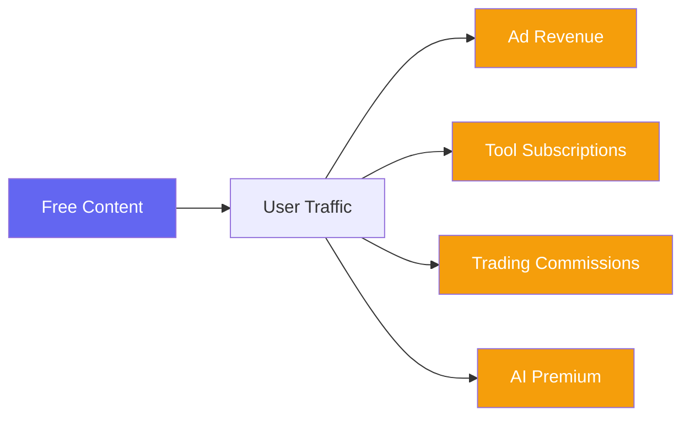
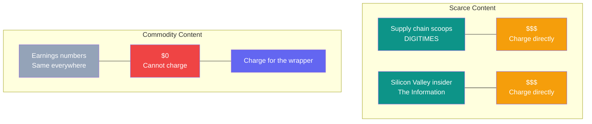
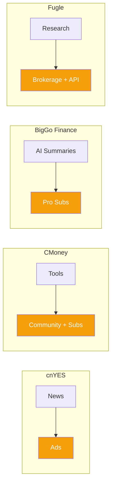
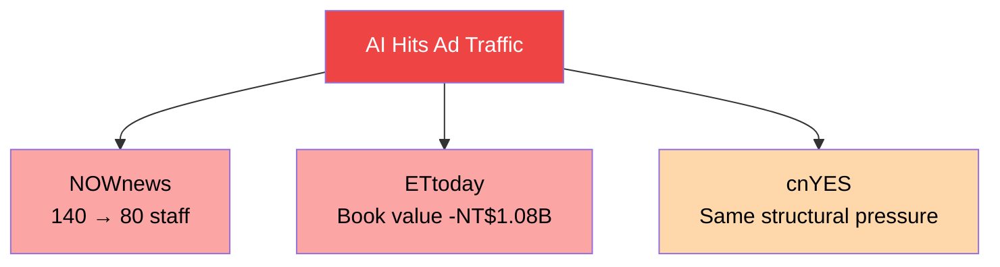
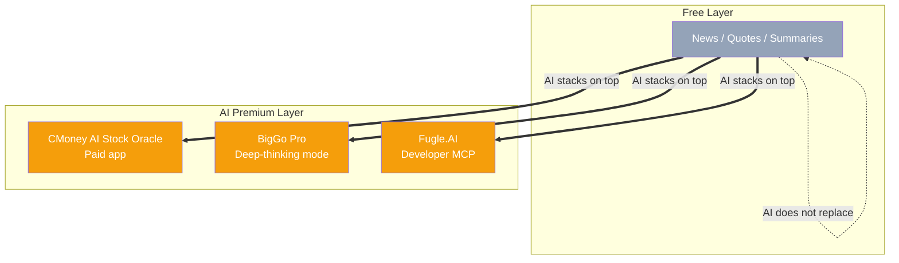
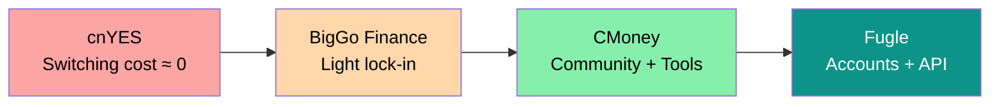

> 🌏 [中文版](/posts/product/2026-09-16-free-content-side-monetization)

A [Bloomberg Terminal](https://www.bloomberg.com/professional/products/bloomberg-terminal/) costs over $25,000 a year. [cnYES](https://www.cnyes.com/) (鉅亨網), Taiwan's largest financial news portal, is completely free. Both serve the same fundamental need: helping people make investment decisions. The thousand-fold price gap exists not because content quality differs by a thousand-fold, but because they are playing entirely different games. Bloomberg sells the content itself — proprietary data, real-time feeds, and analytics bundled into a terminal experience. cnYES gives content away and makes money from everything around it.

This is the fourth model of content selling: you don't sell the content at all.

## Why Financial Content Can Be Free

Not all content can be given away for free. Content that works in this model typically shares one trait: **it is commoditized**.

Financial news is the textbook example of commoditized content. When TSMC reports earnings, cnYES reports it, [Yahoo Finance](https://finance.yahoo.com/) reports it, and Reuters reports it. The numbers are identical; only speed and presentation differ. Readers will not pay twice for the same set of figures.

By contrast, [DIGITIMES](https://www.digitimes.com.tw/) can charge enterprises tens of thousands of NTD per year because its supply chain scoops are unavailable elsewhere. [The Information](https://www.theinformation.com/) can charge $399/year because its Silicon Valley insider stories are sourced through relationships no AI can replicate. These are scarce content — worth charging for directly.

Free-content platforms acknowledge a different reality: **when content itself trends toward zero price, you wrap value around the content** — tools, community, trading access, AI-enhanced features. Content is the entrance, not the merchandise.

## Five Platforms, Five Side Flanks

The five platforms below all provide free financial content. Each found a different monetization flank.

| Platform | Free Content | Ads | Tool Subscriptions | Transaction Fees | AI Premium | Community |
|---|---|---|---|---|---|---|
| [cnYES](https://www.cnyes.com/) | Real-time news | Primary | — | — | — | — |
| [Yahoo Finance](https://finance.yahoo.com/) | Real-time news | Primary | Plus plan | — | — | — |
| [CMoney](https://www.cmoney.tw/) | Basic tools | Secondary | Multi-tier | — | AI 股神 | Primary |
| [BigGo Finance](https://finance.biggo.com.tw/) | AI podcast summaries | Yes (free tier) | Pro plan | — | AI chat | — |
| [Fugle](https://www.fugle.tw/) | Research data | — | API subscriptions | Brokerage commissions | Fugle.AI | — |

The same pool of Taiwanese retail investors. Five different ways to extract revenue from them.

## cnYES: The Ceiling of Pure Ad Revenue

cnYES is one of Taiwan's highest-traffic financial news sites. A 24/7 editorial team, supplemented by wire services (Reuters, AP), produces real-time financial news covering Taiwan and US stocks, forex, futures, and funds. Its apps are well-rated on both the App Store and Google Play.

Its business model is the most classic version of internet media: free content generates traffic, traffic generates ad revenue. No paywall, no tool subscriptions, no trading functionality.

The cracks in this model are showing. In 2026, [NOWnews laid off over 40% of its staff](https://www.ftnn.com.tw/news/554607) (in Chinese), from around 140 people to just over 80 — a direct consequence of generative AI eroding traffic and ad revenue. ETtoday, under Eastern Media International, continues to lose money with its parent's investment book value turning negative at -NT$1.079 billion. Supporting a newsroom on ad revenue alone looks increasingly like cycling into a headwind.

cnYES has not reached that breaking point yet, but the structural pressure is the same: Google AI Overviews have pushed zero-click searches from 56% to 69%, and publisher traffic has dropped by a third on average.

## CMoney: The Community-Plus-Tools Flywheel

[CMoney](https://www.cmoney.tw/) took a fundamentally different path. Its free content is just the entry point — the "股市爆料同學會" (Stock Market Insider Club) community creates stickiness that content alone cannot. The real revenue comes from tool subscriptions built around the community: charting tools (籌碼K線), portfolio analyzers (理財寶), and other multi-tier paid products designed for investors at different levels.

In 2026, CMoney launched [AI 股神](https://apps.apple.com/tw/app/ai%E8%82%A1%E7%A5%9E/id6753969485) (AI Stock Oracle), an app where you ask "Should I buy TSMC now?" in natural language and get a full report covering fundamentals, technicals, institutional positioning, and valuation. AI here is not used to produce free content for lead generation — it becomes a premium tool feature that users pay for.

CMoney's moat is the community. A retail investor who already follows a dozen analysts, has saved hundreds of notes, and participates in daily discussions on the platform faces enormous switching costs. By contrast, switching between news sites is frictionless — closing cnYES and opening Yahoo Finance changes almost nothing about the experience.

## BigGo Finance: AI Content as Funnel

[BigGo Finance](https://finance.biggo.com.tw/) is a new product line from [BigGo](https://biggo.com.tw/), a comparison shopping engine founded in 2016 that raised a $5 million Series A in 2019. The platform offers real-time stock quotes, earnings call transcripts, market calendars, and AI chat.

Its most interesting feature is [Podcast AI Summaries](https://finance.biggo.com.tw/podcast). It takes top English-language financial podcasts — Lenny's Podcast, the All-In Podcast, Goldman Sachs' The Markets — and uses AI to automatically produce structured Chinese-language notes. Not transcripts, but deep summaries with headings, tables, quotes, and unresolved questions. The quality is genuinely impressive.

The key insight: these summaries are completely free. They are not the product — they are the funnel. BigGo Finance's monetization sits in the [Pro plan](https://finance.biggo.com.tw/pricing) ($20/month), which provides a deep-thinking AI model, 150 daily proactive alerts, 30-minute early access to earnings call news, and an ad-free experience. The podcast summaries exist to attract readers to the platform with high-quality free content, then convert through the overall platform experience.

This is the most direct application of AI in the free-content model: automating content production drives the marginal cost toward zero, making the economics of "free as funnel" even more favorable.

## Fugle: The Full Loop from Content to Transactions

[Fugle](https://www.fugle.tw/) has gone furthest among the five. It started as a stock research platform offering free company data and market research, then extended step by step toward the transaction layer — partnering with Yushan, Taishin, and Fubon Securities to become one of Taiwan's first API-connected brokerages.

Free content and research tools are the entry point. [Developer API](https://developer.fugle.tw/) subscriptions provide one revenue layer. Brokerage commissions provide another. In 2026, [Fugle.AI](https://www.fugle.ai/) extended this further by connecting Taiwan stock data to ChatGPT and Claude via MCP, letting users query stocks, manage watchlists, and set price alerts directly within AI conversations.

Fugle's model most resembles what Robinhood did in the US: attract young investors with free tools and low (or zero) commissions, then earn from trading flow and value-added services. Content is not even the primary acquisition channel here — the product experience itself is.

## Where AI Is Entering

Looking across all five platforms, AI enters at different points:

| Platform | What AI Does | AI's Role |
|---|---|---|
| cnYES | No visible AI deployment | — |
| Yahoo Finance | Basic AI summaries | Auxiliary feature |
| CMoney | AI 股神 one-click reports | Paid tool differentiator |
| BigGo Finance | Podcast AI summaries + AI chat | Free funnel + paid premium |
| Fugle | MCP integration with ChatGPT/Claude | Developer ecosystem |

A pattern emerges: **AI is not replacing the free content layer — it is entering as a differentiator for the paid layer above it.** CMoney's AI Stock Oracle is a paid app, not a free article. BigGo Finance's AI chat offers deep-thinking mode only in the Pro plan. Fugle's AI integration targets developers and power users.

Free content stays free. AI makes "the layer above free" more compelling.

## The Risks of This Model

Free content with side monetization is not risk-free. Three structural pressures are building:

**Ad revenue is shrinking.** Google AI Overviews have cut publisher search traffic by a third on average. Platforms that depend primarily on advertising (the cnYES model) will face the greatest pressure. NOWnews and ETtoday are early warnings.

**Content differentiation is getting harder.** When every platform can use AI to produce earnings analysis and news summaries in seconds, the quality gap between free content providers will narrow further. Differentiation will shift entirely to dimensions outside content.

**Tool lock-in is the strongest moat.** Comparing the five platforms by defensibility: cnYES has almost zero switching costs — users can leave anytime. CMoney has community and tool lock-in. Fugle has trading accounts and API integrations. Content itself is barely a moat. **The shell around the content is.**

## Lessons for Builders

If you are entering the "free content + side monetization" space, the five platforms' experiences point to several principles:

**Don't try to charge for commodity content — charge for the wrapper.** cnYES proved financial news can be free. CMoney proved the tools and community surrounding news can be paid. Your content strategy should ask "what content brings the most people who need my tools?" rather than "what content is most valuable?"

**There are five flanking options: ads, tools, community, transactions, AI premium.** Pure advertising is shrinking. Pure community is hard to bootstrap. The most robust combination is "tools plus one or two additional flanks." Fugle's "content → tools → transactions" closed loop is the most complete template today.

**In Taiwan's small market, vertical depth beats horizontal breadth.** CMoney does not cover international news or forex trading — it only builds tools for Taiwan retail stock investors, and builds them well. BigGo Finance, by contrast, is extending horizontally from comparison shopping into finance, and brand association is still being established.

**AI is the new wrapper.** BigGo Finance uses AI to turn free podcasts into platform stickiness. CMoney uses AI to turn stock analysis into a paid tool. The next opportunity: what content was previously too labor-intensive to give away for free, but can now be produced at zero marginal cost with AI — and used as a new funnel?

Bloomberg Terminal charges $25,000 a year. cnYES is free. Same need, a thousand-fold price gap. The difference is not the content itself — it is what you choose to do with the content.

## References

- [Bloomberg Terminal](https://www.bloomberg.com/professional/products/bloomberg-terminal/) — B2B financial data terminal
- [cnYES (鉅亨網)](https://www.cnyes.com/) — Taiwan's largest financial news portal
- [CMoney](https://www.cmoney.tw/) — Taiwan retail investor tools platform
- [CMoney AI 股神 (AI Stock Oracle)](https://apps.apple.com/tw/app/ai%E8%82%A1%E7%A5%9E/id6753969485) — AI stock analysis app
- [BigGo Finance](https://finance.biggo.com.tw/) — AI-powered financial info platform
- [BigGo Finance pricing](https://finance.biggo.com.tw/pricing)
- [BigGo Finance Podcast AI Summaries](https://finance.biggo.com.tw/podcast)
- [Fugle](https://www.fugle.tw/) — Taiwan fintech platform
- [Fugle Developer API](https://developer.fugle.tw/) — Taiwan stock real-time quotes and trading API
- [Fugle.AI](https://www.fugle.ai/) — AI investment assistant with MCP integration
- [Yahoo Finance](https://finance.yahoo.com/) — Global financial info platform
- [NOWnews layoff report](https://www.ftnn.com.tw/news/554607) — FTNN News (in Chinese)
- Series overview: [Who Sells Content: Four Models and One Threat](/posts/product/2026-09-16-content-selling-four-models)
