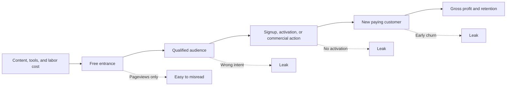
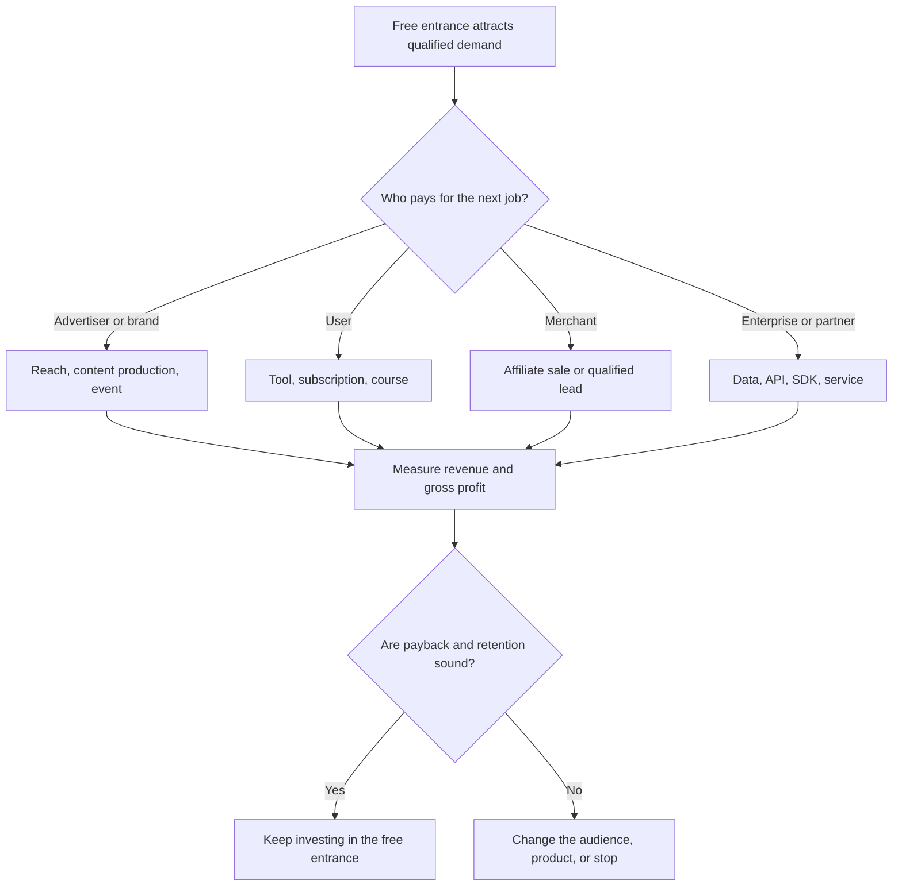

> 🌏 [中文版](/posts/product/2026-09-16-free-content-side-monetization)

Imagine a night-market vendor offering a free cup of soup. The sample is not costless: ingredients, labor, and the stall all cost money. The vendor gives it away because some visitors will buy a full bowl or add side dishes. If everyone takes the sample and leaves, a long line is still not a good business.

Free content works the same way. Articles, news, podcast summaries, and calculators all cost money to produce, distribute, and maintain. Their business value does not come from impressive pageviews alone. It comes when the right reader reaches another job that creates gross profit: viewing an ad, buying a tool, subscribing, completing a service through a brokerage partner, or purchasing from a merchant.

This article began as model four in the parent “Content Selling Business Models” series. It now opens an eight-part subseries. The first four cases examine Taiwanese financial products; the next four add affiliate marketing, free tools, CAC and LTV, and AI search. Every article asks the same question: **what asset or action remains after the free visit, and is it worth its cost?**

## Separate traffic from the business outcome

A free entrance proves only that people can enter. It does not prove that they are qualified, activate, or pay. A free page and a paid product living on the same site therefore demonstrate a possible path, not causation. Attribution, event tracking, and cohorts are still needed.

## Eight articles, each testing one part of the path

| Order | Free entrance | Possible paid job | What public evidence supports | What it does not prove |
|---:|---|---|---|---|
| 1 | cnYES news and market information | Ads, events, sponsored content, and other enterprise partnerships | Official materials list several advertising products | That cnYES is a pure-ad business or any revenue mix |
| 2 | CMoney content, basic tools, and community | Apps, courses, creator products, and enterprise systems | The product design places methods, tools, and community in one loop | Which step actually improves conversion or retention |
| 3 | BigGo Finance public summaries and financial entry points | Pro model, notification, and experience benefits | Free and paid layers coexist | How many summary readers subscribe or an exact current price |
| 4 | Fugle research and product entry points | Market-data APIs, brokerage partnerships, and B2B information services | API plans, brokerage partners, and distinct products exist | That Fugle receives a commission on every trade |
| 5 | Reviews, comparisons, and buying guides | Merchants pay affiliate commission for attributable outcomes | The commission model and disclosure obligations can be inspected | That every click is attributed or rates stay fixed |
| 6 | A free tool that performs a real job | Paid tiers, leads, or an adjacent product | Tools can create a reason to return | That tools inevitably rank or earn backlinks |
| 7 | Every free entrance | CAC, gross-margin LTV, and payback evaluate the result | Costs and new paying customers can be measured by cohort | That leads equal customers or 3:1 is universal |
| 8 | Content read by search and answer engines | First-party relationships, tools, original signals, and direct brand demand | Crawling and attributable referrals are different events | That crawl-to-refer is CTR or a sitewide traffic-loss figure |

The first four rows are product cases, not a weakest-to-strongest ranking. The final four form an operator's scorecard: how revenue is attributed, whether a tool provides real utility, whether unit economics work, and what remains when the search entrance changes.

## The payer can change even when every entrance is free

[The cnYES case](/en/posts/product/2026-09-17-anue-attention-ad-market-en) is a useful warning against reducing a free publication to “pure advertising.” The company's official offerings include digital ads, video, events, sponsored features, and content production. It is more accurate to describe several enterprise marketing products sharing an audience than a single banner-ad business. The official material confirms that the products exist; it does not disclose their revenue mix.

[CMoney](/en/posts/product/2026-09-17-cmoney-content-tool-community-en) places content, tools, and community in one product environment. Its [official product recruiting page](https://www.cmoney.tw/careers/product) explicitly describes a loop of methods, tools, and community. That is product design, not a published conversion experiment. A smooth interface does not prove that community turns readers into subscribers.

[BigGo Finance](/en/posts/product/2026-09-17-biggo-finance-ai-content-funnel-en) offers public podcast AI summaries alongside a Pro plan. “Content may acquire subscribers” is therefore a reasonable hypothesis, but public evidence does not reveal signup, payment, or retention rates for summary readers. This series omits precise prices supported only by a single official snapshot and does not turn an undisclosed transcription, translation, and review process into a fully automated content factory.

[Fugle](/en/posts/product/2026-09-17-fugle-information-to-trading-en) shows a branching path. Individuals can buy [market-data API plans](https://developer.fugle.tw/docs/pricing/); partner brokerages continue to hold the accounts and assets; businesses can adopt data licensing, SDKs, or technical services. Those paths cannot be collapsed into “Fugle makes money from trading commissions.” Public evidence does not establish a per-trade commission paid to Fugle.

## A flank is not a feature list; it is a payer buying an outcome

This diagram is more useful than a list of ads, subscriptions, transactions, and AI because it starts with the payer and the job. AI may appear in production, discovery, or a paid tool, but “uses AI” is neither a business model nor evidence that AI caused revenue growth.

## Four operating questions bring the story back to the ledger

First, `rel="sponsored"` is a search-engine signal, not a disclosure written for a person. [Google's spam policies](https://developers.google.com/search/docs/essentials/spam-policies) also identify affiliate pages without original value as thin affiliation. The [FTC disclosure guide](https://www.ftc.gov/business-guidance/resources/disclosures-101-social-media-influencers) says material relationships should be disclosed clearly near the endorsement. FTC guidance is US guidance, not a legal conclusion for Taiwan.

Second, a [free tool](/en/posts/product/2026-09-17-free-tools-seo-compounding-en) must perform the job it claims to perform. A tool can give users a reason to recalculate, save, or monitor something. Google does not promise that tools automatically rank or attract links, and large collections of low-value programmatic pages can instead become scaled content abuse.

Third, the denominator of [content CAC](/en/posts/product/2026-09-17-content-acquisition-cac-ltv-en) is new paying customers, not leads. The numerator should include content, distribution, tooling, and labor. Gross-margin LTV and payback then test the cash economics. [HubSpot's CAC guide](https://www.hubspot.com/startups/sales-and-marketing/calculating-cac-for-startups) also reminds teams to include tools, salaries, and founder time. A familiar ratio is context, not a substitute for the company's own cohorts.

Fourth, [AI search](/en/posts/product/2026-09-17-ai-takes-clicks-free-content-assets-en) further separates “the content was read” from “the reader visited.” [Cloudflare's crawl-to-refer ratio](https://blog.cloudflare.com/ai-search-crawl-refer-ratio-on-radar/) compares HTML crawls with identifiable referral visits and notes that native apps may omit the `Referer`. The metric is not CTR and cannot directly establish any publisher's sitewide traffic loss. Assets worth building include consensual first-party relationships, actionable tools, original signals, and direct brand demand.

## Reading order

1. [How free financial news makes money: cnYES and the three-sided attention market](/en/posts/product/2026-09-17-anue-attention-ad-market-en)
2. [How free content sells tools: CMoney's methods, apps, and investor community](/en/posts/product/2026-09-17-cmoney-content-tool-community-en)
3. [How AI summaries feed a subscription: BigGo Finance, free tools, and Pro](/en/posts/product/2026-09-17-biggo-finance-ai-content-funnel-en)
4. [How free information reaches a trade: Fugle's research, API, and brokerage funnels](/en/posts/product/2026-09-17-fugle-information-to-trading-en)
5. [Affiliate marketing unit economics: a business or just a one-time commission?](/en/posts/product/2026-09-17-affiliate-marketing-unit-economics-en)
6. [How free tools compound search value: real utility, return loops, and maintenance](/en/posts/product/2026-09-17-free-tools-seo-compounding-en)
7. [Does content acquisition pay? CAC, gross-margin LTV, payback, and attribution](/en/posts/product/2026-09-17-content-acquisition-cac-ltv-en)
8. [What is left of free content when AI takes the click?](/en/posts/product/2026-09-17-ai-takes-clicks-free-content-assets-en)

## Update log

- 2026-09-17: Rebuilt the former parent-series order 4 article as a subseries guide; removed unreliable exact pricing, revenue-mix, trading-commission, and AI-traffic causality claims; added links to all eight articles, a comparison table, decision diagrams, and unit-economics boundaries.

## References

- Parent series: [Who Sells Content: Four Models and One Threat](/en/posts/product/2026-09-16-content-selling-four-models-en)
- [cnYES case and official-source boundaries](/en/posts/product/2026-09-17-anue-attention-ad-market-en)
- [CMoney product design](https://www.cmoney.tw/careers/product)
- [BigGo Finance Podcast AI summaries](https://finance.biggo.com.tw/podcast)
- [Fugle Developer API plans](https://developer.fugle.tw/docs/pricing/)
- [Google Search spam policies](https://developers.google.com/search/docs/essentials/spam-policies)
- [FTC: Disclosures 101 for Social Media Influencers](https://www.ftc.gov/business-guidance/resources/disclosures-101-social-media-influencers)
- [HubSpot: How to calculate CAC](https://www.hubspot.com/startups/sales-and-marketing/calculating-cac-for-startups)
- [Cloudflare: AI search crawl-to-refer ratio](https://blog.cloudflare.com/ai-search-crawl-refer-ratio-on-radar/)
