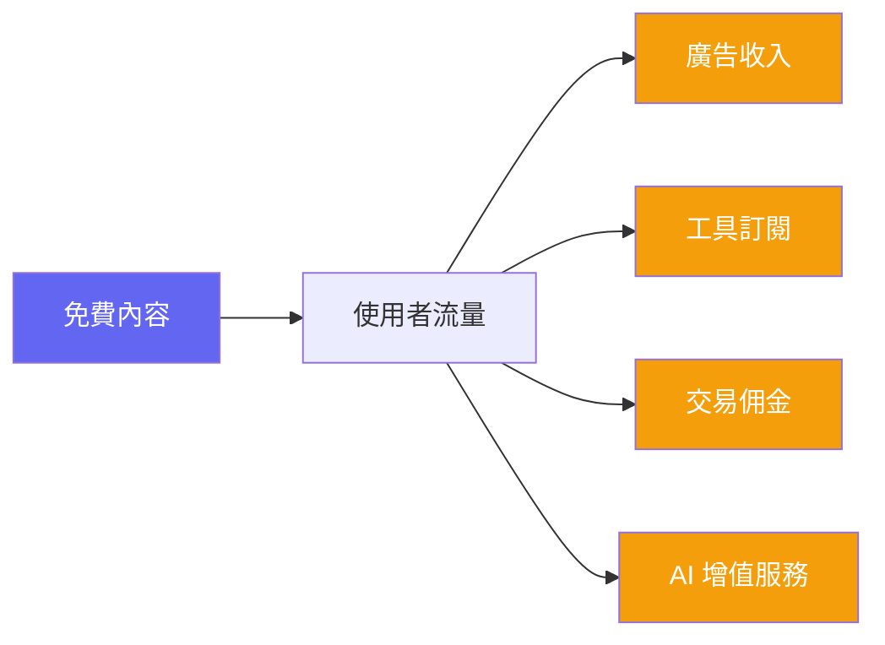
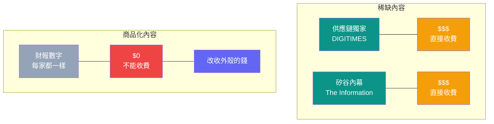
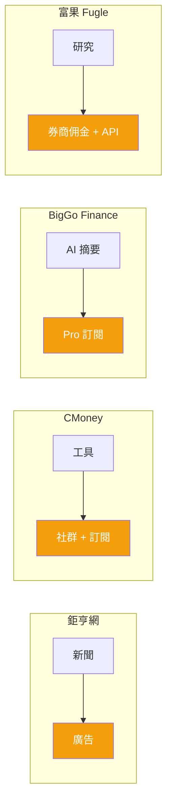
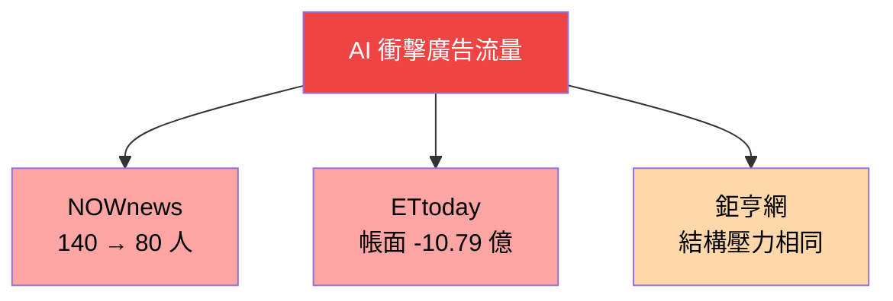
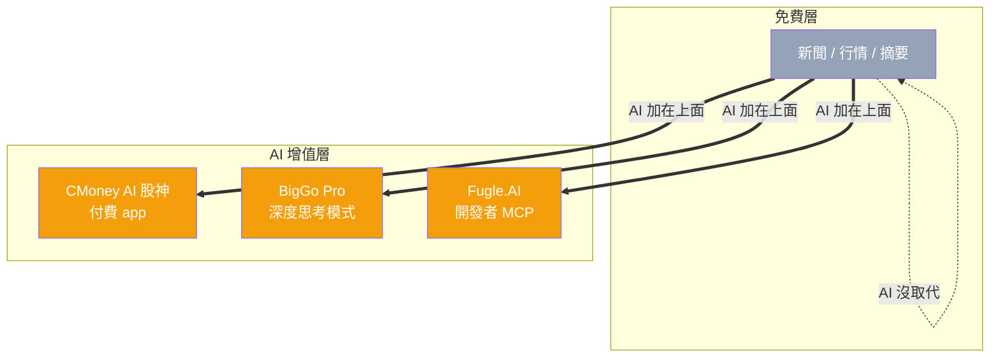
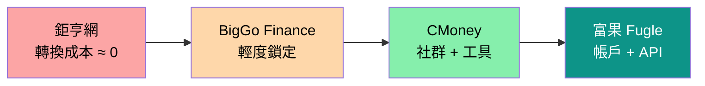

> 🌏 [English version](/en/posts/product/2026-09-16-free-content-side-monetization-en)

[Bloomberg Terminal](https://www.bloomberg.com/professional/products/bloomberg-terminal/) 一年要價超過 25,000 美元。[鉅亨網](https://www.cnyes.com/)完全免費。兩者服務的是同一個根本需求：幫人做出投資決策。價差達一千倍，不是因為內容品質差一千倍，而是因為它們玩的是完全不同的遊戲。Bloomberg 賣的是內容本身——獨家資料、即時行情、分析工具綁在一起的終端機體驗。鉅亨網把內容送出去，從內容周圍的一切賺錢。

這是內容販售的第四種模式：你根本不賣內容。

## 為什麼財經內容可以免費

並非所有內容都適合免費。能免費的內容通常有一個共通特徵：**它是商品化的**。

財經新聞是典型的商品化內容。台積電公布財報，鉅亨網報、Yahoo Finance 報、路透社也報。每家的數字一樣，差異只在速度和呈現方式。讀者不會為了同一組數字付兩次錢。

相較之下，[DIGITIMES](https://www.digitimes.com.tw/) 能收年費數萬元，因為它的供應鏈獨家消息在別處看不到。[The Information](https://www.theinformation.com/) 能收 399 美元/年，因為它的矽谷內幕是記者用人脈換來的。這些是稀缺內容，值得直接收費。

免費內容平台做的是另一件事：**承認內容本身的價格趨近於零，轉而把價值包裝在內容的外殼裡**——工具、社群、交易通道、AI 增值功能。內容是入口，不是商品。

## 五個平台、五種側翼

以下五個平台都提供免費的財經內容，但各自找到了不同的變現側翼。

| 平台 | 免費內容 | 廣告 | 工具訂閱 | 交易佣金 | AI 增值 | 社群 |
|---|---|---|---|---|---|---|
| [鉅亨網](https://www.cnyes.com/) | 即時新聞 | 主力 | — | — | — | — |
| [Yahoo Finance](https://finance.yahoo.com/) | 即時新聞 | 主力 | Plus 方案 | — | — | — |
| [CMoney](https://www.cmoney.tw/) | 基礎工具 | 次要 | 多層訂閱 | — | AI 股神 | 主力 |
| [BigGo Finance](https://finance.biggo.com.tw/) | AI Podcast 摘要 | 有（免費版） | Pro 方案 | — | AI 對話 | — |
| [富果 Fugle](https://www.fugle.tw/) | 研究資料 | — | API 訂閱 | 券商佣金 | Fugle.AI | — |

同一群台灣散戶投資人，五個平台用五種不同的方式從他們身上賺錢。

## 鉅亨網：純廣告模式的天花板

鉅亨網是台灣流量最大的財經新聞網站之一。24 小時由編輯團隊搭配國際通訊社（路透、美聯社）產出即時財經新聞，涵蓋台股、美股、外匯、期貨與基金。App 在 App Store 和 Google Play 上評價穩定。

它的商業模式是網路媒體最經典的版本：免費內容換流量，流量換廣告收入。沒有付費牆、沒有工具訂閱、沒有交易功能。

這個模式的問題正在浮現。2026 年，遊戲橘子旗下的 [NOWnews 大幅裁員](https://www.ftnn.com.tw/news/554607)，從 140 人砍到 80 多人，直接原因是生成式 AI 衝擊流量與廣告收入。東森新媒體 ETtoday 連年虧損，母公司帳面投資價值轉為負 10.79 億元。純靠廣告養活一個新聞編輯室，在 AI 時代越來越像在逆風騎車。

鉅亨網還沒到這個地步，但結構性壓力是一樣的：Google AI Overviews 讓 zero-click 搜尋從 56% 上升到 69%，出版商流量平均下降了三分之一。

## CMoney：社群加工具的複合飛輪

CMoney 走了完全不同的路。它的免費內容只是起點——「股市爆料同學會」社群讓散戶互相討論、分享看法，創造了內容之外的黏性。真正的收入來自圍繞社群的工具訂閱：籌碼 K 線、理財寶等多層付費產品，針對不同程度的投資人設計不同功能。

2026 年 CMoney 推出了 [AI 股神](https://apps.apple.com/tw/app/ai%E8%82%A1%E7%A5%9E/id6753969485) app，用自然語言問「台積電現在可以買嗎？」就能一鍵生成涵蓋基本面、技術面、籌碼面和估值分析的完整報告。AI 在這裡不是用來產免費內容引流，而是成為付費工具的新賣點。

CMoney 的護城河在於社群。一個散戶如果已經在「股市爆料同學會」裡追蹤了十幾個老師、存了幾百篇筆記，轉換成本非常高。相比之下，新聞內容幾乎沒有轉換成本——關掉鉅亨網開 Yahoo Finance，體驗差異微乎其微。

## BigGo Finance：AI 內容作為漏斗

[BigGo Finance](https://finance.biggo.com.tw/) 是比價引擎 [BigGo](https://biggo.com.tw/)（2016 年成立，2019 年 A 輪 500 萬美元）跨入財經的新產品線。它同時提供即時報價、法說會紀錄、市場行事曆和 AI 對話。

其中最有意思的功能是 [Podcast AI 摘要](https://finance.biggo.com.tw/podcast)。它把英語頂級財經節目——Lenny's Podcast、All-In Podcast、高盛 The Markets——用 AI 自動轉成結構化的中文筆記。不是逐字稿，而是帶有標題、表格、引述和未解問題的深度摘要。品質令人印象深刻。

關鍵是：這些摘要完全免費。它們不是產品，是漏斗。BigGo Finance 的付費點在 [Pro 方案](https://finance.biggo.com.tw/pricing)（20 美元/月），提供深度思考 AI 模型、每日 150 次主動通知、法說會提前 30 分鐘搶先看和無廣告體驗。Podcast 摘要的角色是用高品質免費內容吸引讀者進入平台，再靠整體體驗轉化付費。

這是 AI 在免費內容模式裡最直接的應用：自動產出內容的邊際成本趨近於零，讓「免費引流」這件事的經濟學變得更好。

## 富果 Fugle：從內容到交易的完整迴路

[富果 Fugle](https://www.fugle.tw/) 是這五個平台裡走得最遠的。它從股票研究平台起步，提供免費的個股資料和市場研究，然後一步步往交易端延伸——與玉山、台新、富邦證券合作，成為台灣第一批用 API 串接下單的券商之一。

免費內容和研究工具是入口，[開發者 API](https://developer.fugle.tw/) 訂閱帶來一層收入，券商交易佣金帶來另一層。2026 年推出的 [Fugle.AI](https://www.fugle.ai/) 進一步把台股資料接上 ChatGPT 和 Claude，讓使用者在 AI 對話裡直接查詢個股、管理追蹤清單和設定到價通知。

富果的模式最像 Robinhood 在美國做的事：用免費工具和零（或低）佣金吸引年輕投資人，從交易流水和增值服務賺錢。內容在這裡甚至不是主要的引流工具——產品體驗本身才是。

## AI 正在改變哪一層

回顧五個平台，AI 進入的位置不同：

| 平台 | AI 做什麼 | AI 的角色 |
|---|---|---|
| 鉅亨網 | 尚未明顯導入 | — |
| Yahoo Finance | 基礎 AI 摘要 | 輔助功能 |
| CMoney | AI 股神一鍵報告 | 付費工具賣點 |
| BigGo Finance | Podcast AI 摘要 + AI 對話 | 免費引流 + 付費工具 |
| Fugle | MCP 串接 ChatGPT/Claude | 開發者生態 |

一個規律浮現：**AI 沒有取代免費內容層，而是作為付費增值層的差異化工具**。CMoney 的 AI 股神是付費 app，不是免費文章。BigGo Finance 的 AI 對話功能在 Pro 方案裡提供深度思考模式。富果的 AI 整合面向的是開發者和進階使用者。

免費內容依然免費。AI 讓「免費之上的那一層」變得更有吸引力。

## 這個模式的風險

免費內容加側翼變現不是無風險的。三個結構性壓力正在升高：

**廣告收入在萎縮。** Google AI Overviews 讓出版商的搜尋流量平均下降三分之一。純靠廣告的平台（鉅亨網模式）將承受最大壓力。NOWnews 和 ETtoday 的困境是預警。

**內容的差異化越來越難。** 當每個平台都能用 AI 在幾秒內產出財報分析和新聞摘要，「免費內容」的品質差異會進一步縮小。差異化將完全轉移到內容以外的維度。

**工具鎖定是最強的護城河。** 比較五個平台的護城河強度：鉅亨網幾乎沒有轉換成本，讀者隨時可以換；CMoney 有社群和工具鎖定；富果有交易帳戶和 API 整合。內容本身幾乎不構成護城河，**包裹內容的殼才是**。

## 給創業者的啟示

如果你想進入「免費內容 + 側翼變現」的市場，五個平台的經驗指向幾個原則：

**不要試圖對商品化內容收費——對外殼收費。** 鉅亨網證明了財經新聞可以免費；CMoney 證明了圍繞新聞的工具和社群可以收費。你的內容策略應該是「什麼內容能帶來最多需要我的工具的人」，而不是「什麼內容最值錢」。

**側翼選項有五種：廣告、工具、社群、交易、AI 增值。** 純廣告正在萎縮，純社群很難起步。最穩健的組合是「工具 + 一到兩個附加側翼」。富果的「內容→工具→交易」迴路是目前最完整的範本。

**在台灣的小市場裡，垂直深度勝過水平廣度。** CMoney 不做國際新聞、不做外匯交易——它只做台股散戶需要的工具做到極致。BigGo Finance 反過來，試圖從比價引擎橫向延伸到財經，品牌聯想還在建立中。

**AI 是新的外殼。** BigGo Finance 用 AI 把免費 Podcast 變成平台黏性。CMoney 用 AI 把個股分析變成付費工具。下一波機會在於：還有什麼過去因為人力成本太高、無法免費提供的內容，現在可以用 AI 零邊際成本產出，作為新的引流入口？

Bloomberg Terminal 一年收 25,000 美元。鉅亨網免費。同一個需求，一千倍的價差。差的不是內容本身——是你選擇用內容做什麼。

## 參考資料

- [Bloomberg Terminal](https://www.bloomberg.com/professional/products/bloomberg-terminal/) — B2B 金融資料終端
- [鉅亨網](https://www.cnyes.com/) — 台灣財經新聞入口
- [CMoney](https://www.cmoney.tw/) — 台灣散戶投資工具平台
- [CMoney AI 股神](https://apps.apple.com/tw/app/ai%E8%82%A1%E7%A5%9E/id6753969485) — AI 個股分析 app
- [BigGo Finance](https://finance.biggo.com.tw/) — AI 財經資訊平台
- [BigGo Finance 付費方案](https://finance.biggo.com.tw/pricing)
- [BigGo Finance Podcast AI 摘要](https://finance.biggo.com.tw/podcast)
- [富果 Fugle](https://www.fugle.tw/) — 台灣金融科技平台
- [Fugle Developer API](https://developer.fugle.tw/) — 台股即時報價與交易 API
- [Fugle.AI](https://www.fugle.ai/) — AI 投資助理 MCP 整合
- [Yahoo Finance](https://finance.yahoo.com/) — 全球財經資訊平台
- [NOWnews 大幅裁員報導](https://www.ftnn.com.tw/news/554607) — FTNN 新聞網
- 系列總覽：[誰在賣內容：四種模式與一個威脅](/posts/product/2026-09-16-content-selling-four-models)
