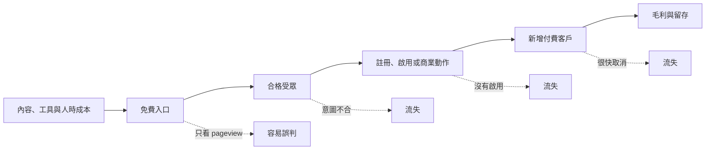
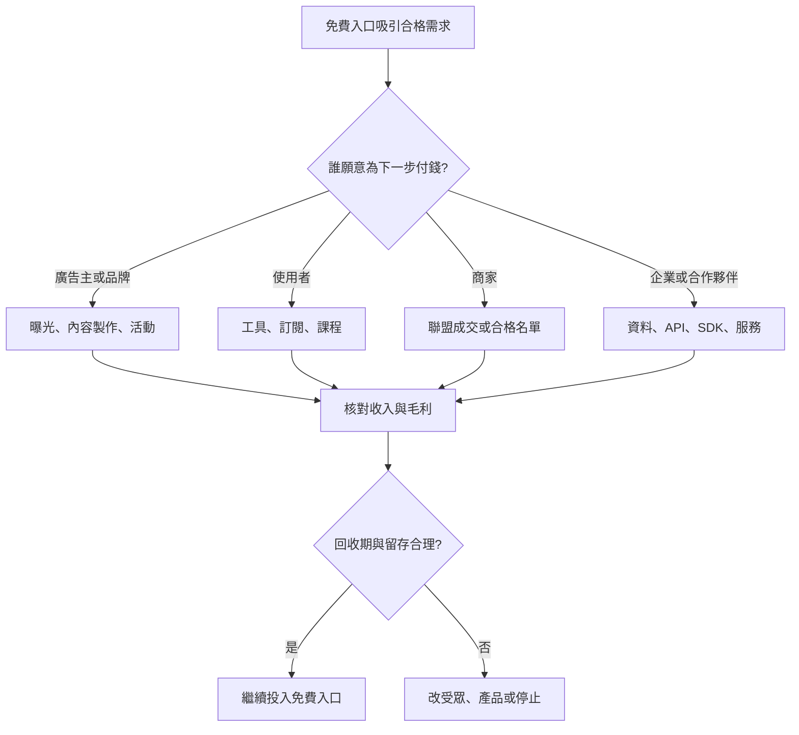

> 🌏 [English version](/en/posts/product/2026-09-16-free-content-side-monetization-en)

想像夜市老闆免費送一小杯湯。那杯湯不是憑空變出來的：食材、攤位和人力都要錢。老闆願意送，是因為有些人喝完會買整碗，也可能順手買滷味；若大家只拿試喝就離開，排隊再長也不是好生意。

免費內容也是如此。文章、新聞、Podcast 摘要與計算器都要製作、分發和維護。它們能不能成立，不取決於 pageview 看起來多漂亮，而是適合的讀者有沒有走到下一個能產生毛利的工作：看廣告、買工具、訂閱、透過合作券商完成服務，或向商家購買。

這篇原本是母系列「內容販售商業模式拆解」的第四種模式。現在把它展開成八篇子系列：前四篇看台灣財經產品，後四篇補上聯盟行銷、免費工具、CAC／LTV 與 AI 搜尋。核心問題始終相同：**免費入口留下了什麼，而且那個東西值不值得成本？**

## 先把「流量」和「生意」分開

免費內容只保證有人可以進門，不保證來的人合適，也不保證會啟用或付費。因此「同一網站上同時有免費頁與付費產品」只能證明路徑存在，不能證明前者造成後者轉換。要證明因果，仍需來源歸因、事件追蹤與 cohort。

## 八篇文章，各自檢查一段路徑

| Order | 免費入口 | 可能承接的付費工作 | 可以從公開資料確認 | 不能直接推論 |
|---:|---|---|---|---|
| 1 | 鉅亨網新聞與市場資訊 | 廣告、活動、贊助內容與其他企業合作 | 官方廣告服務確實涵蓋多種商品 | 它是純廣告媒體、各收入占比 |
| 2 | CMoney 內容、基礎工具與社群 | App、課程、創作者商品與企業系統 | 官方產品設計把方法、工具、社群放在同一循環 | 哪一步真的提高轉換或留存 |
| 3 | BigGo Finance 公開摘要與財經入口 | Pro 的模型、通知與體驗權益 | 免費層與付費層並存 | 摘要帶來多少訂閱、精確現行價格 |
| 4 | Fugle 研究與產品入口 | 行情 API、券商合作與 B2B 資訊服務 | API 方案、合作券商與不同產品邊界存在 | Fugle 從每筆交易抽佣 |
| 5 | 評測、比較與選型內容 | 商家依可歸因成果支付聯盟佣金 | 佣金公式與揭露義務可檢查 | 點擊都能被歸因、固定佣金永遠不變 |
| 6 | 真正完成工作的免費工具 | 付費版、名單或相鄰產品 | 工具可提供反覆使用理由 | 工具必然排名或得到 backlinks |
| 7 | 所有免費入口 | 以 CAC、毛利 LTV 與回收期檢查 | 成本與新增付費客戶可按 cohort 計算 | leads 等於 customers、3:1 普遍適用 |
| 8 | 會被搜尋與答案引擎讀取的內容 | 第一方關係、工具、原始訊號與品牌直達 | 抓取和可辨識導流是不同事件 | crawl-to-refer 等於 CTR 或全站流量跌幅 |

前四列是產品案例，不是由弱到強的排行榜。後四列則是一組經營檢查表：收入怎麼歸因、工具是否真的有用、單位經濟是否成立，以及搜尋入口改變後還剩下什麼。

## 同樣免費，付錢的人可能完全不同

[鉅亨網的案例](/posts/product/2026-09-17-anue-attention-ad-market)最適合提醒我們不要把「免費媒體」寫成「純廣告」。鉅亨官方列出的服務除了數位廣告，也包括影音、活動、贊助專題與內容製作；因此更準確的描述是多種企業行銷商品共享同一批讀者注意力，而不是單一 banner 生意。官方資料可以證明商品存在，不能證明各項收入占比。

[CMoney](/posts/product/2026-09-17-cmoney-content-tool-community)把內容、工具與社群放在同一產品環境。[官方產品職缺頁](https://www.cmoney.tw/careers/product)甚至直接用「方法、工具、社群」描述循環。不過這是產品設計，不是公開的轉換實驗；不能因為介面接得順，就聲稱社群一定把讀者變成訂戶。

[BigGo Finance](/posts/product/2026-09-17-biggo-finance-ai-content-funnel)同時提供公開 Podcast AI 摘要與 Pro 方案。這使「內容可能替訂閱獲客」成為合理假說，但公開資料沒有摘要讀者的註冊率、付費率或留存。本系列因此不放只有單一官方快照支持的精確價格，也不把未知的轉寫、翻譯與校對流程寫成全自動內容工廠。

[Fugle](/posts/product/2026-09-17-fugle-information-to-trading)則展示一條分岔路徑：個人可購買[行情 API 方案](https://developer.fugle.tw/docs/pricing/)，券商帳戶與資產仍由合作券商承接，企業還可採用資料授權、SDK 或技術服務。這些路徑不能合併成「Fugle 靠交易佣金」；公開資料不足以支持每筆交易抽佣的說法。

## 側翼不是清單，而是誰替哪個結果付錢

這張圖比「廣告、訂閱、交易、AI」的功能清單更有用，因為它先問付款者與購買工作。AI 可能出現在內容生產、搜尋入口或付費工具裡，但「用了 AI」本身不是商業模式，也不是收入成長的因果證據。

## 四個經營問題，把漂亮故事拉回帳本

第一，聯盟行銷的 `rel="sponsored"` 是搜尋標記，不是給人看的利益揭露。[Google 的垃圾內容政策](https://developers.google.com/search/docs/essentials/spam-policies)也把沒有原創價值的 thin affiliation 列為問題；[FTC 的揭露指引](https://www.ftc.gov/business-guidance/resources/disclosures-101-social-media-influencers)則要求將重要關係清楚放在推薦附近。FTC 是美國指引，不是台灣法律結論。

第二，[免費工具](/posts/product/2026-09-17-free-tools-seo-compounding)必須真的完成宣稱的工作。工具可以讓人有重算、保存或監控的理由，卻沒有 Google 官方規則保證它必然排名或得到連結；大量低價值程序化頁面反而可能落入 scaled content abuse。

第三，[內容 CAC](/posts/product/2026-09-17-content-acquisition-cac-ltv)的分母是新增付費客戶，不是 leads。分子要放進內容、分發、工具與人時，之後再拿毛利 LTV 與回收期檢查現金流。[HubSpot 對 CAC 的說明](https://www.hubspot.com/startups/sales-and-marketing/calculating-cac-for-startups)也提醒團隊納入工具、薪資與創辦人時間；常見比率只能當情境參考，不能代替自己的 cohort。

第四，[AI 搜尋](/posts/product/2026-09-17-ai-takes-clicks-free-content-assets)會讓「內容被讀取」與「讀者進站」進一步分離。[Cloudflare 的 crawl-to-refer ratio](https://blog.cloudflare.com/ai-search-crawl-refer-ratio-on-radar/)比較 HTML 抓取與可辨識 referral，並提醒原生 App 可能不帶 `Referer`。所以它不是 CTR，也不能直接推出每家網站的流量跌幅。真正該累積的是經同意取得的第一方關係、可操作工具、原始訊號和品牌直達。

## 系列閱讀順序

1. [免費財經新聞怎麼賺錢：鉅亨網的讀者、廣告主與內容三方市場](/posts/product/2026-09-17-anue-attention-ad-market)
2. [免費內容怎麼賣工具：CMoney 的方法、App 與投資社群](/posts/product/2026-09-17-cmoney-content-tool-community)
3. [AI 摘要怎麼替訂閱獲客：BigGo Finance 的內容、工具與 Pro](/posts/product/2026-09-17-biggo-finance-ai-content-funnel)
4. [免費資訊怎麼走到交易：Fugle 的研究、API 與券商合作漏斗](/posts/product/2026-09-17-fugle-information-to-trading)
5. [聯盟行銷的單位經濟：何時是生意，何時只是一次佣金](/posts/product/2026-09-17-affiliate-marketing-unit-economics)
6. [免費工具怎麼累積搜尋價值：真功能、回訪迴圈與維護成本](/posts/product/2026-09-17-free-tools-seo-compounding)
7. [內容獲客划不划算：CAC、毛利 LTV、回收期與歸因](/posts/product/2026-09-17-content-acquisition-cac-ltv)
8. [AI 拿走點擊後，免費內容還剩什麼？](/posts/product/2026-09-17-ai-takes-clicks-free-content-assets)

## 更新紀錄

- 2026-09-17：將母系列 order 4 的單篇拆解重寫為子系列導讀；移除未可靠的精確定價、收入占比、交易佣金與 AI 流量因果，新增八篇內鏈、比較表、決策圖與單位經濟邊界。

## 參考資料

- 母系列總覽：[誰在賣內容：四種模式與一個威脅](/posts/product/2026-09-16-content-selling-four-models)
- [鉅亨網個案與官方來源邊界](/posts/product/2026-09-17-anue-attention-ad-market)
- [CMoney 產品設計](https://www.cmoney.tw/careers/product)
- [BigGo Finance Podcast AI 摘要](https://finance.biggo.com.tw/podcast)
- [Fugle Developer API 方案](https://developer.fugle.tw/docs/pricing/)
- [Google Search spam policies](https://developers.google.com/search/docs/essentials/spam-policies)
- [FTC：Disclosures 101 for Social Media Influencers](https://www.ftc.gov/business-guidance/resources/disclosures-101-social-media-influencers)
- [HubSpot：How to calculate CAC](https://www.hubspot.com/startups/sales-and-marketing/calculating-cac-for-startups)
- [Cloudflare：AI search crawl-to-refer ratio](https://blog.cloudflare.com/ai-search-crawl-refer-ratio-on-radar/)
