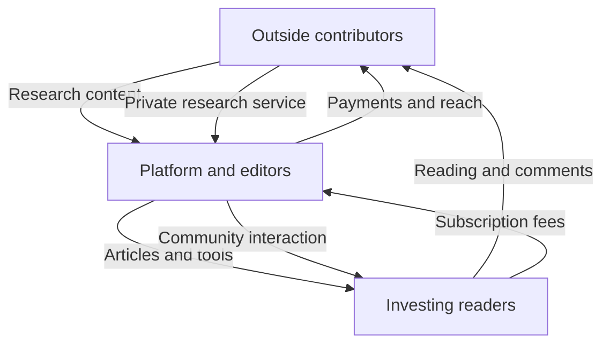
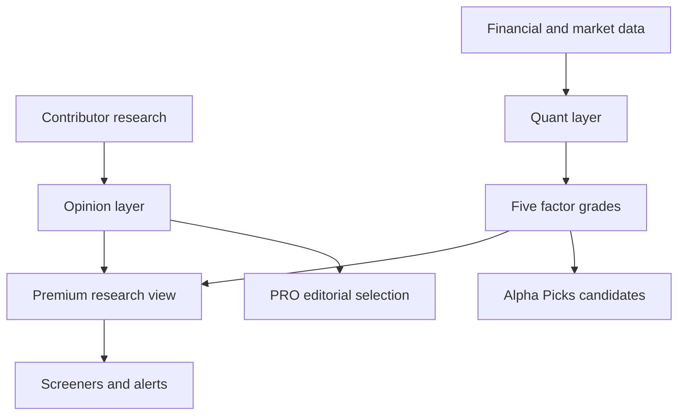

> 🌏 [中文版](/posts/product/2026-09-16-seeking-alpha-contributor-marketplace)

Picture an investing night market. It is not a restaurant employing a hundred chefs. It gives independent stallholders space to sell their specialties: one studies semiconductors, another follows dividend stocks, and a third hunts for companies ignored by Wall Street. The market operator does not prepare every dish, but it sets the rules, checks the signs, and brings in the crowd.

[Seeking Alpha](https://about.seekingalpha.com/) is that market. Outside investors and analysts submit research, and editors decide which public articles make it through. Free readers bring attention; paying readers buy full research, screening tools, and quantitative ratings. The platform can broaden its stock coverage without putting every contributor on payroll.

Articles are only the surface. The product underneath is a research market that makes scattered opinions searchable, comparable, and trackable. That creates an equally clear challenge: how does the platform keep contributors publishing without letting quality problems and conflicts of interest overwhelm the market?

Most paying customers are individual investors rather than enterprise procurement teams. Seeking Alpha belongs in this B2B-intelligence subseries as an adjacent model: instead of hiring a complete research staff first, it uses platform rules to aggregate outside research and then charges for content and data tools in layers. It should not be mistaken for a conventional enterprise-intelligence firm.

## Three things move through the market

The marketplace carries three flows. Contributors send content to the platform. Readers direct attention toward contributors. Subscription money reaches the platform first, then flows back to the supply side through article payments and author-run services.

Content gives people something to browse. Attention tells the platform what is worth supplying. Money gives both sides a reason to stay. Remove any one flow and the flywheel weakens: contributors leave if nobody reads, readers refuse to pay if rules cannot support trust, and subscriptions erode if fresh viewpoints disappear.

This is the basic difference between Seeking Alpha and a conventional research firm. A brokerage hires analysts first and assigns coverage. Seeking Alpha gathers people who already want to publish, then uses editing and incentives to shape supply. Its [About page](https://about.seekingalpha.com/) says it publishes more than 5,000 analysis articles per month and covers 8,000 to 10,000 tickers per quarter. Those are company-reported figures, not independently audited numbers. They show the breadth the platform is designed to pursue; they do not prove that every article is accurate.

## Why contributors bring their work

At submission, authors can choose between exclusive and non-exclusive publication. Under the [official partnership program](https://about.seekingalpha.com/premium-partnership-program), exclusive articles are eligible for payment but cannot be republished in full elsewhere. Authors may post a summary of up to 250 words on their own sites, with a link back. Non-exclusive pieces can appear on other platforms but are not eligible for article payments.

Payment for ordinary exclusive articles is not a simple flat rate per thousand views. The [current payment rules](https://about.seekingalpha.com/article-payments) describe two components: fixed bonuses for scarce coverage, plus a monthly pool allocated according to reading by Premium and PRO subscribers. The system rewards articles that paying customers actually consume while offering extra incentives for stocks that receive little coverage.

Popular corners already attract plenty of stalls. A neglected lane needs a sign saying, “Set up here and earn a bonus.” That does not guarantee that every article on an undercovered stock will be good. It does show that the platform actively manages holes in its research inventory.

Investing Groups form a second supply channel. Individual contributors can run private research services and communities for subscribers who want to follow them directly. Seeking Alpha's [Contributor Partnership Terms](https://about.seekingalpha.com/contributor-partnership-program-tc) said in 2017 that authors received 75% of collected subscription revenue while the platform kept 25%. That ratio is useful as a historical description of the marketplace design. A public page that remains online does not establish that every author's 2026 settlement still follows exactly the same terms.

## Readers are not paying for the same job

According to the [official subscription guide](https://help.seekingalpha.com/basic/what-are-the-various-types-of-subscription-services-available-on-seeking-alpha), Basic, Premium, PRO, Alpha Picks, and Investing Groups all look like “investment content.” In practice, each saves the reader a different kind of effort.

| Product layer | What the reader is really buying | Best fit |
|---|---|---|
| Basic | News, live prices, portfolio tracking, and a small sample of premium research | Someone monitoring markets before paying |
| Premium | Full analysis, Quant Ratings, screeners, and portfolio tools | A self-directed investor who wants to spend less time organizing data |
| PRO | A more selective layer of research and idea generation | Someone managing a larger portfolio whose time costs more than the subscription |
| Alpha Picks | A fixed cadence of candidates selected by the quantitative system | Someone who wants less screening and a shorter list |
| Investing Groups | Private content, interaction, and community around a particular contributor | Someone who already trusts an author or strategy |

The guide positions Premium as full article access plus Quant Ratings, Top Stocks, and portfolio tools. PRO emphasizes analysis selected by its editorial team. The ladder does more than put additional articles behind progressively higher walls. Each tier removes more of the work involved in finding, comparing, and filtering ideas.

The pricing pages also show why the first number on a website should not automatically become “the price.” A Premium [renewal notice](https://about.seekingalpha.com/premium-subscription-price-update) and the bundle page both quote $299 per year. Alpha Picks is inconsistent: its [price update](https://about.seekingalpha.com/alpha-picks-subscription-price-update) says $399 per year, while the [bundle explanation](https://help.seekingalpha.com/how-does-the-bundle-work) calculates the stand-alone price at $499. Different plans, cohorts, or stale pages could explain the gap, but the public evidence does not identify which. The accurate statement is narrower: two official prices appeared on the date checked, and the checkout page determines the actual charge.

Seeking Alpha is privately held and does not publish financial statements detailed enough to verify current revenue. Multiplying a subscription price by a subscriber count circulating online does not solve the problem. Discounts, refunds, bundles, and churn are all missing from that arithmetic.

## Quant Ratings add a data layer to the article market

If the platform offered articles alone, readers would still have to compare incompatible arguments in their heads. Quant Ratings solve a different problem: give every stock the same measuring stick.

The [official methodology overview](https://help.seekingalpha.com/premium/what-are-quant-ratings-and-how-do-i-use-them) says the system compares more than 100 metrics for each stock with peers in the same sector. It rolls those measurements into five factors—Value, Growth, Profitability, Momentum, and EPS Revisions—then produces a rating from Strong Sell to Strong Buy.

Human analysis addresses “what might happen to this company, and why?” The quantitative layer addresses “where does it rank when the same criteria are applied to its peers?” Together, they turn articles from one-off reading into components that can appear in screeners, alerts, and portfolio pages.

This is also where the article needs a brake pedal. Seeking Alpha's [Quant methodology page](https://about.seekingalpha.com/quant-sell-ratings) discloses data sources, factor concepts, and some backtest assumptions while warning that past performance does not guarantee future results. The published simulation uses equal weighting, daily rebalancing, and no transaction costs. It is not a portfolio a reader can reproduce unchanged. The backtest helps explain product design; one historical curve cannot prove future outperformance. This article analyzes a business model and is not investment advice.

## What editorial controls can—and cannot—stop

Breadth is the strength of crowdsourced research and its central weakness. Contributors differ in skill, methods, holdings, and incentives. A platform that optimizes for supply alone risks becoming a night market full of loud signs where nobody knows which stall is safe.

Seeking Alpha's [editorial policies](https://about.seekingalpha.com/summary-editorial-policies) require contributors to disclose current or planned positions in securities discussed in an article, declare business relationships with companies or funds, and reject third-party payment for coverage. Public analysis goes through editorial review, with additional rules for short ideas, microcaps, and serious allegations against management.

Public pseudonyms are allowed, but the [pseudonymous contributor policy](https://about.seekingalpha.com/policy-on-pseudonymous-analysts) says the platform verifies real names and contact details and applies the same position-disclosure rules. This is a tradeoff between supply and accountability. Pseudonyms can help knowledgeable insiders publish without exposing their public identity, while making it harder for readers to evaluate an author's background independently.

Rules do not make every disclosure truthful. They can lower risk, but they cannot make every conclusion correct or eliminate undisclosed compensation. Editorial review is closer to a health inspection for the market: it can remove obvious violations and poorly supported claims, but it cannot promise that every customer will enjoy every meal.

## AI is both a moat tool and an internal competitor

Seeking Alpha's AI stance looks contradictory. Its [editorial policy](https://about.seekingalpha.com/summary-editorial-policies) prohibits contributors from using AI to generate or polish analysis articles. The platform itself uses machine learning and commercial language models to generate summary reports. Its [AI disclosure](https://help.seekingalpha.com/does-seeking-alpha-use-ai-to-generate-these-reports) explicitly says those reports are not reviewed by editors, may contain errors, and are not guaranteed to be complete or timely.

The split makes more sense at the product-layer level. Human contributors supply theses, domain experience, and disagreement that are hard to standardize. AI compresses, retrieves, and organizes the resulting volume. The platform is trying to protect human-originated judgment while reducing the cost of consuming it.

The harder tension is financial. If author compensation partly depends on paying readers opening articles, and an AI summary lets readers skip the full text, then a more convenient summary could reduce visible article consumption. Seeking Alpha has not publicly explained how summary usage affects contributor payments. This is a business-model risk to test, not a confirmed outcome.

Generic financial-statement summaries are the easiest part of the product for AI to commoditize. Harder assets include contributor track records, persistent portfolio workflows, community relationships, and maintained relative ratings. Seeking Alpha does not need to prove that AI can never write a stock article. It needs readers who can get free summaries elsewhere to keep paying for comparison, monitoring, and trust.

## What is actually difficult to copy

From a distance, Seeking Alpha looks like a site that puts articles behind a paywall. Underneath are at least four connected gears: outside contributors broaden supply; editorial and disclosure rules constrain risk; subscription tiers save different amounts of reader time; and Quant Ratings connect content to tools people can use every day.

Its advantage is not that every article beats professional research. It is that one marketplace can hold many viewpoints, standardized data, and ongoing interaction. The limits belong in the same picture: quality varies, contributor incentives can drift, public methodology is insufficient to reconstruct the entire quantitative system, and even official pricing pages can disagree.

A night market does not need every stall to be perfect. It works when sellers want to show up, customers can find what they need, and the operator keeps the most dangerous problems within tolerable bounds. That market-making capability is the content business Seeking Alpha is really selling.

## References

- [About Seeking Alpha](https://about.seekingalpha.com/)
- [Premium Partnership Program](https://about.seekingalpha.com/premium-partnership-program)
- [Article Payments](https://about.seekingalpha.com/article-payments)
- [Contributor Partnership Program Terms](https://about.seekingalpha.com/contributor-partnership-program-tc)
- [Seeking Alpha subscription types](https://help.seekingalpha.com/basic/what-are-the-various-types-of-subscription-services-available-on-seeking-alpha)
- [Premium Subscription Price Update](https://about.seekingalpha.com/premium-subscription-price-update)
- [Alpha Picks Subscription Price Update](https://about.seekingalpha.com/alpha-picks-subscription-price-update)
- [Premium and Alpha Picks bundle](https://help.seekingalpha.com/how-does-the-bundle-work)
- [What Are Quant Ratings?](https://help.seekingalpha.com/premium/what-are-quant-ratings-and-how-do-i-use-them)
- [Quant Sell Ratings methodology](https://about.seekingalpha.com/quant-sell-ratings)
- [Summary of Editorial Policies](https://about.seekingalpha.com/summary-editorial-policies)
- [Policy on Pseudonymous Contributors](https://about.seekingalpha.com/policy-on-pseudonymous-analysts)
- [AI-generated Summary Reports](https://help.seekingalpha.com/does-seeking-alpha-use-ai-to-generate-these-reports)
