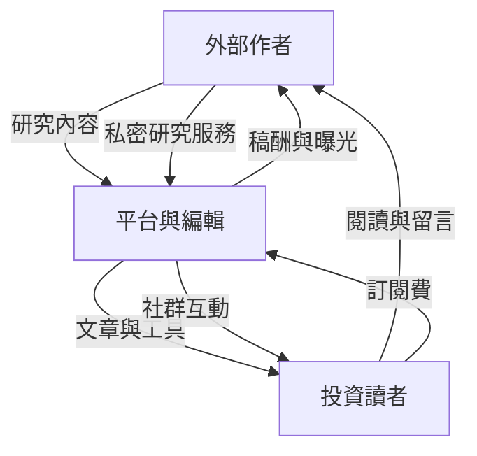
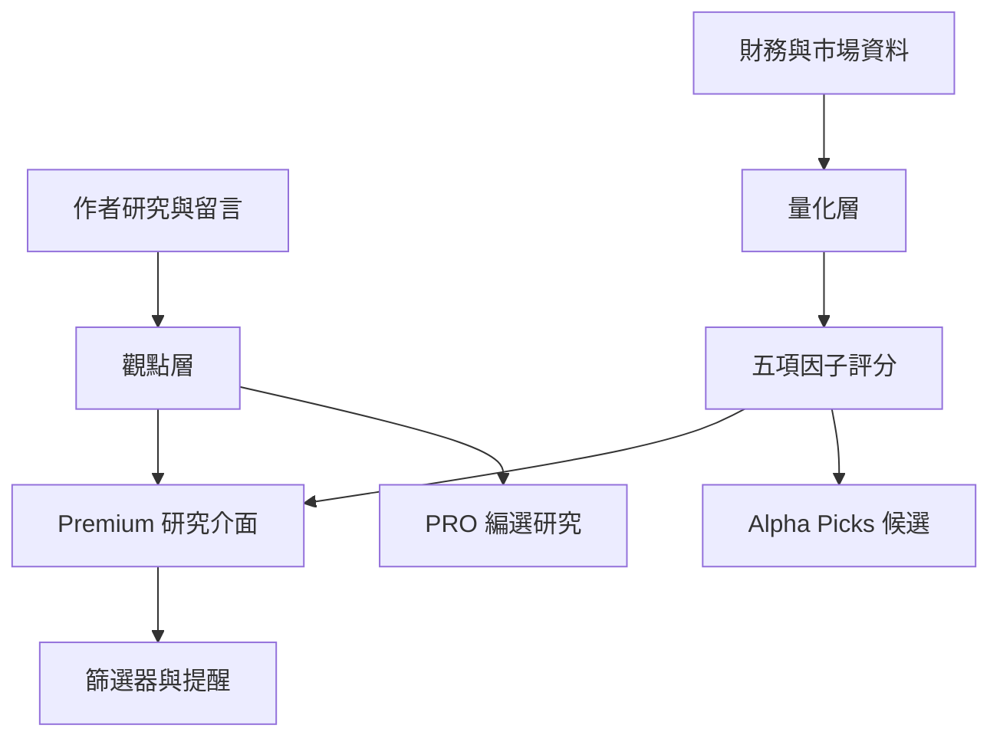

> 🌏 [English version](/en/posts/product/2026-09-16-seeking-alpha-contributor-marketplace-en)

想像一座投資夜市。它不是一家餐廳雇一百位主廚，而是讓各種攤商進場：有人研究半導體，有人只看高股息，也有人專門找市場忽略的小公司。市場管理員不替每一攤備料，卻要訂規則、檢查招牌，還要把願意逛夜市的人帶進來。

[Seeking Alpha](https://about.seekingalpha.com/) 就是這座夜市。外部投資人與分析者投稿，編輯決定公開文章能不能刊登；免費讀者帶來注意力，付費讀者購買完整研究、篩選工具和量化評級。平台不必把每位作者都聘成員工，卻能靠作者的不同專長擴大股票覆蓋。

文章只是表層。它真正販售的是一套研究市場，讓分散觀點變得可找、可比、可追蹤。這個模式的難題也很直接：平台怎麼讓作者持續供稿，又不讓品質與利益衝突失控？

它的主要付費客群是個人投資人，不是企業採購部門。這篇把它放進 B2B 情報子系列，是因為它展示了相鄰的產品化路徑。平台不先雇用完整研究團隊，而是聚集外部研究，再把內容與資料工具分層收費。讀者應把它當成相鄰模式，而不是典型企業情報公司。

## 三種東西同時在流動

這個市場裡有三種流動。作者把內容交給平台，讀者把注意力交給作者，訂閱費則先進平台，再透過稿酬或作者服務分回供給端。

內容讓市場有東西可逛，注意力告訴平台什麼值得繼續供應，金流則讓兩邊願意留下。少一條都轉不起來。只有文章、沒有讀者，作者不會久留；只有流量、沒有可信規則，讀者不會付費；只有訂閱、沒有新觀點，產品也會慢慢失去理由。

這也是 Seeking Alpha 跟傳統研究機構最大的差別。傳統券商或研究公司先聘分析師，再分配要追蹤的公司；Seeking Alpha 先聚集願意公開研究的人，再用編輯與報酬調整供給。[官方 About 頁](https://about.seekingalpha.com/)稱，目前每月刊出超過 5,000 篇分析，每季涵蓋 8,000 到 10,000 個股票代號。這些是公司自報數字，不是獨立稽核結果；它們比較適合用來理解平台追求的「廣」，不適合拿來證明內容一定「準」。

## 作者為什麼願意把研究放進來

作者投稿時，可以選擇 exclusive 或 non-exclusive。依[官方合作計畫說明](https://about.seekingalpha.com/premium-partnership-program)，獨家文章有機會取得報酬，但全文不能再發布到其他地方；作者最多能在自己的網站放 250 字摘要並連回原文。非獨家文章可以同步發布，卻不列入文章報酬。

一般獨家文章的稿酬不是簡單的「每千次瀏覽多少錢」。[現行付款規則](https://about.seekingalpha.com/article-payments)把報酬分成兩部分：一是依股票覆蓋稀缺程度提供固定獎金，二是按照 Premium 與 PRO 訂戶實際閱讀分配每月預算。換句話說，平台一邊獎勵付費讀者真的會看的文章，一邊替少人研究的股票加價徵稿。

熱門街口本來就有人擺攤，平台不用多付錢；偏遠街區沒人去，就掛出「來這裡擺攤多給獎金」的牌子。這不保證每篇冷門股研究都好，卻顯示平台會主動管理內容庫的缺口。

另一條供給線是 Investing Groups。特定作者可以經營私密研究服務與社群，訂戶直接追蹤那位作者。Seeking Alpha 的[貢獻者條款](https://about.seekingalpha.com/contributor-partnership-program-tc)在 2017 年寫的是作者取得訂閱收入的 75%，平台收取 25%。這只能當成歷史條款來理解市場設計；公開頁面仍在線，不代表 2026 年每位作者的實際結算條件都沒有改變。

## 讀者付費買的不是同一件事

依[官方訂閱說明](https://help.seekingalpha.com/basic/what-are-the-various-types-of-subscription-services-available-on-seeking-alpha)，免費帳號、Premium、PRO、Alpha Picks 與 Investing Groups 看起來都是「投資內容」，實際上替讀者省下的成本不同。

| 產品層 | 讀者真正買到的東西 | 適合誰 |
|---|---|---|
| Basic | 新聞、即時價格、投資組合追蹤與少量試讀 | 想先掌握市場與追蹤持股的人 |
| Premium | 完整分析、Quant Ratings、篩選器與投資組合工具 | 願意自己做研究，但想少整理資料的人 |
| PRO | 平台再篩過的研究與較進階的 idea generation | 部位較大、時間比訂閱費更貴的人 |
| Alpha Picks | 由量化系統篩出的固定節奏選股 | 想少做篩選、直接看候選名單的人 |
| Investing Groups | 特定作者的私密內容、互動與社群 | 已信任某位作者或策略的人 |

該說明把 Premium 定位為完整文章加上 Quant Ratings、Top Stocks 和投資組合工具；PRO 則強調由編輯挑出的頂尖分析。產品每往上一級，就替讀者多省一段「自己找、自己比、自己篩」的時間，而非只把更多文章鎖進更貴的牆。

定價資料也提醒我們，不要把官網看到的第一個數字當成唯一真相。Premium 的[續訂通知](https://about.seekingalpha.com/premium-subscription-price-update)與 bundle 說明都寫每年 299 美元；Alpha Picks 卻出現衝突：[價格更新頁](https://about.seekingalpha.com/alpha-picks-subscription-price-update)寫每年 399 美元，[bundle 說明](https://help.seekingalpha.com/how-does-the-bundle-work)又以每年 499 美元計算。可能原因包括方案、客群或頁面更新不同步，但現有公開資料無法判定。誠實的寫法只能是：查詢當天官方頁面同時存在兩種價格，實際費用要以結帳頁為準。

Seeking Alpha 是私人公司，沒有足以核對的公開財報。第三方網站對營收的估計差很大，不能拿「訂閱價乘上網路流傳的訂戶數」當成公司營收。折扣、退款、方案組合和流失率都不在那道乘法裡。

## Quant Ratings 讓文章市場長出資料層

如果平台只提供文章，讀者仍得把不同作者的主張放在腦中比較。Quant Ratings 做的是另一件事：先替所有股票準備同一把尺。

[官方方法說明](https://help.seekingalpha.com/premium/what-are-quant-ratings-and-how-do-i-use-them)指出，系統以每檔股票超過 100 項指標跟同產業股票比較。結果再整理成 Value、Growth、Profitability、Momentum 與 EPS Revisions 五項因子，最後產生從 Strong Sell 到 Strong Buy 的評級。

人工觀點回答「這家公司可能發生什麼事，為什麼」；量化層回答「用同一組條件比較，它現在排在哪裡」。兩者疊在一起，文章才從一次性閱讀變成能放進篩選器、提醒與投資組合頁面的產品元件。

這裡也要踩煞車。Seeking Alpha 的[Quant 說明頁](https://about.seekingalpha.com/quant-sell-ratings)公開資料來源、因子概念與部分回測假設，也明寫歷史績效不保證未來。回測使用等權、每日再平衡且不計交易成本，並不是讀者可以原封不動買進的商品。它能說明平台如何產品化資料，不能單靠一條歷史曲線證明未來會打敗市場。本文討論的是商業模式，不提供投資建議。

## 編輯能擋住什麼，擋不住什麼

群眾供稿的優勢是廣，弱點也是廣。作者的能力、方法、持倉與動機各不相同；平台若只追求供給量，很快就會變成一排招牌都很響、卻沒人知道哪攤安全的夜市。

Seeking Alpha 的[編輯政策](https://about.seekingalpha.com/summary-editorial-policies)要求作者揭露文中證券的現有或預計持倉，申報與公司或基金的商業關係，並禁止第三方付費換取報導。公開分析文章要經編輯審核；涉及放空、微型股或對管理階層的重大指控時，還有額外規則。

平台也允許作者對公眾使用假名，但依[假名作者政策](https://about.seekingalpha.com/policy-on-pseudonymous-analysts)，平台會驗證真實姓名與聯絡方式，持倉揭露標準不變。這是供給與問責之間的取捨：假名讓不願公開身分的產業人士敢寫，讀者卻更難自行檢查作者背景。

規則不等於所有人都會誠實填寫。揭露制度可以降低風險，無法證明每篇結論正確，也無法完全排除隱藏報酬。編輯比較像市場的衛生檢查：它能淘汰明顯違規與證據不足的攤位，不能替每位客人保證吃完一定滿意。

## AI 同時是護城河工具與內部競爭者

Seeking Alpha 對 AI 的態度看似矛盾。[編輯政策](https://about.seekingalpha.com/summary-editorial-policies)禁止作者用 AI 產生或潤飾分析文章；平台自己卻用機器學習與商用大型語言模型產生摘要報告。[官方 AI 說明](https://help.seekingalpha.com/does-seeking-alpha-use-ai-to-generate-these-reports)甚至直接提醒：這些報告沒有經過編輯審查，可能出錯，也不保證完整或即時。

把產品拆成兩層就比較容易理解。人類作者提供難以標準化的 thesis、產業經驗與反對意見；AI 負責壓縮、檢索與整理。平台想守住「人寫的原創判斷」，同時降低讀者消化大量內容的成本。

真正的衝突在金流。如果作者報酬部分取決於付費讀者是否打開文章，而 AI 摘要讓讀者不必打開全文，那麼摘要愈方便，作者可見的閱讀可能愈少。官方沒有公開 AI 摘要如何計入稿酬，因此這只能算待驗證的商業風險，不能寫成已發生的事實。

泛用的財報摘要最容易被 AI 商品化。作者長期紀錄、投資組合工作流程、社群關係，以及每天維護的相對評級都更耐打。Seeking Alpha 真正要守的是：讀者即使能免費取得摘要，仍願意為比較、追蹤與信任付費。

## 這個模式真正難複製的地方

從表面看，Seeking Alpha 只是把稿子放到付費牆後。往下拆，真正的機器至少有四個齒輪。外部作者擴大供給，編輯與揭露規則壓住風險，訂閱產品替讀者節省時間，Quant Ratings 再把內容接進每天會用的工具。

這套市場能同時容納大量觀點、統一資料與持續互動；它不保證每篇文章都比專業研究準。限制也不能省略：品質會變動、作者誘因會偏移、公開方法資料不足以讓外部重建整套量化系統，官方頁面的價格甚至可能彼此不同。

夜市不需要每一攤都完美。只要攤商願意來、客人找得到想吃的，管理者又能把最危險的問題壓在可接受範圍，市場就能繼續運作。Seeking Alpha 賣的正是這套能力。

## 參考資料

- [About Seeking Alpha](https://about.seekingalpha.com/)
- [Premium Partnership Program](https://about.seekingalpha.com/premium-partnership-program)
- [Article Payments](https://about.seekingalpha.com/article-payments)
- [Contributor Partnership Program Terms](https://about.seekingalpha.com/contributor-partnership-program-tc)
- [Seeking Alpha subscription types](https://help.seekingalpha.com/basic/what-are-the-various-types-of-subscription-services-available-on-seeking-alpha)
- [Premium Subscription Price Update](https://about.seekingalpha.com/premium-subscription-price-update)
- [Alpha Picks Subscription Price Update](https://about.seekingalpha.com/alpha-picks-subscription-price-update)
- [Premium and Alpha Picks bundle](https://help.seekingalpha.com/how-does-the-bundle-work)
- [What Are Quant Ratings?](https://help.seekingalpha.com/premium/what-are-quant-ratings-and-how-do-i-use-them)
- [Quant Sell Ratings methodology](https://about.seekingalpha.com/quant-sell-ratings)
- [Summary of Editorial Policies](https://about.seekingalpha.com/summary-editorial-policies)
- [Policy on Pseudonymous Contributors](https://about.seekingalpha.com/policy-on-pseudonymous-analysts)
- [AI-generated Summary Reports](https://help.seekingalpha.com/does-seeking-alpha-use-ai-to-generate-these-reports)
