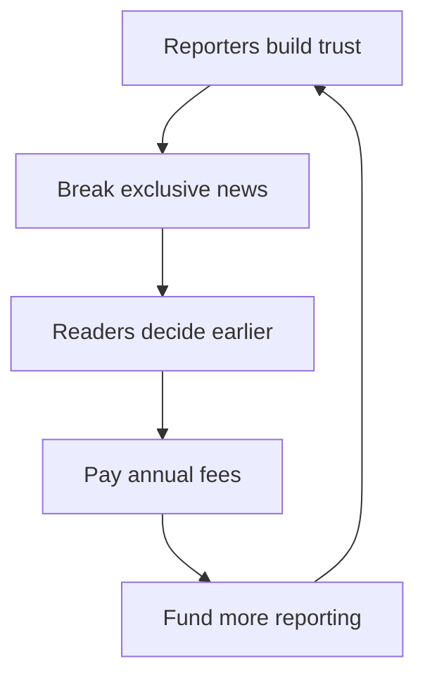

> 🌏 [中文版](/posts/product/2026-09-16-the-information-exclusive-news)

Once a game is over, the final score is free everywhere. The information that can change a decision is knowing, before kickoff, that the star player will sit out—and trusting the report enough to change your lineup.

That time advantage is what [The Information](https://www.theinformation.com/about) sells. Founded in 2013, it is a B2B technology and business publication built around exclusive reporting on major tech companies, venture capital, and finance. It does not need to publish the most stories. Its readers pay to learn something earlier than everyone else and use it in a real decision.

That is also how a relatively small output can command a price above mass-market news. Each valuable story sits close to an expensive choice: an investment, acquisition, hire, competitive move, or corporate risk.

## The Flywheel Starts With Sources

The business begins with reporter relationships. A journalist stays on a beat long enough to know who has real information and to earn their trust. An exclusive story attracts professional readers who can use it. Subscription revenue then funds more reporting.

The company's [About page](https://www.theinformation.com/about) describes the strategy plainly: recruit strong reporters, give them room to pursue important subjects, and tell them not to worry about small stories.

This loop rewards a different editorial question from advertising-funded media. An ad model needs large traffic and repeatedly asks whether a story will draw clicks. A subscription newsroom asks whether a story gives readers a reason to renew.

When the site launched in 2013, Jessica Lessin told [Digiday](https://digiday.com/media/will-readers-pay-to-read-the-information/) that it was designed for professionals accustomed to paying for information that helps them at work. In 2018, she told [Digiday](https://digiday.com/media/the-informations-jessica-lessin-on-five-years-of-subscription-journalism/) that original stories unavailable elsewhere converted readers. Both claims come from the founder, not an independently audited conversion report. They are still useful evidence of how the company designed the product.

## The Paywall Sells Utility, Not Volume

A high paywall narrows the audience, but it also selects customers with a stronger use case. Technology executives, investors, venture capitalists, and consultants do not have to read every story. If one exclusive helps them avoid an expensive mistake, renewing can be rational.

That logic separates Annual, Pro, and corporate plans. The table compares only the Annual, Pro, and corporate plans used in this article, plus one historical Investor plan. The prices appeared on the [official subscription page](https://www.theinformation.com/subscribe) and [Help Center](https://theinformation.zendesk.com/hc/en-us/articles/218741157-Individual-Subscriptions) on September 16, 2026. Promotions and renewal prices can change, so this is a dated snapshot rather than a permanent price list.

| Plan | Public price | Primary value | Best fit |
|---|---:|---|---|
| Annual | $399 for the first year; $499 renewal | All reporting, 8+ newsletters, charts and data, video, apps, community tools, and event benefits | Individual professionals who need exclusive news |
| Pro | $749 for the first year; $999 renewal | Everything in Annual plus Deep Research, company org charts, proprietary databases, and subscriber surveys | Investors, executives, and advisers who need research tools |
| Group / Corporate | Quote based on group size | Seat changes, one invoice and renewal date, and dedicated support | Organizations centralizing procurement and account management |
| Investor (historical, 2016) | $10,000 a year at the time | Group briefings, conference calls, and reporting that had not become articles | A high-priced investor segment in 2016; **not a current public plan** |

The old Investor plan is often cited as proof that The Information can charge $10,000, but it was a 2016 product. Lessin told [Nieman Lab](https://www.niemanlab.org/2016/10/the-informations-jessica-lessin-on-how-shes-scaling-an-already-expensive-subscription-product/) that reporters routinely accumulated information too narrow for the full readership but useful to investors, so the company could package it into briefings. Current offerings should be taken from the official site; Investor and Pro are not interchangeable.

The corporate plan solves procurement friction instead. The [official corporate page](https://www.theinformation.com/corporate) emphasizes one invoice, one renewal date, flexible seat changes, and the ability to expand a team. None of those features makes the journalism more exclusive. They turn one executive's reading habit into something an organization can purchase and administer.

## Exclusive Reporting Is Expensive

Sources do not appear because a reporter sends one email. A beat journalist must understand the companies, work out who knows what, corroborate claims, and absorb the cost of leads that never become stories.

The Information's own hiring materials make that labor visible. A 2026 [venture capital and startups reporter opening](https://ats.rippling.com/theinformation-jobs/jobs/81bbc2d7-c04b-42bd-b3c6-829c0544c5a0) listed a salary range of $120,000 to $200,000, plus bonus and benefits. The role involved breaking funding and fund-performance news, cultivating trusted sources, and turning reporting into products such as org charts. One posting cannot establish company-wide compensation or total newsroom cost. It does show that this is not a low-cost content factory.

In a 2016 [Poynter interview](https://www.poynter.org/tech-tools/2016/the-informations-jessica-lessin-on-building-her-business-putting-subscribers-first-and-the-future-of-media/), Lessin said 60% of the budget went to editorial and that the business was cash-flow positive at the time. Those figures came from the founder and cannot be checked against public financial statements. What the public evidence supports is a deliberate commitment to human reporting—not continuous profitability in every subsequent year.

## One Reporting Process, More Than One Product

The paid article is only the first layer. While covering a company, reporters already collect fragments about executives, investors, funding, competitors, and infrastructure. The Information has organized that reporting exhaust into org charts, proprietary databases, subscriber surveys, events, and Deep Research for Pro customers.

The [official Pro page](https://www.theinformation.com/pro) says these data tools were first built for the newsroom and later shared with subscribers. That shift matters. A news story tells a reader what just happened. A structured product repeatedly answers questions such as how a company is organized or which firms operate in a market. News ages quickly; a maintained dataset is more likely to become part of a workflow.

The value stack now looks like this:

1. Exclusive stories create a time advantage.
2. Org charts and databases turn reporting fragments into structured information.
3. Deep Research queries more than a decade of reporting and data.
4. Events and the member directory connect readers with other professionals.
5. Corporate seats turn personal reading into team procurement.

These are not five unrelated businesses. They share the same expensive upstream input: reporters gathering and verifying information.

## Ownership Buys Patience, Not a Certificate of Quality

The company's [official account](https://www.theinformation.com/about) says Lessin owns the publication and that it has no venture capital or corporate owners. A 2023 [Vanity Fair profile](https://www.vanityfair.com/news/2023/12/the-information-jessica-lessin) also reported that she retained full ownership and started the company with less than $1 million of her own money. The two sources support the equity-ownership claim. They do not prove the absence of debt or every other form of financing.

Nor does founder ownership prove that the journalism is better. As a matter of governance, having no venture fund with an exit deadline can create more room for strategic patience. Reporting quality still depends on journalists, editors, corroboration, and correction practices.

The same caution applies to growth and profit claims. In 2023, Vanity Fair quoted Lessin saying revenue would grow 30% that year and that the company expected to be profitable. The profile also cited 475,000 “active readers,” a number that combined paying subscribers with free newsletter readers. These are founder-supplied figures without audited public statements. Active readers must not be relabeled as paying subscribers.

## AI Can Take the Summary, Not the Source Relationship

AI is both a threat to this model and part of the product.

The immediate threat is substitution after publication. Once an exclusive appears, an answer engine can summarize the central fact in seconds. A reader who only wants the conclusion may never visit the original story. The brand exposure that once came from other publications following an Information scoop may shrink to a small citation.

The upstream work is harder to copy. An AI system can reorganize public text, but it cannot independently maintain years of trust with a venture partner or find a second human source for an undisclosed claim. As long as the paid value depends on getting and verifying information first, the source network matters more than the article format.

The Information has also put AI inside Pro. Its subscription page describes Deep Research as answering questions using more than a decade of the publication's reporting, org charts, and proprietary data. The product accepts that retrieval and synthesis can be automated while keeping the hardest-to-copy corpus behind a paid service.

The company's [Terms of Service](https://www.theinformation.com/terms) prohibit unauthorized scraping, bypassing access controls, and using the service to train machine-learning or AI software. Its corporate page separately offers a contact route for content licensing. This research found no reliable public announcement of an AI licensing agreement with a major model provider and no reliable evidence of an AI-scraping lawsuit by The Information. An invitation to discuss licensing is not evidence of licensing revenue.

## This Is Not a Template Every Publisher Can Copy

The Information's model needs three conditions at once: the news must affect expensive decisions, reporters must obtain material that others do not have, and buyers must have a recurring reason to pay. General-interest content without one of those conditions is unlikely to support the same annual price.

The model has visible weaknesses. Experienced reporters are a fixed cost. When a star journalist leaves, some relationships may leave with them. Once competitors follow an exclusive, its central fact may circulate for free. And because the company is private, outsiders do not have audited subscriber counts, retention, acquisition cost, cohort data, or financial statements needed to calculate how efficiently the flywheel operates.

The useful lesson is the order of operations. Identify information that can change an expensive decision, invest in the ability to obtain it, and only then create differentiated layers of reporting, data, and tools. A paywall without scarce information still protects a substitute for free news.

## References

- [The Information: About Us](https://www.theinformation.com/about)
- [The Information: Subscription plans](https://www.theinformation.com/subscribe)
- [The Information Help Center: Individual Subscriptions](https://theinformation.zendesk.com/hc/en-us/articles/218741157-Individual-Subscriptions)
- [The Information: Corporate Subscriptions](https://www.theinformation.com/corporate)
- [The Information Pro](https://www.theinformation.com/pro)
- [The Information: Terms of Service](https://www.theinformation.com/terms)
- [Nieman Lab: Scaling an Already-Expensive Subscription Product](https://www.niemanlab.org/2016/10/the-informations-jessica-lessin-on-how-shes-scaling-an-already-expensive-subscription-product/)
- [Poynter: Jessica Lessin on Building Her Business and Putting Subscribers First](https://www.poynter.org/tech-tools/2016/the-informations-jessica-lessin-on-building-her-business-putting-subscribers-first-and-the-future-of-media/)
- [Digiday: Why a New Tech News Site Spurns Ads for Subscriptions](https://digiday.com/media/will-readers-pay-to-read-the-information/)
- [Digiday: Five Years of Subscription Journalism](https://digiday.com/media/the-informations-jessica-lessin-on-five-years-of-subscription-journalism/)
- [Vanity Fair: How The Information Has Survived a Decade of Media Tumult](https://www.vanityfair.com/news/2023/12/the-information-jessica-lessin)
- [The Information: Reporter, Venture Capital and Startups](https://ats.rippling.com/theinformation-jobs/jobs/81bbc2d7-c04b-42bd-b3c6-829c0544c5a0)
