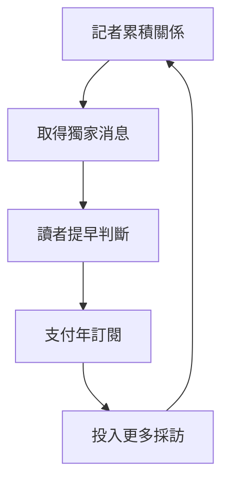

> 🌏 [English version](/en/posts/product/2026-09-16-the-information-exclusive-news-en)

球賽結束後，比數到處都看得到。真正能改變決策的，是比賽開始前就知道主力不會上場，而且消息可靠到讓你敢重新排陣容。

[The Information](https://www.theinformation.com/about) 賣的就是這種時間差。它是一家 2013 年創辦的 B2B 科技商業媒體，專門追大型科技公司、創投與金融圈的獨家消息。文章不求多，讀者付錢買的是「比別人早知道，而且能拿來做決定」。

這也解釋了它為什麼能把年費訂在大眾媒體之上。少量內容要賣得貴，前提是每一則消息都靠近昂貴的決策：投資、併購、招募、競爭策略，或公司風險。

## 先看飛輪：消息源才是起點

The Information 的生意從記者關係開始。記者長期跑同一條線，認識願意透露內部狀況的人；搶到獨家後，專業讀者因為消息有用而訂閱；訂閱收入再投入採訪團隊。它的[官方 About 頁](https://www.theinformation.com/about)把競爭方式說得很直白：找最好的記者，讓他們追重要題目，不必分心處理小事。

這個循環跟靠廣告的免費媒體不同。廣告模式需要大量瀏覽，編輯會一直面對「這篇能不能帶流量」；訂閱模式則每天面對另一題：「這篇值不值得續訂？」

創辦人 Jessica Lessin 在 2013 年上線時就向 [Digiday](https://digiday.com/media/will-readers-pay-to-read-the-information/) 說，目標讀者是習慣為工作情報付費的專業人士。到了 2018 年，她又對 [Digiday](https://digiday.com/media/the-informations-jessica-lessin-on-five-years-of-subscription-journalism/) 表示，能帶來轉換的是別處找不到的原創報導。這些都是創辦人自述，不能當成經外部查核的轉換率；它們至少清楚說明公司怎麼設計產品。

## 付費牆賣的是可用性，不是篇數

高價付費牆會縮小讀者群，卻也幫 The Information 找到更適合的客戶。科技公司主管、創投、投資人與顧問不一定每天讀完所有文章；只要其中一則消息讓他們少犯一次昂貴的錯，訂閱就有理由留下。

這也是 Annual、Pro 與企業方案的差別。依[官方訂閱頁](https://www.theinformation.com/subscribe)與 [Help Center](https://theinformation.zendesk.com/hc/en-us/articles/218741157-Individual-Subscriptions)，下表只比較本文會用到的 Annual、Pro、企業方案，以及一個歷史 Investor 方案。價格是 2026 年 9 月 16 日的快照；促銷和續訂價格可能調整，不能把它當永久價目表。

| 方案 | 公開價格 | 買到的主要價值 | 適合誰 |
|---|---:|---|---|
| Annual | 首期 399 美元／年；續訂 499 美元 | 全部報導、8 種以上電子報、圖表資料庫、影音、App、社群與活動權益 | 需要獨家新聞的個人專業讀者 |
| Pro | 首期 749 美元／年；續訂 999 美元 | Annual 全部內容，加上 Deep Research、公司組織圖、專有資料庫、讀者調查 | 需要研究工具的投資人、主管與顧問 |
| Group / Corporate | 依人數報價，未公開定價 | 彈性換席、統一帳單與續訂日、專責支援 | 要集中採購與管理帳號的組織 |
| Investor（2016 歷史方案） | 當時每年 10,000 美元 | 集體簡報、電話會議與記者尚未寫成文章的情報 | 當年的高價投資人客群；**不是現行公開方案** |

Investor 方案常被拿來證明 The Information 可以賣到一萬美元，但那是 2016 年的產品。當時 Lessin 向 [Nieman Lab](https://www.niemanlab.org/2016/10/the-informations-jessica-lessin-on-how-shes-scaling-an-already-expensive-subscription-product/) 說，記者平常就會累積許多未必適合寫成大眾文章、卻對投資人有用的材料，因此能再包成簡報。現行方案應以官網為準，不該把 Investor 和 Pro 混在一起。

企業方案處理的則是採購摩擦。[官方 corporate 頁](https://www.theinformation.com/corporate)列出的重點包括統一帳單、共同續訂日、彈性換人與增加席次。這些功能不會讓新聞變得更獨家，卻能讓「某位主管想看」變成「整個團隊能採購」。

## 獨家採訪為什麼昂貴

消息源不會因為記者寄出一封信就出現。記者要長期理解公司、辨認誰知道什麼、交叉查證，還得承受搶不到新聞的時間成本。

The Information 的職缺也看得出這個成本。2026 年一則[創投與新創記者職缺](https://ats.rippling.com/theinformation-jobs/jobs/81bbc2d7-c04b-42bd-b3c6-829c0544c5a0)開出年薪 12 萬到 20 萬美元，另有獎金與福利。工作內容包括追融資、基金績效、領導層異動，持續培養消息源，並把採訪成果做成組織圖等產品。單一職缺不能代表全體薪資，更不能直接算出新聞部成本，但足以說明這不是低成本的內容工廠。

2016 年，Lessin 對 [Poynter](https://www.poynter.org/tech-tools/2016/the-informations-jessica-lessin-on-building-her-business-putting-subscribers-first-and-the-future-of-media/) 表示，當時有六成預算用在編輯採訪。同一場訪談裡，她也稱公司現金流為正。這兩個數字都來自創辦人，沒有公開財報可供核對；文章能確定的是公司選擇把固定成本放在人，而不是證明它每一年都獲利。

## 一次採訪，做成不只一篇文章

付費文章只是第一層。記者追公司時，本來就會整理高階主管、投資人、融資、競爭者與資料中心等零碎資訊。The Information 把這些副產品整理成公司組織圖、專有資料庫、讀者調查、活動，以及 Pro 的 Deep Research。

[官方 Pro 頁](https://www.theinformation.com/pro)說，這些資料工具原先是為新聞部自己打造，後來才開放給訂戶。這個轉換很重要：文章用時間順序告訴你「剛剛發生什麼」，資料產品則讓客戶反覆查「這家公司怎麼組織」「這個市場有哪些玩家」。前者容易被下一則新聞蓋過，後者比較容易進入工作流程。

產品價值因此一層層往上疊：

1. 獨家文章提供時間差。
2. 組織圖與資料庫把零散採訪變成可查詢的結構。
3. Deep Research 用十年以上的報導與資料回答問題。
4. 活動與 Directory 讓讀者接觸其他專業人士。
5. 企業席次把個人閱讀習慣變成團隊採購。

這不是五份互不相關的產品。它們共用同一個昂貴的上游：記者採訪與查證。

## 所有權給的是耐心，不是品質證書

The Information 的[官方說法](https://www.theinformation.com/about)是沒有創投或企業股東，由 Lessin 持有。Vanity Fair 在 2023 年的[十週年專訪](https://www.vanityfair.com/news/2023/12/the-information-jessica-lessin)也報導她維持全資持有，創辦時投入自己的錢，金額低於 100 萬美元。這能交叉支持公司的所有權結構，卻不能證明它沒有債務或其他非股權融資。

更不能從「沒有外部投資」直接推論「新聞一定比較好」。從治理結構來看，沒有創投退出期限，可能讓公司更有空間把時間留給採訪與續訂；報導是否可靠，仍要看記者、編輯、查證與更正機制。

獲利與規模也要保守寫。Vanity Fair 2023 年引述 Lessin 表示，公司當年營收預計成長三成，並預期會獲利。同一篇報導的 47.5 萬名 active readers 同時包含付費訂戶與免費電子報讀者。這些是創辦人提供的數字，沒有經查核財報，active readers 也不能改寫成付費訂戶。

## AI 拿得走摘要，拿不到消息源

AI 對這套模式同時是威脅和產品。

威脅很直接：一則獨家發表後，答案引擎可以迅速摘要核心事實。讀者若只想知道結論，可能不再點回原文；過去由其他媒體跟進所帶來的品牌曝光，也可能被縮成一個不起眼的引用。

較難取代的是上游。AI 可以整理已經公開的文字，卻不會自己和一位創投合夥人建立多年信任，也不能替一則未公開消息找到第二個來源。付費價值若仍建立在「先拿到、查清楚」，消息源就比文章格式更重要。

The Information 也把 AI 放進 Pro。官方訂閱頁把 Deep Research 定位成用十年以上報導、組織圖與專有資料回答問題。這等於承認檢索與整理可以自動化，同時把最難複製的自有資料留在付費產品裡。

它的[服務條款](https://www.theinformation.com/terms)禁止未授權抓取、繞過存取限制，以及用服務訓練機器學習或 AI 程式；corporate 頁另有內容授權洽談入口。本次查證沒有找到 The Information 公開宣布與大型 AI 公司簽署內容授權，也沒有找到它針對 AI 抓取提告的可靠證據。因此，「提供授權洽談」不能改寫成「已經有 AI 授權收入」。

## 這個模式不是所有媒體都能抄

The Information 的做法成立，需要三個條件同時存在：消息能影響高價決策、記者真的能取得別人沒有的材料、買方有持續付費的理由。一般興趣內容少了其中一項，就很難照著收每年數百美元。

它也有明顯限制。資深採訪是固定成本；明星記者離職會帶走部分關係；獨家被其他媒體跟進後，核心事實可能很快免費流通。私人公司又沒有公開訂戶、續訂率、客戶取得成本與經查核財報，外界無法精算這個飛輪轉得多順。

真正值得參考的是它的順序。先找到能改變昂貴決策的資訊，再投資取得資訊的能力，最後才把文章、資料與工具分層定價。若只有付費牆、沒有稀缺情報，牆後面仍然只是免費新聞的替代品。

## 參考資料

- [The Information：About Us](https://www.theinformation.com/about)
- [The Information：訂閱方案](https://www.theinformation.com/subscribe)
- [The Information Help Center：Individual Subscriptions](https://theinformation.zendesk.com/hc/en-us/articles/218741157-Individual-Subscriptions)
- [The Information：Corporate Subscriptions](https://www.theinformation.com/corporate)
- [The Information Pro](https://www.theinformation.com/pro)
- [The Information：Terms of Service](https://www.theinformation.com/terms)
- [Nieman Lab：The Information 如何擴張高價訂閱產品](https://www.niemanlab.org/2016/10/the-informations-jessica-lessin-on-how-shes-scaling-an-already-expensive-subscription-product/)
- [Poynter：Jessica Lessin 談訂戶優先的媒體生意](https://www.poynter.org/tech-tools/2016/the-informations-jessica-lessin-on-building-her-business-putting-subscribers-first-and-the-future-of-media/)
- [Digiday：The Information 為什麼用訂閱取代廣告](https://digiday.com/media/will-readers-pay-to-read-the-information/)
- [Digiday：五年的訂閱新聞實驗](https://digiday.com/media/the-informations-jessica-lessin-on-five-years-of-subscription-journalism/)
- [Vanity Fair：The Information 十週年專訪](https://www.vanityfair.com/news/2023/12/the-information-jessica-lessin)
- [The Information：創投與新創記者職缺](https://ats.rippling.com/theinformation-jobs/jobs/81bbc2d7-c04b-42bd-b3c6-829c0544c5a0)
