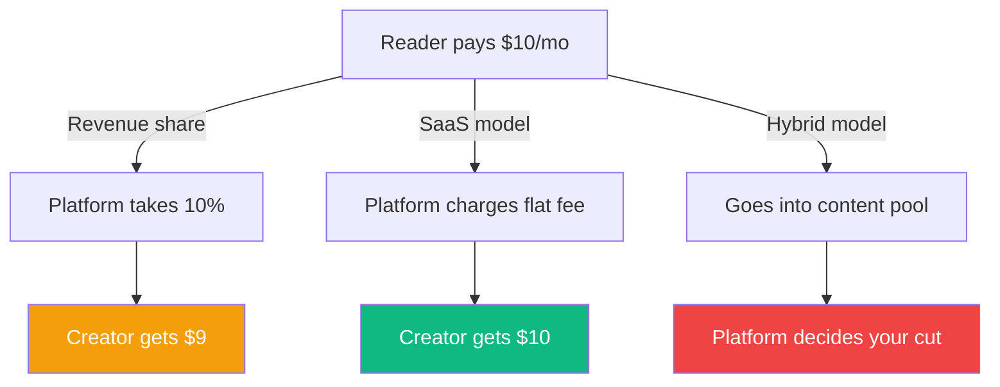
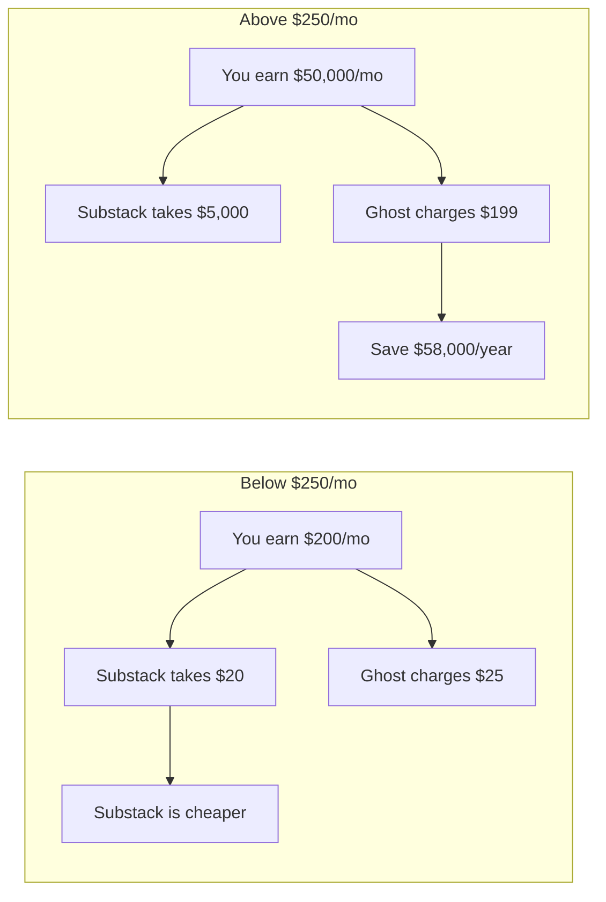
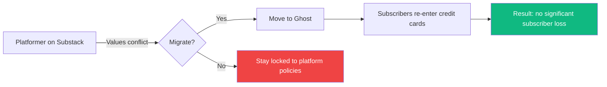
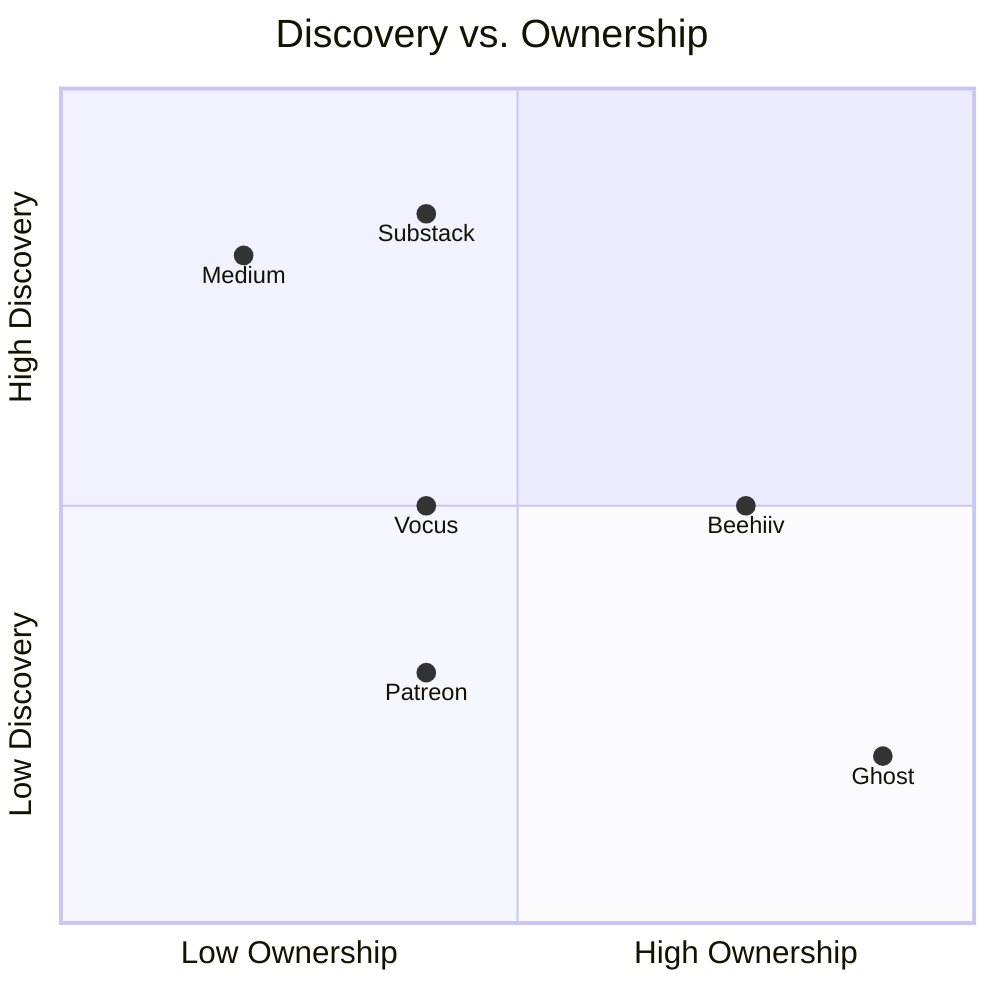
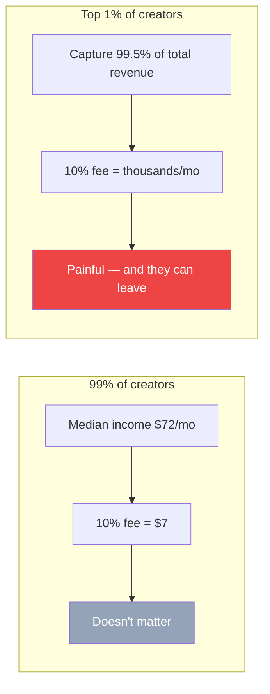
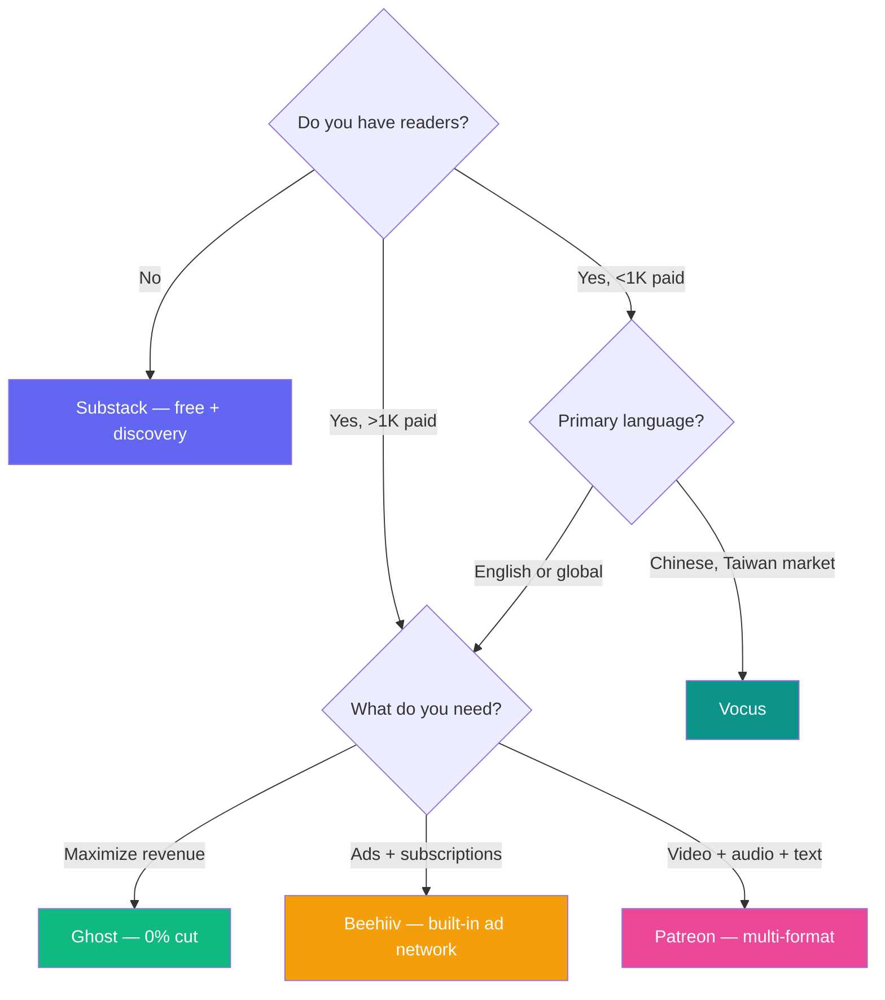

> 🌏 [中文版](/posts/product/2026-09-16-ugc-platform-creator-economy)

The creator economy has a question most people don't think through at the start: the platform you choose determines your business model.

Write on [Substack](https://substack.com/) and you give up 10% of every subscription dollar. Write the same thing on [Ghost](https://ghost.org/) and you keep 100% — but you pay a fixed monthly fee. At 100 subscribers the difference is trivial. At 10,000, you're looking at tens of thousands of dollars a year.

This is not a detail. It's a structural choice. And once you've accumulated readers, branding, and workflows, migration costs are brutal.

---

## Revenue Share vs. SaaS: Two Platform Philosophies

Creator content platforms charge in fundamentally two ways:

**Revenue share**: the platform takes a percentage of every subscription payment. Substack takes 10%. [Patreon](https://www.patreon.com/) takes 10% (unified flat rate for new creators since August 2025). [Vocus](https://vocus.cc/), Taiwan's largest text creator platform, takes 20% plus 2.25% payment processing. The platform's incentives align with yours — it earns more when you earn more. But the flip side: the better you do, the more you pay.

**SaaS fee**: the platform charges a fixed monthly fee regardless of how much you earn. Ghost Pro costs $9 to $199 per month. [Beehiiv](https://www.beehiiv.com/) starts at $39 per month on its Scale plan. Your subscription revenue stays 100% yours. The platform's risk: if creators don't grow, flat fees don't generate much revenue.

**Hybrid model**: [Medium](https://medium.com/) chose a third path. Readers pay $5/month into a shared content pool. The platform distributes membership fees to writers based on engagement metrics. Creators control neither pricing nor the revenue-sharing formula.

### Where the breakeven falls

Compare Substack (10% revenue share) with Ghost Pro Starter ($25/month). The breakeven is $250 in monthly revenue. Below that, Substack is cheaper. Above that, every additional dollar goes straight to you on Ghost.

A creator with 5,000 paid subscribers at $10/month earns $50,000/month. On Substack, $5,000 goes to the platform each month. On Ghost, the fee caps at $199. That's roughly $58,000 a year in the difference.

At 100 subscribers, this math doesn't matter. By year three, it's the single biggest line item in your operating costs.

---

## Six Platforms, Six Business Models

### Substack: Discovery in Exchange for Revenue Share

Substack launched in 2017 on a simple pitch: let writers make a living from writing. By 2026, the platform hosts over 50 million subscriptions with creator GMV exceeding $450 million. Valuation sits at roughly $1.1 billion.

Substack's real asset isn't technology — email sending systems aren't complex — it's **discovery**. Built-in recommendation algorithms, Notes (a social feature resembling X/Twitter), and leaderboards help new writers get found. For someone starting from zero with no existing audience, that value is hard to measure in percentage points.

The cost is twofold. First, 10% becomes expensive at scale. Second, the subscriber relationship lives on Substack's infrastructure. You can export your email list, but readers' payment relationships, reading habits, and engagement history stay on the platform. Migrating means asking every paying reader to re-enter their credit card.

In late 2023, tech policy journalist Casey Newton moved his publication [Platformer](https://www.platformer.news/) from Substack to Ghost, citing Substack's permissive stance on hate speech. The move itself was small. Its ripple effects revealed a structural tension: you only discover how dependent you are on a platform when its values conflict with your brand.

### Vocus: Taiwan's Creator Home Turf

[Vocus](https://vocus.cc/) is Taiwan's largest text creator platform, positioned as a Traditional Chinese Substack — though with a different economic model. Its take rate is higher (roughly 22% after payment processing), but it offers what few alternatives can in Taiwan: concentrated local traffic and integrated local payment options including convenience store payments and domestic credit cards.

Vocus recently expanded into digital product sales, giving creators a revenue stream beyond subscriptions. In Taiwan, its competitor is not Substack or Ghost (language and payment barriers are too high) but [PressPlay Academy](https://www.pressplay.cc/) — a course subscription platform that acquired YOTTA in October 2025, further consolidating Taiwan's online learning market.

Taiwanese creators face a different decision tree: Vocus for ongoing writing, PressPlay for structured educational content.

### Ghost: Open Source, Zero Cut, Full Control

Ghost is an open-source newsletter and membership platform. Zero percent transaction fee — your subscription revenue is entirely yours. The platform earns through Ghost Pro ($9–$199/month managed hosting), though you can self-host for free.

Ghost has processed over $100 million in creator revenue to date. Its economic model is strongest in the mid-to-high income range: once your monthly revenue exceeds roughly $500, the fixed fee becomes negligible compared to a 10% cut.

Ghost's weakness is discovery. No built-in recommendation system, no social features — your readers have to find you through external channels. This makes it unsuitable for beginners starting from scratch, but ideal for mature creators with a loyal audience who want to maximize every dollar. After Casey Newton's migration, Platformer's subscriber count showed no significant decline, suggesting that when reader loyalty is high enough, platform switching costs are smaller than assumed.

### Medium: Zero-Sum in the Content Pool

Medium operates differently from the others. Readers pay $5/month to access a shared content pool, not a specific writer. The platform distributes membership fees based on engagement metrics like reading time.

The problem is transparency. Writers don't know exactly how much an article is worth, nor whether the payout formula will change — and Medium has adjusted it multiple times, triggering waves of departures each time. This has turned Medium into a discovery platform rather than a monetization platform: you write there to be found and to funnel readers elsewhere, not to earn directly.

Medium still commands massive SEO traffic value. But as a primary monetization platform, it's losing mindshare among serious creators.

### Patreon: From "Support Me" to Commerce Platform

[Patreon](https://www.patreon.com/) started as a platform for YouTubers and podcasters to receive fan support. Over $2 billion flows through the platform annually.

In August 2025, Patreon unified the fee for new creators at a flat 10% (legacy accounts keep their existing rates). It's simultaneously phasing out per-creation billing in favor of monthly subscriptions, and expanding into physical and digital product sales. The direction is clear: Patreon wants to evolve from a patronage platform into a full creator commerce platform.

Patreon's moat is multi-format support — text, video, audio, and images on a single page. But its weakness mirrors Substack's: the payment relationship lives on Patreon's infrastructure.

### Beehiiv: SaaS Plus an Ad Network

Beehiiv is the fastest-growing Substack challenger, reaching $30 million in ARR by 2026. Its strategy is straightforward: no revenue share on subscriptions, fixed SaaS monthly fee instead. On the Scale plan and above, 100% of your paid subscription revenue is yours.

Beehiiv's real differentiator is its built-in ad network. Creators can insert Beehiiv-matched ads into their newsletters, adding an entirely separate revenue stream. This gives it a structural advantage over both Substack and Ghost in the "free newsletter + ad revenue" model.

[Kit](https://kit.com/) (formerly ConvertKit) follows a similar SaaS approach, though a controversial 120% price hike in September 2025 drove significant user backlash. Its advantage is a free tier supporting up to 10,000 subscribers, making it attractive for early-stage creators.

---

## Side-by-Side Comparison

| Platform | Fee Model | Creator Take | Scale | Discovery | Ownership | AI Features |
|---|---|---|---|---|---|---|
| [Substack](https://substack.com/) | 10% rev share | ~90% | 50M subscriptions | Strong (recs + Notes) | Medium (email export) | None |
| [Vocus](https://vocus.cc/) | ~22% rev share | ~78% | Largest in Taiwan | Medium (on-site traffic) | Medium | None |
| [Ghost](https://ghost.org/) | SaaS $9–199/mo | 100% | $100M+ creator rev | Weak (no recs) | Strong (self-host) | None |
| [Medium](https://medium.com/) | Pooled payout | Opaque | Massive SEO traffic | Strong (algorithm) | Weak (platform control) | Limited |
| [Patreon](https://www.patreon.com/) | 10% rev share | ~90% | $2B+/yr payouts | Weak | Medium | None |
| [Beehiiv](https://www.beehiiv.com/) | SaaS $0–99/mo | 100% | $30M ARR | Medium (ad network) | Strong | Limited |

---

### Discovery vs. Ownership: Pick One

The top-right quadrant — high discovery plus high ownership — is ideal, but no platform occupies it today. Substack and Medium use algorithms to help you get found; the price is that your reader relationships and data stay on their infrastructure. Ghost gives you full control, but your readers have to find you on their own.

---

## Three Structural Observations

### Power Laws Are Everywhere

[Gumroad](https://gumroad.com/)'s data is the starkest: the median creator earns $72 per month, while the top 1% captures 99.5% of total revenue. This isn't a Gumroad problem — it's a universal truth across every creator platform.

This means most creators will never hit the point where "10% is too expensive," because their income never makes the fee rate feel material. The people who actually care about fee structures are the 1% who've already succeeded — and they're also the ones with the leverage to move.

### AI Absence Is the Biggest Unfilled Gap

Across all six platforms, none has made a meaningful investment in AI-assisted creation. No AI drafting. No AI-powered A/B testing for subject lines. No AI analysis showing which paragraphs lose readers.

This is counterintuitive: creators' scarcest resource is time and output capacity — exactly what AI can help with. The first platform to nail AI writing assistance at the platform level will have a structural advantage.

### Taiwan's Ecosystem Is Uniquely Constrained

Taiwanese creators' platform choices are limited by language and payment infrastructure. Substack and Ghost theoretically work, but discovery for Traditional Chinese content is near zero, and local payment methods (convenience store payments, domestic cards) aren't always supported.

This gives Vocus and PressPlay a natural moat in Taiwan — not because their products are superior, but because alternatives have poor local adaptation. This also means the moat could collapse overnight if Substack or Beehiiv ever invest seriously in Asian localization.

---

## A Decision Framework for Creators

Different stages need different things:

| Your Stage | Recommendation | Reasoning |
|---|---|---|
| Starting out, no audience | Substack | Free, strongest discovery. 10% doesn't hurt when revenue is low |
| Growing, 1K–10K subscribers | Evaluate Ghost or Beehiiv | Revenue becomes meaningful, fee gap widens |
| Mature, 10K+ subscribers | Ghost (full control) or Beehiiv (ad upside) | Save tens of thousands per year |
| Taiwan market, Chinese content | Vocus | Only practical option for local payments and traffic |
| Course and educational content | PressPlay Academy | Taiwan's concentrated online learning audience |
| Multi-format (video + audio + text) | Patreon | Only platform with native multi-format subscription support |

One principle above all: **export and back up your subscriber email list from day one.** No matter which platform you use, the email list is the only asset you truly own. Platforms change rules, raise prices, and shut down. Your reader list doesn't.

---

This is the third post in the "[Content Selling Business Models](/posts/product/2026-09-16-content-selling-four-models)" series. The first post covers the business logic of [B2B industry intelligence](/posts/product/2026-09-16-b2b-intelligence-business). The fourth post examines financial information platforms that give content away free and monetize through tools, ads, or transactions. For the individual paid newsletter model, see the existing "[One-Person Media Company](/posts/career/2026-08-26-one-person-media-company-overview)" series.

## References

- [Substack](https://substack.com/) — Creator newsletter platform, 10% revenue share
- [Ghost](https://ghost.org/) — Open-source newsletter and membership platform, 0% transaction fee
- [Vocus](https://vocus.cc/) — Taiwan's largest text creator platform (in Chinese)
- [Medium](https://medium.com/) — Content pool membership platform
- [Patreon](https://www.patreon.com/) — Creator membership and commerce platform
- [Beehiiv](https://www.beehiiv.com/) — SaaS newsletter platform, $30M ARR
- [Kit (formerly ConvertKit)](https://kit.com/) — Email marketing turned creator platform
- [PressPlay Academy](https://www.pressplay.cc/) — Taiwan subscription learning platform, acquired YOTTA October 2025 (in Chinese)
- [Platformer](https://www.platformer.news/) — Casey Newton's tech policy newsletter, a notable Substack-to-Ghost migration case study
- [One-Person Media Company](/posts/career/2026-08-26-one-person-media-company-overview) — In-site series: ten newsletter business case studies and four monetization paths (in Chinese)
