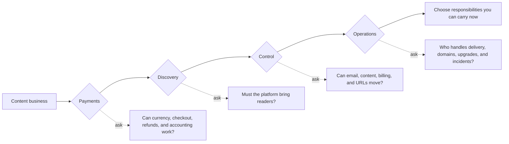
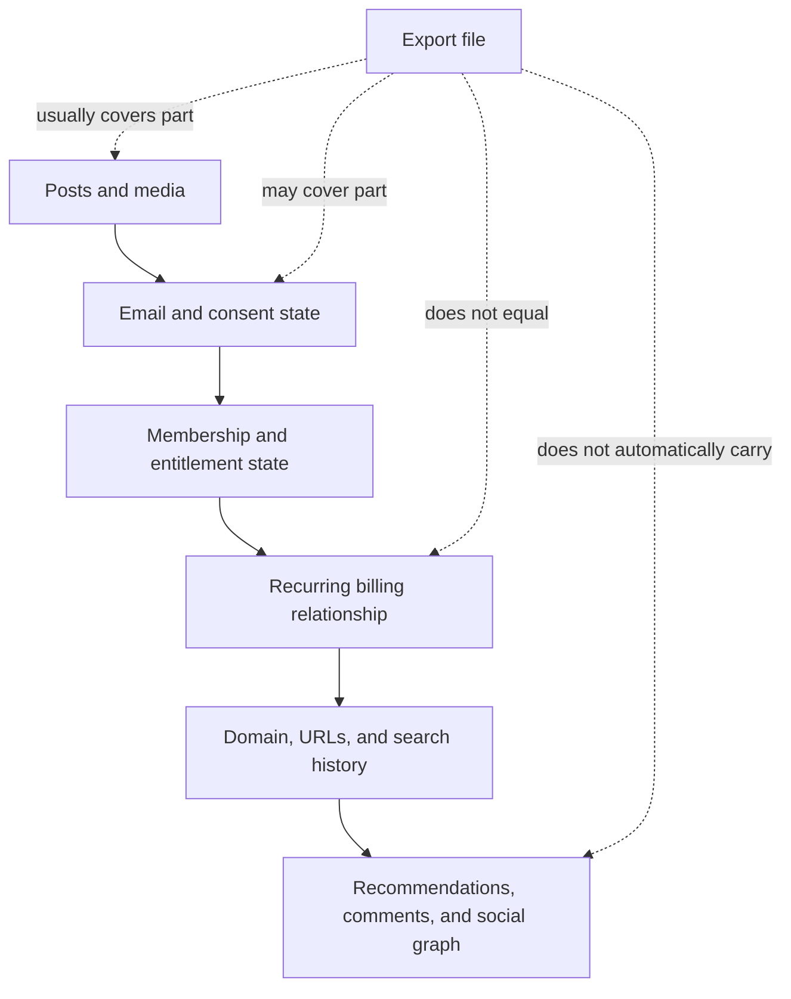
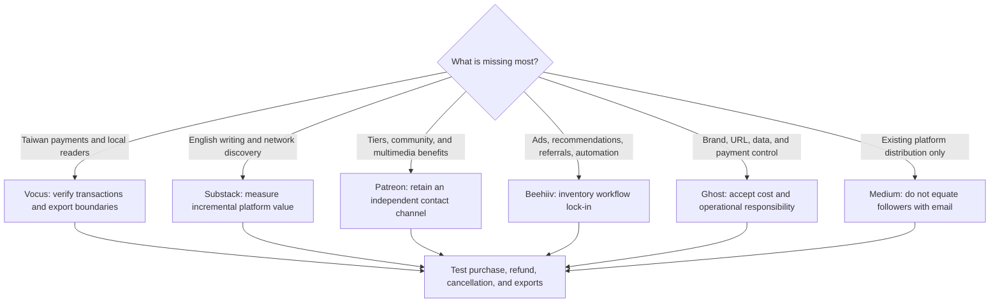

> 🌏 [中文版](/posts/product/2026-09-16-ugc-platform-creator-economy)

Think of creator platforms as three places to run a business.

A night market already has foot traffic, so a vendor can open quickly, but the market controls the location, checkout, and rules. A department-store counter adds membership, promotion, and customer service while tying the vendor more deeply into the store's systems. An independent shop controls its address, customer book, and register—and must bring in customers, maintain the property, and handle failures.

Substack, Medium, Vocus, and Patreon resemble markets or department stores. Self-hosted Ghost is closer to an independent shop. Beehiiv and Ghost(Pro) resemble independent storefronts with more utilities managed for you. This analogy maps responsibilities; it is not a quality ranking. The answer can change as one creator's business changes.

## Pass four gates before comparing features

Platform comparisons often collapse into “revenue share versus monthly fee.” The decision has at least four gates:

- **Payments:** Enabling paid subscriptions does not prove that a service fits your entity, buyers, or accounting workflow. Legal and tax treatment still requires current, situation-specific advice.
- **Discovery:** Recommendations, search, social feeds, and ad networks offer traffic opportunities, not guaranteed revenue. Platform attribution is not every publisher's incremental gain.
- **Control:** Viewing members, exporting a CSV, holding email consent, and moving recurring billing are four different capabilities.
- **Operations:** More control usually brings more responsibility for deliverability, domains, themes, integrations, and failures.

## Six platforms exchange different responsibilities

This table includes only differences supported by public documentation and useful for choosing. A documented export is not proof of complete portability.

| Platform | Payments and monetization | Discovery | Confirmed portable pieces | Platform-bound or rebuilt pieces | Operations |
|---|---|---|---|---|---|
| [Medium](/en/posts/product/2026-09-17-medium-vocus-platform-distribution-en) | Pooled member payouts; writers do not set each reader's price | Recommendations, topics, Digests, Boost | Account content archive; older email lists available to writers | New email subscribers' addresses are not shared; followers and distribution do not move | Platform |
| [Vocus](/en/posts/product/2026-09-17-medium-vocus-platform-distribution-en) | TWD payments, invoices, payouts, and member operations | Taiwan-focused site, app, and email distribution | Official documentation confirms order-detail CSV export | No public official evidence found for complete post, member-email, or recurring-payment migration | Platform |
| [Substack](/en/posts/product/2026-09-17-substack-ten-percent-discovery-en) | 10% platform fee on paid-subscription revenue, plus payment processing | Recommendations, Notes, and its network | Posts, subscriber list, and related statistics | Recommendation traffic stays; billing portability depends on Stripe and the migration path | Platform |
| [Patreon](/en/posts/product/2026-09-17-patreon-membership-value-ladder-en) | Membership tiers, commerce, and community; new-creator pricing follows official effective-date rules | Free membership, Explore, and recommendations | Relationship Manager and some email data | Recurring authorization, comments, chats, and recommendation graph do not move as a CSV | Platform |
| [Ghost](/en/posts/product/2026-09-17-ghost-ownership-not-just-hosting-en) | Connects the publisher's Stripe; 0% Ghost transaction fee, but Stripe, hosting, or self-hosting still cost money | Recommendations and Webmention; Ghost 6 adds ActivityPub | Site content, member data, and the publisher's Stripe relationship sit closer to publisher control | Traffic, deliverability reputation, and self-hosting work do not solve themselves | Managed or self-hosted |
| [Beehiiv](/en/posts/product/2026-09-17-beehiiv-newsletter-operating-system-en) | Tiered SaaS combining paid subscriptions, advertising, and Boosts | Recommendations, Referral, and Ad Network | Official export paths cover posts and subscriber data | Recommendation relationships, ad workflows, automation, analytics, and payment tokens are not fully portable by implication | SaaS platform |

There is deliberately no “best” column. Vocus's local operations, Substack's network, Patreon's membership ladder, Beehiiv's growth workflows, and Ghost's control solve different problems.

## Ownership is six asset layers, not a switch

An Export button proves only that a platform handed over certain files. A creator actually operates six asset layers:

A Medium follower is not an exportable email address. A Vocus order-detail export does not prove complete member-email or recurring-payment portability. Even when Substack, Patreon, or Beehiiv exports content or contacts, that does not imply that recommendations, interactions, and payment authorization move intact. Use the [six-layer migration checklist](/en/posts/product/2026-09-17-creator-platform-migration-assets-en) to test each layer.

## AI changes workflows and distribution, not the winner by default

The earlier version described these services as largely absent from AI. That is no longer defensible. Beehiiv has added AI, MCP, and Agent capabilities to its operating product. Medium's AI-content policy also affects whether writing receives general distribution or monetization. Every platform faces some combination of cheaper content supply, quality governance, and AI search absorbing external clicks.

None of that proves that the platform with more AI features grows faster, or that revenue or valuation changed because of AI. Ask narrower questions: Does AI assist drafting, segmentation, analysis, or automation? Can a human review its output? Which data and workflows become harder to move?

## Choose responsibilities by scenario, not brands by leaderboard

For a Taiwan-based content business, the [Taiwan creator-platform guide](/en/posts/product/2026-09-17-taiwan-creator-platform-choice-en) turns these gates into a checklist. Do not move the whole audience first. Use test accounts to run a subscription, refund, cancellation, content export, and contact export, then inspect whether the resulting fields can enter the next system.

## Seven case studies, organized by question

1. [Medium and Vocus: what platform distribution costs](/en/posts/product/2026-09-17-medium-vocus-platform-distribution-en)
2. [Substack: whether the 10% is worth it](/en/posts/product/2026-09-17-substack-ten-percent-discovery-en)
3. [Patreon: free entry, paid tiers, and migration costs](/en/posts/product/2026-09-17-patreon-membership-value-ladder-en)
4. [Ghost: domains, members, Stripe, and the right to exit](/en/posts/product/2026-09-17-ghost-ownership-not-just-hosting-en)
5. [Beehiiv: recommendations, ads, and growth workflows](/en/posts/product/2026-09-17-beehiiv-newsletter-operating-system-en)
6. [What actually moves: a six-layer migration checklist](/en/posts/product/2026-09-17-creator-platform-migration-assets-en)
7. [How Taiwan creators can choose platform, SaaS, or self-hosting](/en/posts/product/2026-09-17-taiwan-creator-platform-choice-en)

This remains the third post in the [Content Selling Business Models](/en/posts/product/2026-09-16-content-selling-four-models-en) series. The update turns the original comparison into the entry point for the seven-part “Who Controls the Creator-Reader Relationship” extension. For individual paid-newsletter case studies, see [One-Person Media Company](/en/posts/career/2026-08-26-one-person-media-company-overview-en).

## Update log

- 2026-09-17: Rebuilt the comparison around current official documentation, corrected the Ghost, Beehiiv, Medium, and Vocus capability and export boundaries, and linked all seven extended case studies.

## References

- [Medium: Email notifications](https://help.medium.com/hc/en-us/articles/360059837393-Email-notifications) — boundaries for new subscribers and older email lists
- [Vocus: managing members and orders](https://vocus.cc/help_center/TnC9HOz4dEujYDlmdPTg) — order-data export (Chinese)
- [Substack: exporting posts](https://support.substack.com/hc/en-us/articles/360037466012-How-do-I-export-my-posts) and [exporting an email list](https://support.substack.com/hc/en-us/articles/6314498343700-How-do-I-export-my-email-list-on-Substack)
- [Patreon: Relationship Manager](https://support.patreon.com/hc/en-us/articles/360045516212-How-to-use-your-Relationship-manager) — filtering and exporting member data
- [Ghost: transaction fees](https://ghost.org/help/are-there-really-no-transaction-fees/) — 0% Ghost transaction fee and Stripe charges
- [Ghost 6.0](https://ghost.org/changelog/6/) — ActivityPub and social-web features
- [Beehiiv: exporting posts and subscriber data](https://www.beehiiv.com/support/article/12258595483543-exporting-post-content-or-subscriber-data-from-beehiiv)
