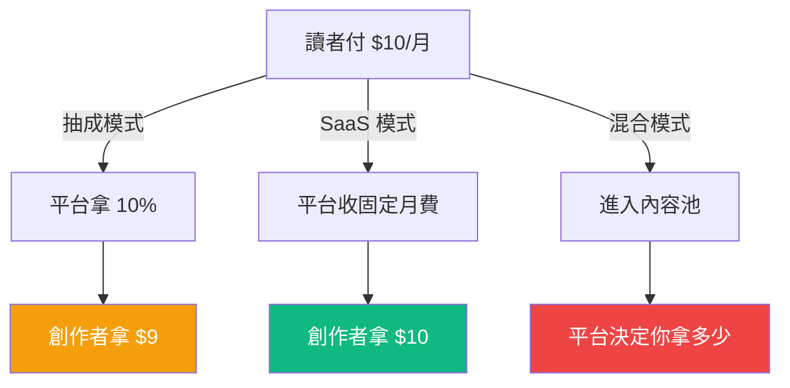
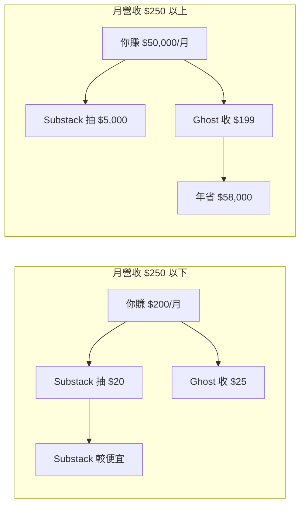
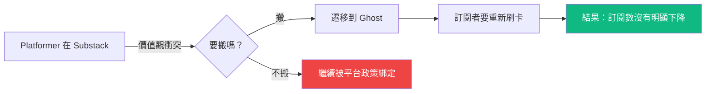
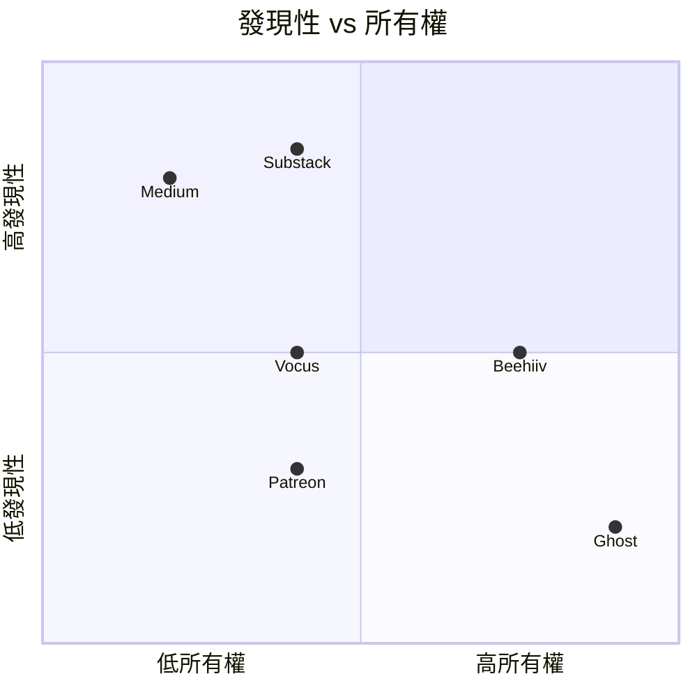
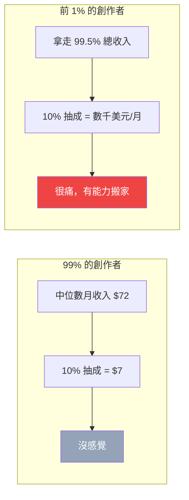
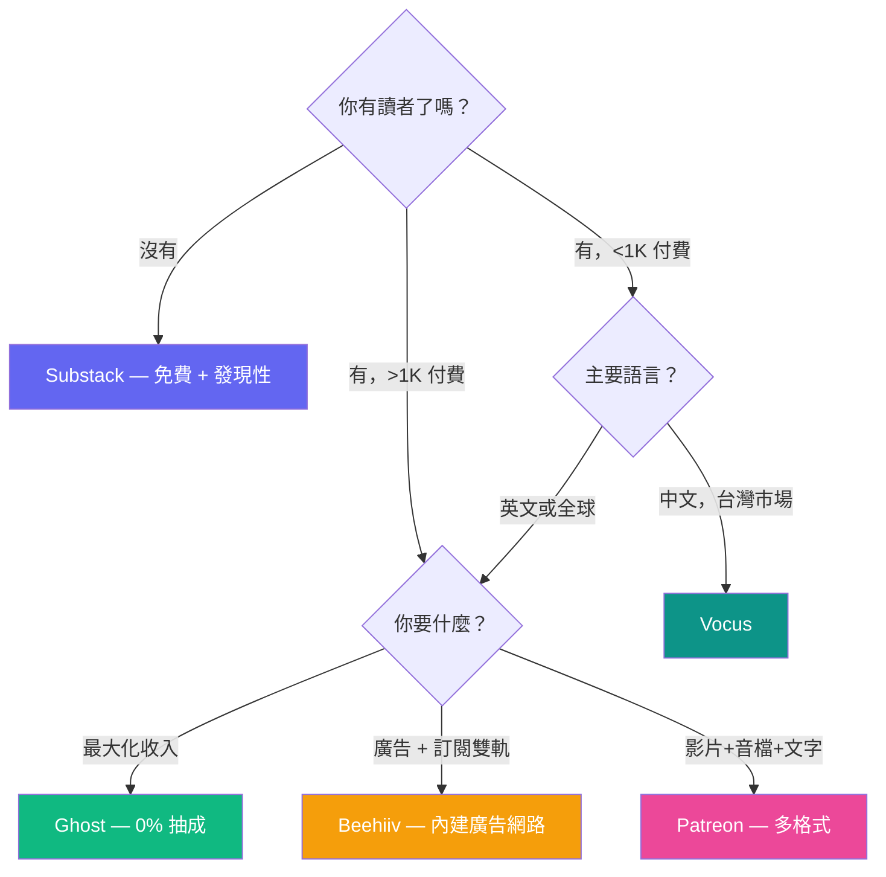

> 🌏 [English version](/en/posts/product/2026-09-16-ugc-platform-creator-economy-en)

創作者經濟有一個多數人不會在起步時想清楚的問題：你選的平台，決定了你的商業模式。

在 [Substack](https://substack.com/) 上寫作，你的營收被抽 10%。在 [Ghost](https://ghost.org/) 上寫同樣的東西，你一毛都不用分——但每月要付一筆固定的平台費。訂閱者 100 人的時候差異可以忽略，長到 10,000 人的時候，你每年多付或少付的金額差了好幾千美元。

這不是細節，這是結構性的選擇。而且一旦累積了讀者、品牌和工作流程，搬家的成本極高。

---

## 抽成 vs SaaS：兩種平台哲學

創作者內容平台的收費結構，歸根結底只有兩種邏輯：

**抽成模式**：平台從你的每一筆訂閱收入裡抽一個百分比。Substack 抽 10%，[Patreon](https://www.patreon.com/) 抽 10%（2025 年 8 月起新創作者統一費率），[Vocus 方格子](https://vocus.cc/) 抽 20% 加上金流手續費 2.25%。平台的利益跟你對齊——你賺越多它賺越多。但反過來說，你成長得越好，付出的代價也越高。

**SaaS 模式**：不管你賺多少，平台收固定月費。Ghost Pro 每月 $9 到 $199，[Beehiiv](https://www.beehiiv.com/) 的 Scale 方案每月 $39 起。你的訂閱收入 100% 歸你。平台的風險在於：如果創作者長不起來，固定月費也收不了多少。

**混合模式**：[Medium](https://medium.com/) 走了第三條路——讀者付 $5/月的會員費進入一個內容池，平台根據互動指標把錢分給作者。創作者既不控制定價，也不控制分潤公式。

### 損益兩平點在哪

假設你用 Substack（10% 抽成）和 Ghost Pro Starter（$25/月），損益兩平點是月營收 $250。低於這個數字，Substack 更便宜；高於這個數字，Ghost 每多賺一塊都是你的。

一個擁有 5,000 名付費訂戶、每人每月 $10 的創作者，月營收 $50,000。在 Substack 上，每月被抽 $5,000；在 Ghost 上，月費不超過 $199。差額是每年近 $58,000。

這筆帳在起步期不重要，但它決定了你在第三年還會不會留在這個平台。

---

## 六個平台，六種活法

### Substack：發現性換分潤

Substack 2017 年成立，核心主張是「讓寫作者靠寫作維生」。截至 2026 年，平台上累計超過 5,000 萬份訂閱，創作者 GMV 突破 $4.5 億。估值約 $11 億。

Substack 的真正資產不是技術——電子報發送系統並不複雜——而是**發現性**。平台內建推薦演算法、Notes 社群功能（類似 X/Twitter）和排行榜，幫助新作者被看到。對一個剛起步、沒有既有讀者群的寫作者來說，這個價值很難用 10% 來衡量。

代價是雙重的。第一，10% 的抽成在規模化後變得昂貴。第二，你的訂閱者關係在 Substack 手中——你可以匯出 email 清單，但讀者的付費關係、閱讀習慣和互動歷史都留在平台上。搬家意味著要求每個付費讀者重新刷卡。

2023 年底，科技政策記者 Casey Newton 把他的 [Platformer](https://www.platformer.news/) 從 Substack 搬到 Ghost，理由是 Substack 對仇恨言論的放任態度。這件事本身不大，但它引發的連鎖反應揭示了一個結構性張力：當平台的價值觀和你的品牌衝突時，你才會發現自己有多依賴它。

### Vocus 方格子：台灣創作者的主場

Vocus 是台灣最大的文字創作者平台，定位類似中文世界的 Substack，但走的路不太一樣。抽成比例更高（約 22%），換來的是繁體中文市場的集中流量和金流整合——在台灣，能處理本地信用卡和超商付款的訂閱平台選項不多。

Vocus 近期擴展到數位商品銷售，讓創作者除了訂閱制之外多一條變現路。在台灣市場，它的競爭對手不是 Substack 或 Ghost（語言和金流障礙太高），而是 [PressPlay Academy](https://www.pressplay.cc/)——後者走課程訂閱路線，2025 年 10 月併購 YOTTA 後進一步鞏固了線上學習市場的位置。

台灣創作者面對的選擇因此很不同：Vocus 適合持續寫作型的創作者，PressPlay 適合有結構化教學內容的講師。

### Ghost：開源、零抽成、全掌控

Ghost 是一個開源的電子報與會員制平台。0% 交易抽成——你的訂閱收入完全歸你。平台透過 Ghost Pro（$9-$199/月）的代管服務賺錢，也可以自架在自己的伺服器上。

Ghost 到目前為止處理的創作者收入超過 $1 億。它的經濟模型在中高收入階段最有優勢：當你的月營收超過 $500，固定月費相對於 10% 抽成的差距就開始拉大。

Ghost 的弱點是發現性。它沒有內建的推薦系統或社群功能——你的讀者要自己去找，或從其他管道導入。這讓它不適合從零開始的新手，但非常適合已經有忠實讀者群、想要最大化每一塊錢的成熟創作者。Casey Newton 搬過來之後，Platformer 的訂閱數沒有明顯下降，說明在讀者忠誠度夠高的時候，平台搬遷的成本沒有想像中大。

### Medium：內容池裡的零和遊戲

Medium 的模式跟前三者都不同。讀者付 $5/月進入一個內容池，不是付給特定作者。平台根據閱讀時長等互動指標把會員費分給作者。

這個模式的問題在透明度。作者不知道一篇文章到底值多少錢，也不知道分潤公式會不會改——而 Medium 確實多次調整過公式，每次都引發一波作者出走。這讓 Medium 變成一個「發現平台」而非「變現平台」：你在上面寫文章是為了被看到、導流到自己的其他管道，不是為了直接賺錢。

Medium 至今仍有巨大的 SEO 流量價值，但作為一個內容變現的主力平台，它的心佔率在持續下降。

### Patreon：從「贊助我」到交易平台

[Patreon](https://www.patreon.com/) 最早是讓 YouTuber 和 Podcaster 接受粉絲贊助的平台。每年透過平台流過的金額超過 $20 億。

2025 年 8 月，Patreon 把新創作者的費率統一為 10%（舊使用者維持原方案）。同時逐步淘汰「按作品收費」模式，轉向月訂閱制，並擴展到實體商品與數位商品銷售。這些動作指向一個方向：Patreon 想從「贊助平台」變成「創作者商務平台」。

Patreon 的護城河是它的多格式支持——同一個頁面可以發文字、影片、音檔、圖片，適合不只寫文章的創作者。但它的弱點跟 Substack 一樣：讀者的付費關係在 Patreon 手中。

### Beehiiv：SaaS + 廣告的混合打法

Beehiiv 是成長最快的 Substack 挑戰者。2026 年 ARR 達到 $3,000 萬。它的策略很直接：不抽你的訂閱收入，收固定的 SaaS 月費。Scale 方案以上，你的付費訂閱收入 100% 歸你。

Beehiiv 真正的差異化是內建的廣告網路。創作者可以在電子報中插入 Beehiiv 媒合的廣告，多一條變現管道。這讓它在「免費電子報 + 廣告收入」這條路線上，比 Substack 和 Ghost 都有結構優勢。

[Kit](https://kit.com/)（原 ConvertKit）走類似的 SaaS 路線，但 2025 年 9 月的 120% 漲價引發大量使用者反彈。它的優勢是免費方案支持到 10,000 訂閱者，適合起步階段使用。

---

## 六張牌攤開來比

| 平台 | 收費模式 | 創作者實拿 | 規模指標 | 發現性 | 所有權 | AI 功能 |
|---|---|---|---|---|---|---|
| [Substack](https://substack.com/) | 10% 抽成 | ~90% | 5,000 萬訂閱 | 強（推薦 + Notes） | 中（可匯出 email） | 無 |
| [Vocus](https://vocus.cc/) | ~22% 抽成 | ~78% | 台灣最大 | 中（站內流量） | 中 | 無 |
| [Ghost](https://ghost.org/) | SaaS $9-199/月 | 100% | $1 億+ 創作者收入 | 弱（無推薦） | 強（可自架） | 無 |
| [Medium](https://medium.com/) | 會員池分潤 | 不透明 | 巨大 SEO 流量 | 強（演算法） | 弱（平台控制） | 有限 |
| [Patreon](https://www.patreon.com/) | 10% 抽成 | ~90% | $20 億+/年付款 | 弱 | 中 | 無 |
| [Beehiiv](https://www.beehiiv.com/) | SaaS $0-99/月 | 100% | $3,000 萬 ARR | 中（廣告網路） | 強 | 有限 |

---

### 發現性 vs 所有權：你只能選一邊

右上角是理想狀態——高發現性加上高所有權——但目前沒有平台做到。Substack 和 Medium 靠演算法幫你被看到，代價是你的讀者關係和資料留在平台手上。Ghost 讓你完全掌控一切，但讀者要自己去找。

---

## 三個結構性觀察

### 冪律分佈無處不在

[Gumroad](https://gumroad.com/) 的數據最赤裸：平台上創作者的中位數月收入是 $72，而前 1% 拿走了 99.5% 的總收入。這不是 Gumroad 的問題——它是所有創作者平台的共同現實。

這意味著，多數創作者永遠不會碰到「10% 抽成太貴」的問題，因為他們的收入根本不足以讓抽成變得有感。真正在乎費率的，是那 1% 已經成功的人——而他們也是最有能力搬家的人。

### AI 缺席是最大的未填補空白

六個平台裡，沒有一個在 AI 輔助創作上有實質投入。沒有 AI 幫你起草、沒有 AI 幫你做 A/B 測試標題、沒有 AI 幫你分析哪些段落讓讀者流失。

這很反直覺——創作者最缺的就是時間和產出效率，而 AI 正好能幫上忙。第一個在平台層面把 AI 寫作輔助做好的，會拿到結構性優勢。

### 台灣生態系的獨特性

台灣創作者的平台選擇受限於語言和金流。Substack 和 Ghost 理論上都能用，但繁體中文的讀者發現性幾乎為零，本地金流（超商付款、台灣信用卡）也不一定支持。

這讓 Vocus 和 PressPlay 在台灣市場有天然的護城河——不是因為產品更好，而是因為替代方案的在地適配太差。但這也意味著，當 Substack 或 Beehiiv 認真做亞洲本地化的那一天，這道護城河可能一夜消失。

---

## 選平台的決策框架

不同階段需要不同的東西：

| 你的狀態 | 推薦 | 理由 |
|---|---|---|
| 起步期，沒有讀者 | Substack | 免費、發現性最強，10% 在收入低時不痛 |
| 成長期，1,000-10,000 訂戶 | 評估 Ghost 或 Beehiiv | 收入開始有感，抽成差距拉大 |
| 成熟期，10,000+ 訂戶 | Ghost（全掌控）或 Beehiiv（廣告加值） | 每年省下數萬美元 |
| 台灣市場中文創作 | Vocus | 本地金流和流量的唯一實際選項 |
| 課程與教學內容 | PressPlay Academy | 台灣線上學習訂閱的集中地 |
| 多格式（影片+音檔+文字） | Patreon | 唯一原生支持多格式的訂閱平台 |

最重要的一條原則：**從第一天就匯出並備份你的訂閱者 email 清單**。不管你用哪個平台，email 清單是你唯一真正擁有的資產。平台會改規則、會調價、會關掉。你的讀者名單不會。

---

本篇是「[內容販售商業模式拆解](/posts/product/2026-09-16-content-selling-four-models)」系列的第三篇。第一篇拆解 [B2B 產業情報](/posts/product/2026-09-16-b2b-intelligence-business)的生意邏輯，第四篇會看免費內容配上側翼變現的財經資訊平台。「個人付費電子報」的模式，請參考既有的「[一個人的媒體公司](/posts/career/2026-08-26-one-person-media-company-overview)」系列。

## 參考資料

- [Substack](https://substack.com/) — 創作者電子報平台，10% 抽成
- [Ghost](https://ghost.org/) — 開源電子報與會員制平台，0% 交易抽成
- [Vocus 方格子](https://vocus.cc/) — 台灣最大文字創作者平台
- [Medium](https://medium.com/) — 內容池會員制分潤平台
- [Patreon](https://www.patreon.com/) — 創作者會員與商務平台
- [Beehiiv](https://www.beehiiv.com/) — SaaS 模式電子報平台，$30M ARR
- [Kit (原 ConvertKit)](https://kit.com/) — Email 行銷轉創作者平台
- [PressPlay Academy](https://www.pressplay.cc/) — 台灣訂閱學習平台，2025 年併購 YOTTA
- [Platformer](https://www.platformer.news/) — Casey Newton 的科技政策電子報，從 Substack 遷移至 Ghost 的代表案例
- [一個人的媒體公司](/posts/career/2026-08-26-one-person-media-company-overview) — 站內系列：十個電子報創業案例與四條變現路線
