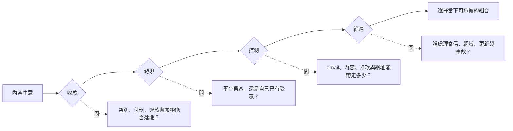
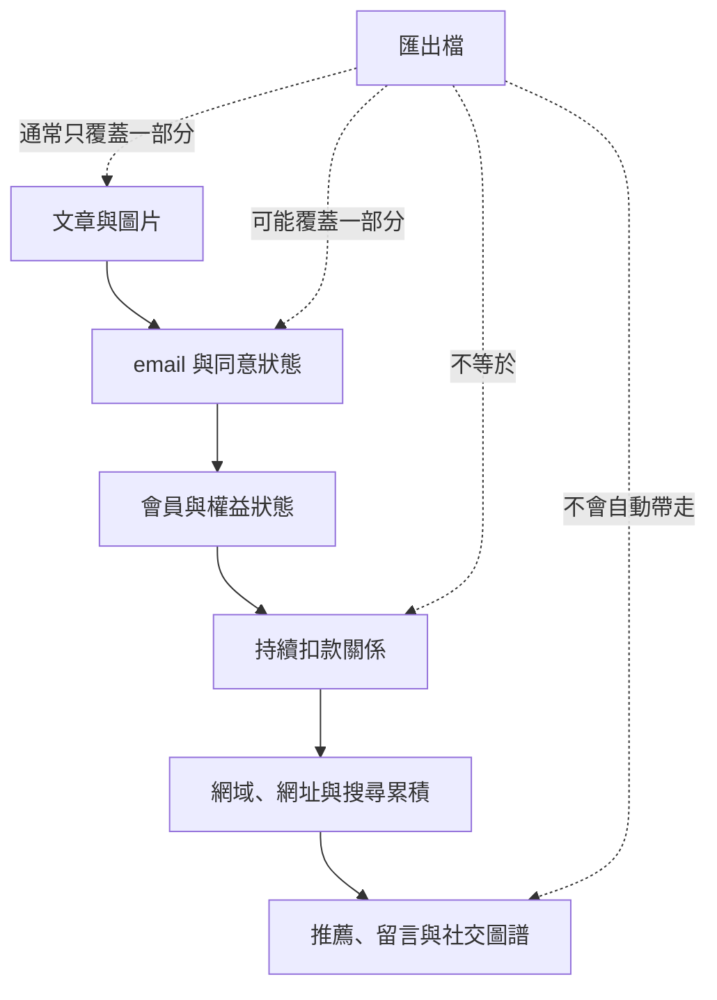
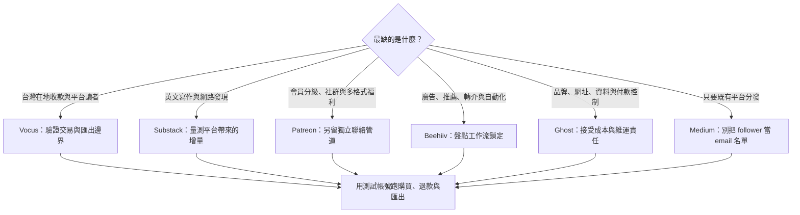

> 🌏 [English version](/en/posts/product/2026-09-16-ugc-platform-creator-economy-en)

把創作者平台想成三種做生意的地方。

夜市已經有人潮，攤主很快就能開張，但位置、收款與營業規則由市場決定。百貨專櫃多了會員、行銷與客服，代價是更深地接進百貨系統。自有店能決定門牌、會員簿與收銀機，也得自己處理招客、維修和事故。

Substack、Medium、Vocus 與 Patreon 比較接近市場或百貨；Ghost 自架比較接近自有店；Beehiiv 與 Ghost(Pro) 則像有人代管水電的獨立店面。這只是理解責任分配的比喻，不是品質排名。同一位創作者在不同階段，答案可以不同。

## 先過四道門，再看功能清單

平台比較經常只剩下「抽成還是月費」。真正的選擇至少有四道門：

- **收款**：能開啟付費，不代表適合你的所在地、買方與帳務流程。法律與稅務適用性仍要依實體和當時規則另行確認。
- **發現**：推薦、搜尋、社群與廣告網路帶來的是流量機會，不是保證營收。平台自報的歸因也不能直接當成每位創作者的增量。
- **控制**：看得到會員、能匯出 CSV、握有 email 同意、能移動續扣關係，是四件不同的事。
- **維運**：控制越多，通常也要承擔更多寄信信譽、網域、版型、整合與故障處理。

## 六個平台交換的是不同責任

下表只放公開文件能支持、且對選擇有用的差異。「條件式」表示必須另查方案、帳號、付款處理商或實際匯出內容，不代表完整可攜。

| 平台 | 收款與變現 | 發現方式 | 已確認能帶走的部分 | 留在平台或需重建的部分 | 維運位置 |
|---|---|---|---|---|---|
| [Medium](/posts/product/2026-09-17-medium-vocus-platform-distribution) | 會員池分潤，作者不自行決定每位讀者價格 | 推薦、主題、Digest、Boost | 帳號內容封存；舊有可取得的 email 名單 | 新 email 訂閱者地址不交給作者；followers 與分發不可攜 | 平台 |
| [Vocus](/posts/product/2026-09-17-medium-vocus-platform-distribution) | 台幣收款、發票、提領與會員營運 | 台灣站內與 App／email 分發 | 官方文件確認訂單明細 CSV | 未找到完整文章、會員 email 或續扣移轉的公開官方證據 | 平台 |
| [Substack](/posts/product/2026-09-17-substack-ten-percent-discovery) | 對付費訂閱收入收取 10% 平台費，另有付款處理成本 | Recommendations、Notes 與站內網路 | 文章、訂閱者名單及相關統計 | 推薦流量不隨行；付費關係能否沿用要看 Stripe 與遷移路徑 | 平台 |
| [Patreon](/posts/product/2026-09-17-patreon-membership-value-ladder) | 會員分級、商品與社群；新創作者費率依官方生效條件 | 免費會員、Explore 與推薦 | Relationship Manager／部分 email 資料可匯出 | 續扣授權、留言、聊天與推薦圖譜不能當成 CSV 一起搬走 | 平台 |
| [Ghost](/posts/product/2026-09-17-ghost-ownership-not-just-hosting) | 連接出版者自己的 Stripe；Ghost 平台抽成 0%，仍有 Stripe、代管或自架成本 | Recommendations、Webmention；Ghost 6 加入 ActivityPub | 網站內容、會員資料與自有 Stripe 關係較接近出版者控制 | 流量、寄信聲譽與自架維運不會因開源而自動解決 | 代管或自架 |
| [Beehiiv](/posts/product/2026-09-17-beehiiv-newsletter-operating-system) | 方案式 SaaS，結合付費訂閱、廣告與 Boosts | Recommendations、Referral、Ad Network | 文章與訂閱者資料有官方匯出路徑 | 推薦關係、廣告流程、自動化、分析與付款 token 不等於完整可攜 | SaaS 平台 |

這張表刻意沒有「最佳」欄。Vocus 的在地營運、Substack 的網路、Patreon 的會員階梯、Beehiiv 的成長工作流，以及 Ghost 的控制權，解的是不同問題。

## 所有權不是開關，而是六層資產

按下 Export，只能證明平台交出某些檔案。創作者真正經營的是六層資產：

Medium 的 follower 不等於可匯出的 email；Vocus 可匯出訂單明細，不代表已證明完整會員 email 與續扣可攜。Substack、Patreon、Beehiiv 即使能匯出內容或名單，也不能據此推論推薦、互動與付款授權會原封不動搬走。完整驗收方法見[六層搬家清單](/posts/product/2026-09-17-creator-platform-migration-assets)。

## AI 改變工作流與分發，不會自動改寫勝負

舊版把這六家寫成「幾乎沒有 AI」，現在已不成立。Beehiiv 已把 AI、MCP 與 Agent 能力接進營運產品；Medium 也用 AI 內容政策決定哪些文章可進一般分發或變現。其他平台即使沒有同樣的產品包裝，也會面對生成內容增加、品質治理與 AI 搜尋截留點擊。

但不能因此推成「有 AI 功能的平台一定成長更快」，也不能把任何公司的營收或估值變化歸因於 AI。對創作者更實際的檢查是：AI 幫忙的是起草、分群、分析還是自動化？輸出能否審核？它又讓哪些資料與流程更難搬走？

## 用情境選責任，不用排行榜選品牌

如果你在台灣經營內容生意，可用[台灣創作者平台選型](/posts/product/2026-09-17-taiwan-creator-platform-choice)把四道門變成測試清單。不要先搬全部讀者；先用測試帳號跑一次訂閱、退款、取消、內容匯出和名單匯出，再看輸出欄位能否接到下一套工具。

## 七篇案例，依問題閱讀

1. [Medium、Vocus：平台流量值多少控制權](/posts/product/2026-09-17-medium-vocus-platform-distribution)
2. [Substack：10% 是否值得](/posts/product/2026-09-17-substack-ten-percent-discovery)
3. [Patreon：免費會員、付費分級與搬家成本](/posts/product/2026-09-17-patreon-membership-value-ladder)
4. [Ghost：網域、會員、Stripe 與退出權](/posts/product/2026-09-17-ghost-ownership-not-just-hosting)
5. [Beehiiv：推薦、廣告與成長工作流](/posts/product/2026-09-17-beehiiv-newsletter-operating-system)
6. [搬家時帶得走什麼：六層資產清單](/posts/product/2026-09-17-creator-platform-migration-assets)
7. [台灣創作者怎麼選平台、SaaS 或自架](/posts/product/2026-09-17-taiwan-creator-platform-choice)

本篇仍是「[內容販售商業模式拆解](/posts/product/2026-09-16-content-selling-four-models)」的第三篇；這次更新把原本的一篇橫評，改成「誰掌握創作者與讀者的關係」七篇延伸系列的入口。個人付費電子報案例可另讀「[一個人的媒體公司](/posts/career/2026-08-26-one-person-media-company-overview)」。

## 更新紀錄

- 2026-09-17：依現行官方文件重寫比較框架，修正 Ghost、Beehiiv、Medium 與 Vocus 的功能及匯出邊界，並補上七篇延伸案例。

## 參考資料

- [Medium：Email notifications](https://help.medium.com/hc/en-us/articles/360059837393-Email-notifications) — 新訂閱者 email 與既有名單的邊界
- [Vocus：如何管理沙龍會員及訂單](https://vocus.cc/help_center/TnC9HOz4dEujYDlmdPTg) — 訂單資料匯出
- [Substack：匯出文章](https://support.substack.com/hc/en-us/articles/360037466012-How-do-I-export-my-posts) 與[匯出 email 名單](https://support.substack.com/hc/en-us/articles/6314498343700-How-do-I-export-my-email-list-on-Substack)
- [Patreon：Relationship Manager](https://support.patreon.com/hc/en-us/articles/360045516212-How-to-use-your-Relationship-manager) — 會員資料篩選與匯出
- [Ghost：交易費說明](https://ghost.org/help/are-there-really-no-transaction-fees/) — 0% Ghost transaction fee 與 Stripe 費用
- [Ghost 6.0](https://ghost.org/changelog/6/) — ActivityPub 與社交網路功能
- [Beehiiv：匯出文章與訂閱者資料](https://www.beehiiv.com/support/article/12258595483543-exporting-post-content-or-subscriber-data-from-beehiiv)
