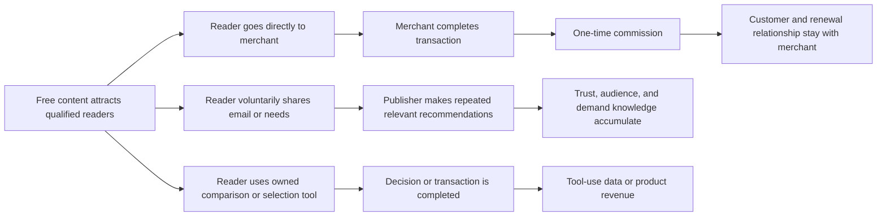
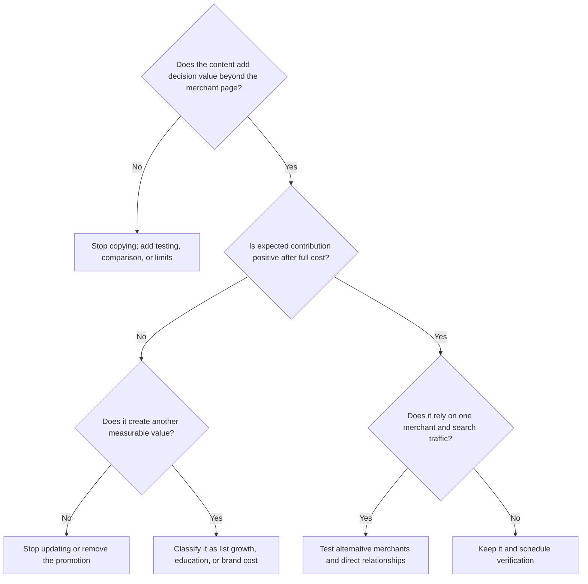

> 🌏 [中文版](/posts/product/2026-09-17-affiliate-marketing-unit-economics)

Imagine a real-estate agent showing a buyer several homes. The agent did not build the properties and does not own the developer's checkout. The job is to understand the buyer, eliminate poor fits, and bring qualified demand to the seller. If a transaction closes, the agent receives a referral fee.

Affiliate marketing is the same kind of business. A reader follows a link from an article, video, or tool and completes a purchase within the merchant's attribution rules; the publisher may then earn a commission. If the page merely copies product descriptions and adds links, it is renting traffic. If it repeatedly answers “which option fits which person” and accumulates testing methods, brand trust, and consented first-party demand data, it can become a repeatable matching system.

The useful question is not “how high is the commission?” It is: **What job does each recommendation perform, what remains after every cost, and which asset stays with the publisher after the sale?**

## A commission becomes a business when assets remain



The first route is fast but depends heavily on the merchant's rates, tracking, and conversion page. The second creates a direct relationship, but email is an asset only when readers knowingly consent and the data purpose is clear. The third converts content into a tool or transaction service, increasing control as well as privacy, maintenance, support, and compliance obligations.

None is automatically superior. A publisher who occasionally recommends a tool does not need to become a software company. A business heavily dependent on affiliate revenue should know whether it operates repeatable demand matching or rents traffic again every month.

## Calculate expected contribution per article, not merely payout per click

A simplified model is:

`Expected contribution per article = expected approved commission - production, update, and distribution costs`

“Expected approved commission” should incorporate estimated approval and attribution rates, including refunds, reversals, and tracking loss. Those losses should not be deducted again at the end of the formula.

This is a decision model, not an income promise. Commission rates, attribution windows, eligible products, return rules, and payment thresholds can change with partner terms. A current fixed commission should not become a long-term assumption.

| Unit-economics field | What to measure | Common overstatement | A check you can run tonight |
|---|---|---|---|
| Qualified clicks | Visitors with purchase intent who reach the merchant | Counting every page view | Cohort by content intent and outbound click |
| Merchant conversion | Tracked clicks that satisfy commission rules | Substituting a sitewide conversion rate | Match partner reports to click ID and date |
| Commissionable order value | Value after excluded items, discounts, and returns | Using list price | Sample approved, pending, and reversed orders |
| Commission revenue | Approved and withdrawable commission | Treating pending as cash | Separate pending, approved, and paid reports |
| Content cost | Research, testing, editing, graphics, and launch | Counting only writer fees | Record labor hours and tool costs by role |
| Ongoing cost | Price, feature, inventory, link, and policy updates | Treating the page as a one-time asset | Set a review cadence and broken-link alerts |
| Attribution loss | Cross-device use, windows, and competing attribution | Assuming every purchase is credited | Compare clicks, merchant reports, and cash received |

Update cost is the easiest item to miss. Once a comparison affects a money decision, an old price, discontinued model, or changed term harms trust as well as search performance. If expected contribution cannot fund the next verification pass, the page is not passive income. It is deferred maintenance debt.

## Original value separates reader service from a copied catalog

[Google's web-search spam policies](https://developers.google.com/search/docs/essentials/spam-policies) describe thin affiliation as pages with affiliate links whose product descriptions or reviews are copied from merchants without original content or added value. The problem is not the affiliate link itself. It is whether the page reduces decision cost beyond sending the visitor elsewhere.

| Content form | Job for the reader | Publisher-owned asset | Main risk | Interpretation |
|---|---|---|---|---|
| Copied description plus links | Almost none | Almost none | Thin affiliation; breaks when terms change | Commission page |
| Original testing and comparison | Exposes differences, limits, and fit | Method, content, and brand trust | High testing and update cost | Sustainable content business |
| Calculator or selector plus opt-in | Converts needs into options | First-party demand signals and direct relationship | Privacy, data quality, maintenance | Matching-product prototype |
| Owned transaction or renewal | Completes purchase and service | Customer and transaction data | Compliance, support, refunds, operations | Beyond pure affiliate marketing |

“Original” does not mean adding a few hundred words. Useful evidence includes test conditions, rejected choices, sample limits, who should not buy, and the last verification date. A reader should make a better decision even without following the affiliate link.

## Search markup and audience disclosure are separate gates

[Google's outbound-link documentation](https://developers.google.com/search/docs/crawling-indexing/qualify-outbound-links) says ordinary advertising and sponsored links can exist, but paid links should use `rel="sponsored"`; `nofollow` remains acceptable. This is a machine-readable signal about the link relationship, not an explanation to the reader.

The [FTC's Disclosures 101](https://www.ftc.gov/business-guidance/resources/disclosures-101-social-media-influencers) says that a material connection—money, employment, personal or family ties, or free or discounted products—should be disclosed clearly and conspicuously. The disclosure should accompany the endorsement rather than live only on an About page, at the end, or behind a “more” control.

```mermaid
flowchart TD
    A[Article contains paid or affiliate link] --> B[HTML link relationship]
    A --> C[Audience-facing disclosure]
    B --> D[rel="sponsored"; Google also accepts nofollow]
    C --> E[Plain-language disclosure near the recommendation]
    D --> F{Are both complete?}
    E --> F
    F -->|Yes| G[Search signal and informed reader handled separately]
    F -->|No| H[Fix the missing gate; one cannot replace the other]
```

For example: “This article contains affiliate links. I may receive a commission if you buy through them.” If a product was free, the content was sponsored, or another relationship exists, the wording should describe that fact rather than hiding it behind a generic template.

The FTC is a U.S. regulator; its guidance is not a conclusion about Taiwanese law. A publisher serving Taiwan or multiple markets should check current requirements for its entity, place of publication, and audience. This article is not legal advice. Regardless of jurisdiction, letting readers understand the economic relationship before acting is a minimum trust design.

## Decide whether to update, transform, or stop



Start with the ten highest-revenue pages rather than rebuilding the site. For each one, add the last verified date, approved commission, full maintenance time, refund or reversal rate, and the original judgment available without clicking. Review three months later: did the page accumulate trust and demand knowledge, or merely wait for the next platform or merchant policy change?

## Conclusion: commission is revenue; judgment may become an asset

Affiliate marketing is neither inherently low-quality nor inherently passive. It can save readers research time, connect merchants with qualified demand, and pay publishers for outcomes. Yet attractive click numbers conceal a fragile business when the content adds no value, costs exclude maintenance, disclosure is hidden, or every customer relationship stays elsewhere.

A real-estate agent's durable value is not knowing where the developer's door is. It is knowing which home fits which buyer and explaining the limitations honestly. Affiliate content works the same way: improve the reader's decision first, then decide whether the referral fee is worth earning.

## References

- [Google Search Central: Spam policies for Google web search](https://developers.google.com/search/docs/essentials/spam-policies) — thin affiliation and paid-link treatment
- [Google Search Central: Qualify outbound links](https://developers.google.com/search/docs/crawling-indexing/qualify-outbound-links) — `sponsored`, `nofollow`, and other link relationships
- [FTC: Disclosures 101 for Social Media Influencers](https://www.ftc.gov/business-guidance/resources/disclosures-101-social-media-influencers) — material connections and clear, conspicuous placement
