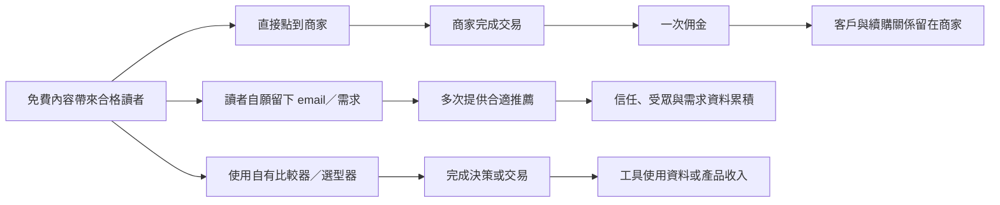
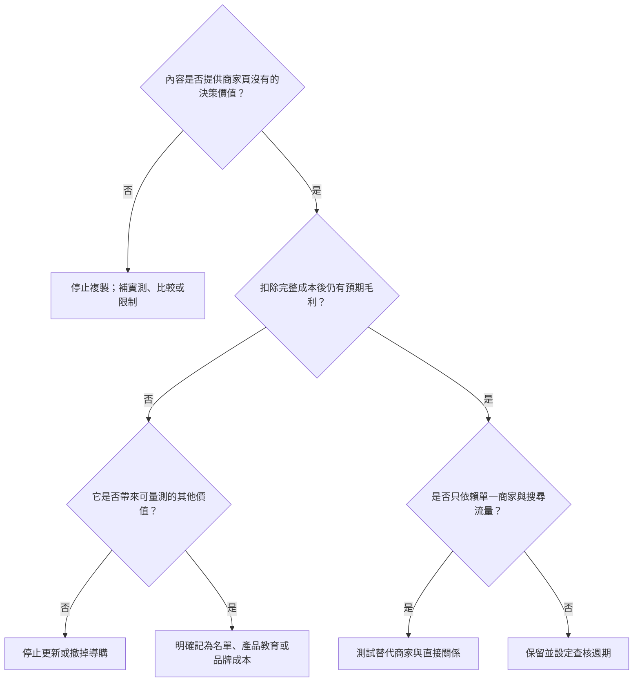

> 🌏 [English version](/en/posts/product/2026-09-17-affiliate-marketing-unit-economics-en)

想像一位房仲帶你看房。他沒有蓋房子，也不擁有建商的收銀台；他做的是理解你的需求、排除不適合的選項，再把可能成交的客人帶到賣方。成交後，他拿一筆介紹費。

聯盟行銷也是這種生意。讀者透過文章、影片或工具點進商家，在歸因條件內完成購買，內容方才可能拿到佣金。若內容只是把商品說明複製一遍，再補上一排連結，它只是在租流量。要成為可重複的媒合系統，內容得持續回答「什麼人適合什麼方案」，並累積測試方法、品牌信任與經同意取得的需求資料。

比佣金率更重要的問題有三個：**每次推薦替讀者完成了什麼工作？扣完所有成本還剩多少？成交後又有什麼留在自己手上？**

## 一筆佣金與一門生意，差在資產留在哪裡



第一條路徑最快，卻最依賴商家的費率、追蹤與轉換頁。第二條開始形成直接關係，但 email 只有在讀者知情同意、資料用途清楚時才是資產。第三條把內容變成工具或交易服務，控制權較高，也同時增加隱私、維護、客服與合規責任。

這三條路沒有天然高下。偶爾推薦真正用過的工具，不必硬改造成軟體公司。若營收高度依賴聯盟行銷，就得分清楚：你是在經營可重複的需求媒合，還是每個月重新向平台租流量？

## 先算「每篇預期貢獻」，不要只看每次點擊多少錢

聯盟內容的簡化單位經濟可以寫成：

`每篇預期貢獻 = 預期核准佣金 - 製作、更新與分發成本`

其中「預期核准佣金」必須用實際核准率與可歸因率估計，已把退款、撤銷與追蹤遺失算進去，不能在公式尾端再扣一次。

這是決策模型，不是收入承諾。佣金率、歸因期限、可計佣品項、退款規則與付款門檻都可能隨 partner terms 改變，所以不該把今天看到的固定佣金寫成長期假設。

| 單位經濟欄位 | 要量什麼 | 常見高估方式 | 今晚能做的檢查 |
|---|---|---|---|
| 合格點擊 | 真正有購買意圖、成功到達商家的訪客 | 把所有頁面瀏覽都算入 | 依內容意圖與 outbound click 分 cohort |
| 商家轉換率 | 被追蹤點擊中，最後符合計佣條件的比例 | 用全站轉換率代替特定商家與頁面 | 對照 partner report 與站內 click ID／日期 |
| 可計佣客單價 | 排除不計佣品項、折扣與退貨後的金額 | 直接用標價 | 抽查已核准、待定與撤銷訂單 |
| 佣金收入 | 實際核准並可提領的佣金 | 把 pending 當現金 | 報表分開 pending、approved、paid |
| 內容成本 | 研究、實測、編輯、圖表與初次發布 | 只算寫手稿費 | 登記每個角色實際工時與工具費 |
| 持續成本 | 價格、功能、庫存、連結與法規更新 | 把文章當成一次性資產 | 設定更新週期與失效連結告警 |
| 追蹤損失 | 跨裝置、Cookie／歸因期限與競爭歸因 | 假設每筆購買都能認列 | 比較點擊、商家回報與實際入帳差距 |

最容易漏掉的是更新成本。比較文一旦影響金錢決策，舊價格、停產型號或改版條款不只是 SEO 問題，也會消耗讀者信任。若一篇文章的預期毛利不足以支付下一次查核，它就不是「被動收入」，而是延期入帳的維護負債。

## 原創價值決定你是在幫讀者，還是在複製型錄

[Google Search spam policies](https://developers.google.com/search/docs/essentials/spam-policies) 將「thin affiliation」描述為含聯盟連結、卻直接複製商家商品描述或評論，沒有原創內容或附加價值的頁面。問題不是 affiliate link 本身，而是頁面除了導購之外，是否真的降低讀者的選擇成本。

| 內容形態 | 對讀者的工作 | 留下的自有資產 | 主要風險 | 判讀 |
|---|---|---|---|---|
| 複製商品描述＋連結 | 幾乎沒有 | 幾乎沒有 | thin affiliation、條款一改就失效 | 一次佣金頁 |
| 原創實測與比較 | 揭露差異、限制與適用情境 | 方法、內容與品牌信任 | 測試與更新成本 | 可持續內容生意 |
| 計算器／選型器＋自願名單 | 把需求轉成選項 | 第一方需求訊號與直接關係 | 隱私、資料品質與維護 | 媒合產品雛形 |
| 自有交易／續約關係 | 完成購買及後續服務 | 客戶與交易資料 | 合規、客服、退款與營運 | 已超出純 affiliate |

「原創」也不等於多寫幾百字。更有用的證據包括實際測試條件、未通過的選項、樣本限制、適用與不適用的人，以及資料最後查核日期。讀者應該能在不點聯盟連結的情況下，仍從內容得到一個較好的決策。

## 搜尋標記與人類揭露，是兩道不同的門

[Google 的連結標記文件](https://developers.google.com/search/docs/crawling-indexing/qualify-outbound-links)表示，一般廣告與贊助連結可以存在，但付費連結應用 `rel="sponsored"` 標記；`nofollow` 仍可接受。這是告訴搜尋引擎連結關係的技術訊號，不是對讀者說明利益關係。

[FTC 的 Disclosures 101](https://www.ftc.gov/business-guidance/resources/disclosures-101-social-media-influencers) 聚焦讀者是否知情。若推薦者與品牌存在可能影響判斷的 material connection，例如金錢、僱傭、親友關係或免費／折扣商品，就應清楚、顯眼地揭露。揭露應放在推薦附近，不要只藏在 About、頁尾或必須展開的文字裡。

```mermaid
flowchart TD
    A[文章含付費／聯盟連結] --> B[HTML 連結關係]
    A --> C[讀者看到的利益揭露]
    B --> D[rel="sponsored"；Google 也接受 nofollow]
    C --> E[在推薦附近用清楚語言說明可能取得佣金]
    D --> F{兩項都完成？}
    E --> F
    F -->|是| G[搜尋訊號與人類知情各自處理]
    F -->|否| H[補缺的一道門；不能互相取代]
```

例如可以在第一次推薦前直接寫：「本文含聯盟連結；若你透過連結購買，我可能取得佣金。」若產品是免費提供、內容受贊助或有其他關係，則應據實換成對應說明，不能拿通用模板掩蓋實際關係。

FTC 是美國的監管指引，不是台灣法律結論。面向台灣或跨境讀者時，仍要依發布地、營運實體、受眾與當時規則確認適用要求；本文不提供法律意見。無論法律管轄如何，讓讀者在做決定前看懂利益關係，仍是最低限度的信任設計。

## 判斷一篇內容該更新、轉型或停止



實作時，先挑營收最高的十篇，而不是全站重做。為每篇補上最近查核日、核准後佣金、完整維護工時、退款／撤銷比例，以及讀者不點連結也能獲得的原創判斷。三個月後再看：它是在累積信任與需求資料，還是只等下一次平台或商家改規則。

## 結論：佣金是收入，判斷力才可能成為資產

聯盟行銷不是天然低品質，也不是天然被動。它可以替讀者縮短研究時間，替商家找到合格需求，讓內容方以成交結果收費。但當內容沒有新增價值、成本只算首次製作、揭露被藏起來，或所有客戶關係都留在別人手上時，漂亮的點擊數很容易遮住脆弱的生意。

房仲長久的價值不是「知道建商大門在哪裡」，而是能判斷誰適合哪間房，也願意把限制講清楚。聯盟內容也是如此：先把讀者的決策做好，再問這筆介紹費值不值得賺。

## 參考資料

- [Google Search Central：Spam policies for Google web search](https://developers.google.com/search/docs/essentials/spam-policies) — thin affiliation 與付費連結標記
- [Google Search Central：Qualify outbound links](https://developers.google.com/search/docs/crawling-indexing/qualify-outbound-links) — `sponsored`、`nofollow` 等連結關係
- [FTC：Disclosures 101 for Social Media Influencers](https://www.ftc.gov/business-guidance/resources/disclosures-101-social-media-influencers) — material connection 與清楚顯眼的揭露位置
