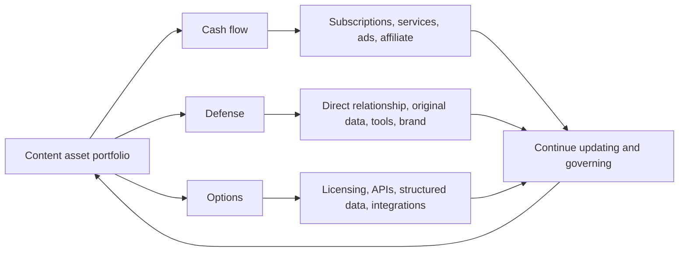
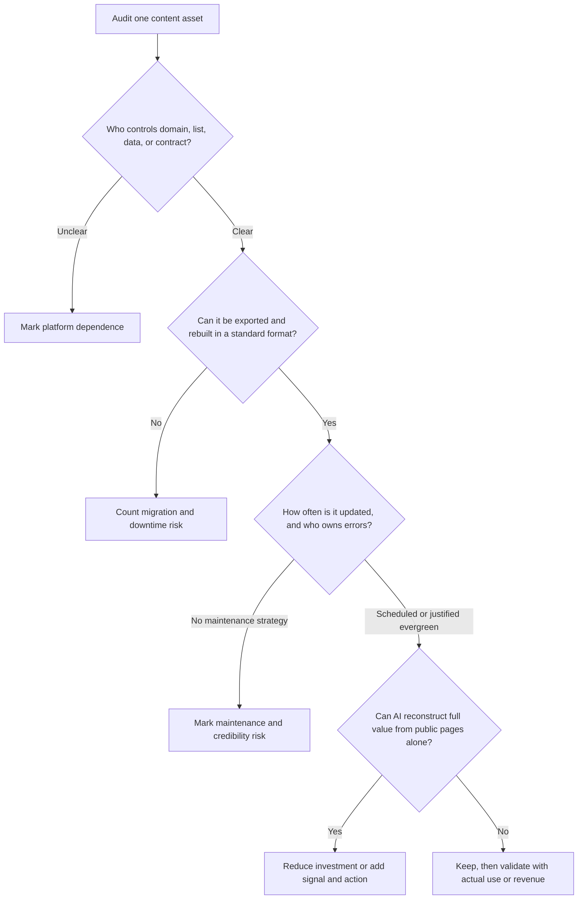

> 🌏 [中文版](/posts/product/2026-09-17-ai-era-content-asset-portfolio)

An orchard owner does not ask only which tree produces the most fruit today. Some trees fund this season, some become windbreaks, and some improve soil and irrigation so different crops remain possible later.

A content portfolio should not be judged only by this month's pageviews. As AI search compresses public text more readily, allocation has three jobs: **earn today, preserve relationships tomorrow, and keep future forms of exchange open.**

These are not accounting categories or guaranteed returns. They are resource-allocation lenses. One asset may sit in two baskets, but its main job and cost still need names.

## Basket one: cash flow with provable unit economics

Subscriptions, consulting, ads, and affiliate commissions can earn revenue. Pageviews, leads, and pending commissions are not cash. Complete production and update cost, approved revenue, margin, payback, and churn belong beside them.

AI can lower the replacement cost of a generic summary and may also reduce some research and formatting work. Neither effect should be inferred from a story alone; compare collected revenue and full cost for the same cohort.

## Basket two: a next interaction that does not rent the entrance again

Defensive assets include consented email or account relationships with a stated purpose, original data, repeatedly useful tools, community context, and direct brand demand. Their shared feature is not “AI cannot copy this.” It is that a public webpage cannot complete the whole job.

[Ghost's official membership documentation](https://docs.ghost.org/members) offers a verifiable example: member lists can be exported and subscriptions connect to the publisher's own Stripe account. That makes the relationship more portable. It does not ensure opens, renewals, or unlimited reuse of member data.

## Basket three: options for future exchange

Original data with clear rights and quality can become an API, enterprise license, or workflow integration. Articles can become product documentation, data dictionaries, and citation entrances. But “structured” does not automatically mean valuable. Without demand, update commitments, and a reliable schema, it is another file to maintain.

[Cloudflare's AI Crawl Control documentation](https://developers.cloudflare.com/ai-crawl-control/), checked in September 2026, lists monitoring, allow, block, and paid-access controls while labeling Pay Per Crawl a private beta. That proves exchange mechanisms are being tested—not that publishers broadly earn stable crawler revenue.

| Asset | Main basket | Evidence to measure | Hidden cost | Reconstructable from public pages? |
|---|---|---|---|---|
| Paid newsletter | Cash flow + defense | Collected revenue, margin, renewal, churn | Delivery, support, continuous work | Public posts can be summarized; consent and payment relationship cannot |
| Original dataset | Defense + options | Update rate, query use, corrections | Rights, cleaning, version governance | Depends on public availability and update speed |
| Calculator or workflow tool | Defense | Activation, task completion, return, payment | Engineering, security, support | Simple function is easier; personal state and reliable execution are harder |
| Community | Defense | Member-to-member interaction, replies, retention | Moderation, facilitation, platform dependence | Public posts can be summarized; relational context is harder to move |
| API or license | Options + cash flow | Active use, contract margin, renewal | SLA, rights, integration support | Docs are readable; continuing service and rights are not rebuilt by scraping |

## Four questions that remove fake assets

The first question is ownership, not a brand slogan. The second is portability, not merely a CSV button; payment credentials, consent records, history, and automations must reconnect. The third puts maintenance into cost. Only the fourth tests AI substitutability.

## “More content” is not the default answer

[Google's official documentation](https://developers.google.com/search/docs/appearance/ai-features) still lists indexing eligibility, crawl access, internal links, and reliable content as foundations for AI features in Search. SEO remains, but it is increasingly an entrance for discovery and citation rather than a guarantee of a click.

Produce less text that can be completely compressed, offers no next step, and still demands constant updates. Invest more in content systems that generate original signals, direct relationships, or reliable action. Every system must still pass tests for revenue, use, retention, and governance cost.

## A 90-day allocation exercise

In the first 30 days, inventory content, lists, tools, data, and contracts across the three baskets and answer all four questions. In the next 30, reduce investment in a group of costly, unused, fully replaceable outputs and move resources into one direct-relationship or tool experiment; stop them only after confirming that no required responsibility remains. In the final 30, inspect cohorts: did it create attributable returns, completed work, collected revenue, or renewal?

The AI era does not eliminate articles. It eliminates the excuse to count article volume as total assets. An asset gives the reader a reason to return—and gives you the right and ability to keep delivering that reason.

## Series navigation

- Previous: [Which content models face the most AI risk?](/en/posts/product/2026-09-17-content-model-ai-exposure-defense-en)
- Start: [How AI summaries change the traffic path](/en/posts/product/2026-09-17-ai-overviews-change-traffic-path-en)

## References

- [Google Search Central: AI features and your website](https://developers.google.com/search/docs/appearance/ai-features)
- [Ghost: memberships, subscriptions, and portability](https://docs.ghost.org/members)
- [Cloudflare: AI Crawl Control](https://developers.cloudflare.com/ai-crawl-control/)
