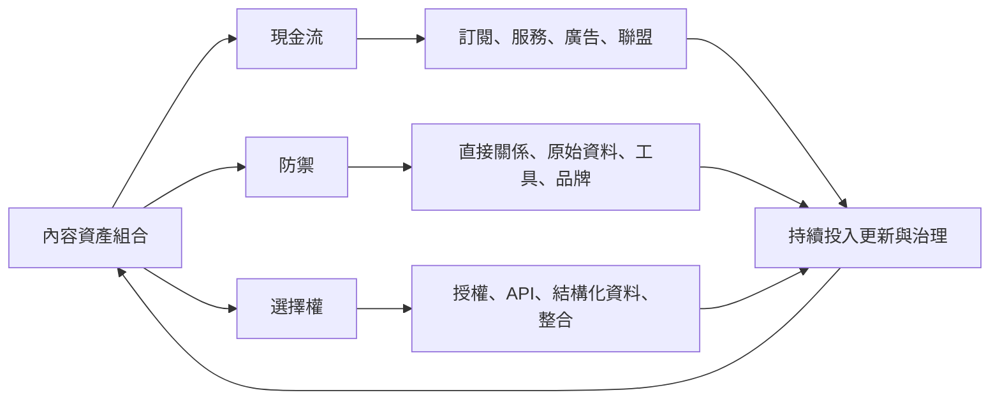
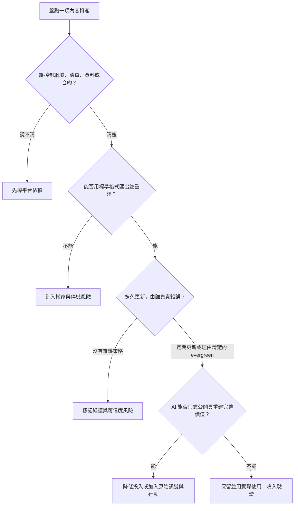

> 🌏 [English version](/en/posts/product/2026-09-17-ai-era-content-asset-portfolio-en)

種果樹的人不會只問哪棵今天結果最多。有些樹供應本季現金，有些長成防風林，有些先養土和灌溉，讓未來能改種別的作物。

內容資產也不該只看本月 pageview。AI 搜尋讓公開文字更容易被壓縮後，好的配置要同時處理三件事：**今天怎麼收錢、明天怎麼保有關係、後天還能轉成什麼。**

這三籃不是會計分類，也不是保證報酬的公式。它們是資源分配問題：每項資產可能同時落在兩籃，但必須說清楚主要工作與成本。

## 第一籃：能證明單位經濟的現金流

訂閱、顧問服務、廣告與聯盟佣金都能產生收入，但 pageview、名單與 pending commission 不是現金。需要一起量的是完整製作與更新成本、核准收入、毛利、回收期與流失。

AI 讓通用摘要更便宜，可能壓低單純文字訂閱的替代成本；它也可能降低部分研究與格式整理成本。兩邊都不能只憑故事判斷，要看相同 cohort 的實收與完整成本。

## 第二籃：讓下一次互動不必重新租入口

防禦資產包括自願加入且用途清楚的 email／帳戶關係、原始資料、會反覆使用的工具、社群脈絡與品牌直達。它們的共同點不是「AI 抄不到」，而是公開網頁不足以完成整個工作。

[Ghost 官方會員文件](https://docs.ghost.org/members)提供一個可驗證例子：會員清單可以匯出，訂閱付款連到出版者自己的 Stripe 帳號。這表示關係較可攜，不表示 email 一定有開信、付款一定續約或資料可以任意再利用。

## 第三籃：保留未來交換方式的選擇權

原始資料若有清楚權利與品質，可以做成 API、企業授權或工作流整合。文章也能成為產品文件、資料字典與可引用入口。但「結構化」不等於自動值錢；沒有需求、更新承諾與可靠 schema，只是另一份需要維護的檔案。

[Cloudflare AI Crawl Control 文件](https://developers.cloudflare.com/ai-crawl-control/)在 2026 年 9 月查詢時列出監看、允許、封鎖與付費存取等控制，並把 Pay Per Crawl 標為 private beta。這證明交換機制正在試驗，不證明出版者已普遍靠 crawler 取得穩定收入。

| 資產 | 主要籃子 | 要證明的指標 | 隱藏成本 | 公開網頁能否重建 |
|---|---|---|---|---|
| 付費電子報 | 現金流＋防禦 | 實收、毛利、續約、退訂 | 寄送、客服、持續交付 | 可摘要公開內容，不能直接重建同意與付款關係 |
| 原始資料集 | 防禦＋選擇權 | 更新率、查詢使用、錯誤修正 | 授權、清理、版本治理 | 視資料是否公開與更新速度而定 |
| 計算器／工作流工具 | 防禦 | 啟用、完成工作、回訪、付費 | 工程、資安、客服 | 簡單功能容易，個人狀態與可靠執行較難 |
| 社群 | 防禦 | 成員互動、回覆、留存 | 治理、主持、平台依賴 | 公開貼文可摘要，關係脈絡難完整搬走 |
| API／授權 | 選擇權＋現金流 | 有效使用、合約毛利、續約 | SLA、權利、整合支援 | 文件可讀，持續服務與權利不可只靠抓頁重建 |

## 四個問題，淘汰假的資產

第一問是擁有權，不是品牌口號。第二問是可攜性，不是看到 CSV 按鈕就算完成；付款憑證、同意紀錄、歷史與自動化也要能接回去。第三問把維護責任算進成本。第四問才檢查 AI 替代性。

## 不要把「更多內容」當成預設答案

[Google 官方文件](https://developers.google.com/search/docs/appearance/ai-features)仍把索引資格、可抓取、內部連結與可靠內容列為 AI 搜尋的基礎。SEO 沒有消失，但它更像可發現與可引用的入口，不必然交付點擊。

因此，該少做的是能被完整壓縮、沒有下一步、又需要不停更新的文字。該多做的是會產生原始訊號、直接關係或可靠行動的內容系統。每一項仍要接受收入、使用、留存與治理成本的檢驗。

## 一個九十天配置法

前 30 天先盤點：把所有內容、清單、工具、資料與合約放進三籃，補齊四個問題。接著 30 天先降低一批高成本、低使用、可完整替代項目的投入，把資源移到一個直接關係或工具實驗；確認沒有必要責任後才停止。最後 30 天只看 cohort：它是否帶來可辨識的回訪、工作完成、實收或續約？

AI 時代不是不要文章，而是不再把文章數量誤認為資產總額。真正的資產，是讀者下一次仍有理由找你，而且你有權、有能力把那個理由繼續交付。

## 系列導覽

- 上一篇：[四種內容生意誰最怕 AI](/posts/product/2026-09-17-content-model-ai-exposure-defense)
- 回到系列起點：[AI 摘要如何改變內容網站的流量路徑](/posts/product/2026-09-17-ai-overviews-change-traffic-path)

## 參考資料

- [Google Search Central：AI 功能與網站](https://developers.google.com/search/docs/appearance/ai-features)
- [Ghost：會員、訂閱與資料可攜性](https://docs.ghost.org/members)
- [Cloudflare：AI Crawl Control](https://developers.cloudflare.com/ai-crawl-control/)
