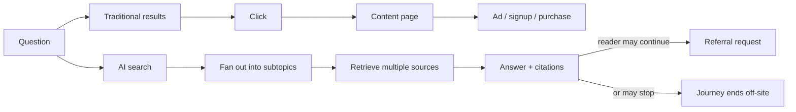
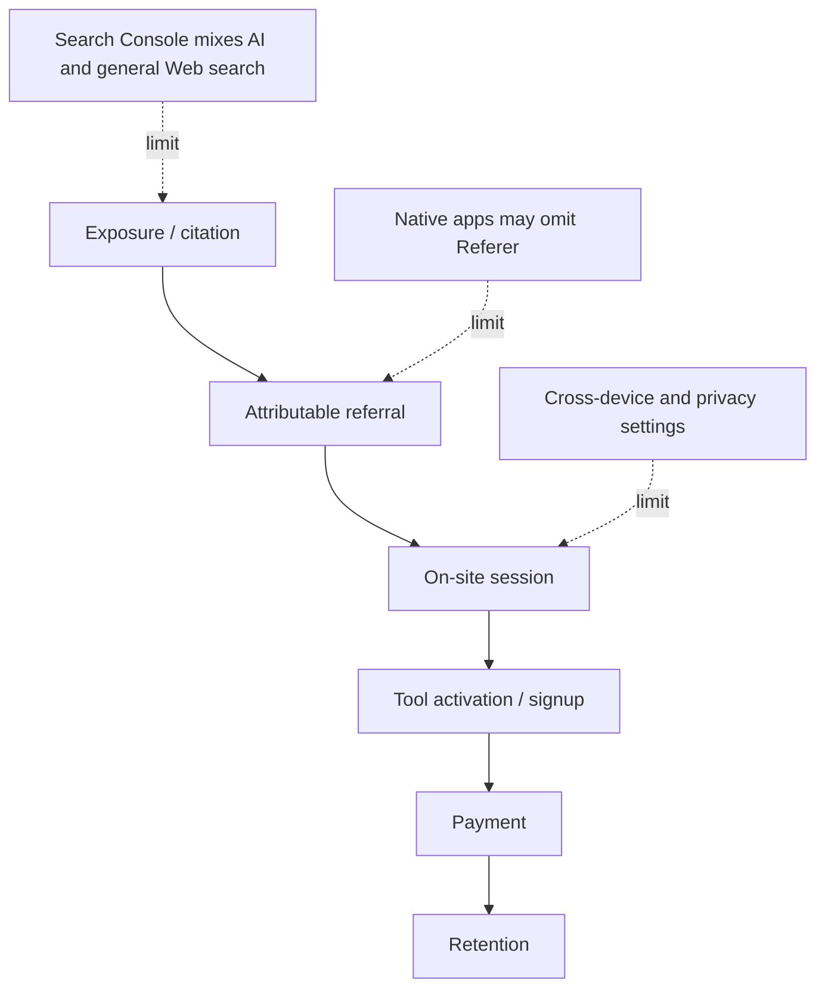

> 🌏 [中文版](/posts/product/2026-09-17-ai-overviews-change-traffic-path)

Traditional search resembles a library catalog clerk: it tells you where a book is, and you walk over to read it. An AI summary resembles a reader at the desk: it consults several books, assembles an answer, and then chooses which sources to list.

The analogy deliberately simplifies the snippets and direct answers that search already offered. Its point is narrower: **website content can participate in an answer before the reader visits the site.**

## A citation is not traffic

[Google's documentation](https://developers.google.com/search/docs/appearance/ai-features) says AI Overviews and AI Mode may use query fan-out, issuing searches across related subtopics and data sources before producing an answer with supporting links. This is Google's description of its own product. It does not mean every query triggers the process or every source used receives a click.

A content business must separate five events: retrieval, appearance in an answer or citation, a referral request, an identifiable session, and activation or payment. Treating the first two as the last three turns visibility into imaginary revenue.

| Layer | Observable signal | What it cannot establish |
|---|---|---|
| Crawled or retrieved | Crawler request, server log | A person saw the answer |
| Cited | Answer citation, brand exposure | A user clicked |
| Referral request | `Referer`, landing URL | A unique visitor or quality visit |
| On-site session | Analytics session | The content caused a purchase |
| Activation or conversion | Signup, tool use, paid event | Long-term retention and margin |

## What current evidence can support

[Pew Research Center](https://www.pewresearch.org/short-reads/2025/07/22/google-users-are-less-likely-to-click-on-links-when-an-ai-summary-appears-in-the-results/) analyzed tracked-device browsing data from 900 U.S. adults in March 2025, then reran the same queries on April 7–17 to classify the result pages. Queries classified as having an AI summary were followed by fewer clicks to standard results.

That is useful behavioral evidence, not a universal causal law. The sample covered U.S. adults, tracking had device boundaries, and summary exposure was reconstructed later even though results can change over time.

[Cloudflare's crawl-to-refer metric](https://blog.cloudflare.com/ai-search-crawl-refer-ratio-on-radar/) measures something else: HTML-response requests from platform-associated user agents relative to HTML requests carrying that platform's hostname in `Referer`. It is not CTR, a session count, or unique visitors. Cloudflare says Claude's native app omits `Referer` and believes other native apps may do the same, so the denominator may be undercounted by an unknown amount.

## Build a different dashboard

Google currently includes AI-feature performance within the Web search type in Search Console's Performance report. No single field can therefore answer the whole question.

A more useful dashboard joins Search Console, server referrers, and on-site events into cohorts: landing sessions, tool activation, leads, payment, and retention by source. Branded search, returning direct users, and email-driven visits offer directional signals about whether a relationship remains after discovery shifts, not single-source attribution; Direct must not be treated as synonymous with brand traffic.

Search still exists. AI summaries redraw the arrow from exposure to click, so a publisher can no longer treat that step as inevitable. The next article asks which content loses most of its value once compressed into an answer.

## References

- [Google Search Central: AI features and your website](https://developers.google.com/search/docs/appearance/ai-features)
- [Pew Research Center: Do people click on links in Google AI summaries?](https://www.pewresearch.org/short-reads/2025/07/22/google-users-are-less-likely-to-click-on-links-when-an-ai-summary-appears-in-the-results/)
- [Cloudflare: The crawl before the fall of referrals](https://blog.cloudflare.com/ai-search-crawl-refer-ratio-on-radar/)
