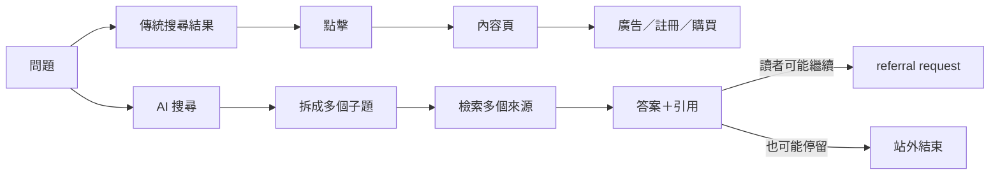
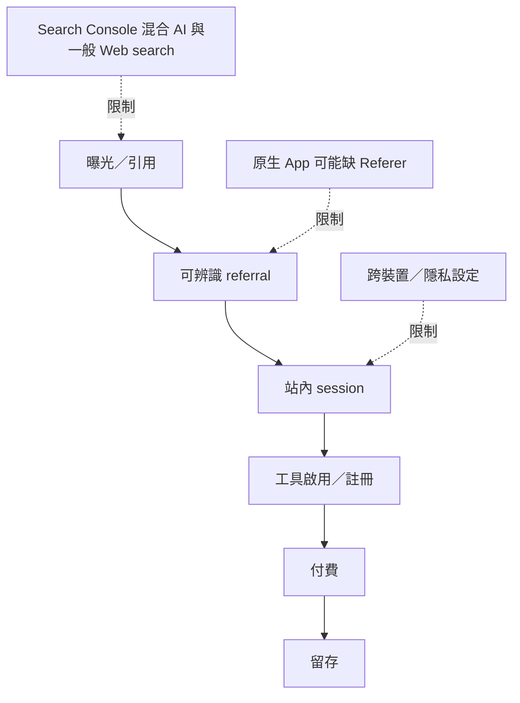

> 🌏 [English version](/en/posts/product/2026-09-17-ai-overviews-change-traffic-path-en)

以前搜尋像圖書館目錄員：告訴你書在哪裡，你得走到書架前讀。AI 摘要像代讀員：先翻過幾本書，把答案整理在櫃台，再決定附哪些書目。

這個比喻刻意簡化了傳統搜尋原本就有的摘要與即時答案。它要指出的改變是：**網站內容可以參與回答，讀者卻不必先進站。**

## 引用不等於流量

[Google 官方文件](https://developers.google.com/search/docs/appearance/ai-features)說，AI Overviews 與 AI Mode 可能使用 query fan-out：針對相關子題與資料來源發出多個查詢，再組成附 supporting links 的回答。這是 Google 對自家產品的描述，不代表每次查詢都觸發，也不保證每個被使用的來源都得到點擊。

因此，內容生意要拆開五件事：被檢索、出現在回答或引用、收到 referral request、形成可辨識 session，以及完成啟用或付費。把前兩項當成後三項，會把能見度誤算成收入。

| 層級 | 可觀察訊號 | 不能直接推出 |
|---|---|---|
| 被抓取／檢索 | crawler request、server log | 有人看過答案 |
| 被引用 | answer citation、品牌露出 | 使用者點擊 |
| referral request | `Referer`、landing URL | 去重訪客或高品質造訪 |
| 站內 session | analytics session | 內容造成購買 |
| 啟用／轉換 | signup、tool activation、paid event | 長期留存與毛利 |

## 現有資料能說到哪裡

[Pew Research Center](https://www.pewresearch.org/short-reads/2025/07/22/google-users-are-less-likely-to-click-on-links-when-an-ai-summary-appears-in-the-results/)分析 900 位美國成年人在 2025 年 3 月的 tracked-device browsing data，再於 4 月 7–17 日重跑相同查詢來分類結果頁。被分類為有 AI 摘要的查詢，之後點進一般結果的比例較低。

這是一個有用的行為訊號，卻不是全球網站的因果定律。樣本是美國成年人；裝置有追蹤範圍；AI 摘要是事後重建，而且可能隨時間改變。

[Cloudflare 的 crawl-to-refer](https://blog.cloudflare.com/ai-search-crawl-refer-ratio-on-radar/)量的是另一件事：平台相關 user agents 取得 HTML 回應的 requests，相對於帶有該平台 hostname `Referer` 的 HTML requests。它不是 CTR、session 或 unique visitor。Cloudflare 也指出 Claude 原生 App 不帶 `Referer`，並推測其他原生 App 可能相同，因此分母可能漏算，幅度未知。

## 新儀表板怎麼畫

Google 目前把 AI features 的表現併入 Search Console Performance 的 Web search type。網站因此不能期待一個欄位回答所有問題。

比較實用的做法是把 Search Console、server referrer 與站內事件接成 cohort：每個來源帶來多少 landing sessions、工具啟用、名單、付費與留存。同時追蹤品牌字搜尋、direct returning users 與 email 回訪，才能看出入口變動後，讀者關係是否仍留下來。這些都是方向性訊號，不是單一來源歸因；尤其 Direct 不能直接等同品牌流量。

搜尋仍然存在，AI 摘要重畫的是曝光到點擊之間的箭頭。網站不能再把這一步視為必然。下一篇會再問：哪些內容只要壓成一段答案，主要價值就已經被帶走？

## 參考資料

- [Google Search Central：AI features and your website](https://developers.google.com/search/docs/appearance/ai-features)
- [Pew Research Center：Do people click on links in Google AI summaries?](https://www.pewresearch.org/short-reads/2025/07/22/google-users-are-less-likely-to-click-on-links-when-an-ai-summary-appears-in-the-results/)
- [Cloudflare：The crawl before the fall of referrals](https://blog.cloudflare.com/ai-search-crawl-refer-ratio-on-radar/)
