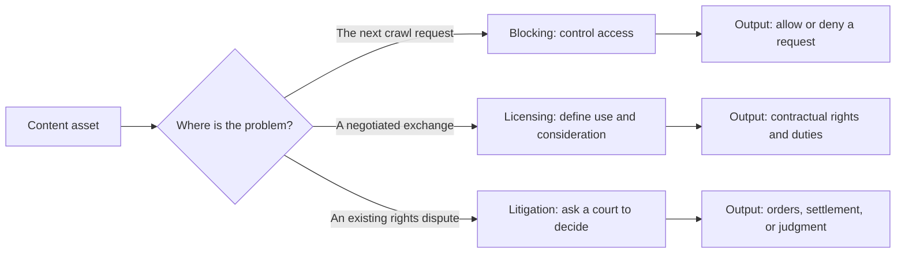
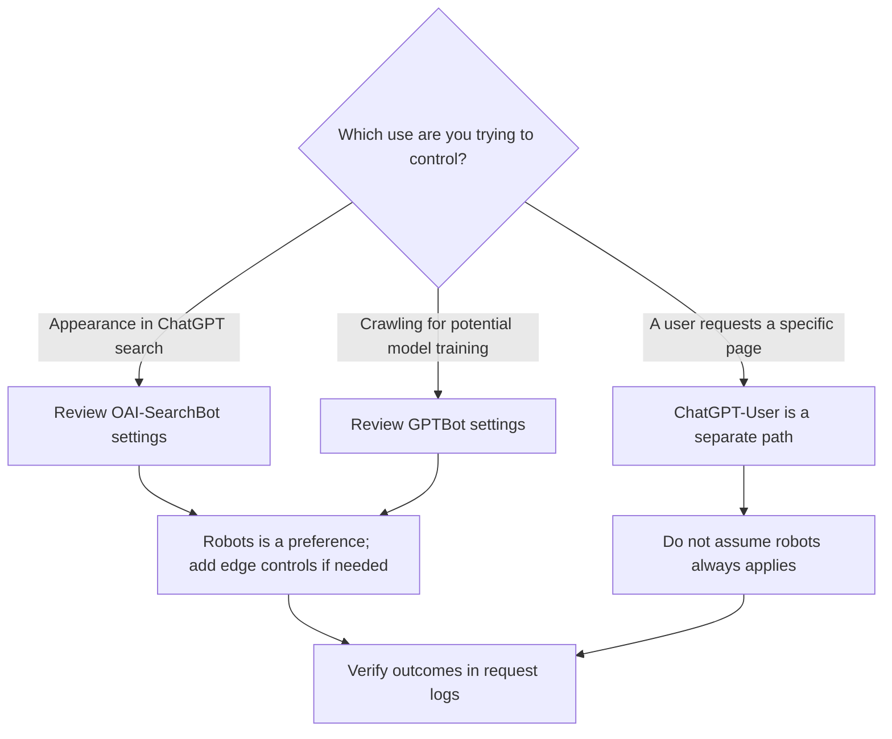
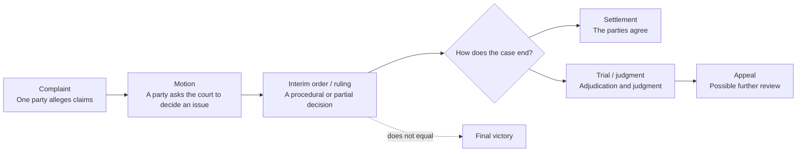
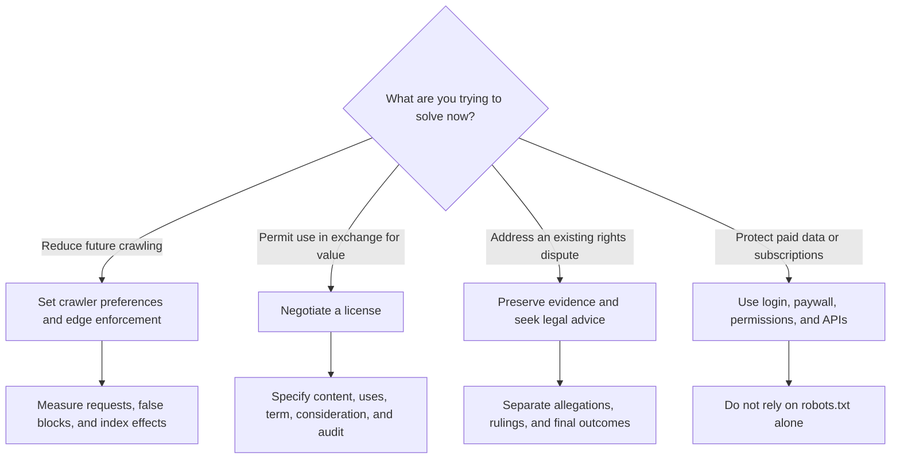

> 🌏 [中文版](/posts/product/2026-09-17-ai-search-block-license-lawsuit)

Imagine that you run a library. Blocking is the door policy: it determines whether the next visitor may enter. It can stop someone the system recognizes, but it cannot retrieve a book copied yesterday or make the person outside willing to pay.

Licensing is the borrowing agreement. You and a particular user define which books are available, what they may be used for, for how long, and what comes back in exchange. A contract can be more precise than a door policy, but it normally binds its parties; a press release is not the complete contract.

Litigation begins after a dispute. A plaintiff alleges that a right was violated, and a court considers liability and remedies. Filing a complaint is not winning a case, and an interim ruling is not a final judgment. All three tools may matter, but they protect different parts of a content business.

## Start with what each tool actually controls

| Tool | Direct target | Time direction | Direct output | Main limit | What to measure or preserve |
|---|---|---|---|---|---|
| `robots.txt` | Crawlers that choose to comply | Future | A preference about paths that should not be crawled | A voluntary signal, not a technical lock | Crawler requests, compliance, index changes |
| Edge or WAF blocking | Requests the system identifies | Future | Denial before content is returned | Identification, false positives, and evasion remain operational problems | Status codes, rule matches, false-positive rate |
| Licensing | Contracting parties and specified content | Future; it may also cover existing material | Uses, scope, term, consideration, and delivery duties | Does not bind nonparties; announcements rarely reveal full terms | Usage records, delivery scope, audit and renewal terms |
| Litigation | Parties, claims, and applicable law in a case | Looks back at a dispute and may shape future conduct | A court process and possible legal remedies | Cost, delay, and uncertain outcomes; one case is not a global rule | Evidence, document stage, jurisdiction, case status |

## Blocking protects the next access request—not history or demand

The first distinction is between `robots.txt` and technical enforcement. Cloudflare's documentation says compliance with `robots.txt` is voluntary: the file expresses a site's preferences but does not technically prevent access. Cloudflare's AI Crawl Control is a separate layer. It can enforce a WAF rule against an identified crawler with a `403` response, and some configurations can return `402` instead. [Cloudflare: managed robots.txt](https://developers.cloudflare.com/bots/additional-configurations/managed-robots-txt/); [Cloudflare: manage AI crawlers](https://developers.cloudflare.com/ai-crawl-control/features/manage-ai-crawlers/)

Even then, “block AI” is too broad. One company may use different user agents for different jobs. OpenAI separates `OAI-SearchBot`, `GPTBot`, and `ChatGPT-User`: the first two concern search appearance and crawling that may be used to train foundation models, respectively; the third is triggered by user action, and OpenAI notes that `robots.txt` rules may not apply. Blocking `GPTBot` therefore does not mean opting out of every ChatGPT search surface. Allowing `OAI-SearchBot` does not grant every training use. [OpenAI crawler documentation](https://platform.openai.com/docs/gptbot)

Blocking can reduce future supply. It cannot recall an existing copy, establish infringement, or create a willing buyer. Cloudflare's Pay Per Crawl experiments with a third edge response: a publisher may allow, charge, or block an authenticated crawler and set a per-request price. But Cloudflare still describes it as a private or closed beta and a very early experiment. It demonstrates that paid access can be implemented as a mechanism; it does not demonstrate stable publisher revenue. [Cloudflare: Introducing Pay Per Crawl](https://blog.cloudflare.com/introducing-pay-per-crawl)

## Licensing protects a negotiated exchange

Licensing does more than open the door: it specifies the exchange. Content scope, permitted uses, term, update method, consideration, audits, termination, and treatment of derivative data can all be contractual questions. The contract defines the actual boundary. Outsiders usually see only the summary that the parties chose to publish.

According to transaction party AP's 2023 announcement, OpenAI would license part of AP's text archive, while AP would gain access to OpenAI's technology and product expertise; the parties would explore generative AI use cases in news products and services. The announcement did not disclose a price, a complete content schedule, or every permitted use, and cannot independently establish actual usage, performance, or economic results. [AP–OpenAI announcement](https://www.ap.org/media-center/press-releases/2023/ap-open-ai-agree-to-share-select-news-content-and-technology-in-new-collaboration)

According to transaction party News Corp's 2024 announcement, the arrangement is a multi-year partnership. Its public description says OpenAI may display content from specified News Corp news brands in response to questions, use current and archived content, and “enhance its products.” The announcement also expressly excludes News Corp's other businesses. That supports the disclosed scope, but cannot independently establish performance or economic results, nor support an invented price, a complete set of legal terms, or a claim that “enhance its products” grants one precisely defined model-training right. [News Corp–OpenAI announcement](https://newscorp.com/2024/05/22/news-corp-and-openai-sign-landmark-multi-year-global-partnership)

The two examples show that deals can be structured differently; they do not establish a market rate. A publisher preparing for licensing should inventory what it can deliver, which rights the counterparty receives, and which records will verify use—not imitate the wording of a press release.

## Litigation protects legal claims, not the business model itself

Litigation asks whether past conduct violated a right and what remedy may be available. The New York Times Company's document index shows that it filed a complaint on December 27, 2023 and lists the complaint and exhibits. That establishes that a case was filed. Statements in the complaint remain the plaintiff's allegations, not judicial findings. This article uses the filing to demonstrate the difference between an allegation and a ruling; it does not use that source to establish the docket's latest status as of the research date. [NYT Company litigation documents](https://www.nytco.com/press/lawsuit-documents-dec-2023)

The safest first step when reading an AI copyright case is to identify the document stage:

A claim surviving to a later stage does not mean that the plaintiff ultimately wins. A settlement may end a dispute without creating a holding that another court must apply. As of this article's research date, the U.S. Copyright Office still labels Part 3 of its AI report, on generative AI training, as a pre-publication version with a final version forthcoming. That is another reason not to turn one U.S. case into a rule for Taiwan or the world. [U.S. Copyright Office: Copyright and Artificial Intelligence](https://copyright.gov/ai/)

## In practice, choose the tool after defining the objective

A content company may use all three. It might admit a search crawler on public pages, exclude a training crawler, negotiate a license with a particular platform, and preserve evidence if a dispute arises. Combining the tools does not erase their individual limits.

The useful sequence is to identify the part of the business that needs protection before choosing a mechanism. To reduce the next crawl, implement access controls that can be tested. To exchange content for value, negotiate a clear contract. To address a past rights violation, use the legal process in the relevant jurisdiction. If the real asset is paid data, authentication, permissions, APIs, and audit trails are usually closer to the core than a `robots.txt` file.

This article analyzes business models and product controls; it is not legal advice. Taiwanese publishers facing cross-border licensing or copyright disputes should seek counsel based on the location of the content, the relevant conduct, and the contract's governing law.

## References

- [Cloudflare: Managed robots.txt](https://developers.cloudflare.com/bots/additional-configurations/managed-robots-txt/)
- [Cloudflare: Manage AI crawlers](https://developers.cloudflare.com/ai-crawl-control/features/manage-ai-crawlers/)
- [Cloudflare: Introducing Pay Per Crawl](https://blog.cloudflare.com/introducing-pay-per-crawl)
- [OpenAI: Overview of OpenAI crawlers](https://platform.openai.com/docs/gptbot)
- [Associated Press: AP and OpenAI agree to share select news content and technology](https://www.ap.org/media-center/press-releases/2023/ap-open-ai-agree-to-share-select-news-content-and-technology-in-new-collaboration)
- [News Corp: News Corp and OpenAI sign multi-year global partnership](https://newscorp.com/2024/05/22/news-corp-and-openai-sign-landmark-multi-year-global-partnership)
- [The New York Times Company: Lawsuit documents](https://www.nytco.com/press/lawsuit-documents-dec-2023)
- [U.S. Copyright Office: Copyright and Artificial Intelligence](https://copyright.gov/ai/)
