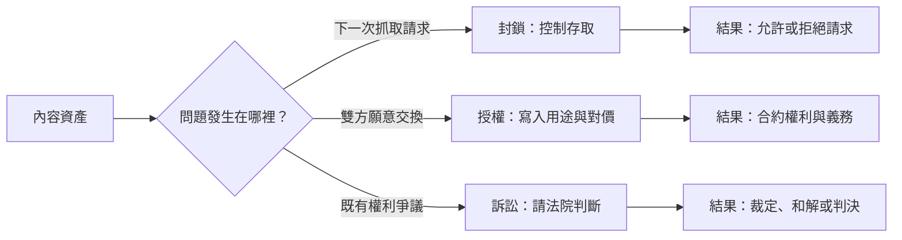
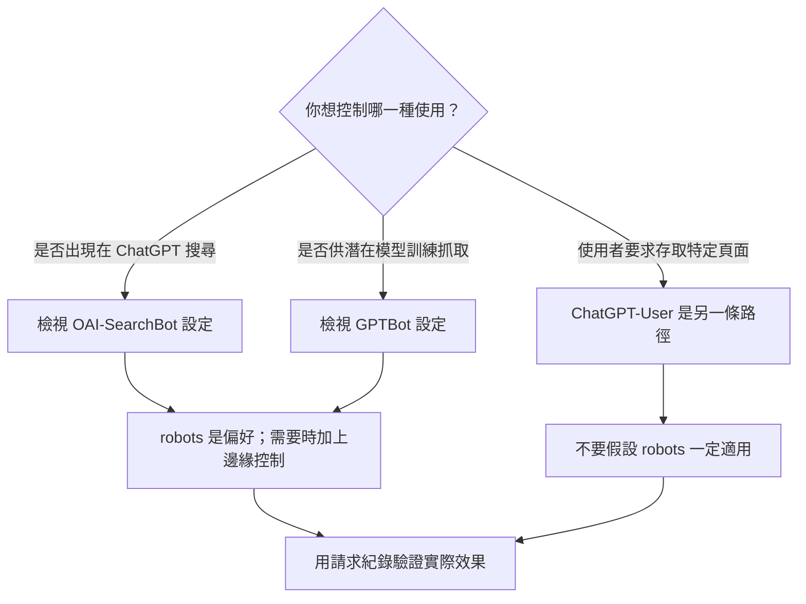
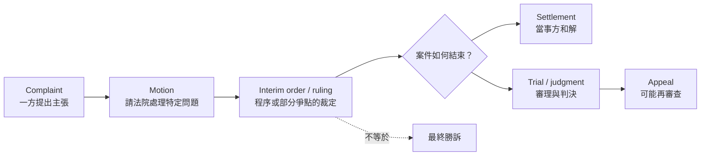
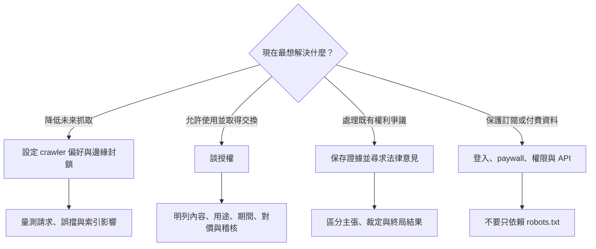

> 🌏 [English version](/en/posts/product/2026-09-17-ai-search-block-license-lawsuit-en)

想像你開了一間圖書館。封鎖像門禁：決定下一位訪客能不能進門。它可以擋住辨識得到的人，卻不能叫回昨天已經抄走的書，也不會自動讓門外的人願意付錢。

授權像借閱合約：你和某位使用者談好哪些書能借、拿去做什麼、借多久，以及對方要交換什麼。合約可以比門禁細，但通常只約束簽約雙方；新聞稿也不是完整合約。

訴訟則像發生爭議後去法院。原告可以主張權利受侵害，法院再判斷責任與救濟。遞出訴狀不等於勝訴，中途裁定也不等於終局判決。這三種手段都可能有用，只是保護內容生意的不同環節。

## 先看三者真正控制什麼

| 手段 | 直接控制的對象 | 時間方向 | 可直接得到什麼 | 主要限制 | 應該量測或留存 |
|---|---|---|---|---|---|
| `robots.txt` | 願意遵守規則的 crawler | 未來 | 表達哪些路徑不希望被抓 | 是自願訊號，不是技術門鎖 | crawler 請求、遵守率、索引變化 |
| 邊緣／WAF 封鎖 | 被系統辨識的請求 | 未來 | 在回傳內容前拒絕存取 | 會有辨識、誤擋與繞過問題 | 狀態碼、命中規則、誤擋率 |
| 授權 | 簽約雙方與約定內容 | 未來，亦可處理既有素材 | 用途、範圍、期間、對價與交付義務 | 不約束未簽約者；公開公告通常不含完整條款 | 使用紀錄、交付範圍、稽核與續約條件 |
| 訴訟 | 特定案件的當事人、請求與法律 | 回看既有爭議，也可能影響未來行為 | 法院程序與可能的法律救濟 | 成本、時間與結果不確定；個案不等於全球規則 | 證據、文件階段、管轄與案件狀態 |

## 封鎖保護的是下一次存取，不是過去與需求

最容易混淆的是 `robots.txt` 和真正的技術阻擋。Cloudflare 的官方文件直接說明，遵守 `robots.txt` 是自願的：它表達網站偏好，卻不會在網路層阻止 crawler 存取。Cloudflare 的 AI Crawl Control 才是另一層做法，能用 WAF 規則對辨識到的 crawler 回應 `403`，部分設定亦可回應 `402`。[Cloudflare：managed robots.txt](https://developers.cloudflare.com/bots/additional-configurations/managed-robots-txt/)；[Cloudflare：管理 AI crawlers](https://developers.cloudflare.com/ai-crawl-control/features/manage-ai-crawlers/)

即使如此，「封鎖 AI」仍然太籠統。同一家平台也可能用不同 user agent 執行不同任務。OpenAI 把 `OAI-SearchBot`、`GPTBot` 與 `ChatGPT-User` 分開：前兩者分別涉及搜尋呈現與可能用於基礎模型訓練的抓取，後者則由使用者動作觸發，官方提醒 `robots.txt` 規則可能不適用。因此，封鎖 `GPTBot` 不能寫成退出所有 ChatGPT 搜尋；允許 `OAI-SearchBot` 也不是同意所有訓練用途。[OpenAI crawler 文件](https://platform.openai.com/docs/gptbot)

封鎖能降低未來供給，卻不能召回已取得的副本、證明侵權，或創造願意付款的買方。Cloudflare 的 Pay Per Crawl 嘗試在邊緣層讓出版者選擇允許、收費或封鎖，並以每次請求計價。官方仍把它稱為 private／closed beta、很早期的實驗。它證明「付費存取」可以被做成技術機制，不證明出版者已經得到穩定收入。[Cloudflare：Introducing Pay Per Crawl](https://blog.cloudflare.com/introducing-pay-per-crawl)

## 授權保護的是談妥的交換

授權會把交換條件寫清楚。內容範圍、允許用途、期間、更新方式、對價、稽核、終止與衍生資料如何處理，都可能是條款。真正的權利邊界要看合約；外界通常只能看到雙方選擇公開的摘要。

依交易當事方 AP 的 2023 年官方公告，OpenAI 取得 AP 部分文字檔案的授權，AP 則取得 OpenAI 的技術與產品專業。雙方會探索生成式 AI 在新聞產品與服務中的用途。公告沒有公開價格、完整內容清單或所有允許用途，也不能獨立證明實際使用量、履約結果或經濟成效。[AP × OpenAI 公告](https://www.ap.org/media-center/press-releases/2023/ap-open-ai-agree-to-share-select-news-content-and-technology-in-new-collaboration)

依交易當事方 News Corp 的 2024 年官方公告，這是一項多年合作。公開文字包括：OpenAI 可在回答問題時呈現指定新聞品牌的內容、使用其現行與歷史內容，並「enhance its products」。公告也明確排除 News Corp 的其他業務。這足以證明公開的合作範圍，卻不能獨立證明履約結果或經濟成效，也不足以讓外界自行補出金額、完整法律條款，或把「enhance products」精確翻成某一種模型訓練權。[News Corp × OpenAI 公告](https://newscorp.com/2024/05/22/news-corp-and-openai-sign-landmark-multi-year-global-partnership)

兩個案例呈現不同的交易設計，不能拼成一張市場公定價。內容公司要談授權，應先盤點自己能交付什麼、對方取得什麼權利，以及用什麼紀錄驗證使用範圍。

## 訴訟保護的是法律請求，不是商業模式保證

訴訟處理的是「已發生的行為是否侵害權利、可以得到什麼救濟」。The New York Times Company 的文件索引顯示，它在 2023 年 12 月 27 日提出 complaint，並列出 complaint 與附件。這能證明訴訟已提出；訴狀內容仍是原告的 allegations，不是法院認定的事實。本文以起訴文件示範如何區分主張與裁判，不以此來源判定案件截至研究日的最新程序狀態。[NYT Company 訴訟文件索引](https://www.nytco.com/press/lawsuit-documents-dec-2023)

讀 AI 與著作權案件時，最基本的防錯方法是先看文件階段：

一項請求能繼續審理，不代表原告最後勝訴；案件和解，也未必建立可供其他案件直接套用的判例。截至本文研究日，美國著作權局仍把生成式 AI 訓練報告 Part 3 標為 pre-publication，正式版本尚待發布。單一美國案件更不適合被外推為台灣或全球定論。[U.S. Copyright Office：Copyright and Artificial Intelligence](https://copyright.gov/ai/)

## 實務上，先問目標再選工具

內容公司可以同時採用三者。例如公開頁讓搜尋 crawler 進入、訓練 crawler 退出，另與特定平台談授權，遇到爭議時再保存證據並評估法律程序。但組合使用不會消除每一項工具的邊界。

最重要的判斷順序是：先說清楚要保護哪一段，再選工具。要降低下一次抓取，就做可驗證的存取控制；要把內容交換成對價，就談清楚合約；要處理既有侵害主張，就交給適用管轄下的法律程序。若真正要保護的是付費資料，登入、權限、API 與稽核通常比一份 `robots.txt` 更接近核心。

本文是商業模式與產品控制的拆解，不是法律意見。台灣業者遇到跨境授權或著作權爭議，仍應依內容所在地、使用行為與合約管轄尋求專業法律意見。

## 參考資料

- [Cloudflare：Managed robots.txt](https://developers.cloudflare.com/bots/additional-configurations/managed-robots-txt/)
- [Cloudflare：Manage AI crawlers](https://developers.cloudflare.com/ai-crawl-control/features/manage-ai-crawlers/)
- [Cloudflare：Introducing Pay Per Crawl](https://blog.cloudflare.com/introducing-pay-per-crawl)
- [OpenAI：Overview of OpenAI crawlers](https://platform.openai.com/docs/gptbot)
- [Associated Press：AP and OpenAI agree to share select news content and technology](https://www.ap.org/media-center/press-releases/2023/ap-open-ai-agree-to-share-select-news-content-and-technology-in-new-collaboration)
- [News Corp：News Corp and OpenAI sign multi-year global partnership](https://newscorp.com/2024/05/22/news-corp-and-openai-sign-landmark-multi-year-global-partnership)
- [The New York Times Company：Lawsuit documents](https://www.nytco.com/press/lawsuit-documents-dec-2023)
- [U.S. Copyright Office：Copyright and Artificial Intelligence](https://copyright.gov/ai/)
