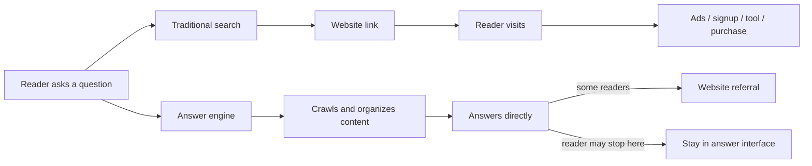
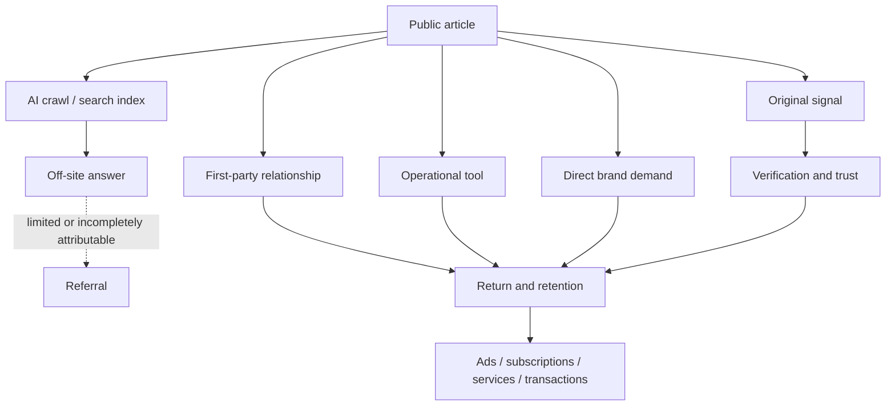

> 🌏 [中文版](/posts/product/2026-09-17-ai-takes-clicks-free-content-assets)

Think of a search engine as a library catalog clerk. You ask a question, it points you to a book and perhaps a page, and you walk over to read it yourself.

An answer engine is more like someone who reads on your behalf. It studies many books and recites the useful parts. You may learn which book supplied the material without ever walking to the shelf.

For a free-content business, the issue is not merely whether it receives a citation. The real question is: **if the reader never visits, can they still register, use a tool, buy, or return?**

The diagram does not assume that every AI query produces zero clicks. It shows a structural change: content can be read, restated, and cited while referral remains a separate event.

## What crawl-to-refer actually measures

[Cloudflare's crawl-to-refer ratio, published in July 2025](https://blog.cloudflare.com/ai-search-crawl-refer-ratio-on-radar/), divides HTML-response requests from user agents associated with a platform by HTML requests whose `Referer` contains a hostname associated with that platform, then normalizes the result to one referral request.

A useful reading is: how many HTML fetches were observed relative to each attributable referral request? It is not a session, unique-visitor, or click-through metric, nor does it say that a model impression produced a human click. The numerator and denominator represent different events, and crawling may support indexing, refreshes, or other jobs.

Cloudflare also gives an important warning: traffic from Claude's native app lacks a `Referer`, and Cloudflare believes the same may hold for other native apps. The denominator may therefore be undercounted by an unknown amount. The data supports only a narrow conclusion: crawling and identifiable referrals can be highly asymmetric. It does not establish an exact traffic loss for every publisher or a clean cross-platform CTR ranking.

| Metric or action | What it can answer | What it cannot answer |
|---|---|---|
| HTML crawler requests | How often a bot fetches pages | How many people saw, liked, or trusted an answer |
| Identifiable referral requests | HTML requests carrying an attributable `Referer` | App traffic without `Referer`, or visit quality |
| Crawl-to-refer ratio | Relative volume of crawling and identifiable referrals | CTR, total traffic decline, or publisher-level causality |
| Blocking a crawler | Control over some content supply | Automatic traffic recovery or reader demand |
| On-site conversion cohorts | Whether sources activate or pay after arrival | What non-visitors later did |

## AI may take the entrance, not every asset

Free content often earns money through a long causal chain: discovery leads to a click, which may lead to an ad impression, a lead, tool activation, or a transaction. Answer engines move the act of getting an answer off-site. The entrance to that chain feels the pressure first.

But a content business does not have to retain only article pages and sessions. It can build four assets with more direct control:

1. **First-party relationships:** email, accounts, memberships, and communities created with user consent. Their value lies in a legitimate way to reconnect, along with understandable controls and portability. Maximum collection is not the goal.
2. **Operational tools:** calculation, monitoring, comparison, transactions, or workflow. A summary may explain a method without doing the recurring job for the user.
3. **Original signals:** exclusive interviews, proprietary data, tests, revision histories, and provenance. They can still be summarized, but they make the brand a source that answers must return to and verify.
4. **Direct brand demand:** readers type the URL, open the app, subscribe to notifications, or deliberately search for the brand. This traffic comes from a habit earned through reliable delivery; it is not costless.

None is a magic shield. People unsubscribe, tools require maintenance, original data ages, and one failure can damage brand trust. The difference is that these assets preserve a reason for the next interaction between publisher and reader instead of renting every visit from a discovery gatekeeper.

## A new dashboard needs more than sessions

Traffic still matters, but it belongs beside the job that follows. A useful dashboard can add branded search, direct visits, net email growth, tool activation, qualified referrals, and conversion per visit, then compare retention by source cohort.

[Google's official documentation](https://developers.google.com/search/docs/appearance/ai-features) says traffic from AI Overviews and AI Mode is included in Search Console's overall Web search type rather than reported as a separate category. A publisher therefore cannot treat one AI-traffic field as a complete measurement of the change.

A [2025 Pew Research Center study](https://www.pewresearch.org/short-reads/2025/07/22/google-users-are-less-likely-to-click-on-links-when-an-ai-summary-appears-in-the-results/) paired March 2025 Google browsing records from 900 U.S. adults with result pages collected by rerunning the same queries on April 7–17. Queries classified as having an AI summary were followed by fewer clicks to standard results. Because summary exposure was reconstructed later and can change over time, this is an association within a specific sample, period, and classification method—not a universal causal estimate of publisher traffic loss.

AI referrals may be scarce yet arrive with a specific problem. They may also be fallback clicks after an inadequate answer. Without activation, payment, and retention data, a referrer alone cannot establish quality.

Likewise, `robots.txt`, crawler blocking, licensing, and pay-per-crawl address content supply and exchange terms. They may be strategically useful, but they do not create demand by themselves, and blocking does not guarantee that traffic returns.

## The next job for free content

Answer engines do not make free content useless. They force a stricter question: after an article is read, what remains?

If the only answer is a pageview, a change at the entrance changes the business. If the article brings the right reader into an owned relationship, a useful tool, an original signal, or a direct brand habit, it can still begin acquisition. Search clicks simply can no longer be treated as an entitlement.

The next series will continue the inquiry. It will identify the content that answer engines can commoditize most easily and distinguish what blocking, licensing, and legal action each protect. It will then examine how a business can leave a rented SEO entrance for a brand that readers deliberately revisit.

## References

- [Cloudflare: AI search crawl-to-refer ratio and crawler data](https://blog.cloudflare.com/ai-search-crawl-refer-ratio-on-radar/)
- [Google Search Central: site appearance and measurement in Google AI features](https://developers.google.com/search/docs/appearance/ai-features)
- [Pew Research Center: search clicking behavior when AI summaries appear](https://www.pewresearch.org/short-reads/2025/07/22/google-users-are-less-likely-to-click-on-links-when-an-ai-summary-appears-in-the-results/)
