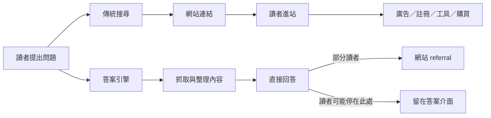
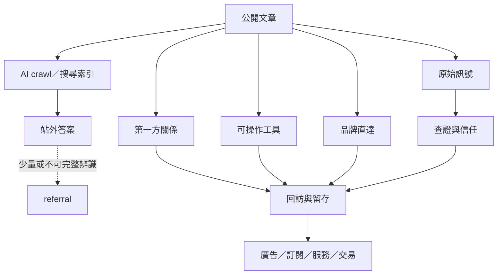

> 🌏 [English version](/en/posts/product/2026-09-17-ai-takes-clicks-free-content-assets-en)

把搜尋引擎想成圖書館的目錄員。你問一個問題，它告訴你哪本書、哪一頁可能有答案，於是你走到書架前自己讀。

答案引擎更像代讀員。它先讀過許多書，再把重點直接念給你。你可能知道資料來自哪本書，卻不一定還需要走到書架前。

對免費內容網站來說，差別不只是「有沒有被引用」。真正的問題是：**讀者沒有進站，還會不會完成註冊、使用工具、購買或回訪？**

這張圖沒有假設所有 AI 查詢都不會帶來點擊。它只指出一個結構變化：內容可以被讀取、重述與引用，但導流是另一件事。

## Crawl-to-refer 到底量了什麼

[Cloudflare 在 2025 年 7 月公布的 crawl-to-refer ratio](https://blog.cloudflare.com/ai-search-crawl-refer-ratio-on-radar/) 是：某平台相關 user agents 取得 HTML 回應的 request 數，除以 `Referer` 可辨識為該平台的 HTML request 數，再正規化為每一個 referral request 相對有多少 crawler requests。

可以把它讀成：相對於每一個「可辨識的導流 request」，觀察到多少次 HTML 抓取。它不是 session、unique visitor 或點擊率，也不是「模型看了幾次就有幾人點擊」。分子與分母來自不同事件，抓取也可能服務索引、更新或其他用途。

更重要的是，Cloudflare 指出 Claude 原生 App 的流量不帶 `Referer`，並推測其他原生 App 也可能如此。分母可能因此漏算，讓比率看起來更高；偏差有多大則不知道。這組資料只能說明「抓取量與可辨識導流量可能很不對稱」。它不能證明每一家出版商損失了多少流量，也不適合當成跨平台的 CTR 排行榜。

| 指標或動作 | 能回答什麼 | 不能回答什麼 |
|---|---|---|
| HTML crawler requests | 平台機器人對頁面的抓取量 | 有多少人看過、喜歡或相信答案 |
| 可辨識 referral requests | 帶有可歸因 `Referer` 的 HTML requests | App 未傳 `Referer` 的流量、造訪品質 |
| crawl-to-refer ratio | 抓取與可辨識導流的相對量 | CTR、全站流量跌幅、單一出版商因果 |
| 封鎖 crawler | 控制部分內容供給 | 自動恢復搜尋流量或創造讀者需求 |
| 站內轉換 cohort | 不同來源進站後是否啟用或付費 | 沒進站的使用者後來做了什麼 |

## 被拿走的是入口，不一定是資產

免費內容原本常靠一條很長的因果鏈賺錢：先被搜尋找到，再換到點擊，接著才有廣告曝光、名單、工具啟用或交易。答案引擎把「取得答案」往站外搬，最先受壓的是這條鏈的入口。

但內容生意不必只留下文章頁和 session。還有四類比較能被自己掌握的資產：

1. **第一方關係**：經使用者同意取得的 email、帳號、會員與社群關係。價值在於能否再次聯絡，也在於使用者能否理解、管理或帶走資料；蒐集量不是目標。
2. **可操作工具**：計算、監控、比較、交易或工作流程。摘要能解釋方法，卻不一定能替使用者持續完成工作。
3. **原始訊號**：獨家採訪、自有資料、實測、更新紀錄與來源脈絡。它們不保證不被摘要，卻讓品牌成為答案必須回頭查證的源頭。
4. **品牌直達**：讀者直接輸入網址、開啟 App、訂閱通知或主動搜尋品牌。這種流量來自長期可靠交付所養成的習慣，並非無成本取得。

這四類資產也不是護身符。Email 會退訂，工具需要維護，原始資料會過時，品牌信任也可能一次失誤就受傷。差別在於，它們把下一次互動的理由留在自己與讀者之間，而不是每次都重新向搜尋入口租一個點擊。

## 新儀表板不該只剩 sessions

流量仍然重要，但要和後續工作放在一起看。儀表板可以加入品牌字搜尋、直接造訪、email 淨成長、工具啟用、合格 referral 與每次造訪的轉換，也要比較不同來源 cohort 的留存。

[Google 的官方文件](https://developers.google.com/search/docs/appearance/ai-features)說，AI Overviews 與 AI Mode 帶來的流量會合併計入 Search Console 的「網頁」搜尋類型，而不是拆成獨立報表。這表示站方不能只看一個 AI 流量欄位，就以為已經量完影響。

[Pew Research Center 的 2025 年研究](https://www.pewresearch.org/short-reads/2025/07/22/google-users-are-less-likely-to-click-on-links-when-an-ai-summary-appears-in-the-results/)將 900 位美國成年人在 2025 年 3 月的 Google 瀏覽紀錄，與研究團隊在 4 月 7 至 17 日重跑相同查詢所收集的結果頁配對。被分類為有 AI 摘要的查詢，下一步點進一般搜尋結果的比例較低；由於摘要是事後重建且可能隨時間改變，這是特定樣本、期間與分類方法下的關聯，不是所有網站流量下降的因果定律。

AI referral 可能少，卻可能帶著更明確的問題進站；也可能只是找不到答案後的補救點擊。沒有站內啟用、付費和留存資料，就不能只靠 referrer 判斷品質。

同樣地，`robots.txt`、crawler blocking、授權或 pay-per-crawl 都是在處理內容供給與交換條件。它們可能有策略價值，卻不會自動創造需求，也不能保證封鎖之後流量回來。

## 免費內容的下一步

答案引擎沒有讓免費內容失去用途。它逼企業回答一個更嚴格的問題：文章除了被讀完，還留下了什麼？

如果答案只有 pageview，入口一改，生意就跟著改。如果文章能把適合的讀者帶進自有關係、工具、原始訊號與品牌習慣，它仍然是獲客起點，只是不再能把搜尋點擊當成理所當然。

下一個系列會繼續往前追問。我們會找出最容易被答案引擎商品化的內容，也會區分封鎖、授權與法律行動各自保護的東西。最後再談如何離開 SEO 的租用入口，走向讀者會主動回來的品牌直達。

## 參考資料

- [Cloudflare：AI 搜尋的 crawl-to-refer ratio 與 crawler 資料](https://blog.cloudflare.com/ai-search-crawl-refer-ratio-on-radar/)
- [Google Search Central：網站在 Google AI 功能中的呈現與計量](https://developers.google.com/search/docs/appearance/ai-features)
- [Pew Research Center：AI 摘要出現時的搜尋點擊行為研究](https://www.pewresearch.org/short-reads/2025/07/22/google-users-are-less-likely-to-click-on-links-when-an-ai-summary-appears-in-the-results/)
