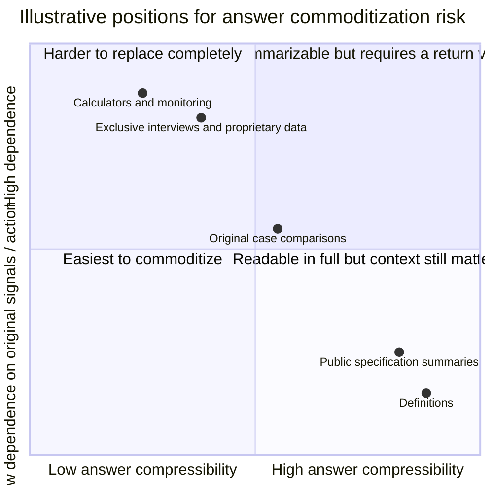
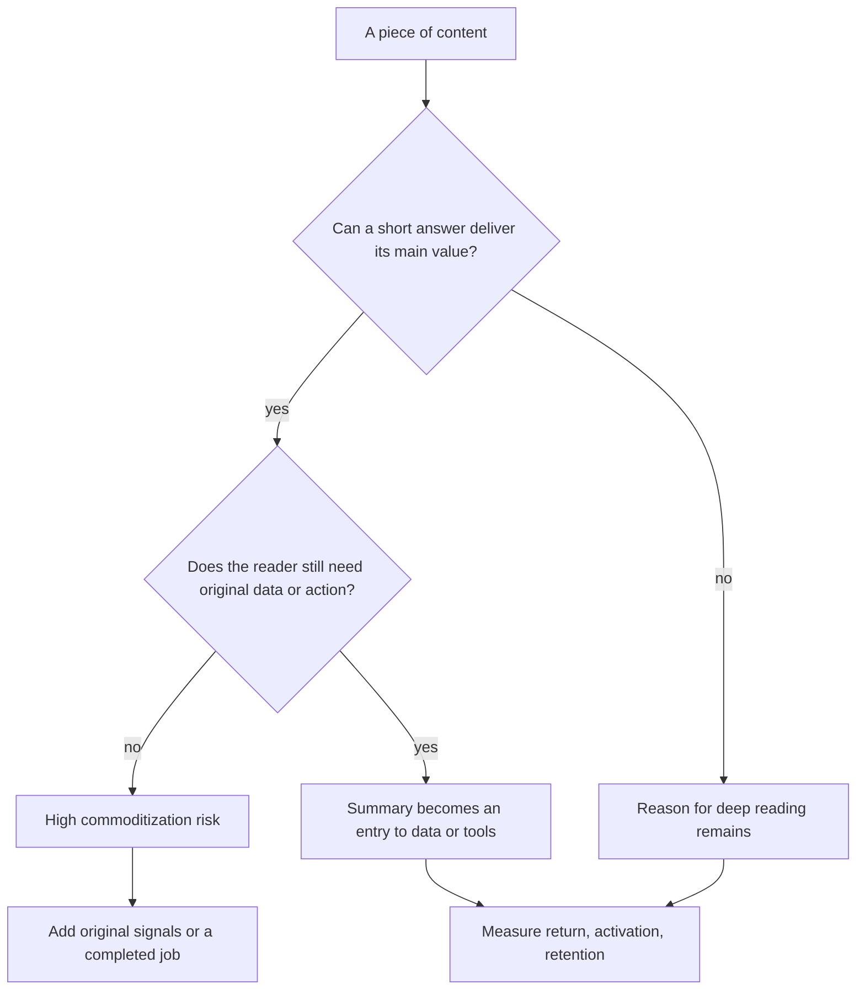

> 🌏 [中文版](/posts/product/2026-09-17-answer-engine-content-commoditization)

Imagine two restaurants. One rewrites public recipes onto attractive cards. The other has its own ingredients, kitchen, chef, and regulars. An answer engine can compress the first restaurant's recipe card into three steps. Reading a summary cannot eat the second restaurant's dinner for you.

Content follows the same distinction. An answer engine may summarize an article without replacing the data, tool, or relationship behind it. The risk test is not whether AI wrote the page. It is: **can the primary value be delivered completely inside a short answer?**

## Two axes matter more than format

The following is an analytical framework, not a published ranking of all content. Coordinates illustrate relative positions; they are not measured scores.

**Answer compressibility** asks how much primary value survives after structure, voice, and examples disappear. The second axis is **dependence on original signals or action**. It asks whether the reader still needs current data, author trust, personal inputs, calculation, a transaction, or a workflow.

| Content | What survives compression | Reason to return | Risk |
|---|---|---|---|
| Definitions and generic steps | Most core information | Weak | High |
| Public specification summaries | Numbers and bullets | Check the latest version | High to medium |
| Original comparisons and cases | Conclusion survives; method may not | Inspect evidence and limits | Medium |
| Exclusive interviews and proprietary data | Conclusion is quotable; source remains scarce | Verify, update, license | Lower |
| Calculators, monitoring, transaction workflows | Text explains but cannot keep doing the job | Input, compute, save, act | Lower |

“Lower” does not mean safe. Exclusive data can still be summarized, and models may absorb simple tool functions. The distinction is whether the summary completes the entire job.

## The greatest risk is having no next step

[Google says AI Overviews and AI Mode may use query fan-out](https://developers.google.com/search/docs/appearance/ai-features), combining related subtopics and sources. That mechanism makes definitions, public specifications, and generic steps easy to decompose and recombine. This is an inference from the mechanism, not a Google content-risk ranking.

[Pew's 2025 study](https://www.pewresearch.org/short-reads/2025/07/22/google-users-are-less-likely-to-click-on-links-when-an-ai-summary-appears-in-the-results/) also found that longer, question-like, and full-sentence queries were more often classified by its method as producing an AI summary. The study covered a U.S. sample, Google, and a specific period, with summaries classified by rerunning queries later. It shows that answer interfaces appear on complex questions; it does not prove that any article type inevitably loses traffic.

## Producing more summaries is not a defense

[Google's spam policies](https://developers.google.com/search/docs/essentials/spam-policies) explicitly include attempts to manipulate generative AI responses in Search. Producing large volumes of keyword-swapped text with little added value does not reduce substitutability. It expands the supply of content that is easy to compress.

Making every article longer does not solve the problem. A more useful redesign connects it to a job the summary cannot complete: auditable original records, user-provided inputs, saved monitoring conditions, a consented membership relationship, or an actual service or transaction.

Run two tests on each page. First, ask an editor to compress it into five sentences. If little value disappears, compressibility is high. Second, ask what the reader must return to do after those five sentences. If there is no concrete action, the page remains a one-time answer rather than an asset.

## References

- [Google Search Central: AI features and your website](https://developers.google.com/search/docs/appearance/ai-features)
- [Google Search Central: Spam policies](https://developers.google.com/search/docs/essentials/spam-policies)
- [Pew Research Center: Do people click on links in Google AI summaries?](https://www.pewresearch.org/short-reads/2025/07/22/google-users-are-less-likely-to-click-on-links-when-an-ai-summary-appears-in-the-results/)
