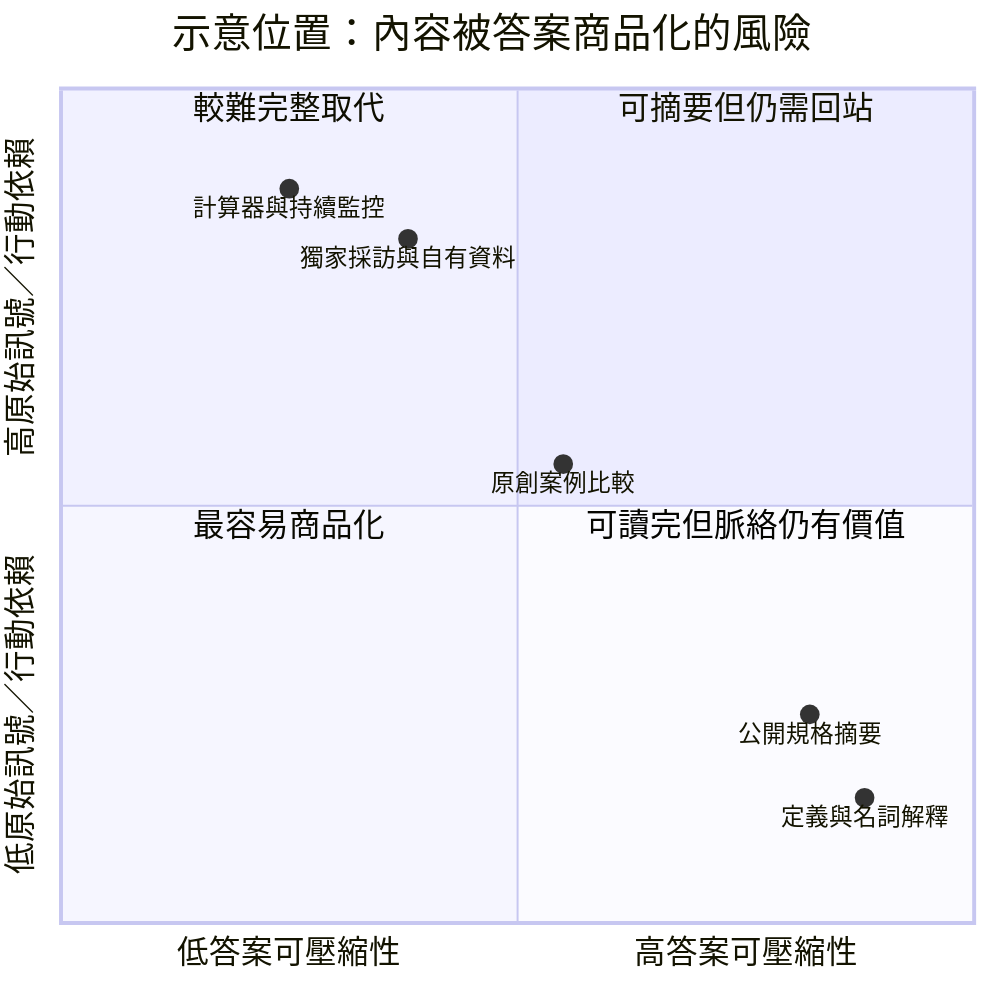
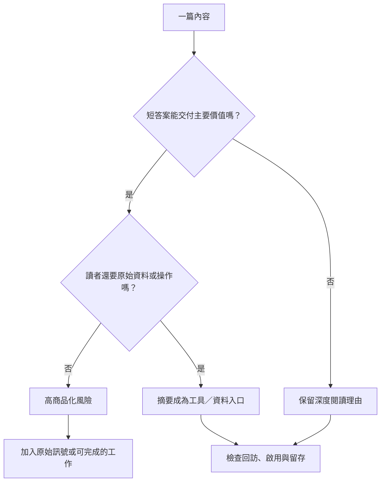

> 🌏 [English version](/en/posts/product/2026-09-17-answer-engine-content-commoditization-en)

想像兩家餐廳。一家把公開食譜重抄成漂亮卡片；另一家有自己的食材、廚房、主廚手感和熟客。代讀員很容易把第一家的卡片濃縮成三步驟，卻不能只靠念摘要替你吃完第二家的晚餐。

內容也一樣。答案引擎能摘要一篇文章，不代表能取代文章後面的資料、工具或關係。判斷風險的問題不是「有沒有用 AI 寫」，而是：**主要價值能不能在一段答案裡交付完？**

## 兩條軸，比內容類型更重要

下面是分析框架，不是某份研究對所有內容做出的排名；圖中座標只為示意相對位置，不是量測分數。

第一軸是**答案可壓縮性**：拿掉原文結構、語氣與例子後，短答案還能留下多少主要價值？第二軸是**原始訊號／行動依賴**。它問讀者是否仍需最新資料、作者信任、個人輸入、計算、交易或工作流程。

| 內容 | 壓成答案後剩多少 | 仍需回站的理由 | 風險判讀 |
|---|---|---|---|
| 定義、通用步驟 | 多數核心資訊仍在 | 弱 | 高 |
| 公開規格轉述 | 數字與條列容易保留 | 查最新版本 | 高到中 |
| 原創比較、案例整理 | 結論可摘要，方法可能流失 | 看證據與限制 | 中 |
| 獨家採訪、自有資料 | 結論可被引述，原始材料仍稀缺 | 查證、更新、授權 | 較低 |
| 計算器、監控、交易工作流 | 文字只能解釋，不能持續執行 | 輸入、運算、保存、行動 | 較低 |

「較低」不等於安全。獨家資料仍可能被摘要，工具的簡單功能也可能被模型內建。差別只是摘要能否交付整份工作。

## 最危險的不是短，而是沒有下一步

[Google 說 AI Overviews 與 AI Mode 可能用 query fan-out](https://developers.google.com/search/docs/appearance/ai-features)，跨子題與來源組成回答。這使定義、公開規格與通用步驟特別容易被拆成可重組的片段；但這是機制推論，不是 Google 公布的內容風險排行榜。

[Pew 的 2025 年研究](https://www.pewresearch.org/short-reads/2025/07/22/google-users-are-less-likely-to-click-on-links-when-an-ai-summary-appears-in-the-results/)也發現，較長、問句型與完整句子的查詢更常被其方法分類為出現 AI 摘要。研究限於美國樣本、Google 與特定期間，而且 AI 摘要是事後重跑查詢分類。它支持「答案介面會出現在複雜問題」的觀察，不證明某一種文章必然失去流量。

## 量產更多摘要，不會形成防禦

[Google spam policies](https://developers.google.com/search/docs/essentials/spam-policies)明列，試圖操弄 Search 的 generative AI responses 也在政策範圍。大量製造換關鍵字、缺少新增價值的文字，沒有解決可替代性；它只增加更多容易被壓縮的供給。

把每篇文章拉長不會解決問題。比較實際的改造，是替它接上一個摘要無法完成的工作。這可以是可查證的原始紀錄、讀者自己的資料輸入、保存監控條件、有同意的會員關係，或真正的服務與交易。

每篇內容可以做兩個測試。第一，把全文交給編輯濃縮成五句；若價值幾乎沒有損失，壓縮風險高。第二，問讀者看完五句後還要回來做什麼；若沒有具體動作，這篇內容只有一次性答案，還沒有形成資產。

## 參考資料

- [Google Search Central：AI features and your website](https://developers.google.com/search/docs/appearance/ai-features)
- [Google Search Central：Spam policies](https://developers.google.com/search/docs/essentials/spam-policies)
- [Pew Research Center：Do people click on links in Google AI summaries?](https://www.pewresearch.org/short-reads/2025/07/22/google-users-are-less-likely-to-click-on-links-when-an-ai-summary-appears-in-the-results/)
