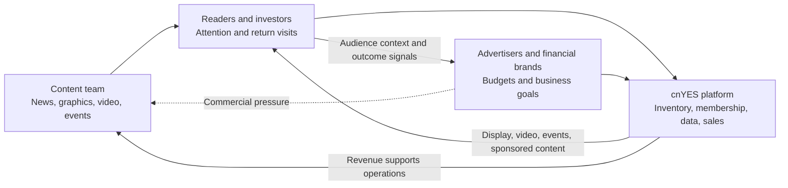
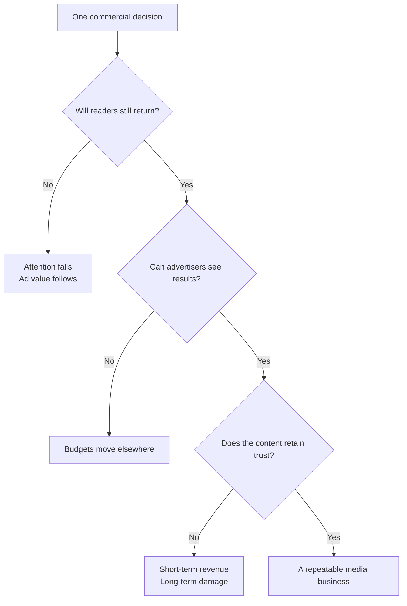
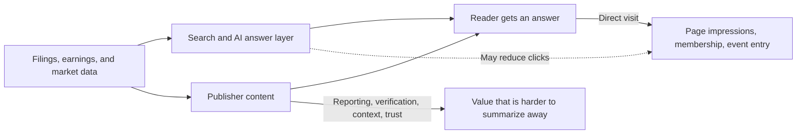

> 🌏 [中文版](/posts/product/2026-09-17-anue-attention-ad-market)

Imagine someone handing out a free financial magazine outside a metro station. Readers pay nothing, but reporting, editing, and distribution still cost money. The bill usually goes to banks, brokers, fund managers, and other brands that want to reach investors.

[anue cnYES](https://www.cnyes.com/) is a digital version of that business. Readers trade attention for free news. Advertisers spend money for access to an audience. The content team supplies news, graphics, video, and events that give both groups a reason to stay.

“It makes money from ads” is too crude a description. cnYES publicly markets sponsored features, forums, editorial production, and, historically, B2B news licensing. The hard part is keeping the exchange valuable to all three sides without allowing commercial pressure to consume a financial publisher's most valuable asset: trust.

## The user and the payer are not always the same person

A conventional product has a buyer and a seller. A media platform adds another layer: the person who opens the site every day may not be the person paying the company.

Each side contributes a scarce resource:

- Readers provide attention, return visits, and a financial decision-making context.
- Advertisers provide budgets in exchange for reaching people interested in investing, insurance, or financial services.
- The content team provides timely information, explanation, and institutional trust.

The platform connects them. The dotted line represents a governance risk; it does not mean advertisers direct the newsroom. If commercial work is not clearly disclosed, readers lose trust. The attention sold to advertisers becomes less valuable at the same time.

This model is sometimes reduced to “the reader is the product.” That phrase captures the monetization of attention but ignores the service readers receive. A more precise description is that the platform operates a free information service and a commercial marketplace, both of which depend on the content team's credibility.

## cnYES sells much more than a rectangle on a page

The official [cnYES advertising page](https://www.cnyes.com/cnyes_about/cnyes_AD01.html) lists several kinds of service. It offers digital, mobile, social, and video advertising alongside custom financial forums, seminars, partnerships, and online events. Its content services include sponsored features, visual long-form work, and special-publication production.

These products do different jobs and carry different costs.

| Publicly documented offer | What the advertiser buys | Publisher cost and risk |
|---|---|---|
| Digital, mobile, and social ads | Reach and exposure | Inventory quality, user experience, and tracking governance |
| Video ads | Richer brand storytelling and attention | Production, page performance, and measurement |
| Forums, seminars, and online events | Interaction, leads, and authority | Event operations, compliance, and consent for contact data |
| Sponsored features and native content | A media format for explaining a complex topic | Disclosure and editorial trust |
| Visual long-form and special publications | Planning and production capability | Labor-intensive, project-based economics |

What cnYES calls advertising spans a spectrum from repeatable inventory to custom services. Standard placements are easier to resell. Events and editorial production may have more value per project but require more labor. cnYES does not disclose revenue or margin by product, so the public pages cannot tell us which line dominates.

The same page describes its audience as finance professionals, managers, high-end investors, and influential members of financial communities. That is cnYES's sales positioning, not an independently audited demographic study. The company wants to sell the context in which financial decisions occur, not merely an arbitrary click. Public information does not provide campaign ROI that would prove this context converts better.

## A three-sided market is a daily balancing exercise

The platform cannot maximize one side indefinitely without affecting the other two.

Readers want fast pages, credible reporting, and ads that do not bury the story. Advertisers care whether the audience has a real interest in finance and whether an event, video, or feature meets a business goal. The content team needs resources and a defensible editorial boundary.

This is why a vertical publisher does not necessarily need to beat a general platform on total traffic. When an advertiser wants to reach investors, a financial context may be more valuable than a click on an entertainment page. That remains a business hypothesis. Without cnYES conversion rates, ad prices, or outcome reports, “higher intent” cannot be presented as a measured result.

## cnYES cannot be reduced to a pure advertising company

Another official [cnYES news-product page](https://www.cnyes.com/cnyes_about/cnyes_pas03.html) lists products for brokers, asset managers, futures firms, banks, companies, and trade associations. It also describes FTP and ASP delivery, including an instruction that only supports Internet Explorer. The page is clearly historical.

It cannot establish the scale of B2B licensing in 2026 or prove that every listed service remains on sale. It does disprove the stronger claim that cnYES has only ever sold display ads. The company once packaged news as an information service for institutional customers, while its advertising page documents a current public offer that includes integrated marketing, events, and content production.

The company's [historical integrated-marketing page](https://www.cnyes.com/cnyes_about/cnyes_pas04.html) also lists brokers, asset managers, insurers, futures firms, and banks among its partner categories. The page has no update date, and some names appear old. It is evidence about historical customer categories, not a valid 2026 client roster.

The same boundary applies to data claims. The [privacy policy for the specific Fund Driver service](https://invest.cnyes.com/privacy) says the app collects an advertising ID and may use data to display ads. That proves what this service discloses. It does not prove that the cnYES newsroom shares all member data across products, nor that cnYES operates a comprehensive cross-product advertising-data market.

## AI lowers production costs and intercepts monetizable attention

Generative AI is neither purely positive nor purely negative for this model. It can structure filings, earnings releases, and market data before an editor checks them, leaving more time for reporting and explanation. Advertising and event teams can also prepare variations and draft reports faster.

The other side is harder. When a search engine or AI assistant directly answers “Why did Taiwan stocks fall today?” or “What was this company's quarterly EPS?”, the reader may not visit the source. For a free publisher, one fewer visit is not only one fewer reader. It is also one fewer chance to show an ad, recommend an event, or build a direct relationship.

This diagram shows a risk mechanism, not a measured decline in cnYES traffic. No public cnYES data in this review disclosed search referrals, app return rates, or the impact of AI answers. An overseas publisher average should not be silently applied to Taiwan.

The defense is not simply to produce more articles with AI. As basic figures and summaries become cheaper, publishers need to move value toward harder-to-replace assets: original reporting, traceable data, continuously useful tools, and direct member relationships. Trusted environments that advertisers will pay to enter belong on that list as well.

## Do not judge a free publisher only by the absence of a paywall

To analyze a free-content platform, make four columns: who uses it, who pays, what the platform actually sells, and which form of trust cannot be recovered once lost. Then label every revenue claim as publicly documented, company-reported, or unknown.

The available evidence already shows that cnYES is more than free articles surrounded by banners. It operates a market between readers, advertisers, and a content operation. Its public offer spans inventory, video, events, sponsored content, and production services. Historically, it also packaged news as a B2B product.

The evidence does not reveal which revenue line is largest, how much traffic cnYES has, whether it runs programmatic advertising, or how many visits AI has intercepted. Those gaps should remain gaps. The commercial value of free content lies in how many useful services a platform can build around attention while preserving the trust that makes readers return.

## References

- [anue cnYES advertising, video, events, native content, and production services](https://www.cnyes.com/cnyes_about/cnyes_AD01.html) (in Mandarin)
- [cnYES news products and historical B2B delivery](https://www.cnyes.com/cnyes_about/cnyes_pas03.html) (in Mandarin)
- [cnYES historical integrated-marketing partner categories](https://www.cnyes.com/cnyes_about/cnyes_pas04.html) (in Mandarin)
- [Fund Driver service privacy policy](https://invest.cnyes.com/privacy) (in Mandarin)
