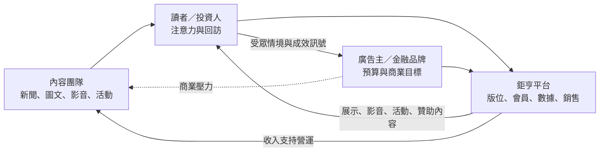
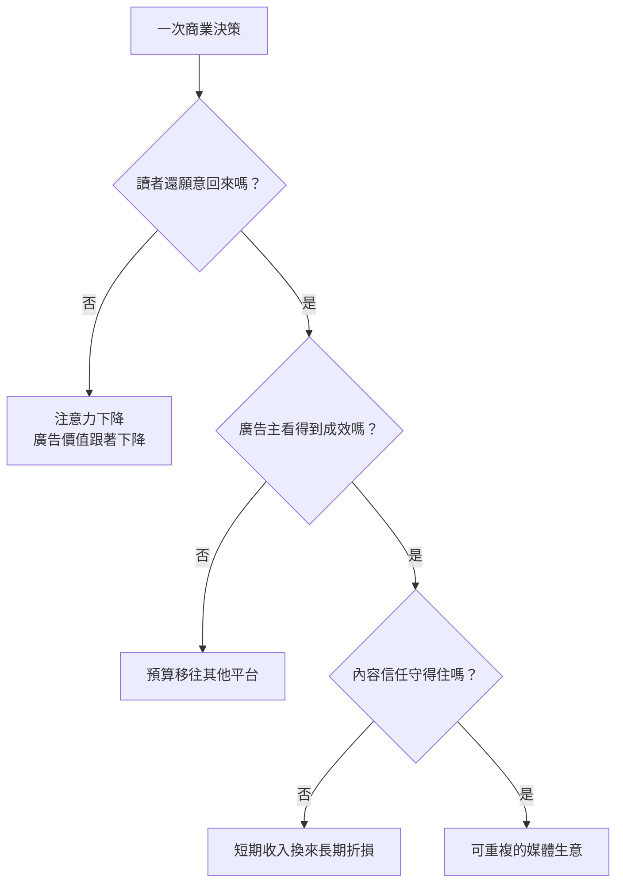
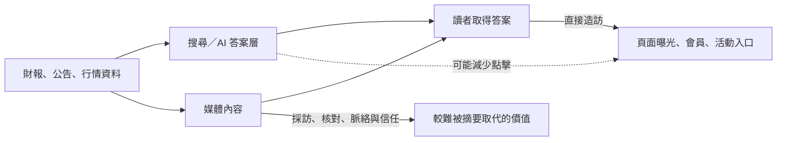

> 🌏 [English version](/en/posts/product/2026-09-17-anue-attention-ad-market-en)

想像捷運站出口有人免費發財經雜誌。讀者沒付錢，採訪、編輯和發行卻都有成本。帳單最後寄給誰？通常是想接觸投資人的銀行、券商、基金公司與其他品牌。

[anue 鉅亨網](https://www.cnyes.com/)也是這種生意的數位版本。讀者用注意力換免費新聞，廣告主用預算換接觸受眾的機會，內容團隊則用新聞、圖文、影音與活動，讓前兩邊願意繼續留下來。

這不是一句「靠廣告賺錢」就能說完的模式。鉅亨公開展示的商品還包括贊助專題、論壇、代編，以及歷史上的 B2B 新聞授權。真正的難題，是讓三方都覺得交換划算，又不讓商業壓力耗掉財經媒體最值錢的信任。

## 免費內容裡，使用者和付錢的人不是同一個

一般商品只有買方與賣方。媒體平台多了一層：每天打開網站的人，未必是付錢的人。

圖裡的三方各帶一種稀缺資源進場：

- 讀者帶來注意力、回訪與使用情境。
- 廣告主帶來預算，希望接觸正在關心投資、保險或金融服務的人。
- 內容團隊帶來即時資訊、解釋能力與媒體信任。

平台負責把三者接起來。最後一條虛線是治理風險，不表示廣告主能直接指揮編輯。若商業內容沒有清楚揭露，讀者信任受損，能賣給廣告主的注意力也會一起縮水。

這種模式最容易被誤讀成「讀者就是商品」。那句話抓到注意力被變現的一面，卻忽略讀者也在取得服務。更精確的說法是：平台同時經營免費資訊服務與商業媒合，而且兩邊都依賴內容團隊維持品質。

## 鉅亨賣的早已不只一塊廣告版位

鉅亨的[官方廣告產品頁](https://www.cnyes.com/cnyes_about/cnyes_AD01.html)列出多種服務。除了數位、行動、社群與影音廣告，還有客製財經講座、論壇、異業合作和網路活動。內容端則包括廠商贊助專題、一頁式圖文與特刊代編。

這些商品處理的是不同工作，成本結構也不同。

| 官方可證的供給 | 廣告主真正購買的東西 | 媒體承擔的成本與風險 |
|---|---|---|
| 數位／行動／社群廣告 | 曝光與受眾觸及 | 版位品質、廣告體驗與追蹤治理 |
| 影音廣告 | 更完整的品牌敘事與注意力 | 製作成本、載入體驗與成效衡量 |
| 講座／論壇／網路活動 | 即時互動、名單與品牌權威 | 活動製作、法遵與名單同意 |
| 贊助專題／原生內容 | 用媒體形式解釋複雜議題 | 商業揭露與編輯信任 |
| 一頁式圖文／特刊代編 | 內容企畫與製作能力 | 人力密集，收入較偏專案型 |

鉅亨所稱的「廣告」，涵蓋從標準版位到客製服務的一整段光譜。版位比較容易重複銷售；活動與代編的單案價值可能更高，卻需要更多人力。本文沒有各產品營收或毛利，不能判斷哪一種才是鉅亨的主力。

官方頁也把受眾描述成金融業人士、專業經理人、高端投資人與財經社群領袖。這是鉅亨自己的銷售說法，不是獨立受眾調查。它想賣給廣告主的，是財經決策正在發生的情境，而非任意的一次點擊。至於這種情境能否帶來更好的轉換，公開資料沒有 campaign ROI 可核對。

## 三方市場每天都在做平衡題

把三方各自的需求攤開，會看到平台不能只把其中一個數字拉到最大。

讀者端希望頁面快、新聞可信、廣告不要蓋住內容。廣告主端在意觸及的人是否真的對金融議題有興趣，以及活動、影音或專題能不能完成商業目標。內容團隊則需要資源，也需要清楚的編輯界線。

這也解釋了為什麼垂直媒體不必跟大型平台比總流量。若廣告主想接觸投資人，財經內容出現的當下可能比一個泛娛樂頁面的點擊更有價值。不過這仍是商業假說；沒有鉅亨的轉換率、廣告單價或成效報告，就不能把「受眾更精準」寫成已證結果。

## 不能把鉅亨簡化成純廣告公司

鉅亨另一個[官方新聞產品頁](https://www.cnyes.com/cnyes_about/cnyes_pas03.html)列出提供給券商、投信、期貨商、銀行、企業與公會的新聞產品，還留下 FTP 與 ASP 的傳輸方式。頁面甚至提到只支援 IE，顯然帶有很強的歷史痕跡。

這份舊頁面不能證明 2026 年 B2B 授權的規模，也不能證明每一項服務仍在販售。它能推翻的，是「鉅亨只有展示廣告」這種過度簡化。新聞內容本身曾被包成企業可採購的資訊服務，而公開廣告頁又證明現在能看到的商業供給至少涵蓋整合行銷、活動與內容製作。

鉅亨的[歷史整合行銷頁](https://www.cnyes.com/cnyes_about/cnyes_pas04.html)也列出券商、投信投顧、保險、期貨與銀行等合作類別。該頁沒有更新日期，部分名稱已顯老舊，因此只能用來理解過去的客戶類型，不能當成 2026 年現行客戶名單。

同樣地，「鉅亨基金老司機」的[特定服務隱私政策](https://invest.cnyes.com/privacy)說明會蒐集 advertising ID，並可用於 App 顯示廣告。這只能證明該服務的做法，不能外推成整個鉅亨新聞站共享所有會員資料，更不能憑此宣稱它有完整的跨產品廣告資料市場。

## AI 同時降低內容成本，也截走可賣的注意力

生成式 AI 對這種生意不是單向利多或利空。它可以先整理財報、公告與市場資料，讓編輯把時間放在核對、採訪和解釋；廣告與活動團隊也能更快做素材版本與報告草稿。

另一面更麻煩。當搜尋引擎或 AI 助手直接回答「今天台股為什麼跌」「某家公司上季 EPS 是多少」，讀者可能不必點進原始網站。對免費媒體來說，少一次造訪不只少一個讀者，也少一次可展示廣告、推薦活動或建立直接關係的機會。

這張圖描述風險機制，不代表鉅亨流量已下降某個百分比。本輪沒有鉅亨自己的搜尋來源、App 回訪或 AI 摘要影響數據，也沒有證據能把台灣出版商的變化直接套上國外平均值。

真正的防守不只是用 AI 生產更多文章。基本數字與摘要愈便宜，媒體愈要把價值移到較難取代的地方：第一手採訪、可追溯的資料、持續更新的工具與直接會員關係。廣告主願意付費進入的可信情境，也在其中。

## 判斷免費媒體，不要只看有沒有付費牆

要拆一個免費內容平台，今晚可以先列四欄：誰使用、誰付錢、平台實際販售哪些商品、哪些信任一旦失去就回不來。再把每項收入標成「公開可證」「公司自述」或「仍未知」。

鉅亨網的公開資料已足以證明，它不是把幾則免費新聞旁邊塞上 banner 那麼簡單。它在讀者、廣告主與內容團隊之間經營一個市場。商品從版位延伸到影音、活動、贊助內容與製作服務，歷史上也曾把新聞做成 B2B 產品。

公開資料還不足以回答哪條收入最大、流量多高、是否使用程式化廣告，或 AI 已經截走多少造訪。這些空白不能用想像補滿。免費內容真正的商業價值，就藏在平台能否把注意力變成多種服務，同時守住讓注意力願意回來的信任。

## 參考資料

- [anue 鉅亨網：廣告、影音、活動、原生內容與代編產品](https://www.cnyes.com/cnyes_about/cnyes_AD01.html)
- [鉅亨網：新聞產品與 B2B 傳輸方式](https://www.cnyes.com/cnyes_about/cnyes_pas03.html)
- [鉅亨網：歷史整合行銷合作類型](https://www.cnyes.com/cnyes_about/cnyes_pas04.html)
- [鉅亨基金老司機：特定服務隱私權政策](https://invest.cnyes.com/privacy)
