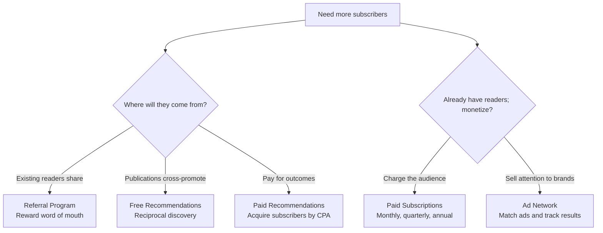
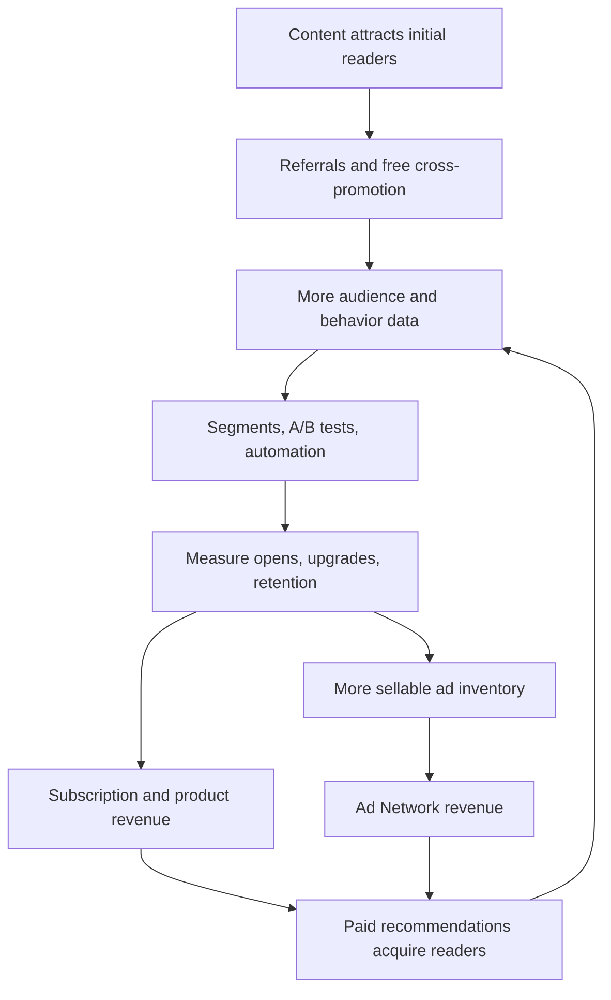

> 🌏 [中文版](/posts/product/2026-09-17-beehiiv-newsletter-operating-system)

A conventional newsletter service resembles a printing press: you prepare the issue, and it sends it. [Beehiiv](https://www.beehiiv.com/) wants to provide the entire newsroom control room. A publisher can write, see where readers came from, reward referrals, trade recommendations with other publications, acquire subscribers, sell ads, and convert part of a free audience to paid membership without leaving the same workspace.

None of those parts is a new invention. Referral software, ad marketplaces, paid subscriptions, segmentation, and automation have long existed as separate products. Beehiiv's incremental value is that the modules share subscriber data and an operating interface, reducing the exports, synchronization, and reconciliation between tools.

That integration also changes switching costs. Content and email addresses can be exported, and a publisher's own Stripe relationship is more portable than platform-controlled billing. The stickier assets are the recommendation, advertising, segmentation, automation, and analytics workflows that a team has already learned to run.

## Four kinds of “growth” perform different jobs

Beehiiv is often summarized as having many growth tools. That label hides an important distinction: asking existing readers to invite friends, trading recommendations, buying subscribers, and selling ads have different cash flows and risks.

The **Referral Program** mobilizes a publication's own readers. The publisher defines rewards for bringing in friends. It builds first-party word of mouth, but the publisher still has to manage attribution and fulfillment.

**Free Recommendations** connect publications. After subscribing to one newsletter, a reader can see publications that the publisher recommends. This mechanism depends on partnerships and the network rather than a payment for every acquisition.

**Paid Recommendations** are transactions. Beehiiv has reorganized what it formerly called Boosts under Recommendations. Its [support documentation](https://www.beehiiv.com/support/article/13091498232855) lists CPA offers, subscriber verification, a wallet, and geographic targeting. A publisher can pay to acquire subscribers or accept offers to monetize. Buying an email address does not guarantee an engaged reader, so publishers still need to measure source quality.

The **Ad Network** operates on the other side. Beehiiv matches publications with brand advertisers and supplies placement and performance tracking. It lets a free newsletter test advertising without first building a dedicated ad sales operation.

## List quality determines whether the loop turns

Connecting these tools reveals the logic behind the “operating system” description:

This is a mechanism diagram, not an average performance chart. The loop requires at least three conditions: acquired or referred readers must fit the content, messages must continue reaching inboxes, and advertisers must value that audience. If any condition fails, the tools can increase list size without increasing the business.

Cost per acquisition is therefore not enough to evaluate paid recommendations. A practical check is to compare each source's 30-day open rate, unsubscribe rate, and paid conversion. A cheap subscriber who never opens an issue can cost more than an expensive reader who stays.

## A 0% subscription take rate still supports a multilayer SaaS business

On [Beehiiv's pricing page on September 17, 2026](https://www.beehiiv.com/pricing), Launch, Scale, and Max are differentiated by list size and features, while paid prices change with the active-subscriber tier. This is a live official snapshot. Because this review did not find a second independently readable price list, it does not turn one list tier's exact numbers into a universal price.

Scale includes the Ad Network, Recommendations, a 0% take rate on paid subscriptions, digital products, automation, surveys, and webhooks. Max adds Beehiiv branding removal, a Sponsorship Storefront, audio newsletters, and more publications and team seats.

The `0% take rate` means Beehiiv does not collect a percentage of paid-subscription revenue. Publishers still pay the SaaS subscription and Stripe processing. Paid recommendations add acquisition spending. Advertising and recommendation markets have their own transaction terms. Calling the system “free” would misdescribe its operating economics.

Beehiiv's own revenue also has several layers. SaaS revenue grows with plans and list size, while advertising and paid recommendations place Beehiiv around market transactions. The fixed fee sits alongside software subscriptions and transaction networks rather than merely replacing Substack's percentage.

## Ask about definitions before believing a private-company growth curve

Beehiiv is private, and public narratives may mix run rate, ARR, annual revenue, and next-year targets with different dates and denominators. A management forecast is not realized revenue. Without two independent, fully readable sources using consistent definitions, interview figures and third-party estimates should not be assembled into a polished growth curve.

## Exporting content and subscribers does not move the control room

Beehiiv's [export documentation](https://www.beehiiv.com/support/article/12258595483543-exporting-post-content-or-subscriber-data-from-beehiiv) lets publishers export posts and subscriber CSV files. A Quick export contains email, status, and tier. A Full export adds custom fields and some statistics. That is more useful than an email-only list, but it still has boundaries.

| Asset or process | What can move | What stays behind or must be rebuilt |
|---|---|---|
| Posts | Published, archived, and draft content can be exported | Templates, site components, and presentation details |
| Subscribers | Email, status, tier, custom fields, and some statistics | Complete event history and platform attribution context |
| Paid relationship | Publishers connect their own Stripe account | Customer migration, old subscription cancellation, and system mapping |
| Referral | Acquired subscribers can enter the CSV | Reward state, attribution rules, and referral graph |
| Recommendations | Acquired subscribers can be exported | Cross-publication network, wallet, and verification history |
| Ad Network | The audience and content remain operating assets | Advertiser demand, placement workflow, and performance history |
| Automation and analytics | Some fields and statistics can be exported | Rules, dashboards, and cross-module operating habits |

In its [paid-subscription product update](https://product.beehiiv.com/p/flexible-subscriptions-and-fresh-integrations), Beehiiv emphasizes that publishers connect their own Stripe account and control the billing relationship. That offers more payment ownership than a fully platform-controlled merchant model. Yet the [paid-subscriber import guide](https://www.beehiiv.com/support/article/12231121444759-how-to-import-paid-subscribers) shows the operational reality: a migration needs source and destination Stripe accounts, customer-data migration, and potentially cancellation of subscriptions in the old system.

A CSV provides part of the exit path; it is not a backup of the operation. The deeper switching costs come from the team's daily workflow and the supply of ads and recommendations inside Beehiiv's markets.

## AI is moving from writing assistant to operating interface

Describing Beehiiv's AI as “limited” is no longer accurate in 2026. Its [editor documentation](https://www.beehiiv.com/support/article/15882638374551-using-ai-features-in-the-beehiiv-post-editor) lists AI Writer, AI Image, spell check, and translation. Spell check works only for English, and the page notes that the interface and capabilities continue to change.

The more consequential shift appears on the [pricing page](https://www.beehiiv.com/pricing). In September 2026, its feature labels list AI Website Builder, beehiiv MCP, and beehiiv Agent, while the plan table separately lists read access and write access. The public page does not define which resources or actions each label can read or write. This review did not test approvals, audit trails, or rollback. A feature list is not evidence of audience, segment, or campaign actions—or of autonomous operating results.

Text generation will quickly become a baseline feature. The differentiating question is whether AI can safely read an audience, analyze segments, prepare campaigns, and write approved actions back into the system. If it can, Beehiiv's advantage comes from shared data and an action layer. If permissions are too broad or actions are hard to reverse, the control room can amplify mistakes.

AI will also increase the supply of newsletters. A flood of low-quality publications can degrade recommendation quality, advertiser brand safety, and sending reputation. Beehiiv must help creators produce faster while preserving trust in the network.

## Who needs this control room?

Beehiiv fits teams that treat the newsletter as the core product and intend to combine audience growth, advertising, subscriptions, and products. Before choosing it, map the current toolchain: writing, sending, recommendations, referrals, ads, payments, and analytics. Beehiiv becomes an operating system only if it removes several real handoffs.

If the job is simply to send one issue each week—with no advertising, acquisition market, or paid tier—a free or simpler email service may be enough. Publishers in small or non-English markets should also verify that the Ad Network and paid-recommendation marketplace contain relevant demand. English-market network effects do not transfer automatically.

Finally, rehearse an exit. Export the Full subscriber CSV and post archive, then list the recovery steps for Stripe, the domain, email authentication, automations, recommendations, and advertising. A publisher may never leave Beehiiv, but knowing which switches belong to the publication is part of owning the reader relationship.

## References

- [Beehiiv pricing and plan features](https://www.beehiiv.com/pricing)
- [Beehiiv product overview and Ad Network](https://www.beehiiv.com/)
- [Beehiiv: Paid subscriptions, Stripe, and the billing relationship](https://product.beehiiv.com/p/flexible-subscriptions-and-fresh-integrations)
- [Beehiiv: Changes to Paid Recommendations](https://www.beehiiv.com/support/article/13091498232855)
- [Beehiiv: Exporting posts and subscriber data](https://www.beehiiv.com/support/article/12258595483543-exporting-post-content-or-subscriber-data-from-beehiiv)
- [Beehiiv: Importing paid subscribers](https://www.beehiiv.com/support/article/12231121444759-how-to-import-paid-subscribers)
- [Beehiiv: AI features in the post editor](https://www.beehiiv.com/support/article/15882638374551-using-ai-features-in-the-beehiiv-post-editor)
