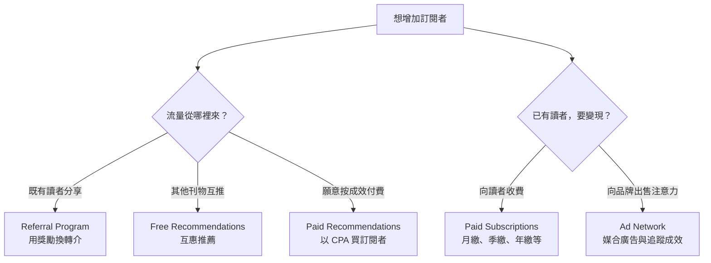
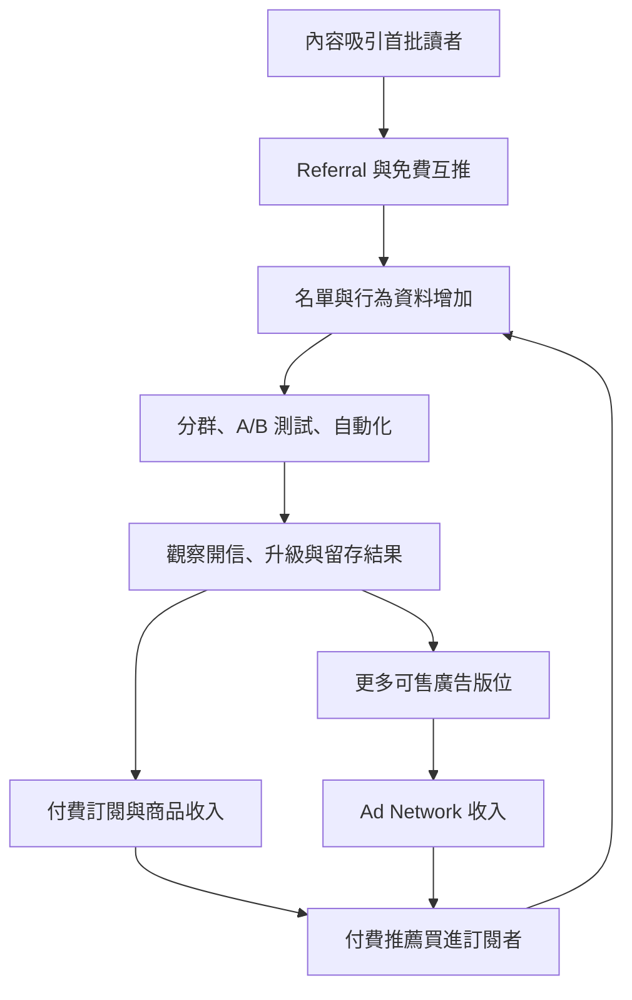

> 🌏 [English version](/en/posts/product/2026-09-17-beehiiv-newsletter-operating-system-en)

一般電子報工具像一台印刷機：你寫好內容，它負責寄出去。[Beehiiv](https://www.beehiiv.com/) 想做的是整間報社的控制室。創作者可以在同一個地方寫信、看讀者從哪裡進來、請讀者推薦朋友，也能和其他刊物互推、買進新訂閱者、接廣告，再把免費讀者轉成付費會員。

每個零件都不是新發明。Referral program、廣告媒合、付費訂閱、分群和自動化早就各有專門工具。Beehiiv 的增量，在於這些模組共用同一份訂閱者資料與操作介面，少掉匯出、同步和對帳的接縫。

這也改變了它的切換成本。內容與 email 可以匯出，創作者自己的 Stripe 關係也比平台代收更容易移動。已經跑順的推薦、廣告、分群、自動化和分析流程，才是較難搬走的部分。

## 四種「成長」其實在做不同工作

Beehiiv 最容易被介紹成「有很多 growth tools」。問題是，讀者推薦朋友、刊物互推、花錢買訂閱者和賣廣告，金流與風險完全不同。

**Referral Program** 動員的是自己的讀者。創作者設定獎勵，讓已訂閱的人帶新朋友進來。它累積的是第一方口碑，但獎勵規則、歸因與兌換狀態都得管理。

**Free Recommendations** 是刊物之間的互推。讀者訂閱一份電子報後，可以看到其他出版者的推薦。它依賴合作關係與刊物網路，不需要為每個訂閱者付費。

**Paid Recommendations** 則是交易。Beehiiv 已把原本稱為 Boosts 的功能重新整理到 Recommendations；官方[說明頁](https://www.beehiiv.com/support/article/13091498232855)列出 CPA offers、subscriber verification、wallet 與地理位置設定。出版者可以付費獲客，也可以接受別人的 offer 賺錢。買到一個 email 不等於買到一名會開信、會留下的讀者，來源品質仍要自己追。

**Ad Network** 處理的是另一邊。Beehiiv 幫出版者媒合品牌廣告，提供版位安排與成效追蹤。它讓免費電子報不必先建立自己的廣告業務團隊，就能嘗試以注意力換收入。

## 飛輪成立前，要先過名單品質這一關

把四種工具接起來，才會看到 Beehiiv 所謂 operating system 的商業邏輯：

這是一張機制圖，不是平均成效圖。飛輪要成立，至少要同時滿足三個條件：買進或互推來的讀者真的符合內容、信件能持續送達收件匣、廣告市場願意買這群讀者的注意力。任何一項斷掉，成長工具都可能只把名單數字做大，沒有把生意做大。

因此，付費推薦不能只看 cost per acquisition。今晚就能做的檢查，是把每個來源的 30 天開信率、退訂率與付費轉換並排。便宜但完全不開信的訂閱者，比昂貴但留下來的讀者更浪費。

## 0% 訂閱抽成，仍是一門多層收入的 SaaS 生意

依 Beehiiv [2026 年 9 月 17 日的官方價格頁](https://www.beehiiv.com/pricing)，Launch、Scale 與 Max 依名單規模和功能分級，付費價格會隨 active subscriber tier 改變。這是官方即時方案快照；本文未找到第二份可完整讀取的獨立價目，因此不把單一名單級距的精確數字寫成普遍價格。

Scale 包含 Ad Network、Recommendations、付費訂閱 0% take rate、數位商品、自動化、調查與 webhooks。Max 再加入去除 Beehiiv 品牌、Sponsorship Storefront、audio newsletters，以及更多 publications 和團隊席次。

`0% take rate` 只代表 Beehiiv 不從 paid-subscription revenue 抽一個百分比。創作者仍要支付 SaaS 月費與 Stripe 金流費用；若使用 paid recommendations 買讀者，也有獲客支出。廣告與推薦市場還有各自的交易條件。把 0% 寫成「零成本」會把整個營運模型說錯。

Beehiiv 自己的收入同樣不只來自一層。SaaS 隨名單與方案成長，廣告網路和付費推薦又讓平台參與交易活動。換句話說，它在固定月費之外，還把軟體訂閱與市場網路放在同一家公司裡。

## 私人公司的成長敘事要先問口徑

Beehiiv 是私人公司，外界常見的 run rate、ARR、年度營收與下一年目標，分母與時間點可能不同。公司預測也不是已實現營收。沒有兩份獨立、可完整核對且口徑一致的資料時，不應把訪談數字與第三方估計拼成一條漂亮的成長曲線。

## 能帶走內容與訂閱者，不代表整間控制室都能搬

Beehiiv 的[官方匯出說明](https://www.beehiiv.com/support/article/12258595483543-exporting-post-content-or-subscriber-data-from-beehiiv)允許出版者匯出文章與訂閱者 CSV。Quick export 包含 email、status 與 tier；Full export 再加入 custom fields 和部分統計。這比只能拿到 email 更完整，但仍有明確邊界。

| 資產／流程 | 能帶走的部分 | 留在平台或必須重建的部分 |
|---|---|---|
| 文章 | 可匯出已發布、封存與草稿內容 | 版型、網站元件與部分呈現細節 |
| 訂閱者 | email、status、tier、custom fields 與部分統計 | 完整事件歷史、平台內歸因脈絡 |
| 付費關係 | 出版者連接自己的 Stripe，較有遷移空間 | customer migration、舊訂閱取消與新系統對應 |
| Referral | 新訂閱者可進 CSV | 獎勵狀態、歸因規則與關係圖 |
| Recommendations | 已取得的訂閱者可匯出 | 平台互推網路、wallet 與 verification history |
| Ad Network | 名單與內容仍屬出版者的營運資產 | 廣告需求池、投放流程與成效歷史 |
| Automation／分析 | 部分欄位與統計可匯出 | 流程規則、儀表板與跨模組操作習慣 |

Beehiiv 在[付費訂閱產品更新](https://product.beehiiv.com/p/flexible-subscriptions-and-fresh-integrations)中強調，出版者連接自己的 Stripe 並掌握與讀者的扣款關係。這比由平台完全代收更接近付款所有權。但[付費訂閱者匯入指南](https://www.beehiiv.com/support/article/12231121444759-how-to-import-paid-subscribers)也顯示，實際搬遷需要來源與目的 Stripe 帳號、客戶資料移轉，完成後還可能要取消舊系統訂閱。

CSV 是退出權的一部分，不是整套營運的備份。真正的 switching cost 來自團隊每天使用的流程，以及平台市場帶來的廣告與推薦供給。

## AI 已從寫作助手走向營運介面

把 Beehiiv 的 AI 描述成「有限」，在 2026 年已經不準確。[官方編輯器說明](https://www.beehiiv.com/support/article/15882638374551-using-ai-features-in-the-beehiiv-post-editor)列出 AI Writer、AI Image、拼字檢查與翻譯；其中拼字檢查只支援英文，功能與介面也仍在更新。

更值得注意的變化在[價格頁](https://www.beehiiv.com/pricing)。2026 年 9 月的 feature labels 已列出 AI Website Builder、beehiiv MCP 與 beehiiv Agent，方案表也分別列出 read access 與 write access。公開頁沒有說明這些 access 各自能讀寫哪些 resource 或 action，因此不能把標籤延伸成已驗證的受眾、segment 或 campaign 操作能力。

這些是官方功能宣稱。本輪沒有登入測試 Agent 能改哪些資料、是否逐步要求批准、如何留下稽核紀錄，因此不能把方案表寫成已驗證的自動營運成果。

文字生成很快會變成基本功能。真正有差異的問題是：AI 能否安全地讀取 audience、分析 segment、準備 campaign，再把獲得批准的動作寫回系統。如果可以，Beehiiv 的優勢會來自共享資料與 action layer；如果權限過寬、動作不可逆，控制室也可能變成事故放大器。

AI 還會讓電子報供給快速增加。更多低品質內容可能拖累推薦網路、廣告品牌安全與寄信信譽。Beehiiv 不只要讓創作者生產更快，也得證明它能維持讀者品質和市場信任。

## 誰真的需要這間控制室

Beehiiv 適合以電子報為核心，準備同時經營成長、廣告、訂閱與商品的團隊。選它之前，先畫出現在的工具鏈：寫作、寄信、推薦、referral、廣告、付款、分析各在哪裡。如果 Beehiiv 能實際替掉三四個接縫，它的價值才是「營運系統」。

若只需要每週寄一封信，不打算接廣告、買訂閱者或建立付費層，免費或更單純的寄信工具可能已經足夠。非英語或小眾市場也要先確認 Ad Network 和 paid recommendations 裡真的有需求，不能把英語市場的網路效果直接搬過來。

最後再做一次搬家演練：匯出 Full subscriber CSV 與文章，列出 Stripe、網域、寄信驗證、自動化、推薦和廣告各自的復原步驟。你不一定會離開 Beehiiv，但知道控制室哪幾個開關屬於自己，才算真的掌握讀者關係。

## 參考資料

- [Beehiiv 官方價格與方案功能](https://www.beehiiv.com/pricing)
- [Beehiiv 產品首頁與 Ad Network](https://www.beehiiv.com/)
- [Beehiiv：付費訂閱、Stripe 與 billing relationship](https://product.beehiiv.com/p/flexible-subscriptions-and-fresh-integrations)
- [Beehiiv：Paid Recommendations 的改版說明](https://www.beehiiv.com/support/article/13091498232855)
- [Beehiiv：匯出文章與訂閱者資料](https://www.beehiiv.com/support/article/12258595483543-exporting-post-content-or-subscriber-data-from-beehiiv)
- [Beehiiv：匯入付費訂閱者](https://www.beehiiv.com/support/article/12231121444759-how-to-import-paid-subscribers)
- [Beehiiv：編輯器內的 AI 功能](https://www.beehiiv.com/support/article/15882638374551-using-ai-features-in-the-beehiiv-post-editor)
