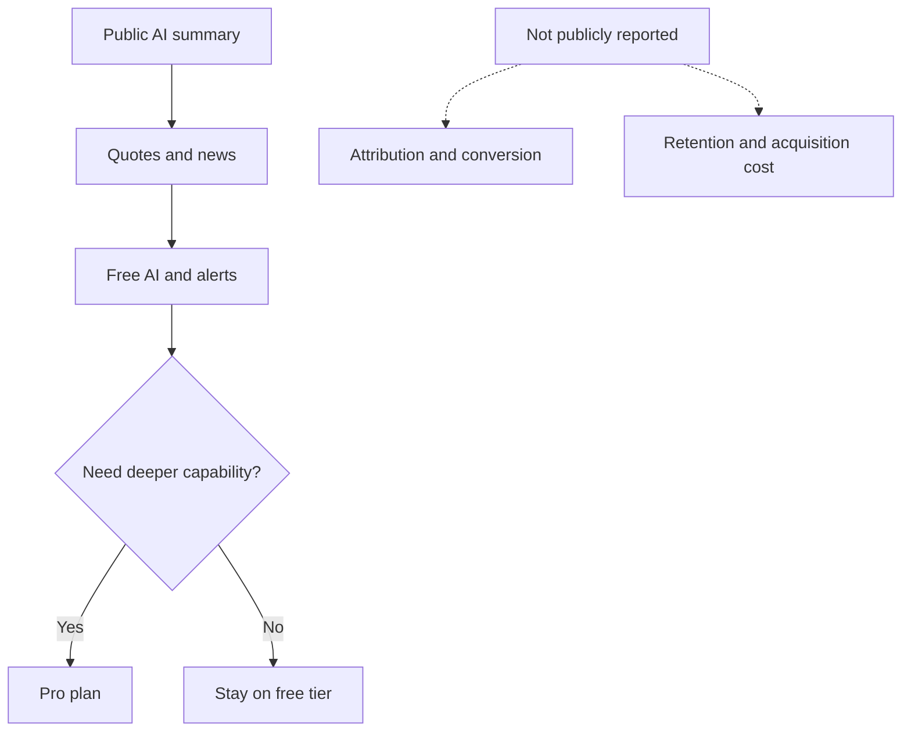
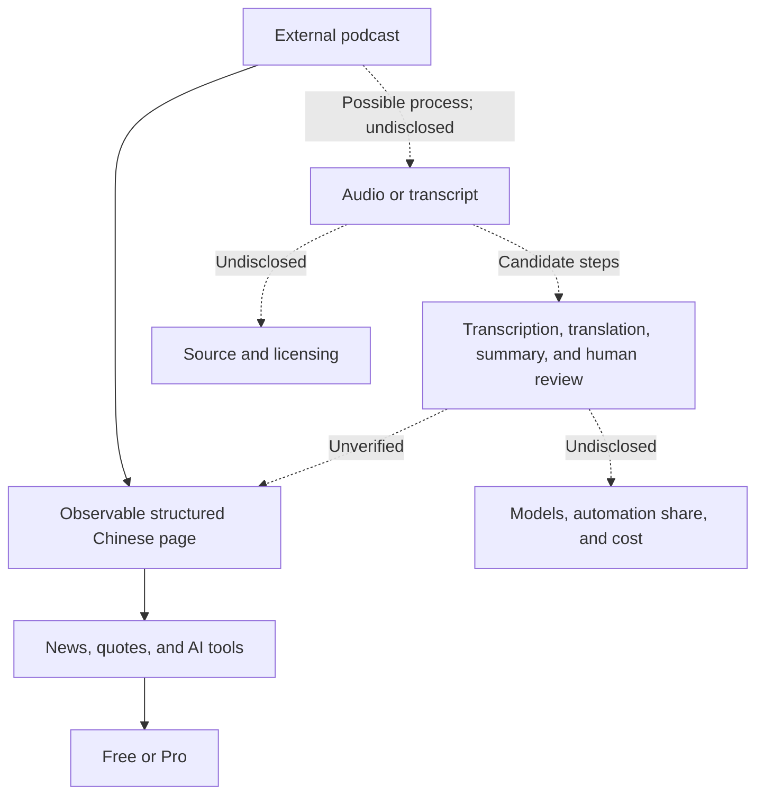

> 🌏 [中文版](/posts/product/2026-09-17-biggo-finance-ai-content-funnel)

Imagine a shop that turns long English-language finance podcasts into free Chinese study sheets. A passerby can quickly see which companies, risks, and market shifts an episode covered without buying a ticket first.

Beside those study sheets sits an investing toolkit, not a donation jar. Readers can move on to quotes, news, and earnings-call information. If they want more capable AI, more proactive alerts, or a cleaner experience, they encounter a paid plan. [BigGo Finance](https://finance.biggo.com.tw/) places these entrances inside the same product environment.

It resembles a supermarket tasting station. The sample counter and checkout both exist, but that does not mean everyone who tastes a sample buys a box. Public pages do not disclose registration, paid conversion, or retention among summary readers. This article examines a plausible product path, not a proven funnel.

## Free summaries save the reader time first

The [Podcast AI summary index](https://finance.biggo.com.tw/podcast) turns long audio into a searchable, scannable Chinese entry point. A public [episode page](https://finance.biggo.com.tw/podcast/a31e56a48e4602b5) goes beyond a short synopsis. It organizes the episode into key points, section summaries, tables, quotations, risks, and follow-up items. The page is readable without signing in.

The first problem it solves is not “Should I pay?” but “Do I have time to listen?” A program constrained by length and language becomes a page someone can scan after a search. Readers who want company quotes, news, or earnings-call information can continue inside the same site.

This review did not compare the summary line by line with the original episode, so it cannot vouch for accuracy. Public pages also do not explain topic selection, publishing frequency, or human review. We can observe the output; we cannot reconstruct the entire content operation from it.

## The route from a public page to Pro is a path, not a result

Placed side by side, the product surfaces suggest a reasonable route. Public summaries create discovery, quotes and news support exploration, free AI and alerts invite action, and the [Pro plan](https://finance.biggo.com.tw/pricing) serves people who want greater model capability, proactive updates, or a different experience.

The solid arrows mean the interface permits this journey. They do not show that many users follow it in order. Podcasts may be one entrance among several; quotes, news, earnings calls, and watchlists may attract their own traffic. Without attribution data, the summaries cannot receive credit for all free-tier acquisition.

Nor can a pricing page establish revenue. It proves that a paid exit and feature differences exist. It cannot tell us how many people subscribe, how quickly they cancel, or whether Pro covers the cost of producing AI content.

## Pro does not merely sell another article

BigGo Finance's [plan comparison](https://finance.biggo.com.tw/pricing) differentiates the paid tier through model options, proactive alerts, information timing, and an ad-free experience. Free content and a paid product therefore need not conflict. Summaries can stay public while the paid tier sells a faster, more proactive, and more repeatable way to work.

This article deliberately omits exact prices, alert allowances, and timing advantages shown on a single official page. Those terms can change, and no contemporaneous independent source confirmed them for this review. A prospective buyer should check the current pricing page directly.

| Product layer | What the user gets | Observable business role | What remains undisclosed |
|---|---|---|---|
| Public podcast summaries | Chinese highlights, structured notes, and risk prompts | Lowers the cost of entering the content | Search traffic, accuracy, and production cost |
| Free quotes and news | Market data and financial information | Moves content readers into a tool environment | Actual summary-to-tool conversion |
| Free AI and alerts | An initial model and reminder workflow | A possible route to recurring use | Activation, frequency, and retention |
| Pro | Higher-tier model, alert, timing, and experience benefits | Subscription revenue outlet | Subscriber count, churn, and product-line revenue |
| Free-tier advertising | Ads remain on the free plan | A possible secondary revenue source | Revenue share and profitability |

The final column matters most. Product components are observable. Commercial performance still requires cohorts, attribution, and revenue data.

## The middle of the AI content factory remains a black box

The public episode page calls itself an AI summary and presents long-form, structured Chinese output. Between an external podcast and that page, the process may involve acquiring audio, transcription, translation, summarization, templates, and human review. BigGo Finance does not describe the actual workflow in the public material reviewed here.

A possible technique should not become an asserted system. Public information does not establish which speech recognition or language model the company uses, how much of the workflow is automated, or whether an editor checks each page. AI may reduce some processing costs, but it does not make marginal content cost zero. Data access, compute, quality control, corrections, and compliance all carry costs.

## The summary text may be the easiest part to copy

General-purpose models will make summarization, translation, and formatting cheaper. Search engines or other AI systems can also summarize the public page again, allowing users to get an answer without visiting the site. If the product depends only on public text, zero-click search can intercept its entry traffic.

Real-time data rights, user watchlists, alert workflows, and accumulated trust are harder to move. Whether those assets actually improve retention still requires product data. They are plausible moat candidates, not demonstrated effects.

Financial content also carries two risks that an “AI-generated” label does not erase:

- **Accuracy and responsibility:** An incorrect company name, financial figure, quotation, or inference can affect an investment decision. Pages need traceable sources, timestamps, correction mechanisms, and a clear boundary from investment advice.
- **Copyright and licensing:** Transcription, translation, long summaries, and direct quotations raise licensing and fair-use questions. This review found no public BigGo Finance explanation of source acquisition or licensing arrangements. That absence does not justify assuming permission, and it does not support an accusation of infringement.

## Operators need to measure every doorway

To test this model, define five events tonight: summary view, registration, watchlist addition, alert activation, and Pro upgrade. Record the source and time for each event. Then build cohorts from the first entry point and compare activation, paid conversion, and later retention across content sources.

Only that analysis can distinguish an acquisition channel from a convenience for existing users or a source of traffic with little commercial effect. Adjacent pages do not establish causation, and a product path does not prove revenue.

The useful lesson from BigGo Finance is not that AI can manufacture many articles. It is that free content can connect to tools with more durable utility. Summaries save time, data and alerts address the next task, and Pro sells capability and experience. The design is coherent. Whether it is profitable remains a question for data the company has not published.

## References

- [BigGo Finance](https://finance.biggo.com.tw/) — product homepage and public entry points (in Mandarin)
- [Podcast AI summaries](https://finance.biggo.com.tw/podcast) — public summary index (in Mandarin)
- [Public podcast summary episode](https://finance.biggo.com.tw/podcast/a31e56a48e4602b5) — example of a long structured Chinese page (in Mandarin)
- [BigGo Finance plan comparison](https://finance.biggo.com.tw/pricing) — Free and Pro benefits (in Mandarin)
- [About BigGo](https://biggo.com.tw/official/aboutus/) — brand and original comparison-shopping context (in Mandarin)
