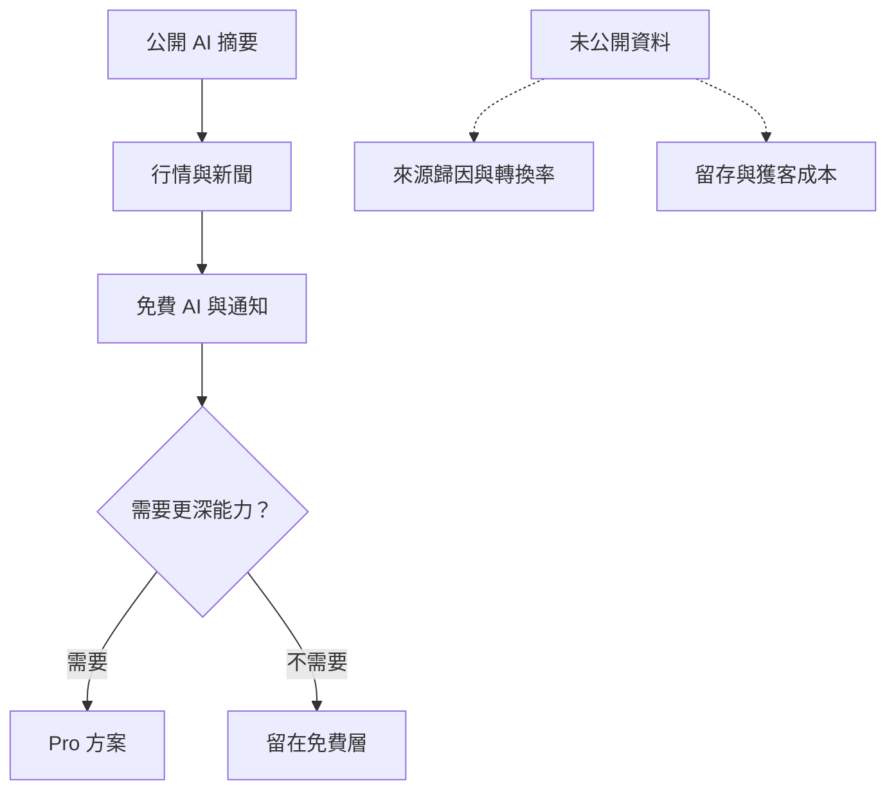
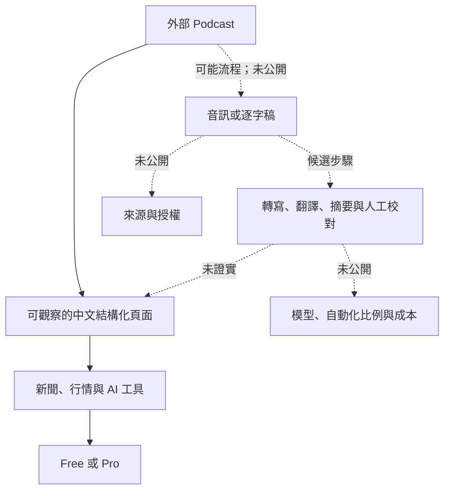

> 🌏 [English version](/en/posts/product/2026-09-17-biggo-finance-ai-content-funnel-en)

想像一家店把很長的英文財經節目整理成免費中文講義。路過的人不用先買票，就能快速看懂這集談了哪些公司、風險與市場變化。

講義旁邊不是捐款箱，而是一套投資工具。讀者可以繼續看行情、新聞和法說會資訊；需要更強的 AI 能力、更多主動通知或更清爽的體驗時，才會遇到付費方案。[BigGo Finance](https://finance.biggo.com.tw/)把這些入口放在同一個產品環境裡。

這很像超市的試吃區：試吃與結帳櫃檯確實都存在，卻不能因此說每位試吃者都買了一盒。公開頁面沒有揭露摘要讀者的註冊率、付費轉換率或留存。本文拆的是一條合理的產品路徑，不是已經驗證的漏斗成績。

## 免費摘要先替讀者省時間

[Podcast AI 摘要列表](https://finance.biggo.com.tw/podcast)把長音訊改造成可以搜尋、掃讀的中文入口。公開的[單集頁](https://finance.biggo.com.tw/podcast/a31e56a48e4602b5)不只是短短幾句介紹，而是把內容整理成重點、分段摘要、表格、引述、風險與後續觀察。未登入的讀者也能讀到頁面內容。

它解決的第一個問題不是「我要不要付費」，而是「我有沒有時間聽完」。原本受長度與語言限制的節目，變成搜尋後幾分鐘就能掃完的頁面。讀者若還想查公司行情、新聞或法說會資訊，同一站內已有下一步可走。

但本輪沒有把摘要與原始節目逐句比對，因此不能替摘要的正確率背書。公開頁也沒有說明選題標準、更新頻率或人工校對流程。看得到的是輸出，不能反推整間內容工廠怎麼運作。

## 從公開頁到 Pro，是路徑而不是成績

把站內入口排在一起，可以畫出一條合理路徑。公開摘要讓產品被看見，行情與新聞讓讀者繼續探索，免費 AI 與通知讓人開始操作。最後由 [Pro 方案](https://finance.biggo.com.tw/pricing)承接對模型能力、主動提醒與使用體驗有更高需求的人。

圖中的實線表示產品介面允許使用者這樣走，不表示大量使用者真的照順序前進。Podcast 可能是入口之一，行情、新聞、法說會與自選功能也可能各自帶來流量。沒有來源歸因資料，就不能把整個免費層的獲客功勞都算給摘要。

更不能從方案頁推導收入。它只能證明付費出口與權益差異存在；無法回答有多少人訂閱、多久取消，或 Pro 是否已經覆蓋 AI 內容成本。

## Pro 賣的不是多一篇文章

BigGo Finance 的[方案比較頁](https://finance.biggo.com.tw/pricing)把付費差異放在模型選擇、主動通知、資訊時效與無廣告體驗。這代表免費內容與付費產品不必互相打架：摘要可以繼續公開，付費層賣的是更快、更主動、更適合反覆使用的工作方式。

本篇刻意不列單一官方頁上的精確價格、通知次數與提前時間。這些條件可能調整，而且目前沒有同期獨立來源交叉支持。讀者要購買時，應直接回方案頁確認當下條件。

| 產品層 | 使用者拿到什麼 | 可見的商業角色 | 公開資料仍缺什麼 |
|---|---|---|---|
| 公開 Podcast 摘要 | 中文重點、分段整理與風險提示 | 降低內容進入門檻 | 搜尋流量、摘要準確率、內容成本 |
| 免費行情與新聞 | 報價、新聞與市場資訊入口 | 讓內容讀者進入工具環境 | 摘要到工具的實際轉換 |
| 免費 AI 與通知 | 可以開始操作的模型與提醒能力 | 建立使用習慣的可能入口 | 啟用率、使用頻率與留存 |
| Pro | 較高階的模型、通知、時效與體驗權益 | 訂閱收入出口 | 付費人數、流失率與產品線收入 |
| 免費層廣告 | 免費方案可見廣告 | 可能形成另一項收入 | 廣告收入占比與獲利 |

這張表最重要的是最後一欄。產品元件可以直接觀察，商業成效仍要靠 cohort、來源歸因與收入資料證明。

## AI 內容工廠的中間一段仍是黑箱

公開單集頁自稱 AI 摘要，也確實呈現長篇中文結構化內容。從外部 Podcast 到這個頁面，中間可能經過音訊取得、轉寫、翻譯、摘要、模板化與人工校對。BigGo Finance 沒有在本輪讀到的公開資料中說明實際流程。

所以不能把「可能用到的技術」寫成「已採用的系統」。公開資訊無法證明它使用哪套語音辨識、哪個大型語言模型、自動化到什麼程度，也不知道編輯是否逐篇校對。AI 可以降低某些處理成本，不等於內容的邊際成本為零；資料取得、運算、品管、更正與法遵都要付出成本。

## 最難複製的可能不是摘要文字

通用模型會讓摘要、翻譯與格式整理愈來愈便宜。同一篇摘要也可能被搜尋引擎或其他 AI 再摘要，讀者甚至不必進站。若產品只靠公開文字，零點擊搜尋就可能截走原本的入口流量。

比較難搬走的是即時資料權、使用者的自選設定、通知工作流，以及長期累積的可信度。這些資產能否真的提高留存，仍需產品數據驗證；它們只是比摘要格式更合理的護城河候選。

金融內容還有兩個不能用「AI 生成」帶過的風險：

- **準確性與責任：** 公司名稱、財務數字、引述或推論出錯，可能直接影響投資判斷。頁面需要可追溯來源、時間戳記、更正機制與清楚的非投資建議界線。
- **版權與授權：** 轉寫、翻譯、長篇摘要與直接引述會碰到節目內容的授權及合理使用問題。本輪沒有找到 BigGo Finance 公開說明其來源取得或授權安排，因此不能假定已取得授權，也不能在沒有證據時指控侵權。

## 經營者真正該量的是每一道門

若要驗證這套模式，今晚可以先畫出五個事件：摘要瀏覽、註冊、加入自選、開啟通知、升級 Pro。替每個事件記錄來源與發生時間，再按首次入口建立 cohort，比較不同內容帶來的啟用率、付費率與一段時間後的留存。

這樣才看得出摘要究竟是獲客入口、既有使用者的便利功能，還是只有流量卻沒有商業影響。頁面相鄰不是因果，產品路徑也不是收入證明。

BigGo Finance 這個案例真正值得看的，不是「AI 可以自動寫很多文章」，而是免費內容如何接到更有持續使用價值的工具。摘要先替讀者省時間，資料與通知再承接下一個需求，Pro 最後販售能力與體驗。這條設計說得通；是否賺錢，仍要等公開數據回答。

## 參考資料

- [BigGo Finance](https://finance.biggo.com.tw/) — 產品首頁與公開入口
- [Podcast AI 摘要](https://finance.biggo.com.tw/podcast) — 公開摘要列表
- [公開 Podcast 摘要單集](https://finance.biggo.com.tw/podcast/a31e56a48e4602b5) — 長篇中文結構化頁面範例
- [BigGo Finance 方案比較](https://finance.biggo.com.tw/pricing) — Free 與 Pro 權益
- [BigGo 關於我們](https://biggo.com.tw/official/aboutus/) — 品牌與原比價產品脈絡
