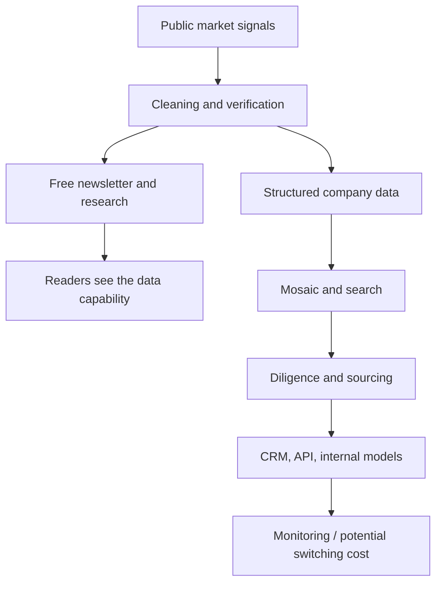

> 🌏 [中文版](/posts/product/2026-09-17-cb-insights-research-to-workflow)

Imagine a supermarket offering free samples at the entrance. The samples tell passersby whether the kitchen can cook. What keeps restaurants paying, however, is the central kitchen behind the counter: ingredients are selected, washed, portioned, labeled, and delivered directly to each restaurant's refrigerator.

[CB Insights](https://www.cbinsights.com/) uses its newsletter and public research as the samples. Charts, market maps, and trend analysis show readers how it organizes technology-company and investment-market information. The paid product is the central kitchen: signals about companies, funding, acquisitions, customer relationships, and management teams become data that can be searched, compared, and monitored.

This is not a business built around letting people read half an article and charging them to unlock the rest. Enterprises buy a shorter path to a decision: identify potential partners, investments, or competitors first, then decide where analyst time is worth spending. Research content earns attention; data, scores, and workflows may make renewal more attractive.

## Free Research Proves That the Data Factory Works

A conventional publisher chooses a story and then gathers the material needed to write it. CB Insights can work in the opposite direction. It continuously collects company and transaction data, then uses the same underlying database to produce newsletters, charts, and research reports. Public content is not merely marketing copy. It is a sample of the paid product.

The distinction matters. A reader who enjoys one trend report may never subscribe to enterprise software. A team that repeatedly asks which new companies deserve a meeting, whom a competitor has partnered with, or whether a market is accelerating needs reusable data rather than another round of news searches.

Productization therefore does not mean moving articles behind a paywall. It means breaking the research material behind those articles into reusable objects: companies, people, transactions, relationships, markets, and scores. Those objects can be ranked, assembled into lists, added to watchlists, and delivered to other software.

The diagram has two exits. Free research demonstrates the capability to the market. Paid data travels all the way into a decision. The public product design suggests that both can be supported by the same data capability; that is this article's business-model inference, not a description of CB Insights' internal architecture. Revenue therefore does not have to scale with article volume.

## Step One: Turn Scattered Reports Into Queryable Data

Private-company intelligence is difficult because information is scattered across formats. A financing may appear in a regulatory filing, an investor's website, a company press release, or local news. The same round may be reported several times under different currencies and variations of a company's name. Searchability alone does not make those reports comparable.

CB Insights once documented a historical collection pipeline called The Cruncher in its [data methodology post](https://www.cbinsights.com/research/team-blog/private-company-financing-data-sources-cruncher/). It first classified whether an article concerned financing, M&A, hiring, or a partnership. It then identified companies, people, dates, and amounts, extracted relationships, clustered duplicate events, and sent the result to an analyst for approval. The automation and direct-submission ratios in that old post are historical snapshots, not 2026 facts. The durable idea is the division of labor: machines sort first; people inspect the shipment.

The current [API data overview](https://api-docs.cbinsights.com/portal/docs/CBI-data/data-overview/) describes a similar split. Automated checks and machine learning flag anomalies, data analysts cross-check key records against multiple public sources, and research teams review AI-generated insights. A fully manual operation would update too slowly. A fully automated one could mix together namesakes, stale transactions, and incorrect amounts.

Once processed, a news report is no longer just text. It becomes one financing round associated with a company, one relationship linked to an investor, or one event inside a market. This is the first step from content to a data product: **turn a paragraph that can only be read into fields that can be filtered and computed.**

## Step Two: Use Mosaic to Decide What to Review First

Once a database exists, the next question is not how many companies it contains. It is which companies an analyst should review today. [Mosaic](https://www.cbinsights.com/mosaic-score/) compresses several private-company signals into a health score ranging from 0 to 1,000 so that investment, strategy, and business-development teams can narrow a candidate set.

According to CB Insights' own [Mosaic white paper](https://www.cbinsights.com/mosaic-whitepaper/), the current score is primarily composed of growth momentum, financial strength, industry health, and management strength. The company used scores from 2023 to examine outcomes over the following two years. It reports that the 30 highest-scoring companies produced future unicorns at 4.7 times the median hit rate of the venture firms in its comparison.

That result may show that the ranking is useful. It does not establish that an algorithm has been independently proven to invest better than venture capitalists. CB Insights designed, ran, and published the analysis, and the result has not been independently replicated. Its outcome is whether a company reached a billion-dollar valuation within two years, not fund returns. Venture portfolios also face constraints involving stage, ownership, deal access, and fund mandates; a Mosaic ranking does not have to deploy capital.

Triage is the more defensible use. If a team finds five hundred companies, it should not ask analysts to research all five hundred equally. It can first filter by industry, geography, and growth signals, then conduct diligence on a smaller group. Mosaic is closer to airport security routing than a judge's verdict. It can suggest which line deserves inspection first. It cannot decide whether a team should ultimately invest, partner, or acquire.

Data gaps matter too. A company that operates quietly, receives little press, or sits in a market with sparse public data may leave fewer digital traces. The white paper also says that when one metric is missing, its weight is redistributed among the available metrics. Two identical scores therefore need not rest on identical evidence. A precise-looking number can still confuse visibility with business quality.

## Step Three: Stop Making Users Return to the Website

An intelligence tool that works only on its own website remains a place where people look something up and copy it elsewhere. A workflow product sends the result into the systems a team already uses.

The [CB Insights Salesforce integration](https://www.cbinsights.com/what-we-offer/salesforce-integration/) can add company, investor, and transaction data to a CRM and use funding, customers, partners, competitors, and momentum to build pipelines. Its [Affinity integration](https://www.cbinsights.com/what-we-offer/integrations/affinity-integration/) can create company profiles in response to new funding, customer announcements, or major hires, reducing duplicate data entry.

APIs and data feeds also let enterprises place scores and relationship data inside internal models. Such integrations may make renewal more attractive. If a CRM, watchlists, and research processes begin to depend on CB Insights fields, replacing the supplier means handling more than accounts: field mappings, lists, triggers, and historical context may also need to move.

| Product layer | What users receive | Job it performs | Primary limitation |
|---|---|---|---|
| Newsletter and public research | Market interpretation, charts, cases | Discover change and understand a topic | Easy to quote, summarize, or replicate with AI |
| Structured data | Companies, deals, people, business relationships | Search, compare, and create lists | Private-company data will always have gaps |
| Mosaic and related scores | Relative ordering of candidates | Allocate research and sales time | A score is neither diligence nor investment return |
| CRM and API integrations | Importable, triggerable, continuously updated fields | Put intelligence inside daily decisions | Adoption and supplier replacement both cost money |

The current [official pricing page](https://www.cbinsights.com/what-we-offer/pricing/) does not publish fixed dollar prices and directs enterprises to request a quote. Data Solutions is described as consumption-based. Online estimates are not substitutes for a contract, so a reliable per-seat comparison is not possible. What the public page does show is that onboarding, migration, enterprise security, and a dedicated strategist are part of the offer. This is not positioned as a low-friction individual subscription.

## AI Makes the Interface Faster—and Surface-Level Content Easier to Replace

[ChatCBI](https://www.cbinsights.com/chatcbi/) places a natural-language interface in front of the company's database. Users can ask it to find companies, analyze a market, prepare acquisition research, or create a watchlist without learning every filter first. CB Insights also offers an API so that internal enterprise AI systems can use the same company and market data.

This is both an opportunity and a threat. Generative AI reduces the friction of querying the database and can produce a first company list or memo faster. It also makes public-news summaries and generic trend reports cheaper. If a product merely paraphrases the open web, a general-purpose model can absorb much of its value.

The dividing line sits behind the answer. Proprietary historical records, cleaned company relationships, team watchlists, and CRM integrations do not vanish when a chat interface arrives. They can instead become context for the model. But AI can still make mistakes. The [CB Insights API documentation](https://api-docs.cbinsights.com/portal/docs/api/) explicitly warns that its generative endpoint may do so. Source links, original fields, and human review remain controls, not decoration.

## Why Historical Data Is Harder to Copy Than Yesterday's Article

More models can read breaking news quickly. A long time series still takes years to accumulate. In 2020, CB Insights acquired VentureSource's data assets from Dow Jones. [Business Insider reported](https://www.businessinsider.com/cb-insights-has-acquired-data-assets-venturesource-dow-jones-7-2020) that the records reached back to 1983 and included private-company management and professional-service relationships. The price was not disclosed.

For a data company, this is like turning today's snapshot into a film. A team can compare cycles, industries, and company stages instead of seeing only a current funding total. Historical records also give a scoring model past examples against which it can be tested. An article ages with the news cycle; a cleaned historical field can continue to support queries, comparisons, and models.

The company's financing history reflects the same direction. CB Insights announced a $10 million Series A in 2015. [Reuters reported](https://www.reuters.com/article/cbinsights-fundraising/cb-insights-raises-10-mln-financing-from-rstp-idUSL3N13201I20151109/) that it was the company's first institutional financing and would fund its team and core data products. This article also does not turn unverified revenue projections into realized results.

## The Moat—and the Cracks in It

CB Insights' moat is not one popular report or one AI feature. The harder system to reproduce is the chain: historical data, entity resolution and deduplication, human verification, proprietary derived scores, and the CRM connections, APIs, and watchlists already embedded at customers. Each layer can be challenged on its own. Stacked together, they may create a higher switching cost.

The weaknesses come from the same chain. Private companies do not disclose complete information, so underlying fields will have gaps. Models can amplify visibility bias. AI can make an incorrect answer sound polished. An enterprise without analytical capacity can also buy a large database without knowing what questions to ask. Dedicated onboarding lowers that friction, but its presence also signals that the product does not generate decisions by itself.

The useful question for a content business is not how to sell one more premium report. It is which parts of the research process can be saved as fields, updated continuously, and connected to a reader's next action. A practical exercise for tonight is to lay out your ten most recent articles and mark the companies, events, prices, and relationships that recur. Put them in a filterable table. If that table becomes more useful each time new material arrives, the content has started to become a data product.

CB Insights shows that the destination is not content that merely resembles software. It is research output that software can actually use. Free content demonstrates that the company understands a market. Once that understanding enters the daily workflow, an enterprise has one more reason to renew.

## References

- [CB Insights Pricing](https://www.cbinsights.com/what-we-offer/pricing/)
- [CB Insights API Data Overview](https://api-docs.cbinsights.com/portal/docs/CBI-data/data-overview/)
- [CB Insights API Documentation](https://api-docs.cbinsights.com/portal/docs/api/)
- [CB Insights: How Does CB Insights Get Its Data?](https://www.cbinsights.com/research/team-blog/private-company-financing-data-sources-cruncher/)
- [CB Insights Mosaic Score](https://www.cbinsights.com/mosaic-score/)
- [CB Insights Mosaic Whitepaper](https://www.cbinsights.com/mosaic-whitepaper/)
- [CB Insights ChatCBI](https://www.cbinsights.com/chatcbi/)
- [CB Insights Salesforce Integration](https://www.cbinsights.com/what-we-offer/salesforce-integration/)
- [CB Insights Affinity Integration](https://www.cbinsights.com/what-we-offer/integrations/affinity-integration/)
- [Business Insider: CB Insights acquires the data assets of VentureSource from Dow Jones](https://www.businessinsider.com/cb-insights-has-acquired-data-assets-venturesource-dow-jones-7-2020)
- [Reuters: CB Insights raises $10 mln financing from RSTP](https://www.reuters.com/article/cbinsights-fundraising/cb-insights-raises-10-mln-financing-from-rstp-idUSL3N13201I20151109/)
