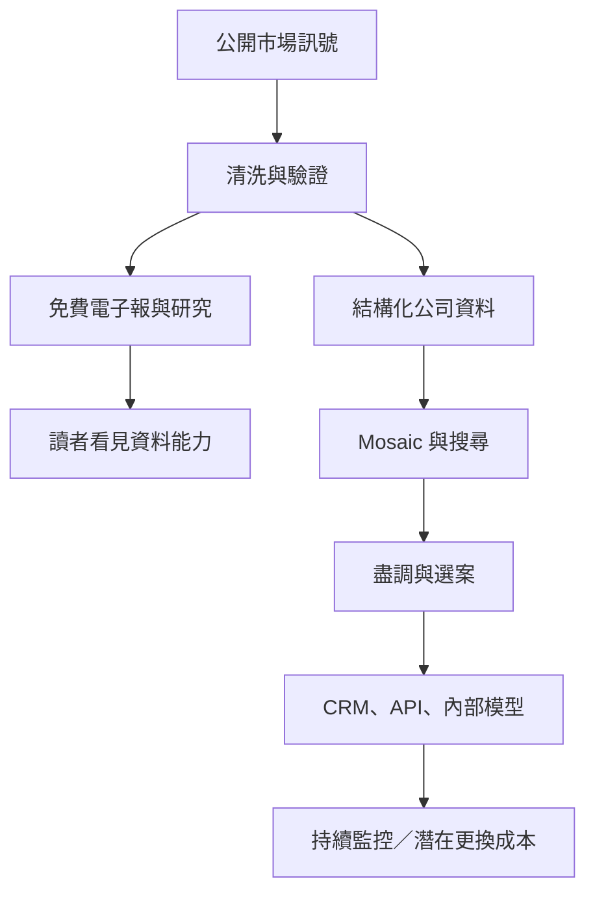

> 🌏 [English version](/en/posts/product/2026-09-17-cb-insights-research-to-workflow-en)

想像一間超市每天在門口提供試吃。試吃讓路人知道廚師會不會做菜。真正讓餐廳持續付錢的，是後面的中央廚房：有人挑食材、清洗、分裝、貼標籤，還能準時送進餐廳的冰箱。

[CB Insights](https://www.cbinsights.com/) 的電子報與公開研究就是試吃。它用圖表、產業地圖與市場觀察，讓讀者先看到它怎麼整理科技公司與投資市場。付費產品則像中央廚房，把公司、融資、併購、客戶關係與管理團隊等訊號整理成可以搜尋、比較和持續追蹤的資料。

因此，這門生意不是「免費文章看一半，付錢解鎖全文」。企業真正購買的是一條比較短的決策路徑：先找出可能的合作對象、投資標的或競爭者，再決定哪幾家值得投入分析師時間。研究內容負責吸引注意；資料、評分與工作流則可能提高續約黏性。

## 免費研究先證明：這座資料工廠有用

一般內容公司先決定要寫什麼，再為那篇文章找資料。CB Insights 可以反過來做：先持續收集公司與交易資料，再從同一座資料庫切出電子報、圖表與研究報告。公開內容不只是行銷文案，也是付費產品的樣品。

這個差別很重要。讀者若只喜歡某篇趨勢文章，未必會訂閱企業軟體。企業團隊每天面對的，則是「哪些新公司值得談」「競爭者最近跟誰合作」「這個市場正在加速還是降溫」。這些問題需要可反覆查詢的資料，不能每次都重新搜尋新聞。

產品化的動作，是把文章背後的研究材料拆成可重複使用的物件：公司、人物、交易、關係、市場、分數。文章是否放進付費牆反而是次要問題。這些物件能被排序、組成名單、放進監控清單，也能送進其他軟體。

這張圖有兩個出口。免費研究把能力展示給市場；付費資料則一路進入決策。從公開產品設計來看，兩邊可以由同一套資料能力支撐；這是本文的商業模式推論，不是對 CB Insights 內部系統的描述。收入因此不必綁在文章數量上。

## 第一步：把零碎消息變成可查詢資料

私人公司情報最麻煩的地方，是資訊散落在不同格式。融資可能出現在監管申報、投資人網站、公司新聞稿或地方媒體；同一輪交易還可能被多篇文章用不同幣別與公司名稱重複報導。搜尋得到，不代表能直接比較。

CB Insights 在[資料蒐集方法說明](https://www.cbinsights.com/research/team-blog/private-company-financing-data-sources-cruncher/)中公開過一套名為 The Cruncher 的歷史流程。系統先判斷文章談的是融資、併購、招募還是合作，再辨認公司、人名、日期與金額。接著抽取彼此關係、合併重複事件，最後交給分析師核准。那篇說明中的自動化與直接提交比例屬於早期快照，不能當成 2026 年現況；值得保留的是「機器先分揀，人再驗貨」的設計。

現行的 [API 資料說明](https://api-docs.cbinsights.com/portal/docs/CBI-data/data-overview/)仍採相同分工。自動檢查與機器學習先找出異常，資料分析師再用多個公開來源交叉核對，研究團隊則審查 AI 產出的洞察。只靠人工，更新速度跟不上；只靠機器，同名公司、舊交易與錯誤金額又可能一起混進資料庫。

整理完成後，一則新聞不再只是文字。它會成為某家公司的一輪融資、某位投資人的一筆關係，或某個市場的一次活動。這就是內容變成資料產品的第一步：**把只能閱讀的段落，改造成可以篩選與運算的欄位。**

## 第二步：用 Mosaic 決定先看誰

資料庫解決「能查到哪些公司」，[Mosaic](https://www.cbinsights.com/mosaic-score/)接著回答「分析師今天先看哪幾家」。它把私人公司的多種訊號壓成 0 到 1,000 的健康分數，讓投資、企業策略與業務團隊先縮小候選名單。

依 CB Insights 自行發布的 [Mosaic 白皮書](https://www.cbinsights.com/mosaic-whitepaper/)，現行分數主要由成長動能、財務強度、產業健康與管理團隊四個面向組成。公司用 2023 年的分數回看之後兩年的結果，宣稱最高分的 30 家公司成為獨角獸的命中率，是受比較創投中位數的 4.7 倍。

這個數字可以說明排序器可能有用，卻不能寫成「演算法已經證明比創投會投資」。研究由 CB Insights 自己設計、執行與發布，沒有獨立重現；它追蹤的是公司是否在兩年內達到十億美元估值，不是基金報酬。創投還受投資階段、持股比例、可取得交易與基金策略限制，Mosaic 排名則不用真的投入資金。

更合適的用法是分流。假設團隊找到五百家公司，不要讓分析師平均研究五百家；先用產業、地區與成長訊號縮成一小批，再逐家做盡職調查。Mosaic 像機場的安檢分流，不是法官判決。它能指出哪一排應該先查，不能替團隊決定最後要不要投資、合作或收購。

資料缺口也會影響分數。低調經營、媒體曝光少，或位於公開資料較稀疏市場的公司，可能留下較少「數位足跡」。白皮書也說明，某項指標缺資料時，權重會重新分配給其他可用指標；因此兩個相同分數背後的證據組成未必相同。一個看起來精準的分數，仍可能把資料可見度誤認成企業品質。

## 第三步：不要叫使用者一直回來看網站

情報工具若只能在自己的網站上使用，價值會停在「查完再抄回去」。真正的工作流產品，會把結果送進團隊本來就在用的地方。

CB Insights 的 [Salesforce 整合](https://www.cbinsights.com/what-we-offer/salesforce-integration/)可以把公司、投資人與交易資料加入客戶關係管理系統。團隊也能用融資、客戶、合作夥伴、競爭者與公司動能來建立名單。[Affinity 整合](https://www.cbinsights.com/what-we-offer/integrations/affinity-integration/)則能依新融資、客戶公告或重要招募等事件建立公司檔案，省下重複輸入。

它也透過 API 與資料供應，讓企業把分數與關係資料放進內部模型。這類整合可能提高續約黏性：若 CRM、監控清單與研究流程開始依賴 CB Insights 的欄位，更換供應商時，除了帳號，還要處理欄位對應、名單、觸發條件與歷史脈絡。

| 產品層 | 使用者拿到什麼 | 解決的工作 | 最主要的限制 |
|---|---|---|---|
| 電子報與公開研究 | 市場解讀、圖表、案例 | 發現變化、理解議題 | 容易被轉述與 AI 摘要 |
| 結構化資料 | 公司、交易、人物、商業關係 | 搜尋、比較、建立名單 | 私人公司資料必然不完整 |
| Mosaic 等評分 | 候選公司的相對順序 | 分配研究與業務時間 | 分數不是盡職調查或投資報酬 |
| CRM／API 整合 | 可匯入、觸發、持續更新的欄位 | 把情報放進日常決策 | 導入與更換供應商都有成本 |

目前[官方定價頁](https://www.cbinsights.com/what-we-offer/pricing/)沒有公開固定美元價格，主要引導企業詢價；資料方案則標示為依用量計費。網路上的估價不能替代實際報價，因此無法可靠比較「每一席多少錢」。能確定的是，它把 onboarding、資料移轉、企業安全與專責顧問一起放進方案，顯示這不是面向個人的低摩擦自助訂閱。

## AI 讓入口更快，也讓表層內容更容易被取代

[ChatCBI](https://www.cbinsights.com/chatcbi/) 把自然語言問答放在自家資料庫前面。使用者可以要求找公司、拆市場、準備併購分析或建立監控清單，不必先熟悉每一個篩選欄位。官方也提供 API，讓企業內部 AI 使用同一批公司與市場資料。

這對 CB Insights 同時是機會與威脅。機會是，生成式 AI 把資料庫變得更容易問，能更快產出第一版名單與 memo。威脅是，公開新聞摘要與一般趨勢整理也會變得更便宜；如果產品只把網路文章換句話說，通用模型就能吃掉大部分價值。

真正的分界在答案背後。專有歷史資料、清洗後的公司關係、團隊監控清單與 CRM 整合，不會因為聊天介面出現就自動消失；反而能成為 AI 的上下文。可是 AI 也會犯錯，CB Insights 的 [API 文件](https://api-docs.cbinsights.com/portal/docs/api/)同樣提醒生成式回答可能出錯。來源連結、原始欄位與人工覆核仍然必要。

## 歷史資料為什麼比昨天的文章更難複製

即時新聞可以被更多模型快速讀取，長時間序列卻需要多年累積。2020 年，CB Insights 從 Dow Jones 收購 VentureSource 的資料資產。依 [Business Insider 的報導](https://www.businessinsider.com/cb-insights-has-acquired-data-assets-venturesource-dow-jones-7-2020)，這批資料可追溯到 1983 年，還包含私人公司的管理人員與專業服務關係；交易金額沒有公開。

對資料公司來說，這像替今天的快照補上一整段影片。團隊不只知道某家公司現在得到多少資金，還能比較不同週期、產業與公司階段。歷史資料也讓評分模型有過去樣本可測試。文章會隨新聞週期變舊，整理過的歷史欄位則可能繼續支撐查詢、比較與模型。

公司資本史也反映這條路。2015 年，CB Insights 宣布取得 1,000 萬美元 Series A；[Reuters](https://www.reuters.com/article/cbinsights-fundraising/cb-insights-raises-10-mln-financing-from-rstp-idUSL3N13201I20151109/)當時報導，這是公司的第一筆機構投資，資金將用於團隊與核心資料產品。這裡也不把未經財報驗證的營收預測寫成已實現成果。

## 這套模式的護城河與破口

CB Insights 的護城河不是某一篇熱門報告，也不是單一 AI 功能。比較難複製的是整條鏈：歷史資料、公司辨識與去重、人工驗證、專有衍生分數，再加上客戶已經接好的 CRM、API 與監控清單。每一層單獨看都可能被追上；疊在一起，則可能形成更高的更換成本。

破口也來自同一條鏈。私人公司不公開完整資料，底層欄位一定有缺漏。模型可能放大可見性偏誤，AI 也會讓錯誤答案看起來更流暢。企業若沒有分析能力，可能買了大量資料卻不知道該問什麼。專責導入服務能降低摩擦，也反過來說明產品並非買來就會自己產生決策。

內容生意可以換一個問題：研究過程中有哪些東西能保存成欄位、持續更新，並直接進入讀者下一個動作？

今晚就把最近十篇文章攤開，找出反覆出現的公司、事件、價格與關係，先做一張可篩選的表。若那張表會隨新資料變得更有用，內容才開始往資料產品走。再多寫一篇付費報告，不會自動帶來這個效果。

CB Insights 展示的終點，是讓研究成果真的能被軟體使用。把內容寫得像軟體沒有用。免費內容證明它看得懂市場；當那些判斷進入每天的工作流，也就多了一個讓企業續約的理由。

## 參考資料

- [CB Insights Pricing](https://www.cbinsights.com/what-we-offer/pricing/)
- [CB Insights API Data Overview](https://api-docs.cbinsights.com/portal/docs/CBI-data/data-overview/)
- [CB Insights API Documentation](https://api-docs.cbinsights.com/portal/docs/api/)
- [CB Insights: How Does CB Insights Get Its Data?](https://www.cbinsights.com/research/team-blog/private-company-financing-data-sources-cruncher/)
- [CB Insights Mosaic Score](https://www.cbinsights.com/mosaic-score/)
- [CB Insights Mosaic Whitepaper](https://www.cbinsights.com/mosaic-whitepaper/)
- [CB Insights ChatCBI](https://www.cbinsights.com/chatcbi/)
- [CB Insights Salesforce Integration](https://www.cbinsights.com/what-we-offer/salesforce-integration/)
- [CB Insights Affinity Integration](https://www.cbinsights.com/what-we-offer/integrations/affinity-integration/)
- [Business Insider: CB Insights acquires the data assets of VentureSource from Dow Jones](https://www.businessinsider.com/cb-insights-has-acquired-data-assets-venturesource-dow-jones-7-2020)
- [Reuters: CB Insights raises $10 mln financing from RSTP](https://www.reuters.com/article/cbinsights-fundraising/cb-insights-raises-10-mln-financing-from-rstp-idUSL3N13201I20151109/)
