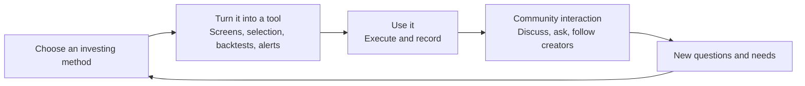
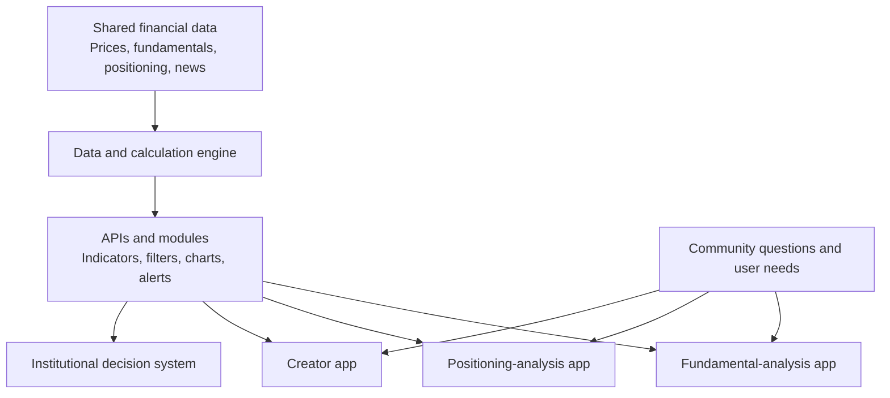
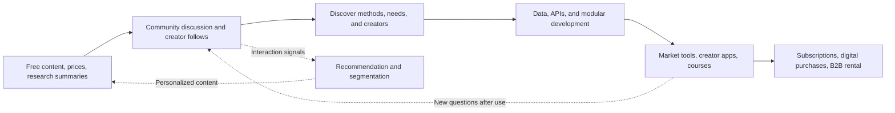

> 🌏 [中文版](/posts/product/2026-09-17-cmoney-content-tool-community)

Imagine a free investing study group. Members exchange notes, discuss unusual stocks, and follow teachers they trust. Next door is not a ticket booth but a tool shop selling market screens, stock-picking apps, courses, and research systems.

[CMoney](https://www.cmoney.tw/) combines those two spaces. Free articles, market data, and the 股市爆料同學會 investor community help people form questions. Tools turn investing methods into repeatable interfaces. New observations from using those tools may return to the community as another discussion.

The loop is plausible, but plausible is not proven. CMoney does not publish conversion, retention, or revenue by stage. This article explains how the products connect; it does not treat a flowchart as a financial result.

## CMoney starts with method, tool, and community

CMoney's [company product page](https://www.cmoney.tw/careers/product) defines three steps: understand yourself and choose a suitable method, use a tool to execute it consistently, and rely on community interaction to keep going.

This is the company's public design logic, not a slogan invented by outside analysis. The page also explains that some investors prefer fundamentals while others study broker positioning. Their horizons range from long-term investing to swing trading and day trading. Instead of putting every feature into one app, CMoney builds different apps around different methods and creators.

The diagram shows the intended product journey. It does not prove that users stay, subscribe, or improve their returns. Investment outcomes depend on the market, the strategy, and risk management. A product loop cannot establish performance.

## The free entry point mixes content, community, and tools

The [Google Play listing for 股市爆料同學會](https://play.google.com/store/apps/details?hl=zh_TW&id=com.cmoney.forum) describes live prices, technical analysis, institutional positioning, news, research reports, posting, anonymous Q&A, simulated trading, and creator rankings. The store also labels the app as containing ads and digital purchases.

Readers do more than consume articles. They can move from a stock quote into a discussion, follow a creator from that discussion, and discover a tool built around the creator's method. Content, community, and product discovery happen within the same operating context, removing some of the handoffs between “I read something” and “I need a way to act on it.”

The same listing describes a creator program. Users can apply to become authors and may receive help launching apps, books, or video courses. CMoney's [about page](https://www.cmoney.tw/careers/aboutus) likewise says its partnership business turns creator knowledge into apps and courses.

The community therefore performs two jobs: it serves readers and creates a supply of creators and methods. Public information does not show which community creators become successful products, how long that transition takes, or how revenue is shared.

## How one method becomes many apps

CMoney can productize content because creators sit on top of a shared technical layer. A [2022 iThome profile](https://www.ithome.com.tw/people/150043) describes how the company moved from institutional decision systems into consumer investing. It modularized data and calculation logic behind APIs, allowing different products to reuse market data, indicators, and charts while packaging them for specific investing methods. An [official institutional-products page](https://www.cmoney.com.tw/purchase) also displays rental and customized arrangements, without publishing current customer counts or revenue.

This makes “turning content into a product” concrete. A creator contributes more than an article: a stock-selection logic, review sequence, or indicator can become an interface, filter, and alert. The shared layer reduces duplicate engineering, while specialized apps give each method its own product package.

iThome also reported that posts, comments, tabs, portfolio data, notifications, and clicks informed analysis and personalization. That describes company practices reported in 2022. It does not prove that every current product shares all of those records, and it cannot replace current privacy policies or user consent.

## There are several revenue paths, but their relative size is unknown

The [CMoney marketplace](https://www.cmoney.tw/app/default.aspx) displays software, seminars, online courses, video, and partner creators. A [籌碼 K 線 product page](https://www.cmoney.tw/app/itemcontent.aspx?id=3537) confirms an annual subscription product with automatic renewal. CMoney also sells an institutional investment-decision system and enterprise arrangements.

The public evidence supports several layers without revealing their economics:

| Layer | What the user gets | Documented monetization | What remains unknown |
|---|---|---|---|
| Free content and market data | News, research summaries, company information | Ads and product discovery | Ad revenue share and referral conversion |
| Investor community | Discussion, Q&A, creators, simulated trading | Ads and digital purchases | Retention, paid conversion, recommendation lift |
| Market and stock-selection tools | Methods turned into usable interfaces | Subscriptions | ARPU, renewal, and revenue by product |
| Creator apps and courses | Creator methods and teaching | Apps, courses, video, or books | Revenue share and average creator earnings |
| Institutional system | Data, backtesting, and research workflows | Rental and enterprise arrangements | Current customers, revenue, and margin |

CMoney's websites publish several figures for members, active users, app counts, and institutional market share, but their dates and definitions differ. This article does not combine them into a growth rate or treat “served at some point” as “currently active and paying.”

## Which arrows in the flywheel have evidence?

Drawing a flywheel is easy. Labeling each arrow with evidence is harder.

The solid path has public product or technical evidence: the content and community exist, creator partnerships exist, the shared data layer exists, and so do subscription and institutional products. The dotted arrows describe plausible mechanisms: using tools may generate discussion, and interaction signals may improve recommendations.

The missing evidence concerns outcomes. Without cohort retention, cross-sell rates, acquisition costs, ARPU, or margin by product, no one can claim that the community has proved it increases renewals or that the tools successfully convert free readers. The “flywheel” here is a design diagram, not a performance report.

## AI adds value beyond writing—and risk beyond incorrect prose

The Google Play description says the community uses AI to recommend creators and stock posts. On September 17, 2026, CMoney's own search result labeled the [AI 股神 product page](https://www.cmoney.tw/app/itemcontent.aspx?id=6580) as not yet on sale; the full page could not be checked reliably for a stable plan. It should not be presented as an established subscription business.

AI matters more when it turns the same fundamental, technical, positioning, news, and community data into conversational queries, personalized summaries, or executable review steps. That builds on CMoney's existing data and tool layer rather than merely rewriting articles.

The risks also come from that data layer:

- An AI summary can mix community rumor with a regulatory filing and make the blend look coherent.
- A recommendation system optimized for clicks may push investors toward more sensational and risky material.
- Stock analysis is easy to interpret as advice, so it needs sources, timestamps, model limits, and clear compliance boundaries.
- If portfolio, preference, or behavior data enters a model, the platform needs explicit consent, purpose limits, and deletion controls.

General-purpose AI will make basic earnings summaries and indicator explanations cheaper. CMoney's differentiation will depend on licensed data, timeliness, workflows, and community relationships—not on who can generate the most words.

## To analyze a content platform, find the action that actually gets charged

Pick a free-content platform and draw four steps: what audience the content attracts, what settings or relationships those users leave behind, which tool solves their next problem, and who eventually pays. Label each arrow as measured, company-reported, or inferred.

CMoney's defensibility does not come from articles that nobody else can rewrite. The harder assets to move are watchlists and settings, familiar tool workflows, followed creators, and community relationships. Those assets may raise switching costs, but retention data would still be necessary to prove the effect.

Free content is not the endpoint in this system. It forms questions, surfaces methods, and identifies creators. Data and APIs turn those methods into tools. Subscriptions, courses, and institutional systems carry the revenue. That is what it looks like when free content acquires customers for another business—and it remains a design whose financial results are private.

## References

- [CMoney company products and the method-tool-community design](https://www.cmoney.tw/careers/product) (in Mandarin)
- [CMoney business groups, creator partnerships, and product positioning](https://www.cmoney.tw/careers/aboutus) (in Mandarin)
- [Google Play: 股市爆料同學會 features and creator program](https://play.google.com/store/apps/details?hl=zh_TW&id=com.cmoney.forum) (in Mandarin)
- [CMoney marketplace for software, courses, video, and partner creators](https://www.cmoney.tw/app/default.aspx) (in Mandarin)
- [CMoney 籌碼 K 線 annual subscription](https://www.cmoney.tw/app/itemcontent.aspx?id=3537) (in Mandarin)
- [iThome on CMoney's data engine, APIs, and multi-app development](https://www.ithome.com.tw/people/150043) (in Mandarin)
- [CMoney institutional-system rental and customization](https://www.cmoney.com.tw/purchase) (in Chinese)
- [CMoney AI 股神 product page](https://www.cmoney.tw/app/itemcontent.aspx?id=6580) (in Mandarin)
