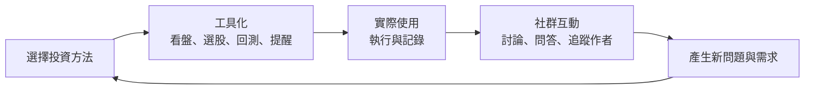
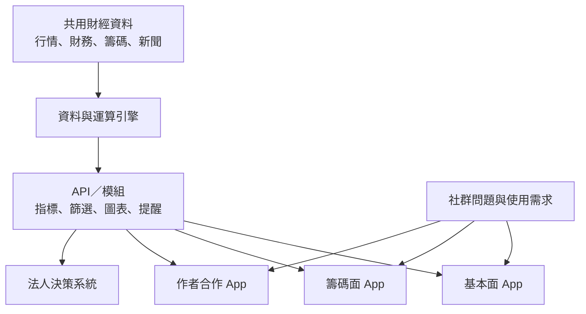
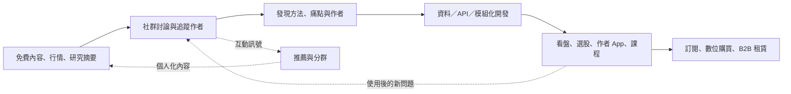

> 🌏 [English version](/en/posts/product/2026-09-17-cmoney-content-tool-community-en)

想像一間免費的投資讀書會。有人分享筆記，有人討論今天哪檔股票異常，也有人追蹤自己信任的老師。讀書會隔壁不是售票亭，而是一間工具行：看盤軟體、選股 App、課程與研究系統都在那裡販售。

[CMoney](https://www.cmoney.tw/)做的正是這種組合。免費文章、行情與股市爆料同學會讓投資人先形成問題。工具把投資方法變成可以反覆操作的介面，使用後產生的新觀察又可能回到社群裡討論。

這個循環很合理，但「合理」不等於「已證實」。CMoney 沒有公開每一段的付費轉換、留存或收入占比。本文拆的是產品如何接在一起，不會把一張流程圖冒充成財務成績單。

## CMoney 官方的起點是方法、工具、社群

CMoney 的[公司產品頁](https://www.cmoney.tw/careers/product)直接提出三個步驟：先了解自己並選擇適合的方法，再用工具有紀律地執行，最後透過社群互動持續下去。

這不是外部分析者替它發明的口號，而是官方公開的產品設計。頁面也解釋，投資人有人偏基本面，有人看籌碼；操作週期又分波段、短線、當沖或長線。CMoney 因此沒有把所有功能塞進一個 App，而是用不同 App 服務不同方法與作者。

這張圖表示官方想建立的使用路徑，不代表使用者一定留下、一定訂閱，更不代表用了工具就能提高投資績效。投資結果受到市場、策略與風險管理影響，不能從產品循環直接推論。

## 免費入口不是一個論壇，而是內容與工具混合場景

[股市爆料同學會的 Google Play 頁](https://play.google.com/store/apps/details?hl=zh_TW&id=com.cmoney.forum)列出即時股價、技術分析、法人動向、新聞、研究報告、發文、匿名問答、模擬交易與達人績效榜。商店頁也標示含廣告與數位購買。

讀者在這裡不只消費文章。他可以從一檔股票的行情進入討論，從討論追蹤作者，再從作者的方法發現工具。內容、社群與產品展示發生在相近的使用情境裡，少掉「讀完文章後還要到別處找解法」的接縫。

同一個商店頁也介紹股市創作者計畫：使用者可申請成為作者，並有機會由官方協助推出 App、書籍與影音課程。CMoney 的[關於我們頁](https://www.cmoney.tw/careers/aboutus)則說，合作夥伴事業群把創作者知識轉成 App 與影音課程。

於是社群有兩個工作：一邊服務讀者，一邊形成作者與方法的供給池。哪些作者真的從社群轉成暢銷商品、平均需要多久、平台怎麼分潤，公開資料都沒有答案。

## 一個方法怎麼變成多款 App

CMoney 能把內容做成工具，關鍵不只在作者，也在共用的資料與開發底座。[iThome 2022 年的深度採訪](https://www.ithome.com.tw/people/150043)描述，CMoney 從服務法人的決策系統轉向一般投資人時，把資料與運算邏輯做成模組與 API。不同產品不必重做行情、指標與圖表底層，而是依投資方法組合出不同 App；[官方法人產品頁](https://www.cmoney.com.tw/purchase)也展示租賃與客製方案，但未公開現行客戶數或收入。

這個架構讓「內容產品化」有了比較具體的意思。作者不只交一篇文章，而是把選股邏輯、檢查步驟或觀察指標，轉成介面、篩選器與提醒。共用底座降低重複開發，細分 App 則讓每種方法可以有自己的產品包裝。

iThome 也描述論壇貼文、留言、頁籤、庫存、推播與點擊等行為資料，可用於分析與個人化推薦。這是 2022 年訪談中的公司做法，不等於現在每一個產品都共用所有資料，也不能取代當下的隱私政策與使用者同意。

## 變現不只一條，也不能猜哪條最大

[理財寶首頁](https://www.cmoney.tw/app/default.aspx)同時陳列軟體、講座、線上課程、影音與合作作者；[籌碼 K 線商品頁](https://www.cmoney.tw/app/itemcontent.aspx?id=3537)則確認存在自動續訂的年訂閱商品。另一邊，CMoney 也有面向機構客戶的投資決策系統與企業方案。

把公開可證的幾層排在一起，比硬猜營收更有用：

| 層 | 使用者取得什麼 | 可證的變現方式 | 仍不知道什麼 |
|---|---|---|---|
| 免費內容／行情 | 新聞、研究摘要、個股資訊 | 廣告、導向其他產品 | 廣告收入占比、導流轉換 |
| 股市爆料同學會 | 討論、問答、作者、模擬交易 | 廣告、數位購買 | 留存、付費轉換、推薦效果 |
| 看盤／選股工具 | 把方法變成可操作介面 | 訂閱商品 | ARPU、續訂率、產品別收入 |
| 作者 App／課程 | 作者方法與教學 | App、課程、影音或書籍 | 分潤條款、作者平均收入 |
| 法人決策系統 | 資料、回測與研究協作 | 租賃與企業方案 | 現行客戶數、收入與毛利 |

CMoney 官網有多組會員、活躍使用者、App 數量與機構市占說法，但口徑和時間不同。本文不把它們拼成成長率，也不拿「服務過」當成現在仍活躍或付費。

## 所謂飛輪，哪些箭頭有證據

把整套系統畫成飛輪很容易；比較難的是逐箭頭標示證據。

實線部分有公開產品或技術資料可支持：內容與社群存在、作者合作存在、共用資料底座存在、訂閱與法人方案也存在。虛線部分是合理機制：使用工具可能帶回討論，互動訊號也可能改善推薦。

缺的是結果。沒有 cohort retention、cross-sell rate、CAC、ARPU 或產品別毛利，就不能寫「社群已證明提高續訂」或「工具成功把免費讀者轉成付費會員」。這篇所稱的飛輪，是設計圖，不是成效報告。

## AI 的價值不只生成文章，風險也不只寫錯字

股市爆料同學會的 Google Play 說明已提到以 AI 演算法推薦作者與股票文章。2026 年 9 月 17 日的官方搜尋結果把[AI 股神商品頁](https://www.cmoney.tw/app/itemcontent.aspx?id=6580)標示為尚未開賣；完整商品頁又無法穩定核對方案，因此不能把它寫成一條已實現的訂閱生意。

對 CMoney 而言，AI 更有價值的地方，是把同一份財務、技術、籌碼、新聞與社群資料，轉成對話式查詢、個人化摘要或可執行的檢查流程。它接近既有的資料與工具優勢，不只是替文章換一種寫法。

風險也跟資料層連在一起：

- AI 若把社群傳聞和公告事實混在同一段，錯誤資訊會顯得更有條理。
- 推薦若只追求點擊，可能把投資人推向更刺激、風險更高的內容。
- 個股摘要容易被讀成投資建議，需要來源、時間戳、模型限制與法遵界線。
- 持倉、偏好與行為資料若進入模型，需要清楚的同意、用途限制與刪除機制。

通用 AI 會讓基本財報摘要與指標解釋愈來愈便宜。CMoney 能否守住差異，最後要看授權資料、即時性、工作流與社群關係，而不是誰能生成最多文字。

## 拆內容平台時，先找真正收費的動作

今晚可以挑一個免費內容平台，畫出四步：內容把什麼人帶進來、使用者留下什麼設定或關係、哪個工具解決下一個問題、最後由誰付錢。再把每一條箭頭標成「有數據」「公司自述」或「只是推論」。

CMoney 的價值不在於免費文章本身比較難複製。比較難搬走的是自選與設定、熟悉的工具流程、追蹤的作者，以及在社群累積的關係。這些資產可能提高切換成本，但「可能」仍需要留存資料來驗證。

免費內容在這套系統裡不是商品終點。它負責形成問題、帶出方法與找到作者；資料和 API 把方法做成工具；訂閱、課程與法人系統才承接收入。這正是免費內容替另一門生意獲客的樣子，也是一張還缺財務結果的設計圖。

## 參考資料

- [CMoney：公司產品與「方法—工具—社群」設計](https://www.cmoney.tw/careers/product)
- [CMoney：事業群、創作者合作與產品定位](https://www.cmoney.tw/careers/aboutus)
- [Google Play：股市爆料同學會功能與創作者計畫](https://play.google.com/store/apps/details?hl=zh_TW&id=com.cmoney.forum)
- [CMoney 理財寶：軟體、課程、影音與合作作者](https://www.cmoney.tw/app/default.aspx)
- [CMoney：籌碼 K 線年訂閱商品](https://www.cmoney.tw/app/itemcontent.aspx?id=3537)
- [iThome：CMoney 的資料引擎、API 與多 App 開發](https://www.ithome.com.tw/people/150043)
- [CMoney：法人決策系統租賃與客製方案](https://www.cmoney.com.tw/purchase)
- [CMoney：AI 股神商品頁](https://www.cmoney.tw/app/itemcontent.aspx?id=6580)
