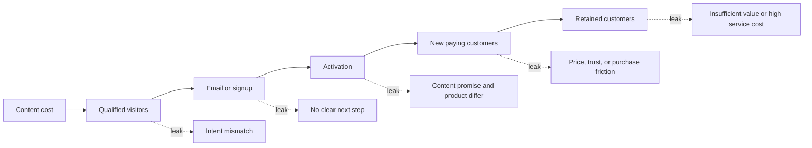
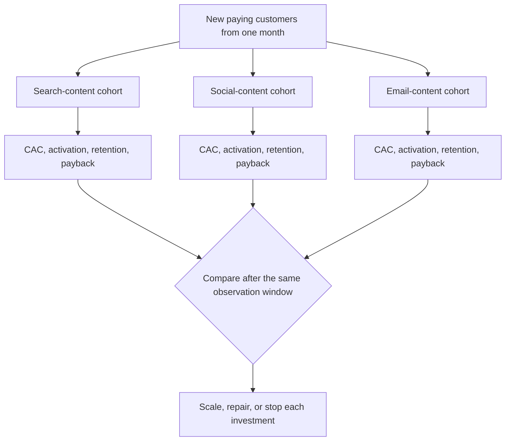
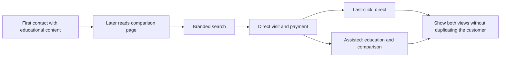

> 🌏 [中文版](/posts/product/2026-09-17-content-acquisition-cac-ltv)

Imagine filling a bucket with holes. Content pours visitors in. Some are the wrong audience and escape through the first hole. Some leave an email address but never complete the first key action. Some pay and cancel weeks later. The faucet can look enormous while little water remains at the bottom.

Traffic is the faucet. Content customer acquisition cost (CAC) asks how much production, distribution, tooling, and labor it actually took to obtain one new paying customer. Customer lifetime value (LTV) asks how much value that customer leaves during the relationship. Revenue alone still overstates the water in the bucket if gross margin and ongoing service cost are ignored.

This article does not offer a healthy ratio for every industry. It provides compatible numerators, denominators, and time windows so a team can locate the leak and choose its next experiment.

## Draw every hole in the bucket first

The diagram deliberately contains no invented conversion rate. Useful numbers belong to each channel, entry cohort, and content intent. High-intent search visitors, new audiences from short social posts, and existing email readers should not become one average funnel.

Tonight, choose one month and one source, then place the five stage counts in one table. If a stage cannot be answered, instrument the event or CRM field before guessing from sitewide sessions.

## CAC needs a complete numerator and paying customers in the denominator

[HubSpot's CAC guide](https://www.hubspot.com/startups/sales-and-marketing/calculating-cac-for-startups) defines CAC around sales and marketing cost required to acquire new customers, and calls out advertising, tools, salaries, commissions, and often-ignored founder time. Adapted to content:

`Content CAC = (attributable production + distribution + tooling + labor cost for the cohort) ÷ new paying customers in that cohort`

| CAC item | Include | Common omission or error | Check |
|---|---|---|---|
| Production | Research, interviews, writing, design, and review | Counting only freelance fees | Multiply actual hours by internal cost for every role |
| Distribution | Ads, social, email, and partnership spending | Treating organic traffic as free | Include operating and repurposing labor |
| Tools | SEO, analytics, email, CRM, video, and hosting | Omitting shared software | Allocate by usage or a documented rule |
| Maintenance | Updates, redirects, link repair, and retirement | Counting only launch | Include work during the cohort observation window |
| Denominator | New paying customers in the same cohort | Using leads, signups, or all customers | Count first-time payers and deduplicate |

A lead is not a customer. A white-paper download, mailing-list signup, or trial proves only that someone advanced one stage. If content costs $10,000 and generates 1,000 leads, that supports a cost-per-lead calculation. Only the people who become new paying customers belong in the CAC denominator.

Dividing total site cost by total customers is often unactionable. It mixes brand demand, product pages, outbound sales, and existing word of mouth. At minimum, split by channel and cohort and fix the attribution window before deciding which content to improve.

## LTV should use contribution margin, not treat all revenue as recoverable cash

For a subscription or repeat-purchase business, a useful approximation is:

`Contribution margin per period = revenue per period - variable service cost for that customer`

`Contribution-margin LTV ≈ contribution margin per period × expected paid periods`

Variable service cost includes support, compute, fulfillment, payment fees, and spending incurred only while the customer remains. This approximation deducts each cost once; if a company's gross-margin figure already includes an item, it must not be subtracted again. One-time onboarding belongs in a separate line only when it is not already included in CAC.

Then calculate:

`Payback period = CAC ÷ monthly gross margin per customer`

Payback translates “eventually profitable” into a cash-flow question. Two channels may report the same CAC and LTV, but the one that takes longer to recover requires different capital, growth speed, and risk tolerance.

The often-repeated “3:1 LTV:CAC” is somebody else's benchmark, not a universal rule. Gross margin, renewal cadence, cost of capital, churn shape, and company stage all change the acceptable relationship. Start with your cohorts: when does each cohort pay back, is retention stable, and has enough time passed to estimate LTV?

## Averages lie unless channel and cohort are separated

Channel says which distribution path a customer used. Cohort groups people who began under comparable timing and conditions. Together they prevent last year's accumulated SEO customers from justifying content launched this month that has not matured.

Lock the observation window when comparing cohorts. Measure activation, renewal, gross margin, and payback after the same number of months from first payment. Mark incomplete cohorts as immature rather than presenting forecast LTV as realized value.

## Last click is not all the credit; assisted conversion is not unlimited credit

Content may educate, establish trust, or answer objections before purchase, while the final click comes from branded search or a direct visit. Last-click alone understates upstream content. Crediting every order from anyone who viewed content overstates it by claiming people who would have purchased anyway.

Keep two sets of fields: the last identifiable conversion source and the content touched before purchase. Reports may show assisted conversions, but the company total of new customers cannot grow because one person had several touches. Estimating incrementality requires holdouts, geographic or time experiments, or similar methods—not an arbitrary percentage allocation.

## Choose experiments from symptoms instead of publishing more

| Symptom | Inspect first | Next small experiment | Success criterion |
|---|---|---|---|
| High traffic, low signup | Query intent and CTA fit | Rewrite offer and landing for one high-intent page group | Signup rate improves without lower quality |
| High signup, low activation | Gap between content promise and first product value | Shorten the path to first outcome | Cohort activation and time-to-value improve |
| High activation, low payment | Pricing, trial boundary, and purchase friction | Test one clearer payment moment | Paid conversion rises without worse refunds |
| High payment, low retention | Discount buyers, poor fit, or onboarding | Compare cancellation reasons by source and fix week one | Gross-margin retention improves for the cohort |
| Acceptable CAC, slow payback | Upfront cost or monthly margin | Lower acquisition cost or increase upfront value | Payback shortens without trading for churn |
| High assisted count, unclear lift | Attribution claims organic demand | Create a holdout or time experiment | Exposed and unexposed groups differ explainably |

Change one funnel stage at a time and preserve the original cohort as a comparison. If content, product, price, and onboarding change together, even a better result will not reveal which action worked.

## Conclusion: traffic is water; retained gross margin is the business

Content teams tend to optimize visible traffic. Finance teams tend to compress all conversion into one average CAC. The leaky bucket shows why every stage between them can determine whether the business works.

Restore complete cost to the numerator and place only new paying customers in the denominator. Then use gross-margin LTV and payback for value and cash flow, split channel and cohort, and show last-click beside assisted conversion. It is slower than repeating a universal ratio, but it tells you which hole to repair next.

## References

- [HubSpot for Startups: How to Calculate Customer Acquisition Cost](https://www.hubspot.com/startups/sales-and-marketing/calculating-cac-for-startups) — CAC definition, cost scope, and common errors
- [HubSpot: Customer Lifetime Value](https://blog.hubspot.com/service/how-to-calculate-customer-lifetime-value) — basic LTV definition and calculation; this article adapts it to gross margin
