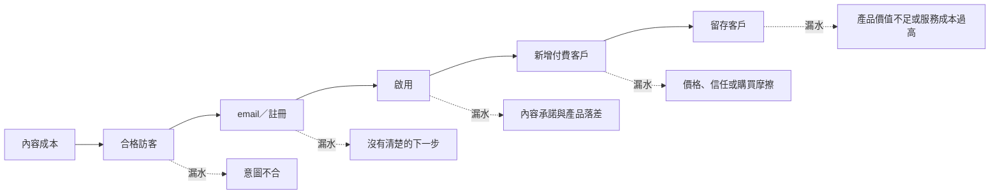
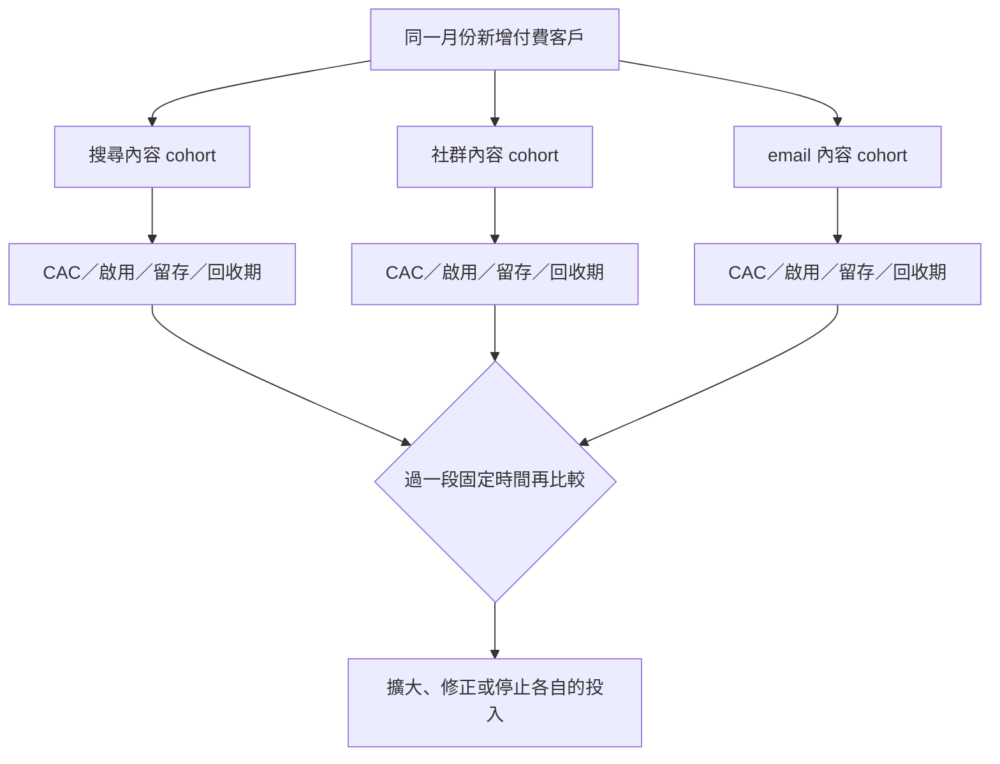
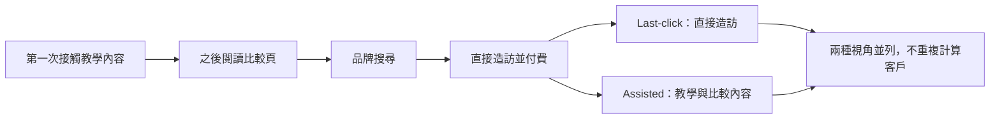

> 🌏 [English version](/en/posts/product/2026-09-17-content-acquisition-cac-ltv-en)

想像用一只破洞水桶接水。內容把訪客倒進桶裡，有些人不是你要的客群，從第一個洞流走；有人留下 email，卻沒有完成第一次關鍵操作；有人付費，幾週後又取消。水龍頭看起來很大，最後留在桶底的水可能很少。

流量就是水龍頭。內容獲客成本（CAC）計算取得一名新增付費客戶所投入的製作、分發、工具與人時。顧客終身價值（LTV）則估計這位客戶在留存期間留下多少價值。若只看營收，不看毛利與持續服務成本，桶底的水仍被高估。

這篇不提供跨產業的健康比率。它提供一套對得起來的分子、分母與時間範圍，讓團隊能找出哪一層漏水，並決定下一個實驗。

## 先把水桶的每一個洞畫出來

圖上故意不放虛構轉換率。真正有用的是每個 channel、每批進站時間與每種內容意圖自己的數字。搜尋來的高意圖訪客、社群短文帶來的新受眾與既有 email 讀者，不該混成同一個平均漏斗。

今晚可以先選一個月份和一個來源，把五層人數排成同一張表。任何一層無法回答，就先補事件或 CRM 欄位，不要用全站 sessions 猜。

## CAC 的分子要完整，分母只能放付費客戶

[HubSpot 的 CAC 指南](https://www.hubspot.com/startups/sales-and-marketing/calculating-cac-for-startups) 將 CAC 定義為取得新客戶所投入的銷售與行銷成本，並提醒應納入廣告、工具、薪資、佣金與常被忽略的創辦人時間。套到內容上，可寫成：

`內容 CAC =（該 cohort 可歸因的內容製作 + 分發 + 工具 + 人時成本）÷ 該 cohort 新增付費客戶`

| CAC 項目 | 應納入 | 常見漏算或誤算 | 核對方式 |
|---|---|---|---|
| 內容製作 | 研究、採訪、寫作、設計、審稿 | 只算外包稿費 | 所有角色以實際工時乘內部成本 |
| 分發 | 廣告、社群、電子報與合作費用 | 把有機流量視為零成本 | 加入經營與重製素材的人時 |
| 工具 | SEO、分析、寄信、CRM、影音與代管 | 共用工具全部漏掉 | 依使用量或合理規則分攤 |
| 維護 | 更新、轉址、連結修復、內容淘汰 | 只算首發成本 | 以 cohort 觀察期內實際投入計算 |
| 分母 | 同一 cohort 的新增付費客戶 | 用 leads、註冊或所有客戶代替 | 只計首次付費且去除重複客戶 |

Lead 不是 customer。下載白皮書、加入名單或開啟試用，只能證明漏斗向前一步，不能直接放進 CAC 分母。若內容花費 10 萬元帶來 1,000 筆名單，這能算每筆名單成本；只有其中實際新增的付費客戶，才能用來算 CAC。

總站成本除以總客戶也經常沒有行動價值。它把品牌、產品頁、業務開發與既有口碑全混進來。至少要按 channel 與 cohort 拆開，並固定歸因窗口，才知道該改善哪一批內容。

## LTV 要看貢獻毛利，不是把營收都當成可回收現金

對訂閱或重複購買生意，一個可用的近似式是：

`每期貢獻毛利 = 每期收入 - 該客戶的變動服務成本`

`貢獻毛利 LTV ≈ 每期貢獻毛利 × 預期付費期數`

變動服務成本包括客服、運算、履約、付款費用與只在客戶存續時發生的支出。這個近似式只扣一次；若公司的毛利率已包含其中某項成本，就不能再次扣除。一次性的 onboarding 若沒有算進 CAC，再另外列一次。

接著算：

`回收期 = CAC ÷ 每月每客毛利`

回收期把「最後可能賺錢」轉成現金流問題。兩個 channel 即使有相同 CAC 與 LTV，若其中一個需要很久才回本，成長速度、資金需求與風險仍不同。

網路上常見的「LTV:CAC 3:1」只能當別人的經驗值，不能當普遍規則。毛利率、續約週期、資金成本、流失型態與公司階段都會改變合理區間。應先看自己的 cohort：同一批客戶何時回本、留存是否穩定、估計 LTV 是否已經有足夠觀察期。

## Channel 與 cohort 不拆開，平均值會說謊

Channel 告訴你客戶從哪種分發路徑進來；cohort 告訴你哪一批人在相同時間與條件下開始。兩者一起看，才不會拿去年累積的 SEO 客戶，去替本月剛投放、還沒成熟的內容背書。

比較時要鎖定觀察期。例如每批客戶都看首次付費後相同月數的啟用、續約、毛利與回收進度。尚未觀察完整的 cohort 要標為未成熟，不能把推估當成已發生的 LTV。

## 最後點擊不是全部功勞，輔助轉換也不是無限邀功

內容常在購買前做了教育、建立信任或回答異議，最後一個 click 卻可能來自品牌搜尋或直接造訪。只看 last-click，會低估上游內容；把所有看過內容的人都算成內容客戶，又會把原本就會購買的人全部攬功。

可行做法是同時保留兩套欄位：一套記錄最後可辨識的轉換來源，另一套記錄購買前接觸過哪些內容。報表可呈現 assisted conversion，但全公司新增客戶總數不能因多次接觸而膨脹。要估計增量，應用 holdout、地區或時間實驗、品牌搜尋變化等方法，而不是任意分配百分比。

## 看現象選實驗，不要只做更多內容

| 現象 | 優先檢查 | 下一個小實驗 | 成功判準 |
|---|---|---|---|
| 流量高、註冊低 | 查詢意圖與 CTA 是否相符 | 為一組高意圖頁重寫 offer 與 landing | 同來源的註冊率改善，品質不下降 |
| 註冊高、啟用低 | 內容承諾與第一次產品價值是否落差 | 縮短到首次成果的步驟 | cohort 啟用率與 time-to-value 改善 |
| 啟用高、付費低 | 定價、試用邊界與購買摩擦 | 測試一個更清楚的付費轉換時點 | 付費率提高且退款不惡化 |
| 付費高、留存低 | 折扣客、錯誤客群或 onboarding | 按來源比較取消原因並改第一週體驗 | 同 cohort 的毛利留存改善 |
| CAC 可接受、回收太慢 | 前期成本或每月毛利 | 降低取得成本或提高 upfront value | 回收期縮短，不以更高流失交換 |
| Assisted 高、增量不明 | 歸因把自然需求算給內容 | 建立 holdout 或時間實驗 | 未曝光組與曝光組出現可解釋差異 |

一次只改一段漏斗，並保留原本 cohort 作比較。若同時換內容、產品、價格和 onboarding，即使結果變好，也很難知道是哪個動作有效。

## 結論：流量是水，留下的毛利才是生意

內容團隊容易優化看得到的流量，財務團隊則容易把所有轉換壓成一個平均 CAC。漏水桶提醒我們，中間每一層都可能決定生意是否成立。

先把完整成本放回分子，只把新增付費客戶放進分母。再用毛利 LTV 和回收期看價值與現金流，按 channel、cohort 拆開，並把 last-click 與 assisted conversion 並列。這比追逐一個通用比率慢一點，卻能告訴你下一個洞該補在哪裡。

## 參考資料

- [HubSpot for Startups：How to Calculate Customer Acquisition Cost](https://www.hubspot.com/startups/sales-and-marketing/calculating-cac-for-startups) — CAC 定義、成本範圍與常見錯誤
- [HubSpot：Customer Lifetime Value](https://blog.hubspot.com/service/how-to-calculate-customer-lifetime-value) — LTV 基本定義與計算思路；本文決策模型另改用毛利口徑
