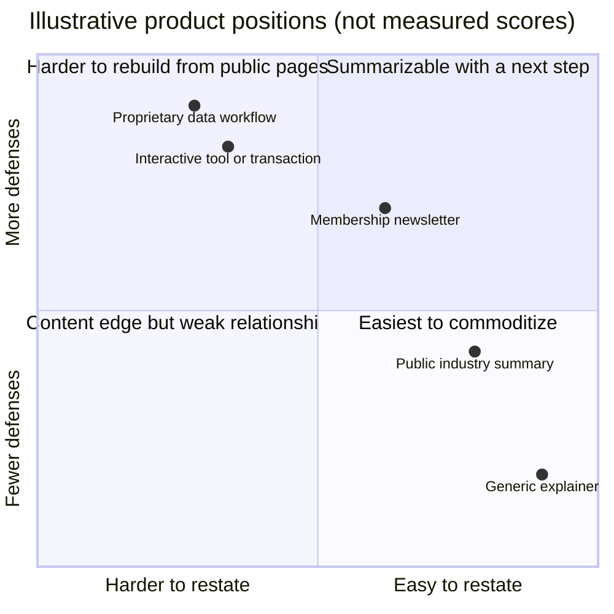
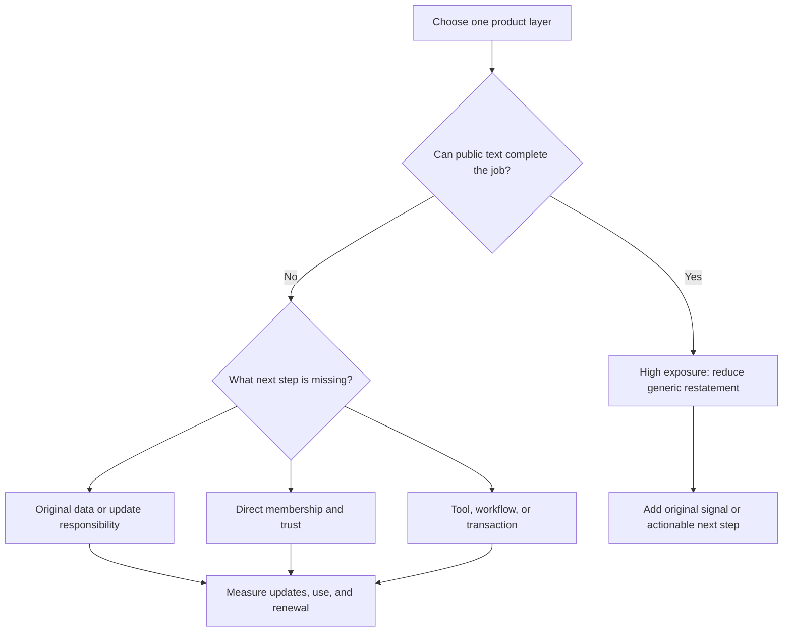

> 🌏 [中文版](/posts/product/2026-09-17-content-model-ai-exposure-defense)

Imagine four restaurants posting menus outside. AI can copy the dish names and prices. It cannot carry away the kitchen, regular-customer list, reservation system, or today's ingredients.

Content businesses work the same way. A public article can be summarized, but a company is more than a pile of articles. The useful comparison is: **which product layer can be reconstructed from public text, and which still requires original data, a relationship, or an action?**

This is a decision framework, not a market measurement. Positions change with data rights, update speed, product design, and reader behavior.

## Separate exposure from defense

[Google's official explanation of AI features in Search](https://developers.google.com/search/docs/appearance/ai-features) says AI Overviews and AI Mode find supporting pages from indexed content and may use query fan-out across subtopics. Public text that compresses into a short answer is therefore easier to reassemble. Being cited, however, does not establish traffic or revenue.

A defense is not an anti-summary spell. It means the full job still requires a next step: querying a database, talking to an analyst, using a tool, receiving email, joining a community, or completing a transaction.

| Product layer | Public-text exposure | Defense | What AI can do | What still requires the source |
|---|---|---|---|---|
| Public B2B summary | High | Brand and some methodology | Restate trends and conclusions | Proprietary data, analyst access, enterprise workflow |
| Public creator post | High | Trust, membership, payment relationship | Summarize views and steps | Ongoing relationship, member benefits, community context |
| Free news or SEO page | Very high | Varies by product | Answer a generic question | Tool, alert, service, or transaction |
| Independent paid newsletter | Medium | Email, brand, payment relationship | Summarize public archive | Inbox delivery, member content, replies |

## B2B intelligence: exposed article layer, stronger workflow layer

Public market summaries, definitions, and ranking explanations can be restated. Continuously updated private-company data, supply-chain interviews, query tools, and procurement workflows require more than the final paragraph.

That does not make B2B intelligence safe. If customers experience the product as “summarize public news for me,” models lower the replacement cost. Defense comes from original signals, auditable data, update responsibility, and embedded work—not charging more for the same summary.

## Creator platforms: exposed archives, relationships with switching friction

A creator's public posts can be compressed, and voice alone is not impossible to imitate. Voluntary subscription, payment, and reply relationships are harder to move.

[Ghost's membership documentation](https://docs.ghost.org/members) says member lists can be exported and paid subscriptions connect to the publisher's own Stripe account. That proves one portability design. It does not prove that every creator retains readers or that every platform exports the same data.

## Free content: highest risk when the next step is another article

Ad-supported explainers, generic comparisons, and simple FAQs often monetize the pageview. If the answer is completed at the entrance, ads, calls to action, and related stories never get a turn.

Content linked to a calculator, alert, account data, or transaction moves toward another quadrant. Yet a simple tool can also become a model feature. More durable defenses come from fresh data, personal state, reliable execution, and accountable boundaries.

## A one-person media company: personality is not the only moat

An independent publisher's direct relationship offers more control than pure SEO traffic, but an email list does not generate trust by itself. The publisher still has to deliver consistently, handle churn and platform dependencies, and give paying readers value beyond a public summary.

## An audit for tonight

Do not give the whole company one score. List each product layer and ask: can the public page reconstruct the value? Why must a reader return? Who owns the next step? Which layer still delivers if traffic falls sharply?

Under this framework, the most exposed layer is text with no original signal, direct relationship, or action exit—not an entire category of company at once.

## Series navigation

- Next: [Which content assets are still worth building in the AI era](/en/posts/product/2026-09-17-ai-era-content-asset-portfolio-en)

## References

- [Google Search Central: AI features and your website](https://developers.google.com/search/docs/appearance/ai-features)
- [Ghost: memberships, subscriptions, and portability](https://docs.ghost.org/members)
- [Cloudflare: AI crawl-to-refer measurement and limitations](https://blog.cloudflare.com/ai-search-crawl-refer-ratio-on-radar/)
