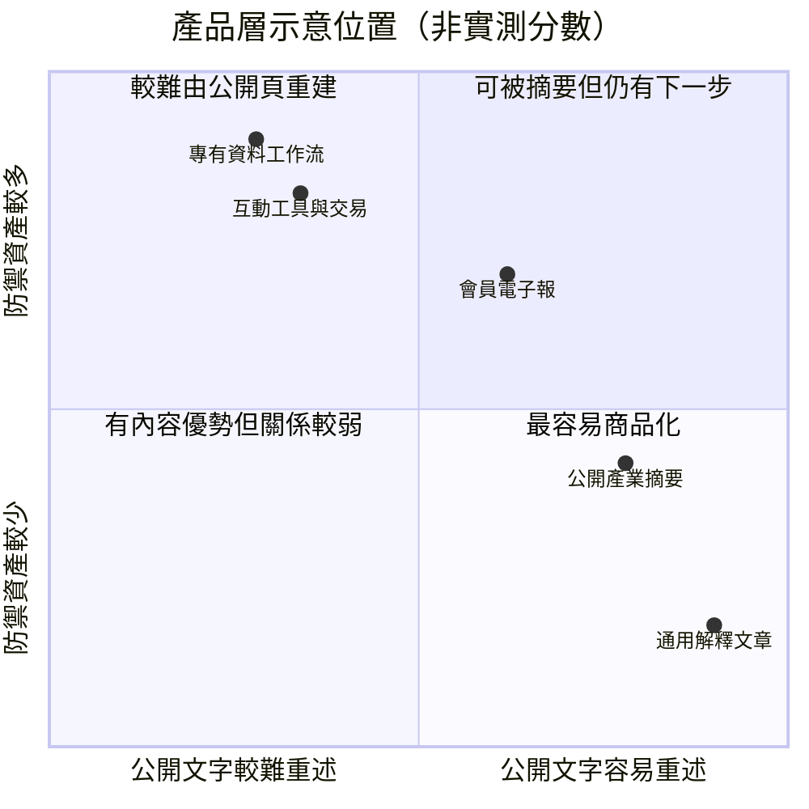
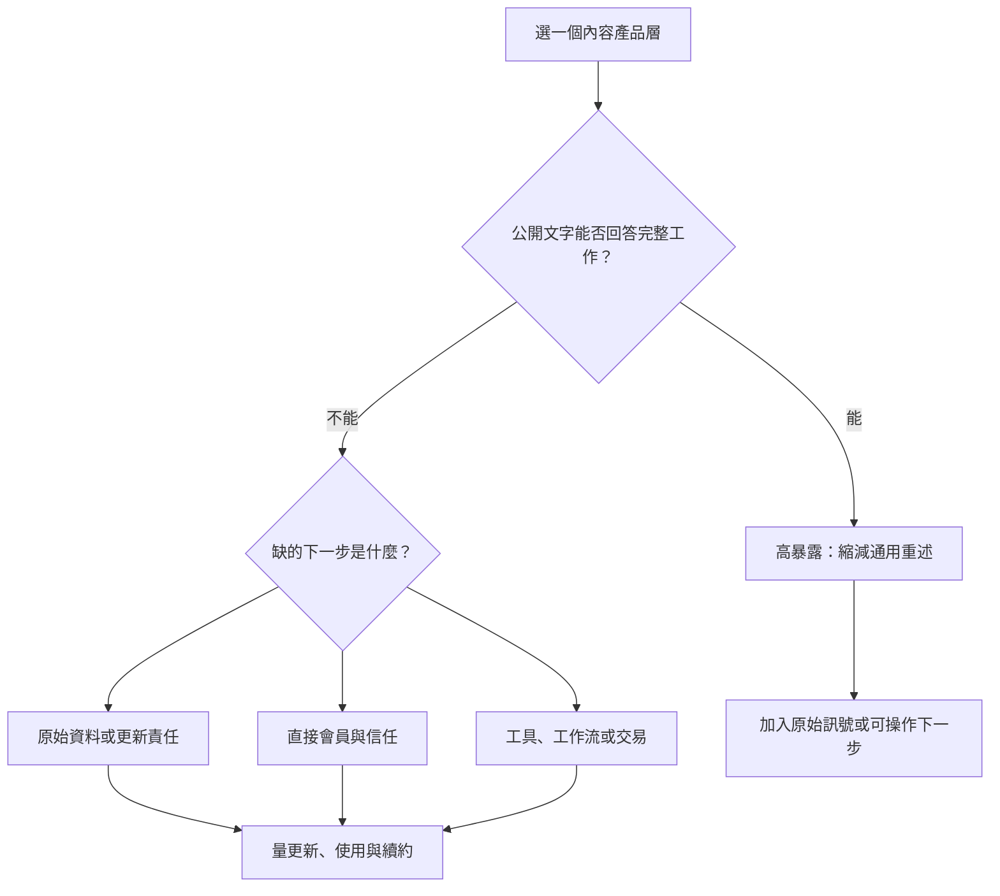

> 🌏 [English version](/en/posts/product/2026-09-17-content-model-ai-exposure-defense-en)

想像四家餐廳都把菜單貼在門口。AI 很容易抄走菜名與價格，卻搬不走廚房、熟客名單、訂位系統和每天新到的食材。

內容生意也是如此。公開文章可能被摘要，但公司不只是一疊文章。真正要比較的是：**哪一層產品能被公開文字重建，哪一層還需要原始資料、關係或行動？**

這張圖是決策框架，不是市場量測。位置會隨產品、資料權、更新速度與讀者行為改變。

## 先分清暴露與防禦

[Google 對 AI 搜尋功能的官方說明](https://developers.google.com/search/docs/appearance/ai-features)指出，AI Overviews 與 AI Mode 會從索引內容找支持頁面，並可能用 query fan-out 搜尋多個子題。這讓可公開讀取、可壓縮成短答案的文字更容易被重新組裝；但「可被引用」不等於已知流量或收入。

防禦力也不是禁止摘要的魔法。它只是讓完整價值還需要下一步：登入資料庫、詢問分析師、使用工具、收到 email、進入社群或完成交易。

| 產品層 | 公開文字暴露 | 防禦資產 | AI 可完成什麼 | 仍需原站或關係完成什麼 |
|---|---|---|---|---|
| B2B 公開摘要 | 高 | 品牌與部分方法 | 重述趨勢與結論 | 專有資料、分析師互動、企業工作流 |
| 創作者公開文章 | 高 | 作者信任、會員與付款關係 | 摘要觀點與步驟 | 持續關係、會員權益、社群脈絡 |
| 免費新聞／SEO 文 | 很高 | 依產品而異 | 回答通用問題 | 工具、通知、服務或交易 |
| 獨立電子報會員層 | 中 | email、品牌、付費關係 | 摘要公開檔案 | 收件匣觸達、會員內容與回覆 |

## B2B 情報：文章層高曝險，工作流層較低

公開的市場摘要、定義與排名說明都可被重述。相對地，持續更新的私人公司資料、供應鏈訪談、查詢工具與採購決策流程，需要的不只是最後一段文字。

這不表示 B2B 情報安全。若客戶只把產品當成「替我整理公開新聞」，模型會壓低替代成本。防禦來自原始訊號、可稽核資料、更新責任與嵌入工作，而不是把相同摘要賣得更貴。

## 創作者平台：公開檔案易摘要，關係仍有摩擦

創作者的公開文章可以被答案引擎壓縮，作者風格也不保證不可模仿。比較難搬走的是讀者主動訂閱、付款與回覆的關係。

[Ghost 的會員文件](https://docs.ghost.org/members)說明會員清單可匯出，付費訂閱連到出版者自己的 Stripe 帳號。這證明某種可攜產品設計，不證明每個創作者都能留住讀者，也不能代表所有平台的資料都一樣可帶走。

## 免費內容：如果下一步還是另一篇文章，最危險

廣告型文章、通用比較與簡單 FAQ 的價值常在 pageview。答案若已在入口完成，廣告、CTA 與相關文章都沒有出場機會。

若內容連到計算器、通知、帳戶資料或交易服務，風險會往另一個象限移動。不過簡單工具也可能被模型內建；真正較難複製的是持續資料、個人狀態、可靠執行與責任邊界。

## 一個人的媒體公司：人味不是唯一護城河

獨立媒體的直接關係比純 SEO 流量更有控制權，但 email 清單本身不會自動產生信任。作者仍需穩定交付、管理退訂與平台依賴，並讓付費者得到公開摘要以外的價值。

## 今晚怎麼盤點

不要替整家公司打一個分數。列出每個產品層，逐一問：公開頁是否足以重建價值？讀者為什麼必須回來？下一步由誰擁有？如果流量少一半，哪一層仍能交付？

用這套框架判讀時，最高暴露的不是「某一類公司」，而是沒有原始訊號、沒有直接關係、也沒有行動出口的文字層。

## 系列導覽

- 下一篇：[AI 時代仍值得經營哪些內容資產](/posts/product/2026-09-17-ai-era-content-asset-portfolio)

## 參考資料

- [Google Search Central：AI 搜尋功能、公開內容與網站流量](https://developers.google.com/search/docs/appearance/ai-features)
- [Ghost：會員、訂閱與資料可攜性](https://docs.ghost.org/members)
- [Cloudflare：AI crawl-to-refer 指標與限制](https://blog.cloudflare.com/ai-search-crawl-refer-ratio-on-radar/)
