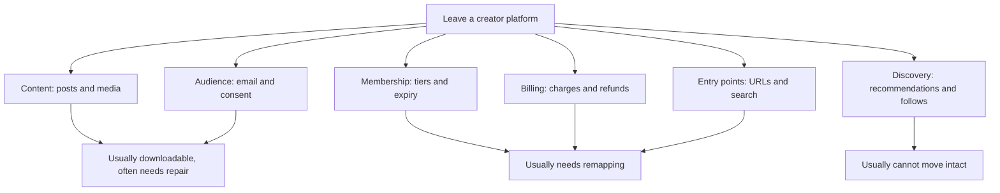
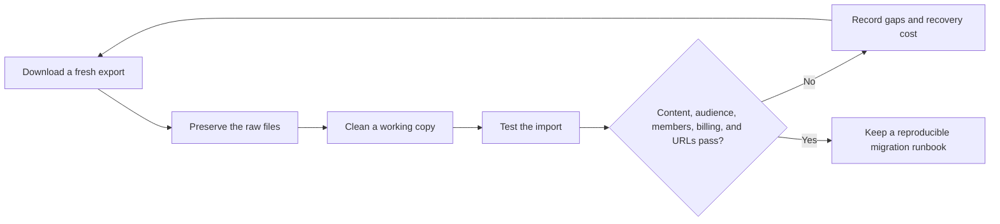

> 🌏 [中文版](/posts/product/2026-09-17-creator-platform-migration-assets)

Imagine moving from a night-market stall into your own shop. Tables can go into a truck, and perhaps you can copy a regular-customer contact list. The old location, foot traffic, neighboring referrals, and customers' saved payment arrangements do not automatically follow.

A creator-platform export works the same way. Downloading a ZIP of posts or a subscriber CSV proves that you received some files. It does not prove that the business has moved. The useful question is not whether a platform has an Export button. It is **which asset layer can move, which must be rebuilt, and which belonged to the platform all along.**

## Migration is six asset layers, not one button

Platforms present these layers as one interface, but migration pulls them apart. A successful post import does not prove that image URLs survived. Having an email does not prove continuing consent to send. Knowing that someone has an annual membership does not give the new system the ability to continue the old recurring charge.

| Asset layer | Common portable format | What is often lost | Acceptance test |
|---|---|---|---|
| Content | HTML, JSON, CSV, ZIP | Images, embeds, paywall rules | Compare a sample of 20 posts |
| Audience | Email CSV | Unsubscribe state, consent, followers without email | Reconcile active and unsubscribed counts |
| Membership | Tier, status, expiry | Benefits, discounts, interaction history | Sign in as samples from every tier |
| Billing | Stripe or platform ledger | Tokens, refunds, failed charges, tax handling | Test a small renewal and refund cohort |
| Entry points | Domain, redirects, canonicals | Old links, search rank, sender reputation | Monitor 404s, traffic, and deliverability |
| Discovery | Rarely a complete export | Recommendations, comments, social graph | Build a separate acquisition channel |

## Posts can move while formatting and URLs break

[Substack's export guide](https://support.substack.com/hc/en-us/articles/360037466012-How-do-I-export-my-posts) lets publishers download posts, subscriber lists, and related statistics. [Medium](https://help.medium.com/hc/en-us/articles/115004745787-Export-your-account-data) can generate an account archive. [Beehiiv](https://www.beehiiv.com/support/article/12258595483543-exporting-post-content-or-subscriber-data-from-beehiiv) says its post export includes published, archived, and draft content.

Those functions matter, but they move raw material. A new platform may not understand an old callout, poll, audio player, or paywall marker. Images may still point to the former platform's CDN and disappear after shutdown. If slugs change, years of inbound links can end at 404 pages.

A content migration therefore needs three inventories: post count, media count, and an old-to-new redirect map. Miss one and the dashboard may look complete while the reader experience remains broken.

## Followers, email subscribers, and paid members are different groups

A follow is a relationship inside the platform. A reader may follow without giving an email address to the creator. Even when an email is present, unsubscribe and consent states must survive; a CSV is not automatically a fresh marketing list.

Medium's documentation separates an [account-data export](https://help.medium.com/hc/en-us/articles/115004745787-Export-your-account-data) from [email subscriptions](https://help.medium.com/hc/en-us/articles/360059837393-Email-subscriptions). The current subscription page also says that new email subscriber addresses are no longer shared with writers; writers can export only an existing list collected before that policy change. Ghost's [Medium migration guide](https://docs.ghost.org/migration/medium) explains how to import such an existing Audience stats list. It does not mean every new follower or subscriber is portable. The work, the platform follow graph, and a contact list actually held by the writer are three different assets.

Patreon's [Relationship Manager](https://support.patreon.com/hc/en-us/articles/360045516212-How-to-use-your-Relationship-manager) can export a member CSV, but Patreon also notes that some members may opt not to share email with creators. Vocus documentation confirms that creators can [export paid-plan order details as CSV](https://vocus.cc/help_center/TnC9HOz4dEujYDlmdPTg). That does not establish that every follower, post, or billing relationship can leave intact. Anything absent from public documentation should become a pre-purchase question, not a last-minute guess.

## Billing is usually harder to move than the list

A member CSV can say who is paying without containing a payment token that a new platform can charge. Tier names, discounts, annual expiry dates, failed-payment retries, and refund histories may use incompatible data models.

Substack's [migration guide](https://support.substack.com/hc/en-us/articles/34558456517396-How-do-I-move-from-my-current-platform-to-Substack) says to establish the new Stripe account first, import the list, and give existing paid readers complimentary access during the transition. Readers must later subscribe again so the new Stripe account can store their payment details. That is not a verdict against the platform. It illustrates a boundary: **importing members and continuing billing are separate projects, and resubscription creates reader friction.**

Ghost shifts more control toward the publisher. Its documentation says a site [connects directly to the creator's own Stripe account](https://ghost.org/help/are-there-really-no-transaction-fees/), with no additional Ghost transaction fee, although Stripe processing fees still apply. That places the payment relationship closer to creator-controlled infrastructure. It does not make migration free: permissions, email, content, and the site still require testing.

## Platform traffic was never part of the export

The sixth layer is easiest to overlook. Substack Recommendations, Medium distribution, Vocus discovery, and Patreon discovery are not email lists that can be carried elsewhere. They resemble shopping-mall foot traffic: a tenant benefits while present but cannot move the corridor to a new address.

This is why platform revenue share cannot be judged in isolation. If the platform consistently brings qualified new readers, the fee may function as acquisition cost. If the creator supplies nearly every reader, it looks more like payment for checkout and delivery infrastructure. A migration decision must compare lost discovery with saved fees and increased control.

## Rehearse reversibility before an emergency

Do not wait for an account restriction, pricing change, or departure decision to press Export for the first time. Run a small rehearsal each quarter: download content and audience data, import them into a test environment, use a sandbox or creator-controlled test member for billing checks, sample posts and members, preserve the URL map, and record the time required. Never place an undisclosed test charge on a real member.

The final selection question is simple: if the platform disappeared tomorrow, could you restore the work, contact readers, identify paid access, and reopen within a reasonable time? The answer need not be “without friction.” But you should know which assets are yours and which conveniences you are renting today.

## References

- [Substack: Creator-platform migration and publication asset exports](https://support.substack.com/hc/en-us/articles/360037466012-How-do-I-export-my-posts)
- [Substack: Move from another platform](https://support.substack.com/hc/en-us/articles/34558456517396-How-do-I-move-from-my-current-platform-to-Substack)
- [Medium: Export account data](https://help.medium.com/hc/en-us/articles/115004745787-Export-your-account-data)
- [Vocus: Export paid-plan order data (Chinese)](https://vocus.cc/help_center/TnC9HOz4dEujYDlmdPTg)
- [Patreon: Relationship Manager](https://support.patreon.com/hc/en-us/articles/360045516212-How-to-use-your-Relationship-manager)
- [Ghost: Import members and migrate](https://ghost.org/help/import-members/)
- [Beehiiv: Export posts and subscriber data](https://www.beehiiv.com/support/article/12258595483543-exporting-post-content-or-subscriber-data-from-beehiiv)
